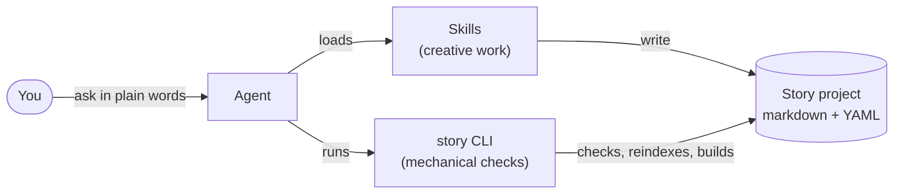

# Story Skills documentation

This is the documentation for Story Skills: Agent Skills for writing fiction, plus the `story` CLI that checks and maintains the project files. Use this page to find the right guide, whether you are writing a book, looking up a command or field, or changing Story Skills itself.

If you have not used Story Skills before, start with [Getting started](getting-started.md).

## How the pieces fit

A story project is a folder of markdown files with YAML frontmatter. The skills do the creative work, such as outlining, drafting, and revising, and write those files. The `story` CLI does the mechanical work: it validates the files, rebuilds registries, counts words, checks links and continuity, and builds the finished book. It never writes prose. [Core concepts](concepts.md) explains the model in full.

## Start here

Pick the route that matches what you came to do. Each one takes four pages; read the rest as you need them.

### I'm writing a book

1. [Getting started](getting-started.md): install the skills and the CLI, then create a project and draft chapter 1.
2. [Writing workflows](writing-workflows.md): which skills to use, in what order, from a blank page to a submission package.
3. [Skills catalogue](skills.md): what each skill does and when your agent picks it up.
4. [Continuity and analysis](continuity.md): what the checks catch and how to act on their findings.

### I'm installing skills for an agent or team

1. [Install the skills](getting-started.md#install-the-skills): Claude Code, Codex, the Agent Skills CLI, or a manual copy.
2. [How skills work](skills.md#how-skills-work): how an agent picks up a skill and finds the `story` CLI.
3. [The bundled fallback CLI](concepts.md#the-bundled-fallback-cli): the copy of the CLI that ships inside the skills for installs without the npm package.
4. [Automation and CI](automation.md): run the checks on every pull request and draft chapters on a schedule.

### I'm changing Story Skills

1. [Core concepts](concepts.md): how a project is laid out, and how ids, registries, backlinks, and word counts work.
2. [Project format reference](project-format.md): every file, frontmatter field, and allowed value the CLI enforces.
3. [CLI reference](cli-reference.md): every `story` command and option, with its output and exit codes.
4. [Development guide](development.md): repository layout, tests, the bundled fallback, CI, and releases.

## All pages

### Guides

| Page | What it covers |
|------|----------------|
| [Getting started](getting-started.md) | Installing the skills and CLI, and a first session from `story init` to a clean maintenance pass |
| [Core concepts](concepts.md) | The project model: files, frontmatter, entity kinds, ids, registries, backlinks, word counts, and how the work is split between skills and CLI |
| [Writing workflows](writing-workflows.md) | End-to-end sessions: plotting first, discovery drafting, scene craft, theme and voice, research, revision, feedback, and submission |
| [Continuity and analysis](continuity.md) | The continuity engine, exemptions, and the `knowledge`, `timeline`, `prose`, `progress`, `compare`, `report`, `next`, and `doctor` commands |
| [Series](series.md) | Linking sequels and prequels, `story series`, and carrying characters and facts between books |
| [Import, export, and builds](manuscripts.md) | Importing an existing draft, front and back matter, and building markdown, EPUB, DOCX, Shunn, and synopsis output |
| [Automation and CI](automation.md) | The GitHub Actions templates, exit codes and output streams, and pre-commit hooks |

### Reference

| Page | What it covers |
|------|----------------|
| [Skills catalogue](skills.md) | All 16 skills: triggers, the files each one reads and writes, the commands it runs, and its reference files |
| [CLI reference](cli-reference.md) | Every `story` command and option, with usage, output, and exit codes |
| [Project format reference](project-format.md) | The schema v2 file contract: every file, frontmatter field, allowed value, and registry, plus migration from older projects |

### For contributors

| Page | What it covers |
|------|----------------|
| [Development guide](development.md) | Repository layout, CLI architecture, tests, the bundled fallback, schema and metadata checks, evals, skill authoring, CI, and releases |

## Find it by task

| You want to... | Read |
|----------------|------|
| Install Story Skills | [Getting started](getting-started.md#install-the-skills) |
| Start a new book | [Getting started](getting-started.md#your-first-session), then [Writing workflows](writing-workflows.md#plotting-first-from-premise-to-chapter-one) |
| Draft without an outline | [Writing workflows](writing-workflows.md#discovery-drafting) |
| Bring in a draft you already have | [Import, export, and builds](manuscripts.md#import-an-existing-manuscript) |
| Pick the right skill for a request | [Skills catalogue](skills.md#which-skill-do-i-want) |
| Look up a command or flag | [CLI reference](cli-reference.md) |
| Look up a frontmatter field or allowed value | [Project format reference](project-format.md) |
| Understand a continuity error or warning | [Continuity and analysis](continuity.md) |
| Dismiss a finding on purpose | [Continuity and analysis](continuity.md#exemptions) |
| Write a sequel or prequel | [Series](series.md) |
| Build an EPUB, DOCX, or submission manuscript | [Import, export, and builds](manuscripts.md#build-a-book) |
| Run the checks on every pull request | [Automation and CI](automation.md) |
| Upgrade an older project | [Project format reference](project-format.md#migrating-older-projects) |
| Change the CLI or a skill | [Development guide](development.md) |

## Example projects

The repository includes four sample projects in [`examples/`](../examples/). The pages above use them for their sample output.

| Example | Shows |
|---------|-------|
| [`the-last-ember`](../examples/the-last-ember/) | A fantasy project with a style sheet, front matter, and an arc. Book 1 of a two-book series. |
| [`the-fall-of-the-citadel`](../examples/the-fall-of-the-citadel/) | The prequel to *The Last Ember*, linked with `precedes` and shared `fact` ids |
| [`harbor-of-second-light`](../examples/harbor-of-second-light/) | A science-fiction coastal mystery with populated continuity state and knowledge entries |
| [`the-unraveled-thread`](../examples/the-unraveled-thread/) | A village mystery that is broken on purpose to show the main kinds of continuity finding |

## Other resources

- [README](../README.md): the project overview.
- [`schemas/story.schema.json`](../schemas/story.schema.json): the project format as a JSON schema.
- [`templates/github/`](../templates/github/): the GitHub Actions workflows to copy into a story repository.
- [`AGENTS.md`](../AGENTS.md): the short rules for coding agents working on this repository.
