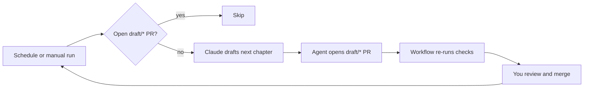

# Automation and CI

This page is for writers and maintainers who keep a story project in a git repository and want its checks to run automatically. It covers the three GitHub Actions templates and the issue form that ship with Story Skills, how to run the `story` CLI from scripts and CI, and how to check a project before each commit.

**On this page**

- [What you can automate](#what-you-can-automate)
- [Running the CLI non-interactively](#running-the-cli-non-interactively)
- [The GitHub Actions templates](#the-github-actions-templates)
- [Story checks workflow](#story-checks-workflow)
- [Draft the next chapter workflow](#draft-the-next-chapter-workflow)
- [Review copy workflow](#review-copy-workflow)
- [Manuscript note issue form](#manuscript-note-issue-form)
- [Customising the workflows](#customising-the-workflows)
- [Checking before each commit](#checking-before-each-commit)
- [Other CI systems](#other-ci-systems)

## What you can automate

The `story` CLI is deterministic: the same project always produces the same findings, and it never asks questions. That makes four kinds of automation practical:

| Goal | How |
|---|---|
| Stop a broken chapter from merging | Run `story validate`, `story links`, and `story continuity` on every push and pull request. [`templates/github/story-checks.yml`](../templates/github/story-checks.yml) does this. |
| Draft chapters on a schedule | Let Claude Code draft the next chapter and open a pull request for you to review. [`templates/github/draft-next-chapter.yml`](../templates/github/draft-next-chapter.yml) does this. |
| Give reviewers a current, citable copy of the book | Build the HTML review copy on every push to `main` and publish it to GitHub Pages; readers file notes through an issue form. [`templates/github/review-copy.yml`](../templates/github/review-copy.yml) and [`templates/github/ISSUE_TEMPLATE/manuscript-note.yml`](../templates/github/ISSUE_TEMPLATE/manuscript-note.yml) do this. |
| Catch problems before they are committed | Run the same checks from a git pre-commit hook. See [Checking before each commit](#checking-before-each-commit). |

The checks are the deterministic ones described in [Continuity and analysis](continuity.md) and the [CLI reference](cli-reference.md), and the review copy is an ordinary `story build`. The one creative step, drafting, is done by an agent and always arrives as a pull request for you to review.

## Running the CLI non-interactively

### Getting the CLI in CI

The CLI needs Node 18 or newer and has no runtime dependencies. In a CI job, use one of these:

| Source | Command | Notes |
|---|---|---|
| npm, pinned | `npx --yes --package story-skills@0.9.2 story <command>` | Fetches the published package. |
| npm, installed once per job | `npm install -g story-skills@0.9.2`, then `story <command>` | Faster when a job runs several commands. |
| GitHub tag | `npx --yes --package github:danjdewhurst/story-skills#v0.9.2 story <command>` | What the templates use. Fetches the tagged release from GitHub, because the templates predate the npm package. |
| Bundled fallback | `node <skills-dir>/story-maintenance/scripts/story.js <command>` | No network needed if your repository already contains the skills, for example under `.claude/skills/`. |

Always pin a version. An unpinned `npx story-skills` can pick up a new release mid-book and start reporting findings your project has never seen. Local installs can track the latest release; CI should pin, because new releases can add checks.

To confirm which version a job is using:

```shell
npx --yes --package story-skills@0.9.2 story --version
```

```text
0.9.2
```

### Exit codes

Every command exits `0` on success and `1` on failure. Warnings never change the exit code.

| Command | Exits 1 when |
|---|---|
| `validate` | The project has a structural, frontmatter, or registry error. |
| `links` | A cross-reference points at a missing file, or a required backlink is missing. |
| `continuity` | A continuity contract is broken, such as a dead character listed in a later chapter or a payoff before its setup. Findings matched by `continuity/exemptions.md` are dismissed and do not count. |
| `series` | A linked path is not a story project, the chronology has a cycle, two books share a `book-number`, linked books declare different series, or shared canon contradicts itself, such as a character who died in an earlier book appearing later. A missing series backlink is caught by `links`, not `series`. |
| `compare`, `progress`, `timeline`, `prose`, `pacing`, `clues`, `voices` | A project file cannot be parsed. Their own findings are advisory. |
| `names` | A candidate name clashes with an existing one. |
| `passes` | It refuses a change, such as a pass name that is not kebab-case or a `story.md` that cannot be parsed. |
| `report`, `next`, `doctor` | Never, on a readable project. They summarise the checks but always exit 0. |
| Any command | Unknown command or option, missing option value, invalid argument, or a refused write. |

`report --actionable`, `next`, and `doctor` are for reading, not gating. Use `validate`, `links`, and `continuity` when a job must fail.

Here is a passing check and a failing one, using the examples in this repository:

```shell
story continuity examples/the-last-ember; echo "exit=$?"
```

```text
Continuity is consistent: 0 errors, 0 warnings, 0 dismissed
exit=0
```

```shell
story continuity examples/the-unraveled-thread; echo "exit=$?"
```

```text
Continuity check failed: 4 errors, 3 warnings, 0 dismissed
error: chapters/chapter-04.md lists edran-vale, who died in chapter-02; move posthumous appearances to mentions
error: continuity/promises/the-broken-compass.md pays off in chapter-02 before it is planted in chapter-03
error: continuity/questions/who-burned-the-mill.md resolves in chapter-02 before it is introduced in chapter-03
error: continuity/state.md knowledge-state[0] references missing chapter chapter-05
warning: chapters/chapter-03.md POV character nessa-thorn is not listed in characters
warning: continuity/promises/the-sealed-letter.md was planted in chapter-01, 3 chapters ago, and has no payoff yet
warning: continuity/state.md object-state[0] status active conflicts with worldbuilding/artifacts/vales-compass.md status destroyed
exit=1
```

### Output streams

There is no `--json` or other machine-readable output mode. Output is plain text with stable line prefixes, so you can filter it with standard tools.

- `validate`, `links`, and `continuity` write only to **stderr**: one summary line, then one line per finding, prefixed `error:`, `warning:`, or `dismissed:`. Nothing goes to stdout.
- `compare`, `progress`, `timeline`, `prose`, `pacing`, `clues`, `voices`, `names`, and `series` write their report to stdout and the same summary and finding lines to stderr.
- Every other command writes its report or confirmation to stdout.
- A command that cannot run, for example because of an unknown option or a missing argument, prints one error line to stderr. An unknown command also prints the full help text after the error.
- Pointing a check at a directory that is not a story project is not a usage error: `validate` reports each missing required file as an `error:` finding and exits 1.

To capture findings, redirect stderr:

```shell
story validate . 2> validate.log
```

The [CLI reference](cli-reference.md#output-streams-and-exit-codes) has the full rules.

### Failing on warnings

Warnings are advisory, so a project can pass with stale data. For example, a chapter whose `word-count` frontmatter is out of date passes `validate`:

```text
Project is valid: 0 errors, 1 warnings, 0 dismissed
warning: chapters/chapter-01.md declares 1 words but contains 993
```

If you want CI to be stricter, there is no `--strict` flag, but you can fail on any `warning:` line:

```shell
set -o pipefail
story validate . 2>&1 | tee validate.log
if grep -q '^warning:' validate.log; then
  echo "story validate reported warnings"
  exit 1
fi
```

`set -o pipefail` needs bash, which GitHub's Linux runners use for `run:` steps. It keeps the command's own exit code when its output is piped through `tee`.

Another approach is to check that the generated data is current. `story wordcount --write` and `story reindex` rewrite word counts and registry tables from the markdown, so if they change anything, someone forgot to run them:

```shell
story wordcount . --write
story reindex .
git diff --exit-code
```

`git diff --exit-code` exits 1 and shows the difference when either command changed a file. See [Core concepts](concepts.md#registries) for why registries are generated rather than edited by hand.

## The GitHub Actions templates

Story Skills ships three workflows and one issue form in [`templates/github/`](../templates/github/). Copy them into the repository that holds your story project; they do not run in the Story Skills repository itself.

| Template | Copy to | Runs on | Needs | What it does |
|---|---|---|---|---|
| [`story-checks.yml`](../templates/github/story-checks.yml) | `.github/workflows/` | Push to `main`, every pull request | Nothing | Runs `validate`, `links`, `continuity`, and `report --actionable`. |
| [`draft-next-chapter.yml`](../templates/github/draft-next-chapter.yml) | `.github/workflows/` | Weekday schedule, manual dispatch | `ANTHROPIC_API_KEY` secret, the skills committed to the repository | Drafts the next chapter with Claude Code, runs the checks, and opens a pull request. |
| [`review-copy.yml`](../templates/github/review-copy.yml) | `.github/workflows/` | Push to `main`, manual dispatch | GitHub Pages set to deploy from GitHub Actions | Runs the checks, builds the HTML review copy, and publishes it to GitHub Pages. |
| [`ISSUE_TEMPLATE/manuscript-note.yml`](../templates/github/ISSUE_TEMPLATE/manuscript-note.yml) | `.github/ISSUE_TEMPLATE/` | A reader opening an issue | A `manuscript-note` label | Gives readers a form for a note on one paragraph of the review copy. |

Together they let you write a book through pull requests and review it in the open: the draft workflow proposes a chapter, the checks keep contradictions out, you review and merge, and the review copy puts the merged book in front of readers, whose notes come back as issues.



All three workflows:

- run the CLI with `npx` from the GitHub tag in `STORY_REF`, using Node 24 from `actions/setup-node`;
- read the project from `STORY_DIR`, which defaults to the repository root (`.`);
- pin every action to a commit SHA, with the tag it corresponds to in a comment.

## Story checks workflow

[`story-checks.yml`](../templates/github/story-checks.yml) is plain CI for a story project. It needs no secrets and only reads the repository (`permissions: contents: read`).

### Install it

1. In your story repository, create `.github/workflows/`.
2. Copy `templates/github/story-checks.yml` into it.
3. If the project is not at the repository root, set `STORY_DIR` (see [Customising the workflows](#customising-the-workflows)).
4. Commit and push. The workflow runs on the push to `main` and on every pull request after that.

To make the checks block merging, add the `story-checks` job as a required status check in a branch protection rule or ruleset for `main`.

### What it runs

| Step | Command | Fails the job when |
|---|---|---|
| Validate structure, frontmatter, and registries | `story validate "$STORY_DIR"` | The project has validation errors. |
| Check cross-references and backlinks | `story links "$STORY_DIR"` | A reference or backlink is broken. |
| Check continuity contracts | `story continuity "$STORY_DIR"` | A continuity contract is broken. |
| Report project health | `story report "$STORY_DIR" --actionable` | Never. It prints inventory, check results, and next actions to the job log. |

The steps run in order and stop at the first failure, so a validation error hides link and continuity results until it is fixed. Warnings show in the log but do not fail the job.

If a continuity finding is intentional, record it in `continuity/exemptions.md` rather than weakening the workflow. The finding is then reported as dismissed. See [Exemptions](continuity.md#exemptions) and [Project format reference](project-format.md).

## Draft the next chapter workflow

[`draft-next-chapter.yml`](../templates/github/draft-next-chapter.yml) runs [Claude Code](https://github.com/anthropics/claude-code-action) on a schedule to draft one chapter per run and open a pull request for it. You review the chapter like any other change.

### Install it

1. Copy `templates/github/draft-next-chapter.yml` to `.github/workflows/` in your story repository. Install `story-checks.yml` too.
2. Add a repository secret named `ANTHROPIC_API_KEY` (Settings, then Secrets and variables, then Actions).
3. Commit the Story Skills skills into the repository so the agent has the workflows it is told to follow, such as `chapter-writing`. Either run `npx skills add danjdewhurst/story-skills` in the repository and commit the result, or copy this repository's `skills/` directory to `.claude/skills/`. See [Skills catalogue](skills.md).
4. In Settings, then Actions, then General, under **Workflow permissions**, turn on **Allow GitHub Actions to create and approve pull requests**. Without this, the built-in `GITHUB_TOKEN` cannot open the chapter PR.
5. Adjust `STORY_DIR` and the cron schedule, then commit.

To try it without waiting for the schedule, open the Actions tab, pick **Draft the next chapter**, and choose **Run workflow**.

### Triggers, permissions, and secrets

| Setting | Value | Why |
|---|---|---|
| Triggers | `schedule` (`0 6 * * 1-5`, 06:00 UTC on weekdays) and `workflow_dispatch` | Never runs on `pull_request` or `pull_request_target`, so a fork cannot trigger a run that has access to the secrets. |
| `permissions` | `contents: write`, `pull-requests: write` | To push the draft branch and open the pull request. |
| `concurrency` | One run per workflow, `cancel-in-progress: false` | A manual run that overlaps the schedule waits instead of drafting the same chapter twice. |
| `ANTHROPIC_API_KEY` | Repository secret you add | Passed to `anthropics/claude-code-action`. |
| `GITHUB_TOKEN` | Provided by GitHub | Used by the skip guard and by the agent to push and open the PR. |

### What a run does

1. **Skip while a draft is open.** The first step lists open pull requests whose head branch starts with `draft/` and comes from this repository. If there is one, every later step is skipped and the run succeeds. Until you merge or close that PR, `story next` would keep recommending the same chapter. Pull requests from forks are ignored, so they cannot block drafting.
2. **Check out and set up Node.** Full history (`fetch-depth: 0`) and Node 24.
3. **Draft with Claude Code.** The agent is prompted to:
   1. run `story next` and read `story.md`, `chapters/_index.md`, `continuity/state.md`, open questions, promises, and the active arcs;
   2. if `story next` reports a P0 maintenance issue, fix it, open a maintenance PR, and stop;
   3. otherwise draft the next chapter on a branch named `draft/chapter-<number>`, following the `chapter-writing` skill: outline first, prose under `## Chapter Text`, accurate frontmatter, matching scene records, and updates to continuity state, promises, questions, and the timeline;
   4. run `story wordcount --write`, `story reindex`, `story validate`, `story links`, and `story continuity`, and make them pass;
   5. commit, push, and open a PR titled `Draft chapter <number>: <title>` that summarises the beats, the arcs advanced, and the promises planted or paid off.
4. **Check the result.** The workflow then runs `story validate`, `story links`, and `story continuity` itself, so a run whose chapter still has errors fails visibly.

The PR is a draft for you to edit, not a finished chapter. [Writing workflows](writing-workflows.md) describes the chapter-writing process the agent follows, and what to look for when you revise.

### What the agent is allowed to do

The action is started with an `--allowedTools` list that limits the agent to:

- the `story` CLI, run through the exact `npx --yes --package github:danjdewhurst/story-skills#<STORY_REF> story` prefix;
- `git checkout -b`, `git add`, `git commit`, and `git push`;
- `gh pr create`;
- reading, writing, and searching files (`Read`, `Write`, `Edit`, `Glob`, `Grep`).

Claude Code matches these rules against the literal command text. That is why the prompt spells out each `story` command in full, with no quotes or shell variables. If you edit the prompt, keep each command identical to an allowed prefix, or the agent will be refused permission to run it. The Story Skills test suite checks this for the shipped template.

### Why the checks run twice

GitHub does not start other workflows for events caused by the built-in `GITHUB_TOKEN`. A pull request the agent opens therefore does not trigger `story-checks.yml`. The draft workflow runs the same three checks at the end so the drafted branch is still verified.

If you want `story-checks.yml` to run on drafted PRs as well, for example because it is a required status check, replace `github_token: ${{ secrets.GITHUB_TOKEN }}` in the Claude Code step with a personal access token or GitHub App token stored as a secret.

## Review copy workflow

[`review-copy.yml`](../templates/github/review-copy.yml) gives beta readers, critique partners, and editors a link instead of a terminal. On every push to `main` it checks the project, builds the [HTML review copy](manuscripts.md#html-review-copy) with `story build --format html`, and publishes it to GitHub Pages. Every paragraph in the copy carries a label such as `ch03-p12` (chapter 3, paragraph 12), and the [manuscript note issue form](#manuscript-note-issue-form) asks readers for that label, so each note points at an exact paragraph.

### Install it

1. Copy `templates/github/review-copy.yml` to `.github/workflows/` in your story repository.
2. In Settings, then Pages, set **Source** to **GitHub Actions**.
3. Decide who may read the book (see [Keeping the manuscript private](#keeping-the-manuscript-private)) before the first push.
4. If the project is not at the repository root, set `STORY_DIR`.
5. Check `STORY_REF`. The `html` format is newer than Story Skills 0.8.2, so `STORY_REF` must name a later release. A template copied from a release that includes it already does, because the release process sets `STORY_REF` to its own version. With an older tag, the build step fails with `Unsupported build format: html`.
6. Commit and push to `main`, or run **Review copy** from the Actions tab.

The address of the site is shown on the run's `deploy` job, on the `github-pages` environment, and in Settings, then Pages. For a project site it is usually `https://<owner>.github.io/<repository>/`. A link to a paragraph adds its label, such as `https://<owner>.github.io/<repository>/#ch03-p12`, which opens the copy at that paragraph and highlights it.

### Triggers, permissions, and jobs

| Setting | Value | Why |
|---|---|---|
| Triggers | `push` to `main` and `workflow_dispatch` | Readers see the merged book, not work in progress on other branches. Never runs on pull requests. |
| `permissions` | `contents: read` for the workflow; `pages: write` and `id-token: write` for the `deploy` job only | The build only reads the repository. Deploying to Pages needs write access to Pages and an OIDC token, and only the job that deploys gets them. |
| `concurrency` | Group `review-copy`, `cancel-in-progress: false` | A deployment that has started finishes instead of being cancelled mid-upload by the next push. |
| Secrets | None | The built-in token is enough. |

The `build` job:

1. Checks out the repository and sets up Node 24.
2. Runs `story validate`, `story links`, and `story continuity`. If any of them fails, nothing is built or published, so readers never get a copy with broken references or a contradicted continuity contract. Readers keep the last good copy.
3. Builds the review copy with `story build "$STORY_DIR" --format html --out "$GITHUB_WORKSPACE/review-site/index.html"`. The `--out` path is absolute because a relative `--out` is resolved against the project root and may not leave it; see [Output paths](manuscripts.md#output-paths-and-what-is-disposable).
4. Uploads `index.html` as a workflow artifact named `review-copy`, which you can download from the run page.
5. Uploads the `review-site` folder as the Pages site.

The `deploy` job then publishes that site with `actions/deploy-pages` to the `github-pages` environment.

The workflow builds from the markdown on every run and commits nothing, so `dist/` stays out of the repository.

### Keeping the manuscript private

A GitHub Pages site is public, even when the repository is private, unless your GitHub plan supports private Pages with access control. Publishing an unpublished book on the open web can matter to publishers and to some contests. If the manuscript must stay private:

- delete the `deploy` job and the **Upload the Pages site** step, and
- share the `review-copy` workflow artifact instead. Anyone with read access to the repository can download it from the run page; readers then open `index.html` in a browser.

The [`editorial-review`](../skills/editorial-review/SKILL.md) skill asks before creating files in `.github/` and warns about Pages visibility before it sets this up.

### Review rounds and changing labels

A paragraph label is the paragraph's position in its chapter, so it changes when you add or remove paragraphs earlier in that chapter. Because this workflow republishes on every push, a note made last week may point at a paragraph that has since moved. Tag the commit when you send readers the link for a round, for example `beta-round-1`, and resolve notes against that tag; `story compare . --ref beta-round-1` shows which chapters have changed since. See [Import, export, and builds](manuscripts.md#html-review-copy) for how labels are numbered.

## Manuscript note issue form

[`ISSUE_TEMPLATE/manuscript-note.yml`](../templates/github/ISSUE_TEMPLATE/manuscript-note.yml) is a GitHub issue form for readers of the review copy. Each note becomes an issue labelled `manuscript-note`, with the paragraph label in its title and body.

### Install it

1. Copy the file to `.github/ISSUE_TEMPLATE/manuscript-note.yml` in your story repository.
2. Create a label named `manuscript-note` (Issues, then Labels, then **New label**). GitHub applies only labels that already exist, so without it the issues arrive unlabelled.
3. Commit and push. The form appears under **New issue**.

Give readers a direct link to the form alongside the review copy: `https://github.com/<owner>/<repository>/issues/new?template=manuscript-note.yml`. Readers need a GitHub account and permission to open issues: anyone can on a public repository, and only collaborators can on a private one.

### What the form asks

| Field | Type | Required | Contents |
|---|---|---|---|
| Issue title | Text, starting `[ch00-p0] ` | Yes | Readers replace `ch00-p0` with the paragraph label and add a short summary. |
| Paragraph label | Short text | Yes | One label, such as `ch03-p12`, or the first and last of a passage, such as `ch03-p12 to ch03-p15`. |
| What kind of note is this? | Dropdown | Yes | Typo or wording; Confusing; Continuity (contradicts something earlier); Pacing (slow or rushed); Character (feels off); Sensitivity or authenticity; Loved this; Other. |
| Your note | Long text | Yes | What the reader noticed and how it made them feel. The form tells them they need not suggest a fix. |
| How much did it affect your reading? | Dropdown | No | Barely noticed; Pulled me out for a moment; Made me want to stop reading. |

### From issues to revisions

The notes are raw reader reactions, not decisions. The [`feedback-triage`](../skills/feedback-triage/SKILL.md) skill records them in one file per reader under `feedback/round-<N>/`, keeps each note's paragraph label in its **Where** line, and weighs them against your intent before anything changes in the manuscript. See [Skills catalogue](skills.md#feedback-triage) and [Writing workflows](writing-workflows.md).

## Customising the workflows

### Project location

Set `STORY_DIR` at the top of each workflow file when the story project lives in a subdirectory:

```yaml
env:
  STORY_DIR: "books/the-last-ember"
  STORY_REF: "v0.9.2"
```

For several books in one repository, copy the check steps once per book, or turn `STORY_DIR` into a matrix value. For a linked series, add a `story series "$STORY_DIR"` step: it exits 1 when canon contradicts itself across books. The `story links` step is what catches a missing series backlink. See [Series](series.md).

### CLI version

`STORY_REF` is the Story Skills release tag the CLI is fetched from. The release process sets it to the release's own version, so a template copied from a given release already points at that release. Bump it in every workflow file you use when you want a newer release, and run the checks locally first, because new releases can add checks. Releases are listed on the [GitHub releases page](https://github.com/danjdewhurst/story-skills/releases).

To use the npm package instead of the GitHub tag, replace `github:danjdewhurst/story-skills#$STORY_REF` with `story-skills@<version>` in each `npx --package` value. In `draft-next-chapter.yml`, the prompt commands and the `Bash(...)` rule in `--allowedTools` spell it `github:danjdewhurst/story-skills#${{ env.STORY_REF }}` instead; change those together, so they still match.

### Schedule

Edit the cron expression. GitHub cron times are UTC.

```yaml
on:
  schedule:
    - cron: "0 6 * * 1-5" # weekday mornings
  workflow_dispatch:
```

Delete the `schedule` block to draft only when you run the workflow by hand.

### Branches

`story-checks.yml` runs on pushes to `main` and on all pull requests, and `review-copy.yml` on pushes to `main`. If your default branch has another name, change `branches: [main]` in both. To publish the review copy from a different branch, such as a `beta` branch you merge into when a round starts, name that branch instead.

### Extra steps

Useful steps to add to `story-checks.yml`:

| Step | Command | Effect |
|---|---|---|
| Prose lint in the log | `story prose "$STORY_DIR"` | Prints per-chapter prose statistics. Always exits 0 on a readable project. |
| Timeline in the log | `story timeline "$STORY_DIR"` | Prints scene chronology, POV balance, and character presence. |
| Fail on stale generated data | `story wordcount "$STORY_DIR" --write`, `story reindex "$STORY_DIR"`, then `git diff --exit-code` | See [Failing on warnings](#failing-on-warnings). |
| Build a reading copy | `story build "$STORY_DIR" --format epub` | Writes `dist/<story-id>.epub`, which you can upload with `actions/upload-artifact`. |

For example, to attach an EPUB to every run:

```yaml
      - name: Build EPUB
        run: npx --yes --package "github:danjdewhurst/story-skills#$STORY_REF" story build "$STORY_DIR" --format epub

      - name: Upload EPUB
        uses: actions/upload-artifact@v4
        with:
          name: epub
          path: ${{ env.STORY_DIR }}/dist/*.epub
```

Pin `actions/upload-artifact` to a commit SHA to match the rest of the file. [Import, export, and builds](manuscripts.md) covers build formats and options.

### Action pins

The `uses:` lines are pinned to commit SHAs, so a moved or compromised tag cannot change what runs. To keep the pins current, add a Dependabot config for the `github-actions` ecosystem to your story repository:

```yaml
# .github/dependabot.yml
version: 2
updates:
  - package-ecosystem: "github-actions"
    directory: "/"
    schedule:
      interval: "weekly"
```

## Checking before each commit

A git pre-commit hook catches errors before they reach CI. Save this as `.git/hooks/pre-commit` in your story repository and make it executable with `chmod +x .git/hooks/pre-commit`:

```shell
#!/bin/sh
# Block the commit when the story project has errors.
STORY_DIR=.
story validate "$STORY_DIR" || exit 1
story links "$STORY_DIR" || exit 1
story continuity "$STORY_DIR" || exit 1
```

The hook assumes `story` is on your `PATH`, for example after `npm install -g story-skills`. If it is not, replace `story` with `npx --yes story-skills@0.9.2` or with `node <skills-dir>/story-maintenance/scripts/story.js`. Warnings do not block the commit.

The hook only checks. It does not run `story wordcount --write` or `story reindex`, because a hook that rewrites files leaves those changes unstaged. Run those yourself, or ask your agent to, after changing chapters or entities; the skills already direct agents to do this. See [Writing workflows](writing-workflows.md).

To skip the hook for one commit, for example to save a half-finished chapter, use `git commit --no-verify`.

If you use the [pre-commit](https://pre-commit.com/) framework, the equivalent is a set of local hooks:

```yaml
# .pre-commit-config.yaml
repos:
  - repo: local
    hooks:
      - id: story-validate
        name: story validate
        entry: story validate .
        language: system
        pass_filenames: false
      - id: story-links
        name: story links
        entry: story links .
        language: system
        pass_filenames: false
      - id: story-continuity
        name: story continuity
        entry: story continuity .
        language: system
        pass_filenames: false
```

`pass_filenames: false` matters: each command takes the project root, not a list of changed files.

## Other CI systems

Nothing in the checks is specific to GitHub. Any CI system with Node 18 or newer can run them:

```shell
npm install -g story-skills@0.9.2
story validate .
story links .
story continuity .
```

Each command exits 1 on errors, which fails the job. Add `story report . --actionable` at the end if you want a readable summary in the log.

## See also

- [CLI reference](cli-reference.md): every command, option, and exit code
- [Continuity and analysis](continuity.md): what `continuity` checks and how exemptions work
- [Writing workflows](writing-workflows.md): the chapter-writing loop the draft workflow automates
- [Development guide](development.md): the CI for the Story Skills repository itself
- [Documentation index](README.md): every page, by audience and task
