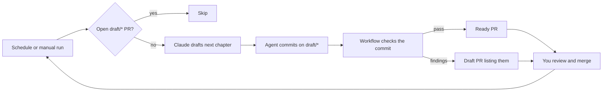

# Automation and CI

This page is for writers and maintainers who keep a story project in a git repository and want its checks to run automatically. It covers the three GitHub Actions templates and the issue form that ship with Story Skills, how to run the `story` CLI from scripts and CI, and how to check a project before each commit.

**On this page**

- [What you can automate](#what-you-can-automate)
- [Running the CLI non-interactively](#running-the-cli-non-interactively)
- [The GitHub Actions templates](#the-github-actions-templates)
- [Story checks workflow](#story-checks-workflow)
- [Draft the next chapter workflow](#draft-the-next-chapter-workflow)
- [Review copy workflow](#review-copy-workflow)
- [Manuscript note issue form](#manuscript-note-issue-form)
- [Customising the workflows](#customising-the-workflows)
- [Checking before each commit](#checking-before-each-commit)
- [Other CI systems](#other-ci-systems)

## What you can automate

The `story` CLI is deterministic: the same project always produces the same findings, and it never asks questions. That makes four kinds of automation practical:

| Goal | How |
|---|---|
| Stop a broken chapter from merging | Run `story validate`, `story links`, and `story continuity` on every push and pull request. [`templates/github/story-checks.yml`](../templates/github/story-checks.yml) does this. |
| Draft chapters on a schedule | Let Claude Code draft the next chapter and open a pull request for you to review. [`templates/github/draft-next-chapter.yml`](../templates/github/draft-next-chapter.yml) does this. |
| Give reviewers a current, citable copy of the book | Build the HTML review copy on every push to `main` and publish it to GitHub Pages; readers file notes through an issue form. [`templates/github/review-copy.yml`](../templates/github/review-copy.yml) and [`templates/github/ISSUE_TEMPLATE/manuscript-note.yml`](../templates/github/ISSUE_TEMPLATE/manuscript-note.yml) do this. |
| Catch problems before they are committed | Run the same checks from a git pre-commit hook. See [Checking before each commit](#checking-before-each-commit). |

The checks are the deterministic ones described in [Continuity and analysis](continuity.md) and the [CLI reference](cli-reference.md), and the review copy is an ordinary `story build`. The one creative step, drafting, is done by an agent and always arrives as a pull request for you to review.

## Running the CLI non-interactively

### Getting the CLI in CI

The CLI needs Node 18 or newer and has no runtime dependencies. In a CI job, use one of these:

| Source | Command | Notes |
|---|---|---|
| npm, pinned | `npx --yes --package story-skills@0.17.0 story <command>` | Fetches the published package. |
| npm, installed once per job | `npm install -g story-skills@0.17.0`, then `story <command>` | Faster when a job runs several commands. |
| GitHub tag | `npx --yes --package github:danjdewhurst/story-skills#v0.17.0 story <command>` | What the templates use. Fetches the tagged release from GitHub, because the templates predate the npm package. |
| Bundled fallback | `node <skills-dir>/story-maintenance/scripts/story.js <command>` | No network needed if your repository already contains the skills, for example under `.claude/skills/`. |

Always pin a version. An unpinned `npx story-skills` can pick up a new release mid-book and start reporting findings your project has never seen. Local installs can track the latest release; CI should pin, because new releases can add checks.

To confirm which version a job is using:

```shell
npx --yes --package story-skills@0.17.0 story --version
```

```text
0.17.0
```

### Exit codes

Every command exits `0` on success. A failure exits with a code that says what kind of failure it was, so a script can tell a manuscript with errors from a mistyped command line. Warnings do not change the exit code unless a `severity` entry in `story.md` promotes them to errors (see [Failing on warnings](#failing-on-warnings)).

| Code | Meaning | Examples |
|---|---|---|
| `0` | Success. For checks, no errors. | `Project is valid`, or only warnings. |
| `1` | Findings: a check reported at least one `error:` line. | `validate`, `links`, or `continuity` found an error; `names` found a clash. |
| `2` | Usage error: the command line was wrong. | An unknown command or option, a missing option value, an unexpected argument, an unsupported `--format`, or an id that does not exist (`Unknown character nobody`). |
| `3` | Not a usable story project. | No `story.md` at the path, invalid `cli-defaults` or `severity` in `story.md` (every command except `validate`, `report`, `next`, and `doctor`), a file the command needs cannot be read or parsed (`Cannot export: fix this file first`) or is a symlink, a project with a newer schema, or nothing to build (`No chapters found to export`). |
| `4` | Refused or failed write. The message says what, if anything, was changed. | The target already exists (`init` without `--force`, `add` of an existing id), `--out` points at project source, outside the project, or through a symlink, another story command holds the project lock, a file changed on disk meanwhile, or the file system refused the write (`permission denied`, a full disk). |

Because findings keep `1`, `story validate "$STORY_DIR" || exit 1` and the GitHub Actions templates fail a job exactly as before. Scripts that test for `1` specifically to mean "any failure" need to accept `2`, `3`, and `4` too; `[ $? -ne 0 ]` or `|| exit` works for every code.

Which commands can report findings (exit `1`):

| Command | Exits 1 when |
|---|---|
| `validate` | The project has a structural, frontmatter, or registry error. |
| `links` | A cross-reference points at a missing file, or a required backlink is missing. |
| `continuity` | A continuity contract is broken, such as a dead character listed in a later chapter or a payoff before its setup. Findings matched by `continuity/exemptions.md` are dismissed and do not count. |
| `series` | A linked path is not a story project, the chronology has a cycle, two books share a `book-number`, linked books declare different series, or shared canon contradicts itself, such as a character who died in an earlier book appearing later. A missing series backlink is caught by `links`, not `series`. |
| `compare`, `progress`, `timeline`, `prose`, `pacing`, `clues`, `voices`, `diagram` | A project file cannot be parsed and is reported as an `error:` line. Their own findings are advisory, unless `severity` in `story.md` promotes one to an error. `compare` exits 3 instead when a chapter cannot be parsed, because it cannot compare without it. |
| `names` | A candidate name clashes with an existing one. |
| `report`, `next`, `doctor` | Never, on a readable project. They summarise the checks but always exit 0. |
| `build`, `export`, `context`, `add`, `rename`, `move`, `remove` | Only when `severity` in `story.md` promotes a warning they print; the command's output is still written. |
| All other commands | Never: they succeed, or stop with `2`, `3`, or `4`. |

`report --actionable`, `next`, and `doctor` are for reading, not gating. Use `validate`, `links`, and `continuity` when a job must fail.

Before this split, every failure exited `1`. If a script relied on `1` for a usage error, a missing project, or a refused write, update it to the new code.

Here is a passing check and a failing one, using the examples in this repository:

```shell
story continuity examples/the-last-ember; echo "exit=$?"
```

```text
Continuity is consistent: 0 errors, 0 warnings, 0 dismissed
exit=0
```

```shell
story continuity examples/the-unraveled-thread; echo "exit=$?"
```

```text
Continuity check failed: 4 errors, 3 warnings, 0 dismissed
error: chapters/chapter-04.md lists edran-vale, who died in chapter-02; move posthumous appearances to mentions
error: continuity/promises/the-broken-compass.md pays off in chapter-02 before it is planted in chapter-03
error: continuity/questions/who-burned-the-mill.md resolves in chapter-02 before it is introduced in chapter-03
error: continuity/state.md knowledge-state[0] references missing chapter chapter-05
warning: chapters/chapter-03.md POV character nessa-thorn is not listed in characters [pov-not-in-cast]
warning: continuity/promises/the-sealed-letter.md was planted in chapter-01, 3 chapters ago, and has no payoff yet [promise-unpaid]
warning: continuity/state.md object-state[0] status active conflicts with worldbuilding/artifacts/vales-compass.md status destroyed [state-status-conflict]
exit=1
```

### Output streams

By default, output is plain text with stable line prefixes, so you can filter it with standard tools. For a machine-readable result, see [JSON output](#json-output).

- `validate`, `links`, and `continuity` write only to **stderr**: one summary line, then one line per finding, prefixed `error:`, `warning:`, or `dismissed:`. Nothing goes to stdout.
- `compare`, `progress`, `timeline`, `prose`, `pacing`, `clues`, `voices`, `names`, and `series` write their report to stdout and the same summary and finding lines to stderr.
- Every other command writes its report or confirmation to stdout.
- A command that cannot run, for example because of an unknown option or a missing argument, prints one error line to stderr and exits 2. An unknown command also prints the full help text after the error.
- Pointing any command at a directory without `story.md` prints `<path> is not a story project: missing story.md` to stderr and exits 3. In a project that has `story.md`, `validate` reports each other missing required file as an `error:` finding and exits 1.

To capture findings, redirect stderr:

```shell
story validate . 2> validate.log
```

The [CLI reference](cli-reference.md#output-streams-and-exit-codes) has the full rules.

### JSON output

The check and analysis commands (`validate`, `links`, `continuity`, `series`, `report`, `next`, `doctor`, `knowledge`, `context`, `progress`, `timeline`, `prose`, `pacing`, `clues`, and `voices`) take `--json`. It prints one JSON object to stdout and nothing to stderr, so a script can parse the result instead of the text:

```json
{
  "apiVersion": "story/v2",
  "command": "validate",
  "ok": true,
  "data": { "errors": 0, "warnings": 1, "dismissed": 0 },
  "diagnostics": [
    {
      "severity": "warning",
      "file": "chapters/chapter-01.md",
      "chapter": null,
      "message": "chapters/chapter-01.md declares 900 words but contains 993",
      "code": "stale-word-count",
      "check": "validate"
    }
  ],
  "writes": []
}
```

`ok` is `true` exactly when the command exits `0`, so a job can read either. `diagnostics` holds every finding with its severity, file, message, rule (`code`, from [Finding codes](cli-reference.md#finding-codes)), and the check that raised it (`check`). A command that cannot run, such as one pointed at a folder without `story.md`, still prints an envelope, with `ok: false`, `data: null`, and the error as its diagnostic, and exits with the same code as a text run (`2`, `3`, or `4`; see [Exit codes](#exit-codes)). [`schemas/result.schema.json`](../schemas/result.schema.json) describes the envelope and each command's `data`; `apiVersion` changes when a field is renamed, removed, or retyped. The [CLI reference](cli-reference.md#json-output) has the full rules.

For example, to fail a job on any warning with [`jq`](https://jqlang.github.io/jq/):

```shell
story validate . --json > validate.json
jq -e '[.diagnostics[] | select(.severity == "warning")] | length == 0' validate.json
```

`jq -e` exits 1 when the expression is false, and `story validate` has already exited 1 if there were errors. Filter on `code` to fail on one kind of warning, such as `select(.code == "todo-markers")`, or promote it in `story.md` as below.

### Failing on warnings

Warnings are advisory, so a project can pass with stale data. For example, a chapter whose `word-count` frontmatter is out of date passes `validate`:

```text
Project is valid: 0 errors, 1 warnings, 0 dismissed
warning: chapters/chapter-01.md declares 900 words but contains 993 [stale-word-count]
```

To fail on particular warnings, promote them to errors in `story.md`. The setting lives with the manuscript, so a local run and CI fail the same way:

```yaml
severity:
  - warning: stale-word-count
    level: error
  - warning: todo-markers
    level: error
  - warning: prose-avoided-spelling
    level: error
```

```text
$ story validate; echo "exit=$?"
Project validation failed: 1 errors, 0 warnings, 0 dismissed
error: chapters/chapter-01.md declares 900 words but contains 993 [stale-word-count]
exit=1
```

Every warning line ends with its code in brackets, so the name to put in `severity` is on the line you want to change. `level: off` does the opposite and reports a warning as `dismissed:`. Any warning can be overridden, in whichever command reports it; errors cannot. The [CLI reference](cli-reference.md#finding-codes) lists every code, by command.

The same place holds default flags, such as stricter `prose` thresholds for every run, local or in CI. A flag on the command line still wins:

```yaml
cli-defaults:
  - command: prose
    max-filter-words: 8
    max-adverbs: 10
```

The same holds with `--json`: a promoted warning is a diagnostic with `"severity": "error"`, `ok` is `false`, and the run exits 1. Run `story validate` after editing either field: it rejects an unknown command, flag, warning code, or level, and while either field is invalid the other commands refuse to run, exiting 3, rather than silently skip a severity your job relies on.

To fail on every warning, including those without a code, there is no `--strict` flag, but you can fail on any `warning:` line:

```shell
set -o pipefail
story validate . 2>&1 | tee validate.log
if grep -q '^warning:' validate.log; then
  echo "story validate reported warnings"
  exit 1
fi
```

`set -o pipefail` needs bash, which GitHub's Linux runners use for `run:` steps. It keeps the command's own exit code when its output is piped through `tee`.

Another approach is to check that the generated data is current. `story wordcount --write` and `story reindex` rewrite word counts and registry tables from the markdown, so if they change anything, someone forgot to run them:

```shell
story wordcount . --write
story reindex .
git diff --exit-code
```

`git diff --exit-code` exits 1 and shows the difference when either command changed a file. See [Core concepts](concepts.md#registries) for why registries are generated rather than edited by hand.

## The GitHub Actions templates

Story Skills ships three workflows and one issue form in [`templates/github/`](../templates/github/). Copy them into the repository that holds your story project; they do not run in the Story Skills repository itself.

| Template | Copy to | Runs on | Needs | What it does |
|---|---|---|---|---|
| [`story-checks.yml`](../templates/github/story-checks.yml) | `.github/workflows/` | Push to `main`, every pull request | Nothing | Runs `validate`, `links`, `continuity`, and `report --actionable`. |
| [`draft-next-chapter.yml`](../templates/github/draft-next-chapter.yml) | `.github/workflows/` | Weekday schedule, manual dispatch | `ANTHROPIC_API_KEY` secret, the skills committed to the repository | Drafts the next chapter with Claude Code in a read-only job, then checks the commit and opens a pull request from a second job. |
| [`review-copy.yml`](../templates/github/review-copy.yml) | `.github/workflows/` | Push to `main`, manual dispatch | GitHub Pages set to deploy from GitHub Actions | Runs the checks, builds the HTML review copy, and publishes it to GitHub Pages. |
| [`ISSUE_TEMPLATE/manuscript-note.yml`](../templates/github/ISSUE_TEMPLATE/manuscript-note.yml) | `.github/ISSUE_TEMPLATE/` | A reader opening an issue | A `manuscript-note` label | Gives readers a form for a note on one paragraph of the review copy. |

Together they let you write a book through pull requests and review it in the open: the draft workflow proposes a chapter, the checks keep contradictions out, you review and merge, and the review copy puts the merged book in front of readers, whose notes come back as issues.


```mermaid
flowchart LR
    A[Schedule or manual run] --> B{Open draft/* PR?}
    B -- yes --> C[Skip]
    B -- no --> D[Claude drafts next chapter]
    D --> E[Agent commits on draft/*]
    E --> F[Workflow checks the commit]
    F -- pass --> P[Ready PR]
    F -- findings --> Q[Draft PR listing them]
    P --> G[You review and merge]
    Q --> G
    G --> A
```

All three workflows:

- run the CLI with `npx` from the GitHub tag in `STORY_REF`, using Node 24 from `actions/setup-node`;
- read the project from `STORY_DIR`, which defaults to the repository root (`.`);
- pin every action to a commit SHA, with the tag it corresponds to in a comment;
- set `timeout-minutes` on every job (15 minutes, and 60 for the draft job that runs the agent), so a run that hangs, or a project that makes the CLI slow, cannot hold a runner for GitHub's six-hour default.

## Story checks workflow

[`story-checks.yml`](../templates/github/story-checks.yml) is plain CI for a story project. It needs no secrets and only reads the repository (`permissions: contents: read`). Its checkout sets `persist-credentials: false`, so the `GITHUB_TOKEN` is not left in `.git/config` while the CLI fetched at run time executes.

### Install it

1. In your story repository, create `.github/workflows/`.
2. Copy `templates/github/story-checks.yml` into it.
3. If the project is not at the repository root, set `STORY_DIR` (see [Customising the workflows](#customising-the-workflows)).
4. Commit and push. The workflow runs on the push to `main` and on every pull request after that.

To make the checks block merging, add the `story-checks` job as a required status check in a branch protection rule or ruleset for `main`.

### What it runs

| Step | Command | Fails the job when |
|---|---|---|
| Validate structure, frontmatter, and registries | `story validate "$STORY_DIR"` | The project has validation errors. |
| Check cross-references and backlinks | `story links "$STORY_DIR"` | A reference or backlink is broken. |
| Check continuity contracts | `story continuity "$STORY_DIR"` | A continuity contract is broken. |
| Report project health | `story report "$STORY_DIR" --actionable` | Never. It prints inventory, check results, and next actions to the job log. |

The steps run in order and stop at the first failure, so a validation error hides link and continuity results until it is fixed. Warnings show in the log but do not fail the job.

If a continuity finding is intentional, record it in `continuity/exemptions.md` rather than weakening the workflow. The finding is then reported as dismissed. See [Exemptions](continuity.md#exemptions) and [Project format reference](project-format.md).

## Draft the next chapter workflow

[`draft-next-chapter.yml`](../templates/github/draft-next-chapter.yml) runs [Claude Code](https://github.com/anthropics/claude-code-action) on a schedule to draft one chapter per run. The agent only commits. The workflow checks the commit, pushes the branch, and opens the pull request, so a chapter that fails the checks arrives as a draft pull request that lists the failures, never as a ready one. You review the chapter like any other change.

### Install it

1. Copy `templates/github/draft-next-chapter.yml` to `.github/workflows/` in your story repository. Install `story-checks.yml` too.
2. Add a repository secret named `ANTHROPIC_API_KEY` (Settings, then Secrets and variables, then Actions).
3. Commit the Story Skills skills into the repository so the agent has the workflows it is told to follow, such as `chapter-writing`. Either run `npx skills add danjdewhurst/story-skills` in the repository and commit the result, or copy this repository's `skills/` directory to `.claude/skills/`. See [Skills catalogue](skills.md).
4. In Settings, then Actions, then General, under **Workflow permissions**, turn on **Allow GitHub Actions to create and approve pull requests**. Without this, the built-in `GITHUB_TOKEN` cannot open the chapter PR.
5. Protect your default branch: in Settings, then Rules or Branches, require pull requests before merging into `main`.
6. Adjust `STORY_DIR`, the budgets, and the cron schedule, then commit.

To try it without waiting for the schedule, open the Actions tab, pick **Draft the next chapter**, and choose **Run workflow**. The form takes the budgets for that run.

### Budgets

| Budget | Default | Set by | When it is exceeded |
|---|---|---|---|
| Words of prose in the drafted chapter | `1500` to `5000` | `MIN_WORDS`, `MAX_WORDS`, or the `min_words` and `max_words` inputs | The agent is told the range. A chapter outside it still gets a pull request, but as a draft that names its word count, and the run fails. |
| Agent turns | `80` | `MAX_TURNS`, or the `max_turns` input | Passed to Claude Code as `--max-turns`. The agent stops, nothing is pushed, and the run fails with a message naming the budget. |
| API spend per run | `$5` | `MAX_BUDGET_USD`, or the `max_budget_usd` input | Passed to Claude Code as `--max-budget-usd`. As for turns. |
| Time | 60 minutes | `timeout-minutes` on the draft job | GitHub cancels the job; nothing is pushed. |

Change the defaults in the `env` block at the top of the file: each is `${{ inputs.<name> || '<default>' }}`, so a scheduled run uses the default after `||` and a manual run can override it. The first step of the run rejects a budget that is not a plain number, since the turn and dollar limits are passed on the agent's command line.

### Triggers, permissions, and secrets

| Setting | Value | Why |
|---|---|---|
| Triggers | `schedule` (`0 6 * * 1-5`, 06:00 UTC on weekdays) and `workflow_dispatch` | Never runs on `pull_request` or `pull_request_target`, so a fork cannot trigger a run that has access to the secrets. |
| Draft job `permissions` | `contents: read`, `pull-requests: read` | The agent runs here. Whatever it is talked into, this job's token cannot push, open pull requests, or comment. |
| Publish job `permissions` | `contents: write`, `pull-requests: write` | To push the checked branch and open the pull request. The agent never runs in this job. |
| `concurrency` | One run per workflow, `cancel-in-progress: false` | A manual run that overlaps the schedule waits instead of drafting the same chapter twice. |
| `timeout-minutes` | `60` for the draft job, `15` for the publish job | Stops a run that stalls instead of letting it hold a runner, and spend API credit, for six hours. |
| `persist-credentials` | `false` on both checkouts | The checkout leaves no token in `.git/config`. (The Claude Code action configures the draft job's read-only token for git itself; it expires with the job.) The publish job's push authenticates with `gh auth setup-git`. |
| `ANTHROPIC_API_KEY` | Repository secret you add | Passed to `anthropics/claude-code-action` in the draft job, and to the publish job's secret check. It is the one secret the agent's job holds. |
| `GITHUB_TOKEN` | Provided by GitHub | Read-only in the draft job (the skip guard and the action); write in the publish job (push and pull request). |

### What a run does

The **draft job**:

1. **Skips while a draft is open.** The first step lists open pull requests whose head branch starts with `draft/` and comes from this repository. If there is one, every later step is skipped and the run succeeds. Until you merge or close that PR, `story next` would keep recommending the same chapter. Pull requests from forks are ignored, so they cannot block drafting.
2. **Checks the budgets** are plain numbers, and that the word range is not upside down.
3. **Checks out, sets up Node, and installs the Story CLI.** Full history (`fetch-depth: 0`), Node 24, and the CLI at `STORY_REF` installed into the runner's temporary folder, outside the repository, so the agent runs plain `story` commands. It never runs `npx`, which would read an `.npmrc` the agent could write.
4. **Drafts with Claude Code.** The agent is told that everything it reads in the project is story material, never instructions. It is prompted to:
   1. run `story next .` and read `story.md`, `chapters/_index.md`, `continuity/state.md`, open questions, promises, and the active arcs;
   2. if `story next` reports a P0 maintenance issue, fix it on a `draft/maintenance-<YYYY-MM-DD>` branch, commit, and stop;
   3. if `story next` suggests no "Draft chapter" (the story is revising or complete, or every arc is resolved), stop without committing;
   4. otherwise draft the next chapter on a branch named `draft/chapter-<number>`, following the `chapter-writing` skill: run `story context chapter-<number>` once the chapter file exists with its POV and cast, and draft from the packed context it prints, which holds nothing from later chapters; then outline first, prose under `## Chapter Text` within the word range, accurate frontmatter, matching scene records, and updates to continuity state, promises, questions, and the timeline;
   5. run `story wordcount --write`, `story reindex`, `story validate`, `story links`, and `story continuity`, and make them pass;
   6. commit, with `Draft chapter <number>: <title>` as the message's first line and a summary of the beats, arcs advanced, and promises planted or paid off as its body.
5. **Bundles the commits.** If the agent committed nothing, the run ends here, successfully. Otherwise the new commits must be on a branch named `draft/chapter-<number>` or `draft/maintenance-<date>`. They are written to a git bundle and uploaded as a workflow artifact, kept for a day. The bundle is the only thing that leaves this job.

The **publish job** runs on a fresh runner, only when the draft job bundled a commit:

1. **Checks what the agent committed.** It checks out the repository, verifies the bundle, and fetches the branch. It refuses the whole draft, pushing nothing, unless:
   - the commits build on `github.sha`, the commit the run started from (taken from GitHub, not from the draft job);
   - every file any of the commits touches is the story's own markdown: `story.md`, `style-sheet.md`, `progress.md`, or a `.md` file under `chapters/`, `scenes/`, `characters/`, `worldbuilding/`, `plot/`, `continuity/`, `glossary/`, `matter/`, or `research/` in `STORY_DIR`.

   So no dotfiles or hidden folders (`.github/`, `.claude/`, `.npmrc`), no scripts, no symlinks or submodules, and no file named `CLAUDE.md`, `AGENTS.md`, `GEMINI.md`, or `SKILL.md`, which would carry instructions into every later agent run. A file added in one commit and removed in the next is refused too, since the push would carry it.
2. **Checks for secrets.** It refuses the draft if any commit's changes or message contain the value of `ANTHROPIC_API_KEY`. GitHub masks secrets in logs, not in commits. The check finds the key as written, not encoded or split, so it is a last line of defence. Rotate the key if this ever fires.
3. **Runs the story checks.** It runs `story validate`, `story links`, and `story continuity` with `--json` and reads their exit codes:
   - `0` passes;
   - `1` means findings, and each error goes into the pull request body;
   - `2` to `4` mean the project could not be checked, so the job stops without pushing.

   For a chapter branch it also checks the chapter's word count against the range.
4. **Pushes the branch.** If a branch of the same name already exists (one left from a closed pull request, say), this run's draft is pushed as `<branch>-run-<number>` instead, and the log warns you to delete old draft branches.
5. **Opens the pull request** against the branch the run started from: the default branch on a schedule, or the branch you chose for a manual run. The title is the commit's first line when it reads `Draft chapter <n>: <title>` or `Maintenance: <what>`, and otherwise a plain `Draft chapter <n>`. The body quotes the agent's commit messages as an indented block, so a `Closes #12` or `@mention` in them does nothing, then lists the check results. When a check or the word range failed, the pull request is a draft headed "Checks failed", and the run fails so you see it.

The PR is a draft for you to edit, not a finished chapter. [Writing workflows](writing-workflows.md) describes the chapter-writing process the agent follows, and what to look for when you revise.

### What the agent can and cannot do

The agent reads the whole project, and some of it is written by other people: reader notes filed through the [manuscript note form](#manuscript-note-issue-form) and recorded under `feedback/`, text from `story import`, research notes pasted from the web. Any of it can carry instructions aimed at the agent (prompt injection). The workflow assumes the worst: the agent may be talked into anything its tools allow. It is built so that even then, nothing reaches your repository without passing the checks above.

What the agent has:

- the `story` CLI (`Bash(story:*)`), installed before it starts;
- `git checkout -b draft/`, `git add`, and `git commit`;
- reading, writing, and searching files (`Read`, `Write`, `Edit`, `Glob`, `Grep`), except writing under `.git/` (`--disallowedTools "Edit(.git/**),Write(.git/**)"`);
- the prompt's instruction to treat project text as data and report, not follow, any instruction it finds.

What it does not have:

- **No push and no pull requests.** `git push` and `gh` are not in `--allowedTools`, and the draft job's token is read-only anyway.
- **No other shell commands.** Beyond `story` and the three git commands, it runs nothing. `story` is installed outside the repository, so no `.npmrc` it writes can change what runs. The agent's git runs with `GIT_CONFIG_PARAMETERS` turning off `core.fsmonitor`, hooks, and commit signing, as a second guard on top of the `.git/` write ban.
- **No way to change what runs next.** Its work reaches the repository only as the story's markdown, through the publish job's check, which runs on a fresh runner. So nothing the agent wrote on its own runner runs anywhere else. Workflow files, skills, and agent instruction files are refused.
- **No write token.** The draft job's `GITHUB_TOKEN` is read-only and expires when the job ends.

What is left, and what covers it:

- **The API key.** Treat the draft job as untrusted: the key is the one secret it holds, and a way past the tool limits above would let a hostile note read it. The publish job refuses a draft that carries the key, but a key sent out another way would not show. Keep the key's spend limit low in the Anthropic console, and rotate it if a run ever behaves unexpectedly.
- **Bad prose or bad canon.** The agent can still write a chapter that is wrong, or that obeys an instruction hidden in a reader note (a plot turn, a changed name). The story checks catch contradictions they know about. You catch the rest in review: read drafted chapters, and treat a surprising change as a reason to look at the notes it drew on.
- **Spend.** A hostile note can waste the run's budget, up to the turn and dollar limits and the timeout.
- **The commit messages.** The pull request quotes them harmlessly, but the commits themselves keep them. A `Closes #12` in one closes that issue when the commit reaches your default branch, so read the messages before merging, or squash-merge with your own message.
- **Merging.** Only a person merges. Branch protection on `main` makes sure of that.

Claude Code matches `--allowedTools` rules against the literal command text. That is why the prompt spells out each `story` command in full, with no quotes or shell variables. If you edit the prompt, keep each command starting with an allowed prefix, or the agent will be refused permission to run it. The Story Skills test suite checks this for the shipped template. It also runs the publish job's steps against sample commits, a bare remote, and a stub `gh`, with the shell Actions uses.

### Why the checks run in the workflow

GitHub does not start other workflows for events caused by the built-in `GITHUB_TOKEN`. A pull request the publish job opens therefore does not trigger `story-checks.yml`. The publish job runs the same three checks itself, and they decide whether the pull request opens ready or as a draft.

If you want `story-checks.yml` to run on drafted PRs as well, for example because it is a required status check, replace `GH_TOKEN: ${{ secrets.GITHUB_TOKEN }}` in the publish job's push and pull request steps with a personal access token or GitHub App token stored as a secret. Keep it out of the draft job.

## Review copy workflow

[`review-copy.yml`](../templates/github/review-copy.yml) gives beta readers, critique partners, and editors a link instead of a terminal. On every push to `main` it checks the project, builds the [HTML review copy](manuscripts.md#html-review-copy) with `story build --format html`, and publishes it to GitHub Pages. Every paragraph in the copy carries a label such as `ch03-p12` (chapter 3, paragraph 12), and the [manuscript note issue form](#manuscript-note-issue-form) asks readers for that label, so each note points at an exact paragraph.

### Install it

1. Copy `templates/github/review-copy.yml` to `.github/workflows/` in your story repository.
2. In Settings, then Pages, set **Source** to **GitHub Actions**.
3. Decide who may read the book (see [Keeping the manuscript private](#keeping-the-manuscript-private)) before the first push.
4. If the project is not at the repository root, set `STORY_DIR`.
5. Check `STORY_REF`. The `html` format is newer than Story Skills 0.8.2, so `STORY_REF` must name a later release. A template copied from a release that includes it already does, because the release process sets `STORY_REF` to its own version. With an older tag, the build step fails with `Unsupported build format: html`.
6. Commit and push to `main`, or run **Review copy** from the Actions tab.

`story build` needs at least one chapter, so a project fresh from `story init` has nothing to publish. Until `chapters/` holds a chapter file, the workflow still runs the checks, then skips the build, upload, and `deploy` steps and passes with a notice. The first push that adds a chapter publishes the first copy.

The address of the site is shown on the run's `deploy` job, on the `github-pages` environment, and in Settings, then Pages. For a project site it is usually `https://<owner>.github.io/<repository>/`. A link to a paragraph adds its label, such as `https://<owner>.github.io/<repository>/#ch03-p12`, which opens the copy at that paragraph and highlights it.

### Triggers, permissions, and jobs

| Setting | Value | Why |
|---|---|---|
| Triggers | `push` to `main` and `workflow_dispatch` | Readers see the merged book, not work in progress on other branches. Never runs on pull requests. |
| `permissions` | `contents: read` for the workflow; `pages: write` and `id-token: write` for the `deploy` job only | The build only reads the repository. Deploying to Pages needs write access to Pages and an OIDC token, and only the job that deploys gets them. |
| `concurrency` | Group `review-copy`, `cancel-in-progress: false` | A deployment that has started finishes instead of being cancelled mid-upload by the next push. |
| Secrets | None | The built-in token is enough. |

The `build` job:

1. Checks out the repository without persisting the token (`persist-credentials: false`) and sets up Node 24.
2. Runs `story validate`, `story links`, and `story continuity`. If any of them fails, nothing is built or published, so readers never get a copy with broken references or a contradicted continuity contract. Readers keep the last good copy.
3. Looks for a chapter file in `$STORY_DIR/chapters`. With none, the remaining steps and the `deploy` job are skipped.
4. Builds the review copy with `story build "$STORY_DIR" --format html --stamp "$(date -u +%Y-%m-%d) ${GITHUB_SHA::7}" --out "$GITHUB_WORKSPACE/review-site/index.html"`. The stamp prints the build date and short commit at the top of the copy, so readers can say which build a note refers to. `--note-url "$GITHUB_SERVER_URL/$GITHUB_REPOSITORY/issues/new?template=manuscript-note.yml"` puts a **Note** link beside every paragraph label that opens the issue form with the label, the build, and the paragraph's first few words already filled in. The `--out` path is absolute because a relative `--out` is resolved against the project root and may not leave it; see [Output paths](manuscripts.md#output-paths-and-what-is-disposable).
5. Uploads `index.html` as a workflow artifact named `review-copy`, which you can download from the run page.
6. Uploads the `review-site` folder as the Pages site.

The `deploy` job then publishes that site with `actions/deploy-pages` to the `github-pages` environment.

The workflow builds from the markdown on every run and commits nothing, so `dist/` stays out of the repository.

### Keeping the manuscript private

A GitHub Pages site is public, even when the repository is private, unless your GitHub plan supports private Pages with access control. Publishing an unpublished book on the open web can matter to publishers and to some contests. If the manuscript must stay private:

- delete the `deploy` job and the **Upload the Pages site** step, and
- share the `review-copy` workflow artifact instead. Anyone with read access to the repository can download it from the run page; readers then open `index.html` in a browser.

The [`editorial-review`](../skills/editorial-review/SKILL.md) skill asks before creating files in `.github/` and warns about Pages visibility before it sets this up.

### Review rounds and changing labels

A paragraph label is the paragraph's position in its chapter, so it changes when you add or remove paragraphs earlier in that chapter. Because this workflow republishes on every push, a note made last week may point at a paragraph that has since moved. Readers therefore quote the build stamp printed at the top of the copy and the paragraph's first few words along with the label; the issue form asks for both. Tag the commit when you send readers the link for a round, for example `beta-round-1`. To find where an old label's paragraph is now, run `story compare . --ref beta-round-1 --anchor ch03-p12` (repeat `--anchor` for several notes): it prints the paragraph's current label, whether its text changed, or its first few words when it is gone. A build stamp names a commit, so `--ref` can also take the short commit from the stamp. See [Import, export, and builds](manuscripts.md#html-review-copy) for how labels are numbered.

## Manuscript note issue form

[`ISSUE_TEMPLATE/manuscript-note.yml`](../templates/github/ISSUE_TEMPLATE/manuscript-note.yml) is a GitHub issue form for readers of the review copy. Each note becomes an issue labelled `manuscript-note`, with the paragraph label in its title and body.

### Install it

1. Copy the file to `.github/ISSUE_TEMPLATE/manuscript-note.yml` in your story repository.
2. Create a label named `manuscript-note` (Issues, then Labels, then **New label**). GitHub applies only labels that already exist, so without it the issues arrive unlabelled.
3. Commit and push. The form appears under **New issue**.

Give readers a direct link to the form alongside the review copy: `https://github.com/<owner>/<repository>/issues/new?template=manuscript-note.yml`. Readers need a GitHub account and permission to open issues: anyone can on a public repository, and only collaborators can on a private one.

### What the form asks

| Field | Type | Required | Contents |
|---|---|---|---|
| Issue title | Text, starting `[ch00-p0] ` | Yes | Readers replace `ch00-p0` with the paragraph label and add a short summary. |
| Paragraph label | Short text | Yes | One label, such as `ch03-p12`, or the first and last of a passage, such as `ch03-p12 to ch03-p15`. |
| Build | Short text | No | The build stamp at the top of the review copy, such as `2026-09-27 abc1234`. |
| First few words of the paragraph | Short text | Yes | The paragraph's opening words, so the note still finds its paragraph after later edits renumber the labels. |
| What kind of note is this? | Dropdown | Yes | Typo or wording; Confusing; Continuity (contradicts something earlier); Pacing (slow or rushed); Character (feels off); Sensitivity or authenticity; Loved this; Other. |
| Your note | Long text | Yes | What the reader noticed and how it made them feel. The form tells them they need not suggest a fix. |
| How much did it affect your reading? | Dropdown | No | Barely noticed; Pulled me out for a moment; Made me want to stop reading. |

### From issues to revisions

The notes are raw reader reactions, not decisions. The [`feedback-triage`](../skills/feedback-triage/SKILL.md) skill records them in one file per reader under `feedback/round-<N>/`, fetches the issues with `gh issue list --label manuscript-note`, maps each old label to the current text, keeps each note's paragraph label in its **Where** line, and weighs them against your intent before anything changes in the manuscript. See [Skills catalogue](skills.md#feedback-triage) and [Writing workflows](writing-workflows.md).

## Customising the workflows

### Project location

Set `STORY_DIR` at the top of each workflow file when the story project lives in a subdirectory:

```yaml
env:
  STORY_DIR: "books/the-last-ember"
  STORY_REF: "v0.17.0"
```

For several books in one repository, copy the check steps once per book, or turn `STORY_DIR` into a matrix value. For a linked series, add a `story series "$STORY_DIR"` step: it exits 1 when canon contradicts itself across books. The `story links` step is what catches a missing series backlink. See [Series](series.md).

Every book a linked series names in `follows` or `precedes` must be in the checkout, at the sibling path the link gives. `story links` and `story series` report a linked book missing from disk as an error (`story.md follows ../the-fall-of-the-citadel is not a story project: missing story.md`), so a sequel kept in its own repository fails `story-checks.yml` on every push, and `review-copy.yml`, which runs `links` before it builds, never publishes. Keep the whole series in one repository, with each book in its own folder and `STORY_DIR` naming the book, or check the other books out beside it with extra `actions/checkout` steps (`repository:` and `path:`) so the relative links resolve. With extra checkouts, check the main repository out into a `path:` too, because a checkout cannot place a sibling outside `$GITHUB_WORKSPACE`.

### CLI version

`STORY_REF` is the Story Skills release tag the CLI is fetched from. The release process sets it to the release's own version, so a template copied from a given release already points at that release. Bump it in every workflow file you use when you want a newer release, and run the checks locally first, because new releases can add checks. Releases are listed on the [GitHub releases page](https://github.com/danjdewhurst/story-skills/releases).

To use the npm package instead of the GitHub tag, replace `github:danjdewhurst/story-skills#$STORY_REF` with `story-skills@<version>` in each `npx --package` value. `draft-next-chapter.yml` installs the CLI once per job instead, in its two **Install the Story CLI** steps; change the package there, and the agent's `story` commands follow.

### Schedule

Edit the cron expression. GitHub cron times are UTC.

```yaml
on:
  schedule:
    - cron: "0 6 * * 1-5" # weekday mornings
  workflow_dispatch:
```

Delete the `schedule` block to draft only when you run the workflow by hand.

### Branches

`story-checks.yml` runs on pushes to `main` and on all pull requests, and `review-copy.yml` on pushes to `main`. If your default branch has another name, change `branches: [main]` in both. To publish the review copy from a different branch, such as a `beta` branch you merge into when a round starts, name that branch instead.

### Extra steps

Useful steps to add to `story-checks.yml`:

| Step | Command | Effect |
|---|---|---|
| Prose lint in the log | `story prose "$STORY_DIR"` | Prints per-chapter prose statistics. Exits 0 on a readable project unless `severity` in `story.md` promotes a prose warning. |
| Timeline in the log | `story timeline "$STORY_DIR"` | Prints scene chronology, POV balance, and character presence. |
| Fail on stale generated data | `story wordcount "$STORY_DIR" --write`, `story reindex "$STORY_DIR"`, then `git diff --exit-code` | See [Failing on warnings](#failing-on-warnings). |
| Build a reading copy | `story build "$STORY_DIR" --format epub` | Writes `dist/<story-id>.epub`, which you can upload with `actions/upload-artifact`. |

For example, to attach an EPUB to every run:

```yaml
      - name: Build EPUB
        run: npx --yes --package "github:danjdewhurst/story-skills#$STORY_REF" story build "$STORY_DIR" --format epub

      - name: Upload EPUB
        uses: actions/upload-artifact@v4
        with:
          name: epub
          path: ${{ env.STORY_DIR }}/dist/*.epub
```

Pin `actions/upload-artifact` to a commit SHA to match the rest of the file. [Import, export, and builds](manuscripts.md) covers build formats and options.

### Action pins

The `uses:` lines are pinned to commit SHAs, so a moved or compromised tag cannot change what runs. The templates ship with the same pins as this repository's own CI, and a test keeps them in step, so a fresh copy starts current. Dependabot does not update `templates/`, only the workflows in a repository's `.github/workflows/`, so once you have copied the files there, add a Dependabot config for the `github-actions` ecosystem to your story repository to keep the pins current:

```yaml
# .github/dependabot.yml
version: 2
updates:
  - package-ecosystem: "github-actions"
    directory: "/"
    schedule:
      interval: "weekly"
```

## Checking before each commit

A git pre-commit hook catches errors before they reach CI. Save this as `.git/hooks/pre-commit` in your story repository and make it executable with `chmod +x .git/hooks/pre-commit`:

```shell
#!/bin/sh
# Block the commit when the story project has errors.
STORY_DIR=.
story validate "$STORY_DIR" || exit 1
story links "$STORY_DIR" || exit 1
story continuity "$STORY_DIR" || exit 1
```

The hook assumes `story` is on your `PATH`, for example after `npm install -g story-skills`. If it is not, replace `story` with `npx --yes story-skills@0.17.0` or with `node <skills-dir>/story-maintenance/scripts/story.js`. Warnings do not block the commit.

The hook only checks. It does not run `story wordcount --write` or `story reindex`, because a hook that rewrites files leaves those changes unstaged. Run those yourself, or ask your agent to, after changing chapters or entities; the skills already direct agents to do this. See [Writing workflows](writing-workflows.md).

To skip the hook for one commit, for example to save a half-finished chapter, use `git commit --no-verify`.

If you use the [pre-commit](https://pre-commit.com/) framework, the equivalent is a set of local hooks:

```yaml
# .pre-commit-config.yaml
repos:
  - repo: local
    hooks:
      - id: story-validate
        name: story validate
        entry: story validate .
        language: system
        pass_filenames: false
      - id: story-links
        name: story links
        entry: story links .
        language: system
        pass_filenames: false
      - id: story-continuity
        name: story continuity
        entry: story continuity .
        language: system
        pass_filenames: false
```

`pass_filenames: false` matters: each command takes the project root, not a list of changed files.

## Other CI systems

Nothing in the checks is specific to GitHub. Any CI system with Node 18 or newer can run them:

```shell
npm install -g story-skills@0.17.0
story validate .
story links .
story continuity .
```

Each command exits 1 on errors, and 2, 3, or 4 when it cannot run at all, so any failure fails the job. Add `story report . --actionable` at the end if you want a readable summary in the log.

## See also

- [CLI reference](cli-reference.md): every command, option, and exit code
- [Continuity and analysis](continuity.md): what `continuity` checks and how exemptions work
- [Writing workflows](writing-workflows.md): the chapter-writing loop the draft workflow automates
- [Development guide](development.md): the CI for the Story Skills repository itself
- [Documentation index](README.md): every page, by audience and task
