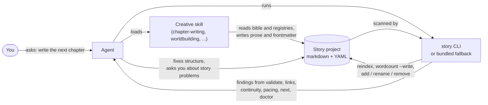

# Core concepts

This page explains the model behind Story Skills: how a story project is laid out on disk, what the files mean, how entities refer to one another, and which work belongs to the skills and which to the `story` CLI. Read it once before you work on a project by hand or change the tooling. The field-by-field contract is in the [project format reference](project-format.md).

**On this page**

- [The short version](#the-short-version)
- [A project is a folder of markdown](#a-project-is-a-folder-of-markdown)
- [Frontmatter and body](#frontmatter-and-body)
- [Entity kinds](#entity-kinds)
- [Identifiers](#identifiers)
- [Registries](#registries)
- [Links and backlinks](#links-and-backlinks)
- [Word counts](#word-counts)
- [Skills and the CLI](#skills-and-the-cli)
- [The bundled fallback CLI](#the-bundled-fallback-cli)

## The short version

- A story project is a folder of plain markdown files. Every file starts with YAML frontmatter.
- The frontmatter holds structured data that tools can check, such as ids, statuses, casts, and chapter references. The body holds prose and notes for humans.
- Each entity lives in its own file, and the filename is its id: `characters/sera-voss.md` is the character `sera-voss`. Ids are kebab-case.
- Entities refer to each other by id. Some references must be mirrored in the other file. These mirrored references are called backlinks.
- Each entity folder has an `_index.md` registry that the CLI generates from the entity files. You rebuild registries; you don't edit them.
- Chapter word counts are measured from the prose and stored in frontmatter, so they can be checked and totalled.
- Skills make the creative decisions and write the story files. The `story` CLI does the mechanical work: it checks, measures, reindexes, counts, and exports, and it never composes or revises prose.

## A project is a folder of markdown

This is [`examples/the-last-ember/`](../examples/the-last-ember/), book 1 of a two-book example series. The other book, [`examples/the-fall-of-the-citadel/`](../examples/the-fall-of-the-citadel/), is a prequel:

```text
examples/the-last-ember
├── chapters
│   ├── _index.md
│   └── chapter-01.md
├── characters
│   ├── _index.md
│   ├── kael-voss.md
│   ├── lord-maren.md
│   └── sera-voss.md
├── continuity
│   ├── clues
│   │   └── _index.md
│   ├── promises
│   │   └── _index.md
│   ├── questions
│   │   └── _index.md
│   └── state.md
├── glossary
│   ├── _index.md
│   └── terms
│       └── ember-burn.md
├── matter
│   ├── _index.md
│   └── epigraph.md
├── plot
│   ├── _index.md
│   ├── arcs
│   │   └── seras-reclamation.md
│   └── timeline.md
├── scenes
│   ├── _index.md
│   └── chapter-01-scene-01.md
├── story.md
├── style-sheet.md
└── worldbuilding
    ├── _index.md
    ├── artifacts
    │   └── blackened-crown.md
    ├── factions
    │   └── marens-guard.md
    ├── locations
    │   ├── ashen-citadel.md
    │   └── whispering-vale.md
    └── systems
        └── ember-magic.md
```

The files fall into three groups:

| Group | Files | Who writes them |
|-------|-------|-----------------|
| Story bible | `story.md`, `style-sheet.md`, `continuity/state.md`, `plot/timeline.md` | You or an agent, by hand. `story init` creates starter versions. |
| Entities | One file per character, location, chapter, scene, and so on, such as `characters/sera-voss.md` | You or an agent, by hand or with `story add`. `story rename` and `story remove` keep references in step. |
| Registries | Every `_index.md` | The CLI (`story reindex`). Some registries also have hand-written sections, described in [Registries](#registries). |

`story init` creates the full layout in one step; see [Getting started](getting-started.md). `story validate` reports an error for any required path that is missing. It warns about a markdown file the model doesn't recognise, such as a stray `notes.md` at the project root or a file nested one folder too deep. Those files are ignored:

```text
Project is valid: 0 errors, 2 warnings, 0 dismissed
warning: notes.md is not part of the story project model and is ignored
warning: characters/drafts/old-kael.md is nested inside an entity directory and is ignored
```

Some skills keep working notes in their own folders, such as `feedback/`, `submission/`, `publishing/`, and `adaptations/`. The CLI ignores those folders without a warning; see [Files the tools ignore](project-format.md#files-the-tools-ignore).

Nothing else lives in a project: no generator scripts and no build scripts that produce story content. Skills write markdown directly, and the CLI runs from wherever it is installed. Build output goes to a disposable `dist/` folder; see [Import, export, and builds](manuscripts.md).

## Frontmatter and body

Each file has two parts. Here is the start of `chapters/chapter-01.md` from the example:

```markdown
---
title: The Ember Wakes
number: 1
pov: sera-voss
locations:
  - whispering-vale
characters:
  - sera-voss
  - kael-voss
arcs-advanced:
  - seras-reclamation
status: draft
word-count: 993
---

# Chapter 1: The Ember Wakes

## Outline

1. **Opening** — Sera in the Heart Grove at dawn, sensing the embers dimming [Location: whispering-vale] [Arc beat: embers are fading]
...
```

- **Frontmatter** is the part tools can check. It holds the fields listed in the [project format reference](project-format.md) and in [`schemas/story.schema.json`](../schemas/story.schema.json). `story validate` checks required fields, enum values, and types. `story links` checks that every id reference points to a real file. `story continuity` checks that the references agree with each other over the course of the story.
- **Body** is for people: prose, outlines, appearance notes, backstory. The CLI reads the body to count words, to split out chapter text for exports, and to check markdown link targets. It never checks whether the writing is any good.

When a CLI command changes a frontmatter value, for example `story wordcount --write` updating `word-count`, it rewrites only the entries that changed. Comment lines, blank lines, unchanged entries (with their quoting and number formatting), and the whole body stay exactly as they were. A file with no changed values is not written at all.

## Entity kinds

An entity is anything with its own file and id. `story add <kind> <name>` creates any of them:

| Kind (`story add`) | Directory | Registry | What it records |
|--------------------|-----------|----------|-----------------|
| `character` | `characters/` | `characters/_index.md` | A person, with role, status, relationships, the locations they're tied to, and optional voice notes (`voice-words`, `voice-avoid`) |
| `location` | `worldbuilding/locations/` | `worldbuilding/_index.md` | A place, with its notable characters, controlling faction, and `routes` (travel times) to other places |
| `system` | `worldbuilding/systems/` | `worldbuilding/_index.md` | A magic system, political order, technology, religion, and so on |
| `faction` | `worldbuilding/factions/` | `worldbuilding/_index.md` | An organised group, with members and locations |
| `artifact` | `worldbuilding/artifacts/` | `worldbuilding/_index.md` | An object that matters to the plot, with owner, location, and status |
| `arc` | `plot/arcs/` | `plot/_index.md` | A plot or character arc, with participants, themes, and acts |
| `chapter` | `chapters/` | `chapters/_index.md` | Chapter prose, plus POV, cast, locations, arcs advanced, word count, and the ending `hook` |
| `scene` | `scenes/` | `scenes/_index.md` | A scene record for a chapter: POV, location, cast, mentions, state changes, and the scene `outcome` |
| `question` | `continuity/questions/` | `continuity/questions/_index.md` | A dramatic question and the chapters where it is introduced and resolved |
| `promise` | `continuity/promises/` | `continuity/promises/_index.md` | A setup and its payoff, by chapter |
| `clue` | `continuity/clues/` | `continuity/clues/_index.md` | A clue for the clue ledger, planted and paid off by chapter, or a red herring and the chapter that debunks it |
| `term` | `glossary/terms/` | `glossary/_index.md` | A glossary term, with category and aliases |
| `research` | `research/` (optional) | `research/_index.md` | A real-world fact the story relies on, with sources, the chapters that use it, and how accurate, risky, and reviewed it is |
| `matter` | `matter/` (optional) | `matter/_index.md` | A front- or back-matter page such as a dedication or acknowledgments, with the permission status of any quoted material |

`story add` also accepts plural and alternate spellings of the kinds, such as `characters`, `glossary-term`, or `research-note`.

Some files hold one thing per project and are not entities:

| File | Frontmatter `type` | Purpose |
|------|--------------------|---------|
| `story.md` | none | The story bible: title, `schema-version: 2`, genre, status, themes, POV, tense, and optional fields for the series, craft, `form` and word target, named `revision-passes`, and publishing metadata |
| `continuity/state.md` | `continuity-state` | Durable state carried between chapters: `character-state`, `object-state`, and `knowledge-state` |
| `plot/timeline.md` | `timeline` | The story timeline. Chapter ids in its body are checked by `story links`. |
| `continuity/exemptions.md` (optional) | `exemption-log` | Continuity findings you've dismissed on purpose, each with a reason |
| `style-sheet.md` (optional) | `style-sheet` | House style that `story prose` reads |
| `progress.md` (optional) | `progress-log` | Daily word counts written by `story progress --log` |

Characters, locations, factions, artifacts, and glossary terms can also carry a `pronunciation` respelling for the audiobook narration build. Every field of every kind is listed in the [project format reference](project-format.md).

## Identifiers

An entity's id is its filename without `.md`. Frontmatter never contains a separate `id` field. Everything that points at an entity (reference lists, registries, scene records, continuity state) uses that id.

Ids are kebab-case: lowercase ASCII letters and digits separated by single hyphens. `story validate` reports an error for any entity filename that isn't. When `story add` creates a file, it derives the id from the name you give it. It drops accents and apostrophes (straight `'` and curly `’` alike) and turns every other run of punctuation or whitespace into a hyphen:

| Name passed to `story add` | Id |
|----------------------------|----|
| `Sera Voss` | `sera-voss` |
| `Sera's Reclamation` | `seras-reclamation` |
| `Maren’s Guard` | `marens-guard` |
| `Café Noir` | `cafe-noir` |
| `Who opened the Whisper Gate?` | `who-opened-the-whisper-gate` |

Chapters and scenes are the exceptions: their ids come from their numbers. Chapter 1 is `chapter-01`. Scene 1 of chapter 1 is `chapter-01-scene-01`. Their titles live in frontmatter, so `story rename` on a chapter or scene changes only the title and keeps the id.

The id comes from the filename, not the name field. A file you write by hand can use any valid id: the example's location is named "The Ashen Citadel" but lives at `worldbuilding/locations/ashen-citadel.md`, so its id is `ashen-citadel`.

The story itself has an id too. It is the kebab-case form of the `story.md` title, and it appears as the `story` field in every registry. `story validate` reports an error when a required registry's `story` value doesn't match. The optional `matter/` and `research/` registries have only their `type` checked.

Because ids are ordinary text in many files, don't rename a file by hand. `story rename <kind> <id> "<New Name>"` moves the file, updates the name field, and rewrites the id in every frontmatter reference field and markdown link target across the project. `story remove <kind> <id>` deletes the file and clears the id from every frontmatter reference field; it leaves markdown links and chapter ids in bodies alone. `story links` reports leftovers only in `plot/timeline.md` and arc bodies, so search hand-written registry sections, `style-sheet.md`, and other entity bodies for the id yourself. Neither command edits prose, so renaming a character called "Port" won't change the word "port" in your chapters. See [`rename`](cli-reference.md#rename) and [`remove`](cli-reference.md#remove) in the CLI reference for details.

## Registries

A registry is the `_index.md` file in an entity folder. It holds a table of every entity in that folder, generated from the entities' frontmatter. For example, `chapters/_index.md`:

```markdown
---
type: chapter-registry
story: the-last-ember
---

# Chapters

## Registry

| # | Title | POV | Status | Word Count | File |
|---|-------|-----|--------|------------|------|
| 1 | The Ember Wakes | sera-voss | draft | 993 | [chapter-01](chapter-01.md) |

## Total Word Count: 993
```

The project has these registries:

| Registry | Frontmatter `type` | Lists |
|----------|--------------------|-------|
| `characters/_index.md` | `character-registry` | Characters |
| `worldbuilding/_index.md` | `world-registry` | Locations, systems, factions, and artifacts |
| `plot/_index.md` | `plot-registry` | Arcs |
| `chapters/_index.md` | `chapter-registry` | Chapters, with word counts and a total |
| `scenes/_index.md` | `scene-registry` | Scene records |
| `continuity/questions/_index.md` | `question-registry` | Questions |
| `continuity/promises/_index.md` | `promise-registry` | Promises |
| `continuity/clues/_index.md` | `clue-registry` | Clues |
| `glossary/_index.md` | `glossary-registry` | Glossary terms |
| `matter/_index.md` | `matter-registry` | Front and back matter, when `matter/` exists |
| `research/_index.md` | `research-registry` | Research notes, when `research/` exists |

### Why registries are rebuilt, not edited

A registry only restates what the entity files already say, so the CLI generates it and nobody maintains it by hand. That matters for three reasons:

- **Agents and people forget.** When you add a character file, it's easy to forget the registry row. `story validate` notices the gap and warns, and `story reindex` fills it.
- **Diffs stay clean.** Rows are in a fixed order: by file id for most registries, by number for chapters, by chapter then scene number for scenes, and by `order` for matter pages. The same files always produce the same registry, byte for byte, so a registry changes in version control only when an entity changes.
- **Registries are what agents read first.** A skill can load `characters/_index.md` to see the whole cast without opening every file, and it can rely on the registry being current.

The registries for `characters/`, `worldbuilding/`, and `plot/` also have sections you write yourself, and `story reindex` keeps them: `## Relationship Map` and `## Family Trees` in the character registry, `## World Overview` in the world registry, and `## Story Structure`, `## Theme Tracking`, and the `structure` frontmatter field in the plot registry. Everything else in a registry is regenerated.

`story reindex` also sets the `story` field in `plot/timeline.md` and `continuity/state.md` when the title changes.

Here is the full cycle on a copy of the example, after writing `characters/orrin-hale.md` by hand:

```shell
story validate .
```

```text
Project is valid: 0 errors, 1 warnings, 0 dismissed
warning: characters/_index.md is missing registry link ](orrin-hale.md)
```

```shell
story reindex .
```

```text
Updated 1 registries
```

When nothing has changed, `story reindex` prints `Registries already up to date`.

You rarely need to run `story reindex` yourself. `story add`, `story rename`, `story remove`, `story wordcount --write`, `story migrate`, and `story import` all reindex when they finish. Run it after you create, delete, or rename an entity file by hand.

## Links and backlinks

A reference is a frontmatter field that holds another entity's id, such as a chapter's `pov`, a scene's `location`, or a promise's `planted` chapter. `story links` checks that every reference points to an existing file of the right kind and that every id in a reference is kebab-case. It also checks the bodies of `plot/timeline.md` and each arc file: every chapter id mentioned there must exist, and every relative link to a `.md` file must resolve to an existing entity file, named by its kebab-case id, inside the project. A link to a non-entity file such as `story.md` or `style-sheet.md` is reported as missing. Links to an `_index.md` registry and links containing a `*` wildcard are not checked.

Some relationships go both ways, and the model stores them in both files. These pairs must agree, and `story links` reports an error when they don't:

| This side | Must be mirrored by | Written automatically by |
|-----------|---------------------|--------------------------|
| A character's `locations` lists a location | That location's `notable-characters` lists the character | `story add character --location` and `story add location --character` |
| A location's `notable-characters` lists a character | That character's `locations` lists the location | Same as above |
| A character's `relationships` has an entry for another character | The other character has a relationship entry pointing back, with the matching inverse type | Nobody: write both entries (the `character-management` skill does this) |
| A book's `story.md` `follows` another book | That book's `precedes` lists this one, and vice versa | `story init --follows` and `story init --precedes` |

For relationships, the backlink type depends on the forward type: a `mentor` needs a `student` backlink, a `sibling` needs a `sibling`, and a type the CLI does not know, such as `antagonist`, accepts any backlink type. The full list of pairs is under [Relationship types](project-format.md#relationship-types) in the project format reference.

In this example, a hand-written character declares `mentor` to `sera-voss` and lists `ashen-citadel`. Sera's file answers with `friend`, and the location doesn't list the new character:

```text
Link check failed: 3 errors, 0 warnings, 0 dismissed
error: characters/orrin-hale.md relationship mentor to sera-voss expects backlink type student, got friend
error: characters/orrin-hale.md location ashen-citadel is missing notable-character backlink
error: characters/sera-voss.md relationship friend to orrin-hale expects backlink type friend, got mentor
```

Every other reference goes one way. A chapter lists its `characters`, but a character doesn't list its chapters. The `Character presence` section of `story timeline` shows that reverse view instead. A location's `routes` are also stored on one side only, but they count both ways: a route from the port to the reef is also a route back, unless the reef declares its own route with a different time. [Series](series.md) covers links between books, and the `character-management` skill's [relationship reference](../skills/character-management/references/relationship-types.md) covers relationship types.

## Word counts

Each chapter's `word-count` frontmatter field is a stored copy of a count the CLI can always recompute from the prose. `story validate` warns when the two differ, and `story wordcount --write` updates the stored value.

The count covers chapter prose only:

- If the body has a `## Chapter Text` heading, only the text after it counts. The `chapter-writing` skill keeps the outline above that heading so the outline never inflates the count.
- Otherwise, if the body has a `## Outline` heading, only the text after the first `---` line below the outline counts. If there is no `---` line, everything after the heading counts.
- Otherwise the whole body counts, minus a leading `# Heading` line.

A word is a run of letters or digits in any script. Straight or curly apostrophes and hyphens join a word, so `don’t` and `well-known` each count once. Code blocks, inline code, images, and link targets are skipped; a link's visible text still counts. [How words are counted](project-format.md#how-words-are-counted) has the exact rules.

After adding a 12-word sentence to the example chapter:

```shell
story validate .
```

```text
Project is valid: 0 errors, 1 warnings, 0 dismissed
warning: chapters/chapter-01.md declares 993 words but contains 1005
```

```shell
story wordcount . --write
```

```text
chapters/chapter-01.md: 1005
Total: 1005
```

`--write` updates the chapter's `word-count` and then reindexes, so the chapter registry's row and `## Total Word Count` match. Without `--write`, `story wordcount` only prints the counts. `story progress` measures these counts against `target-words` and `deadline`; see [Continuity and analysis](continuity.md#story-progress). `story init --form` sets a default `target-words` for the chosen form, and `story validate` warns when the target, or the prose of a `complete` story, falls outside the form's usual range; see [Story form](project-format.md#story-form).

## Skills and the CLI

Story Skills splits the work in two:

| | Skills | `story` CLI |
|-|--------|-------------|
| What it is | `SKILL.md` instructions in [`skills/`](../skills/) that an agent loads | A Node program with no runtime dependencies |
| Kind of work | Creative judgement: what happens next, who a character is, whether a scene works, how to fix a contradiction | Mechanical checks and upkeep: is the file valid, does the id exist, did the dead character come back, how many words |
| Writes | Story content: prose, bible entries, frontmatter values, continuity state | Registries, `word-count` values, reference rewrites on rename and remove, new entity files from templates, revision-pass status, Mermaid diagrams, exports and builds |
| Never does | Invents its own generator or build scripts to emit story content | Composes or revises prose, or makes a story decision |
| Output | Changes to markdown files, and questions for you | Findings with file paths. `validate`, `links`, `continuity`, `compare`, `progress`, `timeline`, `series`, and `names` exit 1 when they find errors (warnings alone exit 0). `prose`, `pacing`, `clues`, `voices`, and `diagram` report only advisory warnings, and exit 1 only when a project file cannot be read. `next`, `doctor`, and `report` always exit 0, and `passes` exits 0 unless it refuses a change |

Each skill ends its workflow by running the maintenance commands that fit what it changed. After adding, removing, renaming, or revising entities, that means some of `story reindex`, `story wordcount --write`, `story links`, and `story validate`, plus `story continuity` after drafting or revision. When a command reports findings, the agent decides how to fix them. It fixes structural problems such as a missing backlink or a stale registry directly. It raises story problems with you, such as a character appearing after their death, and never rewrites prose only to make a check pass.

Beyond the pass-or-fail checks, the CLI has read-only views that measure the manuscript for the craft skills:

| Command | What it shows | Fields it reads |
|---------|---------------|-----------------|
| `story pacing` | Scene units, sequels, scene outcomes, chapter hooks, and chapter lengths, with runs that go slack | Scene `sequel` and `outcome`, chapter `hook` |
| `story clues` | A fair-play grid of where each clue is planted and revealed | Clue `planted`, `payoff`, `characters`, `red-herring`, `significance-delayed` |
| `story voices` | A fingerprint of each character's tagged dialogue, and characters who sound alike | Chapter prose, character names and aliases, `voice-words`, `voice-avoid` |
| `story names` | Whether a candidate name clashes with, or looks like, a name already in the bible | Every character, place, faction, artifact, system, and glossary name |
| `story diagram` | Mermaid source for the family tree, route map, timeline, clue map, or arc map | Relationships, `routes`, dates, clues, and `arcs-advanced` |

Apart from a name clash, which `story names` reports as an error, their findings are advisory. Three easy wins in a row or two characters who sound alike is a prompt for the writer, not an error to clear. The same division holds for revision. `story passes` keeps a checklist of named passes in `story.md`, from structure down to proof. While the story is `revising`, `story next` points at the current pass. The skill does the revising, and the CLI only records which passes are done. The [project format reference](project-format.md#analysis-views) has the exact rules for each view.



The CLI is optional. Without it, the skills tell the agent to make the registry, backlink, and word-count checks by hand, which is slower and easier to get wrong. [`story next`](cli-reference.md#next) and [`story doctor`](cli-reference.md#doctor) turn the same checks into a prioritised list of what to do next. The [Skills catalogue](skills.md) describes each skill, and [Continuity and analysis](continuity.md) covers the continuity engine.

## The bundled fallback CLI

The skills are often installed by copying the `skills/` folders into an agent's skills directory, with no npm package present. For that case, the `story-maintenance` skill ships the whole CLI as a single file: [`skills/story-maintenance/scripts/story.js`](../skills/story-maintenance/scripts/story.js). It is a bundle of `bin/story.js` and `src/`, with the version inlined, so it behaves the same as the package and needs only Node 18 or newer:

```shell
node skills/story-maintenance/scripts/story.js --version
```

```text
0.9.2
```

Skills look for a CLI in this order:

1. `story <command>`, when the package is installed (`npm install -g story-skills`)
2. `npx story-skills <command>`, which runs the published package without installing it
3. `bun run story -- <command>`, when working in a checkout of this repository
4. `node ../story-maintenance/scripts/story.js <command>`, resolved relative to the skill's own folder (the `story-maintenance` skill itself uses `node scripts/story.js`)

The agent runs the fallback where it is installed. It never copies it into the story project, which stays markdown only. The fallback is generated with `bun run build:fallback`, and CI checks that it matches the source; see the [Development guide](development.md).

## See also

- [Getting started](getting-started.md): create a project and go through the full loop.
- [Project format reference](project-format.md): every file, field, and allowed value.
- [CLI reference](cli-reference.md): every command and flag.
- [Skills catalogue](skills.md): what each skill does and when it runs.
- [Continuity and analysis](continuity.md): the checks that catch contradictions.
- [Documentation index](README.md): every page, by audience and task
