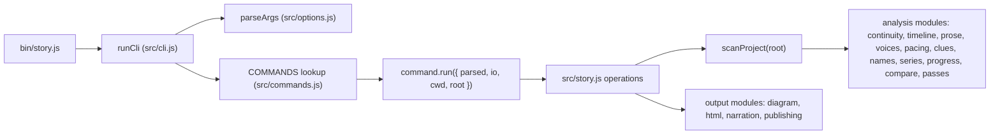

# Development guide

This page is for contributors to the Story Skills repository: how the code is laid out, how the `story` CLI works, and how changes are tested, checked, and released. [`AGENTS.md`](../AGENTS.md) holds the short version of these rules for coding agents; this page explains the mechanics and the reasons behind them.

If you want to use Story Skills rather than change it, start with [Getting started](getting-started.md).

**On this page**

- [Setting up](#setting-up)
- [Repository layout](#repository-layout)
- [CLI architecture](#cli-architecture), including [adding a command](#adding-a-command) and [adding a flag](#adding-a-flag)
- [The bundled fallback](#the-bundled-fallback)
- [Tests](#tests) and the [coverage gate](#coverage-gate)
- [Examples check](#examples-check), [Schema](#schema), and [Metadata check](#metadata-check)
- [Evals](#evals)
- [Authoring a skill](#authoring-a-skill)
- [CI](#ci)
- [Contributing changes](#contributing-changes)
- [Releasing](#releasing) and [publishing to npm](#publishing-to-npm)

## Setting up

You need [Bun](https://bun.sh) for development (the repository pins `bun@1.3.14` in `package.json`) and Node 18 or later, because the CLI and the check scripts must run under plain Node. The package has no runtime or development dependencies, so `bun install` has nothing to download; run it anyway so your setup matches CI.

```shell
git clone https://github.com/danjdewhurst/story-skills.git
cd story-skills
bun install
bun run story -- --help
```

`bun run story -- <args>` runs the CLI straight from `src/`. Everything after `--` is passed to `story`, so `bun run story -- validate examples/the-last-ember` validates an example project.

### Scripts at a glance

All scripts live in `package.json`.

| Script | What it runs | When to use it |
| --- | --- | --- |
| `bun run story -- <args>` | `bin/story.js` from source | Trying CLI changes |
| `bun run test` | `bun test ./test/*.test.js` | Every change |
| `bun run test:coverage` | Tests with lcov coverage, then `scripts/check-coverage.js`, then `check:fallback` | Any change to `src/`, parsing, scanning, validation, or release readiness |
| `bun run test:examples` | `scripts/check-examples.js` | Changes to examples, the project format, validation, or the schema |
| `bun run check:metadata` | `scripts/check-metadata.js` | Changes to skills, plugin manifests, templates, or versions |
| `bun run check:evals` | `scripts/check-evals.js` | Changes to eval fixtures or skill names |
| `bun run eval:selftest` | `evals/run-evals.js --all evals/examples` | Changes to the eval checker or fixtures |
| `bun run build:fallback` | `bun build` of `bin/story.js` into the skill folder | After any change to `src/` |
| `bun run check:fallback` | `scripts/check-fallback.js` | Confirms the committed fallback matches a fresh build |
| `bun run check:node-help` | `node skills/story-maintenance/scripts/story.js --help` | Confirms the fallback runs under Node |
| `bun run release <bump>` | `scripts/release.js` | Cutting a release (maintainers only) |

## Repository layout

```text
story-skills/
├── bin/story.js                  # package binary; calls runCli from src/cli.js
├── src/                          # CLI source (ESM, node: imports only)
├── skills/<name>/SKILL.md        # published agent skills, plus references/
├── skills/story-maintenance/scripts/story.js   # generated Node fallback CLI
├── schemas/story.schema.json     # JSON schema for project frontmatter
├── examples/                     # four sample story projects (shipped in the npm package)
├── test/                         # Bun tests (*.test.js), helpers.js, setup.js
├── scripts/                      # check scripts and the release script
├── evals/                        # skill regression harness (repo tooling only)
├── templates/github/             # workflows and an issue form users copy into story repositories (shipped in the npm package)
├── docs/                         # this documentation (shipped in the npm package)
├── assets/                       # logo, screenshot, social preview, demo GIF + VHS tape
├── .github/                      # CI, publish workflow, Dependabot
├── .claude-plugin/               # Claude Code plugin and marketplace manifests
├── .codex-plugin/                # Codex plugin manifest
├── .agents/plugins/              # Codex marketplace manifest
└── plugins/story-skills -> ..    # symlink to the repo root, for Codex
```

Notes on specific paths:

- `plugins/story-skills` is a symlink to the repository root. Codex marketplace entries must point at a child plugin directory, so `.agents/plugins/marketplace.json` points at `./plugins/story-skills`. Keep it a symlink; a copy would duplicate `skills/` and drift. `check:metadata` fails if the path is missing or the marketplace entry points anywhere else.
- `evals/` is tooling for this repository. Agents using the skills never load it. `evals/outputs/` and `evals/baseline/` are gitignored.
- `docs/`, `bin/`, `src/`, `skills/`, `schemas/`, `README.md`, and `LICENSE` (the `files` list in `package.json`), plus `package.json` itself, which npm always includes, are the only paths published to npm.
- `assets/demo.gif` is generated from `assets/demo.tape` with `vhs assets/demo.tape`.
- `CLAUDE.md` is a symlink to `AGENTS.md`. Edit `AGENTS.md` and leave the symlink alone.

Do not commit `node_modules/`, `coverage/`, `dist/` directories inside examples, or editor swap files. `.gitignore` already covers them.

## CLI architecture

The CLI is plain ESM JavaScript with no dependencies. It uses `node:` built-ins and, like the existing code, synchronous filesystem calls. It must keep running on Node 18.



### Module responsibilities

| Module | Responsibility |
| --- | --- |
| `bin/story.js` | Entry point. Passes `process.argv`, `cwd`, `stdout`, and `stderr` to `runCli` and sets `process.exitCode`. |
| `src/cli.js` | Builds `HELP` and per-command help from the registries, handles `--help` and `--version`, looks up the command (suggesting a near miss for an unknown one), rejects `--path` on commands that create projects, resolves the project root, and turns thrown errors into a message on stderr and exit code 1, rewording Node file-system errors as `Cannot <action> <path>: <reason>`. |
| `src/commands.js` | The `COMMANDS` registry: every command's name, usage, help summary, project-path mode, and `run` function, in help order (the analysis commands `diagram`, `names`, `pacing`, `clues`, and `voices` sit after `prose`; `passes` sits after `series`). Also the internal `reportResult` helper, which writes the standard `N errors, N warnings, N dismissed` summary and each finding to stderr and returns the exit code. |
| `src/options.js` | The `OPTIONS` registry, `parseArgs`, `formatOptionsHelp`, and `isTruthy`. Includes the flags for `init --form`, `build --trim`, `passes --init` / `--start` / `--done`, `add scene --outcome`, `add chapter --hook`, `add clue --red-herring`, and `add research --accuracy` / `--confidence` / `--method` / `--risk`. |
| `src/story.js` | The bulk of the CLI: `scanProject`, validation, link checks, reindexing, word counts, `add` / `rename` / `move` / `remove`, migration, reports, export, synopsis, and all path-safety guards. It also holds the file-reading wrappers for the newer commands (`clueReport`, `diagramProject`, `namesReport`, `pacingReport`, `projectPasses`, `voicesReport`) and `buildBook`, which writes the EPUB, DOCX, and Shunn formats itself and hands `html`, `print`, `narration`, and `metadata` to the output modules below. |
| `src/frontmatter.js` | A dependency-free parser and writer for the YAML subset the project format uses (`parseFrontmatter`, `stringifyFrontmatter`, `replaceFrontmatter`). |
| `src/markdown.js` | Text helpers: `kebabCase`, `titleCaseSlug`, word splitting and counting, `chapterProse`, `extractSection`. |
| `src/continuity.js` | `checkContinuity(project)`: character deaths, chapter and scene casts, chapter sequence, promise, question, and clue ordering, story completion, durable state, prop custody, and the story clock, including route travel (a character seen at two places faster than the shortest path through location `routes` allows). Applies `continuity/exemptions.md` to move matching findings into `dismissed`. Also exports the story date and time parsers. |
| `src/timeline.js` | Read-only timeline, POV balance, and character presence for `story timeline`. |
| `src/prose.js` | Deterministic prose counts and thresholds for `story prose`. Also exports `editDistance`, which `names.js` uses for look-alike names. |
| `src/voices.js` | Dialogue fingerprints for `story voices`: attributes speech only from a named speech tag or a single-name action beat with no pronoun tag, then compares characters and checks `voice-words` and `voice-avoid`. `story.js` reads the chapter prose and passes in paragraphs. |
| `src/pacing.js` | The `story pacing` dashboard: scenes, sequels, scene outcomes, and chapter hooks per chapter, with advisory findings. Exports the allowed `SCENE_OUTCOMES` and `CHAPTER_HOOKS`, which validation also uses. |
| `src/clues.js` | The fair-play plant/reveal grid for `story clues`. Advisory only; `continuity.js` owns the hard clue-ordering errors. |
| `src/names.js` | `story names`: collects every existing name, alias, and glossary term and checks candidates against them. Exact clashes are errors; look-alikes and shared initials are warnings. |
| `src/diagram.js` | Mermaid source for `story diagram` (`relationships`, `locations`, `timeline`, `clues`, `arcs`). Reuses `buildTimeline` from `timeline.js`. |
| `src/passes.js` | Reads, validates, and updates the `revision-passes` list in `story.md` for `story passes`, and supplies the default pass ladder and the next pass for `story next`. |
| `src/forms.js` | `STORY_FORMS` (novel, novella, short story, and so on) with their usual word ranges and default targets, for `init --form` and the out-of-range warning in `validate`. |
| `src/publishing.js` | Publishing metadata in `story.md`: validation, ISBN normalisation, the generated copyright page, and the retailer sheet for `build --format metadata`. |
| `src/html.js` | The single-file HTML review copy with paragraph anchors such as `ch03-p12` (`--format html`), the paged-media print interior (`--format print`), trim sizes, and page estimates. |
| `src/narration.js` | The audiobook narration script for `--format narration`: pronunciation guide, credits, and runtime estimates at 155 words per minute. |
| `src/series.js` | Series links, backlinks, and shared-canon checks across books. |
| `src/progress.js` | Pure progress arithmetic and the `progress.md` session log. |
| `src/compare.js` | Chapter-by-chapter comparison with an earlier draft. |
| `src/import.js` | Splits an existing manuscript into a new project and suggests entity candidates. |
| `src/version.js` | `VERSION`, printed by `story --version`. Bumped only by the release script. |

Most commands follow the same pattern. A function in `src/story.js` takes the project root, calls `scanProject(root)` to read every entity file into one in-memory project object, and passes that object to a pure function in a feature module. For example, `checkProjectContinuity(root)` is `checkContinuity(scanProject(root))`. What happens next depends on the kind of command:

- Check commands such as `validate`, `links`, and `continuity` get back `{ ok, errors, warnings }` (plus `dismissed` for continuity) and hand it to `reportResult`.
- Report commands (`compare`, `progress`, `timeline`, `prose`, `voices`, `pacing`, `clues`, `names`, and `series`) pass their result to a `format*` function from the feature module and write the text to stdout, then hand the same result to `reportResult` for the stderr summary and exit code.

- `diagram` prints Mermaid source to stdout, or writes it with `--out` once the scan is clean. `passes` prints the pass list, rewrites only the `revision-passes` entry in `story.md` when asked to change it, and always exits 0.

Keep new analysis code in that shape: pure functions over the scanned project, with file I/O left to `story.js`. The output modules (`html.js`, `narration.js`, `publishing.js`, `diagram.js`) follow the same rule: they return strings, and `story.js` writes them.

For what the commands do from a user's point of view, see the [CLI reference](cli-reference.md). For the files they read and write, see the [Project format reference](project-format.md).

### Writes stay inside the project

Every file write goes through the exported `writeFile` in `src/story.js` (`src/import.js` uses it too), which calls `prepareWriteTarget`. When a project root is supplied, it refuses paths that resolve outside the root (lexically or through a symlinked parent) and refuses to write through a symlink. Relative `--out` paths are held to the project root; an absolute `--out` path is taken as the user's explicit choice. If you add a command that writes files, route the write through `writeFile` with `{ root }` rather than calling `fs.writeFileSync` directly. The symlink and outside-root cases are covered in `test/init-add-safety.test.js`.

### Command and option registries

`src/commands.js` and `src/options.js` are the single source of truth for the CLI surface. Help text, argument parsing, and project-path handling are all derived from them:

- `HELP` in `src/cli.js` is built by walking `COMMANDS` (usage plus summary lines) and calling `formatOptionsHelp()`, which walks `OPTIONS`. A command cannot be dispatched without appearing in help, or appear in help without being wired.
- `parseArgs` builds its sets of boolean, value, and repeatable options from `OPTIONS`. Any `--flag` not in the registry fails with `Unknown option --flag`, plus `; did you mean --other?` when an option the command accepts is a near miss: `runCli` passes the command's `options` (and `path`, for commands that take a project) as the suggestion list. A single-dash word such as `-ism` is a positional, and a lone `--` makes every later argument positional. `story help <command>` passes the command's own `options` to `formatOptionsHelp()` for per-command help.
- `resolveRoot` reads the command's `project` field to decide where the story project is.

A command entry looks like this (the real `reindex` entry):

```js
{
  name: "reindex",
  usage: "reindex [path]",
  summary: ["Rebuild registry tables from markdown files"],
  project: "positional",
  run({ io, root }) {
    const result = reindexProject(root());
    io.stdout.write(result.changed.length === 0
      ? "Registries already up to date\n"
      : `Updated ${result.changed.length} registries\n`);
    return 0;
  }
}
```

| Field | Meaning |
| --- | --- |
| `name` | The command word. Must equal the first word of `usage`. |
| `usage` | The usage shown in help, such as `validate [path]` or `add <kind> <name>`. |
| `summary` | Help lines. Each line is a separate array entry; help lines must stay within 80 characters. |
| `project` | `"positional"`: takes an optional project path as its first argument or `--path`. `"flag"`: takes the project path only from `--path`, because its positionals mean something else (`knowledge`, `add`, `rename`, `move`, `remove`). `"none"`: creates a new project (`init`, `import`), uses `--dir`, and refuses `--path`. |
| `run` | Receives `{ parsed, io, cwd, root }`. `parsed` is `{ positionals, options }` from `parseArgs`, with the command name at `positionals[0]`. `root()` resolves the project path lazily. Returns the exit code. |

For a `"positional"` command, `story validate book` and `story validate --path book` are equivalent. If both are given and resolve to different directories, the CLI fails with `Conflicting project paths`.

An option entry has these fields:

| Field | Meaning |
| --- | --- |
| `name` | The flag without `--`. |
| `value` | The argument name shown in help, such as `<path>`. Omit it for a boolean flag. |
| `repeatable` | Collect every value into an array. Without it, the last value wins, so `--out a.md --out b.md` writes `b.md`. |
| `help` | Help lines. Omit `help` for a hidden alias (plural forms such as `--characters`); hidden aliases must be `repeatable`. |

Parsing rules worth knowing when you add a flag:

- Value options accept `--name value` or `--name=value`. A value that starts with `--` must use the `=` form.
- Boolean options accept `--name`, `--name=false`, or a following literal (`true`, `false`, `1`, `0`, `yes`, `no`, `on`, `off`). Read them with `isTruthy(parsed.options.name)`.
- `-h` / `--help` and `-v` / `--version` are handled before any command runs.

### Adding a command

1. Put the logic in `src/story.js`, or in a new or existing feature module if it is a pure analysis over the scanned project. Export the function.
2. Import it in `src/commands.js` and add an entry to `COMMANDS` at the place you want it to appear in help. Use `project: "positional"` if the command takes `[path]`.
3. Add any new flags to `OPTIONS` (see below).
4. Add focused tests. `test/registry.test.js` checks automatically that every command is well formed, appears in help, and resolves its project path correctly; you still need behaviour tests for the command itself (see `test/cli.test.js` for the `invoke` pattern).
5. Update the user-facing docs: the [CLI reference](cli-reference.md), the command list in [`skills/story-maintenance/SKILL.md`](../skills/story-maintenance/SKILL.md), and the "Companion CLI" section of the README.
6. Rebuild and check the fallback: `bun run build:fallback`, then `bun run check:fallback`.
7. Run `bun run test:coverage`. The coverage gate requires every line and function in `src/` to be covered.

Do not add a separate dispatch branch in `src/cli.js` or edit help text by hand. Both come from the registry.

### Adding a flag

Add an entry to `OPTIONS` in `src/options.js`, placed where it should appear in help, and read it in the command's `run` through `parsed.options["flag-name"]`; read boolean flags with `isTruthy`. The `add`, `rename`, and `remove` commands spread `parsed.options` into `createEntity`, `renameEntity`, and `removeEntity`, so a new flag reaches those functions without a `run` change, but the function still has to read it. If the flag writes to a list field, make it `repeatable` and consider a hidden plural alias, following `--character` / `--characters`.

## The bundled fallback

[`skills/story-maintenance/scripts/story.js`](../skills/story-maintenance/scripts/story.js) is a single-file build of the whole CLI. Regenerate it with:

```shell
bun run build:fallback
```

The script runs `bun build ./bin/story.js --target=node --outfile=skills/story-maintenance/scripts/story.js`.

It exists because many users install only the `skills/` folder: they copy skills into `.claude/skills/` or `.agents/skills/`, or use a skills installer. Those installs have no `src/` and no `story` binary on `PATH`. The skills fall back to `node ../story-maintenance/scripts/story.js`, resolved relative to the skill folder, so the fallback has to be committed, current, and runnable under Node 18. The `package.json` beside it (`{"type":"module"}`) makes Node treat it as an ES module even when the skills sit under a CommonJS `package.json`. It also inlines `src/version.js`, which is why the release script rebuilds it after bumping the version.

Two checks keep it honest:

- `bun run check:fallback` builds a fresh copy into a temporary directory and compares it byte for byte with the committed file. `test:coverage` runs it as its last step.

  ```text
  Bundled story-maintenance fallback is up to date.
  ```

  If it fails, it prints `Bundled story-maintenance fallback is out of date.` and `Run: bun run build:fallback`.
- `bun run check:node-help` (and the CI Node matrix) runs the fallback under Node to confirm it starts.

Never edit the generated file by hand, and always commit it alongside the `src/` change that produced it.

## Tests

Tests use Bun's built-in runner (`bun:test`) and live in `test/*.test.js`, roughly one file per feature: `cli.test.js`, `registry.test.js`, `continuity.test.js`, `prose.test.js`, `series.test.js`, `shunn-docx.test.js`, `check-scripts.test.js`, and so on. At the time of writing the suite is 688 tests across 46 files.

The newer commands and fields each have their own file: `voices.test.js`, `pacing.test.js`, `clue-matrix.test.js` (the `story clues` grid; `clue.test.js` covers clue entities), `names.test.js`, `diagram.test.js`, `passes.test.js`, `form.test.js`, `routes.test.js` (location routes and travel-time continuity), `research-review.test.js` (research accuracy, method, and risk), `matter-permissions.test.js`, `publishing.test.js`, `html-build.test.js`, `narration.test.js`, and `metadata-build.test.js`. `review-fixes.test.js` holds regression tests for bugs found in review across those features.

```shell
bun run test                              # the whole suite
bun test ./test/registry.test.js          # one file (keep the ./ prefix)
bun test ./test/cli.test.js -t "repeated" # tests whose names match a pattern
```

`test/helpers.js` provides the shared fixtures:

- `makeTempDir(prefix)` creates a fresh directory under the OS temp directory (`story-skills-*` by default). `test/setup.js`, preloaded through `bunfig.toml`, removes every one after the run, so create test directories with it rather than `fs.mkdtempSync`.
- `memoryIo(cwd)` is an in-memory `io` object for `runCli`, with `output()` and `error()` accessors.
- `writeMarkdown(filePath, frontmatter, body)` writes a markdown file with frontmatter, creating parent directories.

Most CLI tests call `runCli` directly with `memoryIo` rather than spawning a process, so they are fast and count toward coverage. Build a project in a temp directory, run commands against it, and assert on the exit code, stdout, stderr, and resulting files. Never point a test that writes files at `examples/`.

Beyond the CLI, the tests also check repository invariants: `test/check-scripts.test.js` verifies that every GitHub Actions `uses:` reference in `.github/workflows/ci.yml` and the three workflow templates is pinned to a 40-character commit SHA with a version comment, that the templates pin the same action SHAs as `ci.yml`, that every template job sets `timeout-minutes`, that CI still runs the release-gate checks and the Node 18 floor, that Dependabot watches GitHub Actions, and that `review-copy.yml` builds the HTML review copy and deploys it with GitHub Pages while the `manuscript-note.yml` issue form asks for a paragraph anchor. `test/release.test.js` covers the release script's version handling.

### Coverage gate

```shell
bun run test:coverage
```

This runs the suite with lcov output into `coverage/`, then `node scripts/check-coverage.js coverage/lcov.info src`, then `check:fallback`. The coverage threshold is 100%: every `.js` file in `src/` must have a coverage record, and every line and every function in it must be hit. If the lcov report includes branch records (`BRDA`, or `BRF`/`BRH`), branches must be at 100% too. Bun's lcov reporter does not currently emit branch records, so the branch gate is skipped with a note:

```text
Note: coverage/lcov.info contains no branch records, so the branch gate was skipped. Use a coverage reporter that emits BRDA/BRF/BRH records to enforce branch coverage.
Coverage is 100% for src line and function coverage.
$ node scripts/check-fallback.js
Bundled story-maintenance fallback is up to date.
```

A failure prints `Coverage is below 100%:` followed by one line per gap, keyed by absolute path, such as `/path/to/story-skills/src/prose.js line coverage 410/412` (or `function coverage`, `branch coverage`, or `has no coverage record`), and exits with status 1. `bunfig.toml` sets `coverageSkipTestFiles = true` so test files do not count. The `coverage/` directory is gitignored.

## Examples check

```shell
bun run test:examples
```

`scripts/check-examples.js` walks every directory under `examples/` that has a `story.md` and runs `validateProject`, `validateLinks`, `seriesReport`, `checkProjectContinuity`, and the JSON schema check against it. Any error or warning fails the check, with one exception: [`examples/the-unraveled-thread`](../examples/the-unraveled-thread) is the showcase for `story continuity` and must produce exactly the findings listed in `EXPECTED_CONTINUITY` at the top of the script, no more and no fewer.

```text
Examples are valid:
harbor-of-second-light: 1 chapters, 1489 words, 0 expected continuity findings
the-fall-of-the-citadel: 1 chapters, 248 words, 0 expected continuity findings
the-last-ember: 1 chapters, 993 words, 0 expected continuity findings
the-unraveled-thread: 4 chapters, 111 words, 7 expected continuity findings
```

`the-last-ember` and `the-fall-of-the-citadel` are linked books in the same series, so the series check also confirms they agree on shared canon.

When you change the project format, update the examples, the schema, and the tests together. If a change alters the unraveled-thread findings on purpose, update `EXPECTED_CONTINUITY` in the same commit. Treat examples as read-only when experimenting: copy one to a temporary directory before running commands that write (`reindex`, `wordcount --write`, `add`, `build`, `export`).

## Schema

[`schemas/story.schema.json`](../schemas/story.schema.json) describes project frontmatter as one aggregate document rather than per file. [`scripts/check-schema.js`](../scripts/check-schema.js) builds that document from a project:

- `story`: the `story.md` frontmatter.
- One array per entity directory (`characters`, `worldbuilding.locations`, `plot.arcs`, `chapters`, `scenes`, `continuity.questions`, `glossary`, `matter`, `research`, and the rest), each item carrying its filename-derived `id`.
- `continuity`: the durable state from `continuity/state.md` and the `exemptions` list from `continuity/exemptions.md`.
- `progressLog` and `styleSheet`, when `progress.md` and `style-sheet.md` exist.

It then validates the document with a small built-in validator. The validator supports only the keywords the schema uses: `$schema`, `$id`, `$comment`, `$defs`, `title`, `description`, `$ref`, `type`, `required`, `properties`, `items`, `enum`, `const`, `pattern`, `minimum`, `exclusiveMinimum`, and `minLength`. `type` may be a single type or an array of types, such as `["string", "integer"]`. It walks the whole schema first and throws on any other keyword, so the schema cannot quietly outgrow the validator. If you need a new keyword, add support for it in `check-schema.js` with tests.

The schema check runs as part of `test:examples` and in `test/schema.test.js`, which also checks that projects scaffolded by `story init` and `story add` match the schema. You can run it on its own:

```shell
node scripts/check-schema.js
```

```text
Examples match schemas/story.schema.json: harbor-of-second-light, the-fall-of-the-citadel, the-last-ember, the-unraveled-thread
```

The CLI's own validation (`story validate`) lives in `src/story.js` and is separate from the JSON schema. A new frontmatter field usually needs both: the validation rule in `src/story.js` and the property in the schema. The current schema version is `STORY_SCHEMA_VERSION = 2` in `src/story.js`; `story migrate` upgrades older projects. The field-by-field reference is [Project format reference](project-format.md).

## Metadata check

```shell
bun run check:metadata
```

```text
Metadata is aligned for story-skills@0.11.0.
```

`scripts/check-metadata.js` fails if any of these drift:

- `name` and `version` in `package.json`, `.codex-plugin/plugin.json`, and `.claude-plugin/plugin.json`.
- `VERSION` in `src/version.js` against the package version.
- `.codex-plugin/plugin.json` `skills` must be `./skills/`.
- Every directory in `skills/` must contain a `SKILL.md` whose frontmatter `name` equals the directory name and whose `description` is non-empty.
- `STORY_REF` in `templates/github/story-checks.yml`, `templates/github/draft-next-chapter.yml`, and `templates/github/review-copy.yml` must equal `v<package version>`.
- Version examples in `README.md` and `docs/*.md` must name the package version. `scripts/doc-versions.js` defines them: a line holding only a version (`--version` output), `story-skills@X.Y.Z`, `story-skills#vX.Y.Z`, `STORY_REF: "vX.Y.Z"`, `git checkout vX.Y.Z`, and the `Releasing X.Y.Z -> ...` transcript. Other version mentions, such as "newer than 0.8.2" or a `--ref v0.8.0` example, are not checked. The failure names the file and line.
- `.claude-plugin/marketplace.json` and `.agents/plugins/marketplace.json` must name the package, list a plugin with the package name, and carry no version that differs from the package. The Codex entry must point at `./plugins/story-skills`, and that path must exist.

Marketplace entries are deliberately unversioned, so there is only one place per manifest for a version to live.

## Evals

The `evals/` directory regression-tests the writing skills. It is described in full in [`evals/README.md`](../evals/README.md); this section covers what a contributor needs day to day.

Each fixture in `evals/fixtures/<name>/` has an `input.md` (the context passage) and a `checks.json` naming the skill under test, the drafting `brief`, the canon phrases that must survive (`required`), the traps a lazy draft would spring (`banned`, `banned_regex`), optional length, structure, and voice-drift bounds, and the phrase collisions the fixture means (`expected_overlaps`). Each fixture also has a known-good draft in `evals/examples/<name>.md`.

Twelve fixtures cover eight of the 21 skills. The rest have no behavioural regression net; a fixture is worth adding for a skill whose output a substring checker can actually judge.

The harness has two halves: deterministic checks that run in CI, and model-backed runs you start by hand.

### Deterministic checks

```shell
bun run check:evals     # validate fixture structure
bun run eval:selftest   # run the checker against the known-good drafts
```

`scripts/check-evals.js` checks that every fixture has `input.md`, a valid `checks.json` with a non-empty `brief`, a `skill` that matches a directory in `skills/`, at least one real check, well-typed fields, and compiling regexes, plus a matching known-good draft (and no orphan drafts). A clean tree is silent:

```text
all eval fixture checks passed
```

It warns when a banned phrase appears in the fixture's `input.md` or overlaps a required phrase, and a fixture acknowledges the collisions it means in `expected_overlaps` (see the check format in [`evals/README.md`](../evals/README.md)). The `anti-slop` input is deliberately seeded with the tells its brief asks the model to remove, and several traps have to contain a required name; those are recorded, so only a **new** collision warns:

```text
WARN canon-keeping: banned "the Thursday boat" overlaps required "Thursday" — keeping the canon may trip the trap (acknowledge it in expected_overlaps.with_required if it is deliberate)
all eval fixture checks passed
```

An acknowledgement that no longer matches a real collision fails the check, so a stale entry cannot sit in a fixture muting nothing.

`eval:selftest` runs `evals/run-evals.js --all evals/examples`, the dependency-free checker, over the known-good drafts:

```text
anti-slop: 36/36 checks passed
canon-keeping: 35/35 checks passed
deep-pov: 31/31 checks passed
genre-craft-mystery: 26/26 checks passed
motif-restraint: 32/32 checks passed
no-invention: 36/36 checks passed
promise-payoff: 41/41 checks passed
question-stays-open: 34/34 checks passed
revision-continuity: 30/30 checks passed
screenplay-fountain: 36/36 checks passed
series-continuity: 31/31 checks passed
voice-preservation: 28/28 checks passed
```

### Model-backed runs

```shell
node evals/run-skill.js                                   # every fixture with its declared skill, claude-opus-5
node evals/run-skill.js --model claude-sonnet-5 canon-keeping
node evals/run-skill.js --skill revision-continuity       # load one skill for every fixture
node evals/run-skill.js --no-skill --no-judge --out evals/baseline
node evals/compare-outputs.js evals/baseline evals/outputs
```

`run-skill.js` sends each fixture through `claude -p` with the skill's `SKILL.md` and references as the system prompt, writes drafts to `evals/outputs/`, runs the checker, and then asks a judge model (`claude-opus-5` unless `--judge-model` says otherwise) to list any invented canon; one listed claim fails the fixture. `compare-outputs.js` does a blind pairwise comparison against a no-skill baseline. Both need the Claude Code CLI on `PATH` with working credentials, cost money, and produce nondeterministic output, so CI never runs them.

Run the model evals before and after any change to a skill's instructions or references, read the drafts as well as the pass counts, and record the run in the "Last full model run" table in `evals/README.md`. To add a fixture, follow "Adding a fixture" in that README, add its known-good draft, and run `bun run check:evals` and `bun run eval:selftest`.

## Authoring a skill

Each skill is a directory under `skills/` with a `SKILL.md` and, usually, a `references/` directory. The [Skills catalogue](skills.md) lists them for users.

```text
skills/research/
├── SKILL.md
└── references/
    └── research-practice.md
```

`SKILL.md` starts with YAML frontmatter. Every existing skill uses exactly two fields, `name` and `description`, and the metadata check requires both:

```markdown
---
name: research
description: This skill should be used when the user asks to "research", "fact-check", ... or needs to record the real-world facts a story relies on and the chapters that use them.
---
```

`name` must equal the directory name. `description` is what an agent reads when deciding whether to load the skill, so list the phrases and situations that should trigger it.

Conventions the existing skills follow:

- Write for the agent, not the reader: what to read, what to edit, which checks to run, and when to stop and ask the user. The usual sections are Overview, Prerequisites, When to Use, a numbered Workflow, Conventions, CLI Maintenance, and Reference Files (see [`skills/research/SKILL.md`](../skills/research/SKILL.md)).
- Put long templates and craft material in `references/` and list each file with a one-line description under "Reference Files". Keep `SKILL.md` itself operational.
- Use kebab-case ids for story entities and keep bidirectional links where the format requires them (relationships, faction members, series links, and so on).
- After any step that adds, removes, renames, or revises story entities, tell the agent which maintenance commands to run: `story reindex`, `story wordcount --write`, `story links`, and/or `story validate`.
- Include the standard "CLI Maintenance" paragraph telling the agent to prefer `story`, then `bun run story --` from a checkout, then the bundled fallback `node ../story-maintenance/scripts/story.js`, and to do the checks by hand if no CLI is available. Copy it from an existing skill.
- Keep projects markdown-first. Skills must not tell agents to create project-local generator or build scripts that emit story content.

When you add, rename, or remove a skill:

1. Run `bun run check:metadata` to confirm the frontmatter.
2. Update the [Skills catalogue](skills.md) and the skills table in the README.
3. Check cross-references: other skills name each other by directory name (for example, `chapter-writing` hands off to `revision-continuity`).
4. If the skill changes drafting behaviour, run the model evals before and after, and consider a fixture whose `skill` names it.

Both plugin manifests pick up new skills automatically: `.codex-plugin/plugin.json` points at `./skills/`, and Claude Code loads the skills directory of the plugin root.

## CI

[`.github/workflows/ci.yml`](../.github/workflows/ci.yml) runs on pushes to `main` and on every pull request. A new run on the same ref cancels the one in progress. The workflow file is the source of truth for which checks run and in what order.

The `test` job uses Bun 1.3.14 and runs, in order:

1. `bun install`
2. `bun run check:metadata`
3. `bun run check:evals`
4. `bun run eval:selftest`
5. `bun run test`
6. `bun run test:coverage` (includes `check:fallback`)
7. `bun run test:examples`
8. `node skills/story-maintenance/scripts/story.js --help`

The `node` job runs on Node 18, 20, and 22 without Bun. It runs `node scripts/check-examples.js`, then `--version` and `validate examples/the-last-ember` against both the source CLI (`node bin/story.js`) and the bundled fallback. It then copies `skills/story-maintenance` into a temporary folder under a `{ "type": "commonjs" }` `package.json` and runs `--version` and `validate` against that copy, the way a copied install runs. This is what keeps the Node 18 floor in `engines.node` honest; `test/check-scripts.test.js` fails if the matrix stops including the floor.

Every action in the repository's workflows and in `templates/github/` is pinned to a full commit SHA with the version tag in a trailing comment, and [`.github/dependabot.yml`](../.github/dependabot.yml) proposes weekly updates for the `github-actions` ecosystem. `test/check-scripts.test.js` enforces the pinning for `ci.yml` and the three workflow templates, so a new `uses:` line with a moving tag there fails `bun run test`. Dependabot updates only `.github/workflows/`, so the same test fails when a template's pin for an action differs from `ci.yml`: after merging a Dependabot bump, copy the new SHA and version comment into `templates/github/`. `publish.yml` is pinned the same way, but no test checks it, so keep it pinned by hand.

The templates in `templates/github/` are for users' story repositories, not this one: `story-checks.yml`, `draft-next-chapter.yml`, `review-copy.yml`, and the `ISSUE_TEMPLATE/manuscript-note.yml` issue form. They are covered in [Automation and CI](automation.md).

To reproduce CI locally before opening a pull request, run the `test` job's steps in the same order. [`AGENTS.md`](../AGENTS.md) lists the same gates; if the two ever disagree, follow `ci.yml`.

```shell
bun run check:metadata
bun run check:evals
bun run eval:selftest
bun run test
bun run test:coverage
bun run test:examples
node skills/story-maintenance/scripts/story.js --help
```

## Contributing changes

- Use [Conventional Commits](https://www.conventionalcommits.org/): `feat: add chapter export option`, `fix: repair registry validation`, `docs: update skill instructions`.
- Keep each commit to one logical change.
- Update a branch by rebasing onto `main`, not by merging `main` in. Force-push a rebased branch only with `--force-with-lease`.
- Before you finish, check that `story --help` and the skill docs still agree on command and option names, that the fallback is current, and that registries, backlinks, and word counts stay deterministic for the examples.

Report security issues privately through GitHub Security Advisories, as described in [`SECURITY.md`](../SECURITY.md).

## Releasing

Releases are cut by a maintainer from an up-to-date `main` with one command. Do not bump versions by hand.

```shell
bun run release patch            # or minor, major, or an explicit version such as 1.2.0
bun run release patch --dry-run  # run every check, change nothing
```

An explicit version must be greater than the current one. Run with no argument and the script prints its usage:

```text
Usage: bun run release <patch|minor|major|MAJOR.MINOR.PATCH> [--dry-run]
```

[`scripts/release.js`](../scripts/release.js) does the following.

1. **Preflight.** Aborts unless the current branch is `main`, the working tree is clean, local `main` matches `origin/main` after fetching `main` and tags, the tag does not already exist, `gh` is installed and logged in, no GitHub release exists for the tag, and `npm view story-skills@<version>` shows the version is unpublished. It then runs `check:metadata`, `check:evals`, `eval:selftest`, `test:coverage`, `test:examples`, and `check:node-help`. With `--dry-run` it stops here and prints the plan.
2. **Bump.** Writes the new version into `package.json`, `.codex-plugin/plugin.json`, `.claude-plugin/plugin.json`, and `src/version.js`, and sets `STORY_REF` to `v<version>` in the three workflow templates in `templates/github/`, and bumps the version examples in `README.md` and `docs/` that name the old version. It then runs `build:fallback` (the fallback inlines the version) and `check:metadata`.
3. **Commit and tag.** Commits those files and the fallback as `chore: release X.Y.Z` and creates an annotated tag `vX.Y.Z`.
4. **Push.** Runs `git push --atomic origin main vX.Y.Z`, so the remote accepts both refs or neither. A published tag can never point at a commit that is not on `main`.
5. **GitHub release.** Runs `gh release create vX.Y.Z --title vX.Y.Z --generate-notes --verify-tag`, then prints the release URL and a link to the Publish workflow.

Run from a branch other than `main`, it stops straight away:

```text
Releasing 0.11.0 -> 0.11.1 (v0.11.1)
Release aborted: releases are cut from main.
```

### Publishing to npm

The tag push triggers [`.github/workflows/publish.yml`](../.github/workflows/publish.yml), which publishes the package through npm trusted publishing (OIDC). No npm token is stored anywhere and no local `npm login` is needed; npmjs.com trusts that workflow file by name, and provenance is attached automatically.

The workflow checks out the tag, sets up Node 24, upgrades npm to 11 (trusted publishing needs npm 11.5.1 or later), fails if the tag does not equal `v` plus the `package.json` version, smoke-tests both CLIs, and runs `npm publish`. If the version is already on npm, it exits successfully without publishing, so re-running it is safe. The workflow also has a manual `workflow_dispatch` trigger that takes a `tag` input, for re-publishing an existing tag.

Because trusted publishing is tied to the workflow file name, renaming `publish.yml` breaks publishing until the trusted publisher is updated on npmjs.com.

## See also

- [CLI reference](cli-reference.md): the user-facing behaviour of every command
- [Project format reference](project-format.md): the file contract that validation and the schema enforce
- [Skills catalogue](skills.md): the published skills
- [Automation and CI](automation.md): the GitHub Actions templates shipped for story repositories
- [Documentation index](README.md): every page, by audience and task
