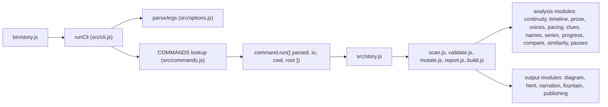

# Development guide

This page is for contributors to the Story Skills repository: how the code is laid out, how the `story` CLI works, and how changes are tested, checked, and released. [`AGENTS.md`](../AGENTS.md) holds the short version of these rules for coding agents; this page explains the mechanics and the reasons behind them.

If you want to use Story Skills rather than change it, start with [Getting started](getting-started.md).

**On this page**

- [Setting up](#setting-up)
- [Repository layout](#repository-layout)
- [CLI architecture](#cli-architecture), including [raising a finding](#raising-a-finding), [adding a command](#adding-a-command), and [adding a flag](#adding-a-flag)
- [The bundled fallback](#the-bundled-fallback)
- [Tests](#tests) and the [coverage gate](#coverage-gate)
- [Examples check](#examples-check), [Schema](#schema), and [Metadata check](#metadata-check)
- [Evals](#evals)
- [Authoring a skill](#authoring-a-skill)
- [CI](#ci)
- [Contributing changes](#contributing-changes)
- [Releasing](#releasing) and [publishing to npm](#publishing-to-npm)

## Setting up

You need [Bun](https://bun.sh) for development and Node 18 or later, because the CLI and the check scripts must run under plain Node. The package has no runtime or development dependencies, so `bun install` has nothing to download; run it anyway so your setup matches CI.

Install the exact Bun the repository pins in `package.json`, currently `bun@1.4.2`:

```shell
curl -fsSL https://bun.sh/install | bash -s "bun-v1.4.2"
git clone https://github.com/danjdewhurst/story-skills.git
cd story-skills
bun install
bun run story -- --help
```

The pin is not cosmetic. `skills/story-maintenance/scripts/story.js` is a committed Bun build of the CLI, and `check:fallback` compares it byte for byte against a fresh build. Bun renames generated identifiers between releases, so building that bundle with a different Bun rewrites hundreds of lines that change nothing, and the check fails on an untouched checkout. `build:fallback` and `check:fallback` both stop with an explanation when `bun --version` does not match the pin, and `check:metadata` keeps the pin, `bun-version` in [`ci.yml`](../.github/workflows/ci.yml), and the version named above in step. Moving the project to a newer Bun is those three edits plus `bun run build:fallback` and the regenerated bundle in the same commit.

`bun run story -- <args>` runs the CLI straight from `src/`. Everything after `--` is passed to `story`, so `bun run story -- validate examples/the-last-ember` validates an example project.

### Scripts at a glance

All scripts live in `package.json`.

| Script | What it runs | When to use it |
| --- | --- | --- |
| `bun run story -- <args>` | `bin/story.js` from source | Trying CLI changes |
| `bun run test` | `bun test ./test/*.test.js` | Every change |
| `bun run test:coverage` | Tests with lcov coverage, then `scripts/check-coverage.js`, then `check:fallback` | Any change to `src/`, parsing, scanning, validation, or release readiness |
| `bun run test:examples` | `scripts/check-examples.js` | Changes to examples, the project format, validation, or the schema |
| `bun run check:metadata` | `scripts/check-metadata.js` | Changes to skills, plugin manifests, templates, or versions |
| `bun run check:evals` | `scripts/check-evals.js` | Changes to eval fixtures or skill names |
| `bun run check:links` | `scripts/check-links.js`, which checks relative links and `#anchors` in `README.md`, `CONTRIBUTING.md`, `docs/`, `skills/`, `templates/`, and example READMEs, skipping code, external links, and `{placeholder}` paths | Changes to any of that markdown, or to a heading something links to |
| `bun run eval:selftest` | `evals/run-evals.js --all evals/examples` | Changes to the eval checker or fixtures |
| `bun run build:fallback` | `scripts/build-fallback.js`, a `bun build` of `bin/story.js` into the skill folder | After any change to `src/` |
| `bun run check:fallback` | `scripts/check-fallback.js` | Confirms the committed fallback matches a fresh build from the pinned Bun |
| `bun run check:node-help` | `node skills/story-maintenance/scripts/story.js --help` | Confirms the fallback runs under Node |
| `bun run release <bump>` | `scripts/release.js` | Cutting a release (maintainers only) |

## Repository layout

```text
story-skills/
├── bin/story.js                  # package binary; calls runCli from src/cli.js
├── src/                          # CLI source (ESM, node: imports only)
├── skills/<name>/SKILL.md        # published agent skills, plus references/
├── skills/story-maintenance/scripts/story.js   # generated Node fallback CLI
├── schemas/story.schema.json     # JSON schema for project frontmatter
├── schemas/result.schema.json    # JSON schema for story <command> --json output
├── examples/                     # five sample story projects (shipped in the npm package)
├── test/                         # Bun tests (*.test.js), helpers.js, setup.js
├── scripts/                      # check scripts and the release script
├── evals/                        # skill regression harness (repo tooling only)
├── templates/github/             # workflows and an issue form users copy into story repositories (shipped in the npm package)
├── docs/                         # this documentation (shipped in the npm package)
├── assets/                       # logo, screenshot, social preview, demo GIF + VHS tape
├── CHANGELOG.md                  # user-visible changes per release (Keep a Changelog)
├── CONTRIBUTING.md               # short contributor guide that points here
├── CODE_OF_CONDUCT.md            # Contributor Covenant 2.1
├── .github/                      # CI, publish workflow, Dependabot, issue forms, PR template
├── .claude-plugin/               # Claude Code plugin and marketplace manifests
├── .codex-plugin/                # Codex plugin manifest
├── .agents/plugins/              # Codex marketplace manifest
└── plugins/story-skills -> ..    # symlink to the repo root, for Codex
```

Notes on specific paths:

- `plugins/story-skills` is a symlink to the repository root. Codex marketplace entries must point at a child plugin directory, so `.agents/plugins/marketplace.json` points at `./plugins/story-skills`. Keep it a symlink; a copy would duplicate `skills/` and drift. `check:metadata` fails if the path is missing or the marketplace entry points anywhere else.
- `evals/` is tooling for this repository. Agents using the skills never load it. `evals/outputs/` and `evals/baseline/` are gitignored.
- `docs/`, `bin/`, `src/`, `skills/`, `schemas/`, `examples/`, `templates/`, `README.md`, `CHANGELOG.md`, and `LICENSE` (the `files` list in `package.json`), plus `package.json` itself, which npm always includes, are the only paths published to npm.
- The `exports` map in `package.json` makes only `story-skills/package.json` and `story-skills/schemas/*` importable; `src/` is internal and the `story` bin is the interface. The npm README is read from the installed package, so `README.md` links to anything outside the `files` list (`assets/`, `CONTRIBUTING.md`, `evals/`) with an absolute GitHub URL. `check:package` fails on a relative README link the tarball does not contain.
- `assets/demo.gif` is generated from `assets/demo.tape` with `vhs assets/demo.tape`.
- `CLAUDE.md` is a symlink to `AGENTS.md`. Edit `AGENTS.md` and leave the symlink alone.

Do not commit `node_modules/`, `coverage/`, `dist/` directories inside examples, or editor swap files. `.gitignore` already covers them.

## CLI architecture

The CLI is plain ESM JavaScript with no dependencies. It uses `node:` built-ins and, like the existing code, synchronous filesystem calls. It must keep running on Node 18.


```mermaid
flowchart LR
  A["bin/story.js"] --> B["runCli (src/cli.js)"]
  B --> C["parseArgs (src/options.js)"]
  B --> D["COMMANDS lookup (src/commands.js)"]
  D --> E["command.run({ parsed, io, cwd, root })"]
  E --> F["src/story.js"]
  F --> G["scan.js, validate.js, mutate.js, report.js, build.js"]
  G --> H["analysis modules: continuity, timeline, prose, voices, pacing, clues, names, series, progress, compare, similarity, passes"]
  G --> I["output modules: diagram, html, narration, fountain, publishing"]
```

### Module responsibilities

| Module | Responsibility |
| --- | --- |
| `bin/story.js` | Entry point. Passes `process.argv`, `cwd`, `stdout`, and `stderr` to `runCli` and sets `process.exitCode`. |
| `src/cli.js` | Builds `HELP` and per-command help from the registries, handles `--help` and `--version`, looks up the command (suggesting a near miss for an unknown one), rejects `--path` on commands that create projects, resolves the project root, and turns thrown errors into a message on stderr and the exit code `exitCodeFor` picks, rewording Node file-system errors as `Cannot <action> <path>: <reason>`. |
| `src/commands.js` | The `COMMANDS` registry: every command's name, usage, help summary, project-path mode, and `run` function, in help order (the analysis commands `diagram`, `names`, `pacing`, `clues`, and `voices` sit after `prose`; `passes` sits after `series`). Also the internal `reportResult` helper, which writes the standard `N errors, N warnings, N dismissed` summary and each finding to stderr (a warning with its code in brackets) and returns the exit code, and `writeFindings`, which does the same without the summary for the warnings `build`, `export`, `context`, and the entity commands print after their output. Every command that reports findings passes them through `applySeverity` first, so text and `--json` output agree. |
| `src/config.js` | The optional `cli-defaults` and `severity` fields of `story.md`: parsing and validation (called from `validate` and from `runCli`), `applyDefaults` (fills in flags the command line did not give), `findingOverrides` (the `severity` entries and the exemptions that name a code), and `applySeverity`, which dismisses the warnings those exemptions match and then moves the warnings a `severity` entry names by code. `severity` accepts any warning code in `FINDING_CODES` and rejects an error code. Imports `COMMANDS`. `validate.js` imports this module and `story.js` imports `validate.js`, which `commands.js` imports, so the cycle is read only inside functions. |
| `src/findings.js` | `err(code, message, file, chapter)` and `warn(...)`, which build the `{ code, message, file, chapter }` finding every check raises, `FINDING_CODES`, every code with its level, and the code lists exemptions and severity check against: `severityCodes`, `CONTINUITY_ERROR_CODES`, `exemptionCodes`, and `CHAPTER_CODES`. See [Raising a finding](#raising-a-finding). |
| `src/exemptions.js` | `continuity/exemptions.md`: `exemptionProblems` (the errors `story validate` reports for an entry, and that keep it from taking effect), `parseExemptions` and `readExemptionLog` (the usable entries, with their indexes), `exemptionMatches` (every key an entry sets matches the finding), and `dismissByExemptions`, which `checkContinuity` runs over errors and warnings and `applySeverity` over warnings. |
| `src/json.js` | The `--json` result envelope: `writeJsonResult(io, { command, ok, data, diagnostics, writes })` prints it and returns the exit code: `0` when `ok` is true, else the `exitCode` it was given from `EXIT_CODES` (default `findings`), and `diagnosticsFrom(result, check)` turns a result's errors, warnings, and dismissed findings into diagnostics, taking `code`, `file`, and `chapter` from each finding, and `exemptionIndex` from a dismissal. `src/cli.js` uses `failureDiagnostic` to report a usage error or thrown error as JSON when `--json` is on, coded by the exit code a text run would give. |
| `src/options.js` | The `OPTIONS` registry, `parseArgs`, `formatOptionsHelp`, and `isTruthy`. Includes the flags for `init --form`, `build --trim`, `passes --init` / `--start` / `--done`, `add scene --outcome`, `add chapter --hook`, `add clue --red-herring`, and `add research --accuracy` / `--confidence` / `--method` / `--risk`. |
| `src/exit-codes.js` | `EXIT_CODES` (`ok` 0, `findings` 1, `usage` 2, `project` 3, `refused` 4) and the error constructors that carry them: `usageError`, `projectError`, and `refusedError`. Throw one of these rather than a plain `Error` so the CLI exits with the right code; `withExitCode` and `withDefaultExitCode` tag an error raised during a write, and `exitCodeFor` maps any error to a code (a raw file-system error from a write is `refused`, from a read `project`, and anything untagged `findings`). |
| `src/story.js` | Public entry for project operations. Re-exports what commands and tests import, and keeps the thin wrappers that scan a project and call a feature module: continuity, context, series, compare, similarity, progress, timeline, clues, diagram, passes, names, voices, pacing, and prose. |
| `src/scan.js` | `scanProject` and entity records: the markdown registries and starter records, and the readers and id rules those records share. |
| `src/validate.js` | `story validate` and `story links`: schema checks and reference checks over one scanned project. |
| `src/mutate.js` | Commands that write the project: `init`, `add`, `rename`, `remove`, `move`, `reindex`, `wordcount`, and `migrate`, plus `fixProject`, the safe repairs `doctor --fix` applies. |
| `src/report.js` | `story report` and `story next`: the project report and the action planner. |
| `src/build.js` | Manuscript assembly, export, synopsis, and `buildBook`, which hands each format to the output modules below. |
| `src/files.js` | Project file reads and writes, and the path-safety guards they share: `readTextFile`, `writeFile`, and the outside-root and symlink assertions every write goes through. |
| `src/lock.js` | `withProjectLock(root, run)`: the `.story.lock` file that write commands (`add`, `rename`, `remove`, `move`, `reindex`, `migrate`, `wordcount --write`, `doctor --fix`) hold, so two cannot plan from the same snapshot. Reentrant within one process; a lock whose process is gone is taken over. A lock from another host older than 10 minutes is taken over too; a newer one is left for the user to delete. A stale lock is checked and removed only while holding `.story-takeover.tmp`, so two commands cannot both take it over, and a command releases the lock only if it still holds its own. |
| `src/packaging.js` | The package writers that emit bytes rather than a string: EPUB (`--format epub`), DOCX for Word and for a Shunn manuscript (`--format docx`, with `--shunn`), the Shunn markdown manuscript (`--format shunn`), the HTML review and print parts (`htmlBook`), and the deterministic ZIP container the EPUB and DOCX share. Takes a manuscript from `build.js` and does no project scanning. |
| `src/frontmatter.js` | A dependency-free parser and writer for the YAML subset the project format uses (`parseFrontmatter`, `stringifyFrontmatter`, `replaceFrontmatter`), and `withoutLeadingFrontmatter`, the lenient strip that `import` and piped passages use. |
| `src/frontmatter-keys.js` | `FRONTMATTER_KEYS`, the keys each kind of file defines (a copy of the schema's lists, which `test/frontmatter-keys.test.js` keeps equal), and `nearMissKeys`, which finds the known keys a misspelt one most likely means for the `near-miss-key` warning. |
| `src/stdin.js` | Reads standard input synchronously for the `-` argument of `prose`, `voices`, and `import`: refuses a terminal, closed, empty, oversized, or non-UTF-8 input, and waits out a non-blocking pipe. Commands call it through `io.readStdin` when a test supplies one. |
| `src/markdown.js` | Text helpers: `kebabCase`, `titleCaseSlug`, word splitting and counting, `chapterProse`, `extractSection`. |
| `src/continuity.js` | `checkContinuity(project)`: character deaths (including `status` progressions, resolved with `deaths.js`), chapter and scene casts, chapter sequence, promise, question, and clue ordering, story completion, durable state, prop custody, and the story clock, including route travel (a character seen at two places faster than the shortest path through location `routes` allows). Applies `continuity/exemptions.md` to move matching findings into `dismissed`. Also exports the story date and time parsers. |
| `src/deaths.js` | When a character is dead or alive: the per-chapter status and progression-death functions `story continuity` checks with, and `characterLifeline`, a character's deaths and revivals in story order with their state at the start and end of the book, which `story series` and `story diagram` read. |
| `src/context.js` | `story context`: `buildContext` packs the drafting context for a chapter or scene into a token budget, leaving out everything dated after the target in reading order, except a POV fact already known in story time, which is marked character-knowledge. `formatContext` prints it as markdown. `characterStateAt` is where a character's state at a chapter is resolved. `story.js` scans the project and supplies the file bodies. The knowledge rule itself is `knowledgeAudience` in `chronology.js`, shared with `story knowledge`. |
| `src/timeline.js` | Read-only timeline, POV balance, and character presence for `story timeline`. |
| `src/prose.js` | Deterministic prose counts and thresholds for `story prose`. Also exports `editDistance`, which `names.js` uses for look-alike names. |
| `src/voices.js` | Dialogue fingerprints for `story voices`: attributes speech only from a named speech tag or a single-name action beat with no pronoun tag, then compares characters and checks `voice-words` and `voice-avoid`. `story.js` reads the chapter prose and passes in paragraphs. |
| `src/pacing.js` | The `story pacing` dashboard: scenes, sequels, scene outcomes, and chapter hooks per chapter, with advisory findings. Exports the allowed `SCENE_OUTCOMES` and `CHAPTER_HOOKS`, which validation also uses. |
| `src/clues.js` | The fair-play plant/reveal grid for `story clues`. Advisory only; `continuity.js` owns the hard clue-ordering errors. |
| `src/names.js` | `story names`: collects every existing name, alias, and glossary term and checks candidates against them. Exact clashes are errors; look-alikes and shared initials are warnings. |
| `src/unicode.js` | One Unicode form for matching: `nfc` composes a name or phrase to NFC, and `composedText` composes prose with `original(start, end)` to map a span back to the text as written. `wordMatcher` and `matchingText` run on composed text; build every name and phrase pattern from `nfc` text. |
| `src/mentions.js` | Finds the bible's names in chapter prose for `story mentions`, using `existingNames` from `names.js` and `wordMatcher` from `words.js` for whole-word matches in every script. `auditMentions` compares them with each chapter's frontmatter; `continuity.js` runs it for `named-not-listed`. |
| `src/diagram.js` | Mermaid source for `story diagram` (`relationships`, `locations`, `timeline`, `clues`, `arcs`). Reuses `buildTimeline` from `timeline.js` and `characterLifeline` from `deaths.js`. |
| `src/passes.js` | Reads, validates, and updates the `revision-passes` list in `story.md` for `story passes`, and supplies the default pass ladder and the next pass for `story next`. |
| `src/forms.js` | `STORY_FORMS` (novel, novella, short story, and so on) with their usual word ranges and default targets, for `init --form` and the out-of-range warning in `validate`. |
| `src/publishing.js` | Publishing metadata in `story.md`: validation, ISBN normalisation, the generated copyright page, and the retailer sheet for `build --format metadata`. |
| `src/html.js` | The single-file HTML review copy with paragraph anchors such as `ch03-p12` (`--format html`), the paged-media print interior (`--format print`), trim sizes, and page estimates. |
| `src/narration.js` | The audiobook narration script for `--format narration`: pronunciation guide, credits, and runtime estimates at 155 words per minute. |
| `src/fountain.js` | The screenplay scene skeleton for `--format fountain`: title page, chapter sections, scene headings from `setting`, location, and time, source notes, and the escaping that keeps record text from opening Fountain notes, boneyards, or emphasis. `build.js` resolves the scene records it reads. |
| `src/codex.js` | The story bible site for `--format codex`: one page per entity plus the index, timeline, threads, and progress pages, built from the timeline, clue, grid, progress, and mentions views. `build.js` writes the folder and clears an earlier codex. |
| `src/twee.js` | The Twine story for `--format twee`: Twee 3 source from the chapter passages and their choices, and the IFID derived from the story id. `validate.js` checks chapter `choices` and `build.js` builds the passage graph, which the ink build shares. |
| `src/ink.js` | The ink story for `--format ink`: global tags, one knot per chapter with its choices or diverts, knot names from chapter ids, and the escaping that keeps prose and choice text from reading as ink syntax. `test/ink.test.js` compiles and plays the builds when `INKLECATE` names an inklecate binary. |
| `src/series.js` | Series links, backlinks, and shared-canon checks across books. |
| `src/progress.js` | Pure progress arithmetic and the `progress.md` session log. |
| `src/compare.js` | Chapter-by-chapter comparison with an earlier draft. |
| `src/similarity.js` | Shared-passage detection for `story similarity`: word shingles of the reference indexed once, each hit extended to the longest shared run, the passage's labels and text on both sides, and the report. `story.js` reads the `--against` file, folder, or git ref and labels chapters as the review copy does. |
| `src/import.js` | Splits an existing manuscript into a new project and suggests entity candidates. |
| `src/languages/` | Language packs: `index.js` resolves a BCP 47 tag to a pack (`languagePack`), reads story.md `language` (`projectLanguage`), and answers whether a pack has a word list (`checkList`, `checkSet`, `hasLists`, `skippedChecks`). `base.js` is the generic pack, `en.js` holds every English word list the analysis modules use, and `es.js`, `fr.js`, and `de.js` hold Spanish, French, and German lists. `style.js` applies a style sheet's `add-words` and `replace-words` (`withStyleLists`). `locale.js` sorts, cases, and formats numbers in a pack's language. See [Language packs](#language-packs). |
| `src/version.js` | `VERSION`, printed by `story --version`. Bumped only by the release script. |
| `src/workflows.js` | `workflowPinActions`: the `story doctor` P3 actions for copied GitHub Actions workflows (in the project and the git root above it) whose `STORY_VERSION` is older than `VERSION` or that still set `STORY_REF`. It matches the env line by regex and never parses YAML. |

Most commands follow the same pattern. A function takes the project root, calls `scanProject(root)` from `src/scan.js` to read every entity file into one in-memory project object, and passes that object to a pure function in a feature module. For example, `checkProjectContinuity(root)` in `src/story.js` is `checkContinuity(scanProject(root))`. What happens next depends on the kind of command:

- Check commands such as `validate`, `links`, and `continuity` get back `{ ok, errors, warnings }` (plus `dismissed` for continuity), where each error and warning is a finding (see [Raising a finding](#raising-a-finding)), and hand it to `reportResult`.
- Report commands (`compare`, `similarity`, `progress`, `timeline`, `prose`, `voices`, `pacing`, `clues`, `names`, and `series`) pass their result to a `format*` function from the feature module and write the text to stdout, then hand the same result to `reportResult` for the stderr summary and exit code.

- `diagram` prints Mermaid source to stdout, or writes it with `--out` once the scan is clean. `passes` prints the pass list, rewrites only the `revision-passes` entry in `story.md` when asked to change it, and exits non-zero only when it refuses a change (2 for a pass name that is not kebab-case).

Keep new analysis code in that shape: pure functions over the scanned project, with file I/O left to the wrapper in `story.js`. The output modules (`html.js`, `narration.js`, `fountain.js`, `twee.js`, `ink.js`, `publishing.js`, `diagram.js`) follow the same rule: they return strings, and `build.js` writes them. `packaging.js` is the exception, because a ZIP is bytes rather than text: it takes the manuscript and writes the file itself, through the same `writeFile`.

For what the commands do from a user's point of view, see the [CLI reference](cli-reference.md). For the files they read and write, see the [Project format reference](project-format.md).

### Raising a finding

Every error and warning is a finding, `{ code, message, file, chapter }`, built where the rule is checked with `err` or `warn` from [`src/findings.js`](../src/findings.js):

```js
errors.push(err("missing-reference", `${label} references missing chapter ${id}`, label));
```

- `code` is a stable kebab-case name. `story.md` `severity` entries and `--json` consumers name it, so a code is never renamed or reused for another rule; reword the message freely instead. Pass it as a string literal (a condition choosing between two literals is fine), so the codes can be found in the source.
- `message` is the text printed after `error:` or `warning:`. Text output adds ` [code]` after a warning.
- `file` is the project file the finding is about, relative to the project root, or `null`. Never parse it back out of the message.
- `chapter` is the id of the chapter the problem shows up in, or `null`. Pass it when the rule already knows the chapter (a cast, a scene, a learning event, a dated unit), so an exemption's `chapter` key can match the finding; then add the code to `CHAPTER_CODES` and to the list under [Exemptions](continuity.md#exemptions). Pass it on every call for that code, or on none.

A new code needs an entry in `FINDING_CODES` with its level, a row in the command's table under [Finding codes](cli-reference.md#finding-codes), and the schemas' code lists: `$defs/diagnostic` `code` in `schemas/result.schema.json`, and, for a warning, the `severity` `warning` enum in `schemas/story.schema.json`. A new `continuity` error also goes in `CONTINUITY_ERROR_CODES`, so an exemption can name it, and in the exemption `code` enum in `schemas/story.schema.json`, which lists `exemptionCodes()`. `test/finding-codes.test.js` fails when a code is raised but not listed or documented, listed but never raised, documented at the wrong level, or missing from a schema, and when `CONTINUITY_ERROR_CODES` or `CHAPTER_CODES` disagrees with the source. Reuse an existing code when the rule is the same (`missing-field`, `id-not-kebab`, `unreadable-file`).

### Writes stay inside the project

Every file write goes through the exported `writeFile` in `src/files.js` (`src/story.js` re-exports it, and `src/import.js` imports it from there), which calls `prepareWriteTarget`. When a project root is supplied, it refuses paths that resolve outside the root (lexically or through a symlinked parent) and refuses to write through a symlink. Relative `--out` paths are held to the project root; an absolute `--out` path is taken as the user's explicit choice. If you add a command that writes files, route the write through `writeFile` with `{ root }` rather than calling `fs.writeFileSync` directly. The symlink and outside-root cases are covered in `test/init-add-safety.test.js`.

### Command and option registries

`src/commands.js` and `src/options.js` are the single source of truth for the CLI surface. Help text, argument parsing, and project-path handling are all derived from them:

- `HELP` in `src/cli.js` is built by walking `COMMANDS` (usage plus summary lines) and calling `formatOptionsHelp()`, which walks `OPTIONS`. A command cannot be dispatched without appearing in help, or appear in help without being wired.
- `parseArgs` builds its sets of boolean, value, and repeatable options from `OPTIONS`. Any `--flag` not in the registry fails with `Unknown option --flag`, plus `; did you mean --other?` when an option the command accepts is a near miss: `runCli` passes the command's `options` (and `path`, for commands that take a project) as the suggestion list. A single-dash word such as `-ism` is a positional, and a lone `--` makes every later argument positional. `story help <command>` passes the command's own `options` to `formatOptionsHelp()` for per-command help.
- `resolveRoot` reads the command's `project` field to decide where the story project is.

A command entry looks like this (the real `reindex` entry):

```js
{
  name: "reindex",
  usage: "reindex [path]",
  summary: ["Rebuild registry tables from markdown files"],
  project: "positional",
  run({ io, root }) {
    const result = reindexProject(root());
    io.stdout.write(result.changed.length === 0
      ? "Registries already up to date\n"
      : `Updated ${result.changed.length} registries\n`);
    return 0;
  }
}
```

| Field | Meaning |
| --- | --- |
| `name` | The command word. Must equal the first word of `usage`. |
| `usage` | The usage shown in help, such as `validate [path]` or `add <kind> <name>`. |
| `summary` | Help lines. Each line is a separate array entry; help lines must stay within 80 characters. |
| `project` | `"positional"`: takes an optional project path as its first argument or `--path`. `"flag"`: takes the project path only from `--path`, because its positionals mean something else (`knowledge`, `context`, `add`, `rename`, `move`, `remove`). `"none"`: creates a new project (`init`, `import`), uses `--dir`, and refuses `--path`. |
| `run` | Receives `{ parsed, io, cwd, root, severity }`, with `story.md` `cli-defaults` already merged into `parsed.options` and `severity` the overrides for this command, which it passes to `reportResult`. `parsed` is `{ positionals, options }` from `parseArgs`, with the command name at `positionals[0]`. `root()` resolves the project path. For a command that reads a project, `runCli` has already resolved it and read `story.md` for the config before `run` is called. Returns the exit code. |

For a `"positional"` command, `story validate book` and `story validate --path book` are equivalent. If both are given and resolve to different directories, the CLI fails with `Conflicting project paths`.

An option entry has these fields:

| Field | Meaning |
| --- | --- |
| `name` | The flag without `--`. |
| `value` | The argument name shown in help, such as `<path>`. Omit it for a boolean flag. |
| `repeatable` | Collect every value into an array. Without it, the last value wins, so `--out a.md --out b.md` writes `b.md`. |
| `help` | Help lines. Omit `help` for a hidden alias (plural forms such as `--characters`); hidden aliases must be `repeatable`. |
| `aliasOf` | The flag an alias shares its value with (`characters` is an alias of `character`). A flag on the command line overrides a `story.md` `cli-defaults` value set through either name. |

Parsing rules worth knowing when you add a flag:

- Value options accept `--name value` or `--name=value`. A value that starts with `--` must use the `=` form.
- Boolean options accept `--name`, `--name=false`, or a following literal (`true`, `false`, `1`, `0`, `yes`, `no`, `on`, `off`). Read them with `isTruthy(parsed.options.name)`.
- `-h` / `--help` and `-v` / `--version` are handled before any command runs.

### Adding a command

1. Put the logic in the module that owns it (`src/scan.js`, `src/validate.js`, `src/mutate.js`, `src/report.js`, or `src/build.js`), or in a new or existing feature module if it is a pure analysis over the scanned project. Export the function, and re-export it from `src/story.js` when callers import it from there.
2. Import it in `src/commands.js` and add an entry to `COMMANDS` at the place you want it to appear in help. Use `project: "positional"` if the command takes `[path]`.
3. Add any new flags to `OPTIONS` (see below).
4. Add focused tests. `test/registry.test.js` checks automatically that every command is well formed, appears in help, and resolves its project path correctly; you still need behaviour tests for the command itself (see `test/cli.test.js` for the `invoke` pattern).
5. Update the user-facing docs: the [CLI reference](cli-reference.md), the command list in [`skills/story-maintenance/SKILL.md`](../skills/story-maintenance/SKILL.md) (with a check command's rules in [`references/continuity-checks.md`](../skills/story-maintenance/references/continuity-checks.md), an editing command's detail in [`references/editing-commands.md`](../skills/story-maintenance/references/editing-commands.md), and a build format's in [`references/builds.md`](../skills/story-maintenance/references/builds.md)), and the "Companion CLI" section of the README.
6. Rebuild and check the fallback: `bun run build:fallback`, then `bun run check:fallback`.
7. Run `bun run test:coverage`. The coverage gate requires every line and function in `src/` to be covered.

Do not add a separate dispatch branch in `src/cli.js` or edit help text by hand. Both come from the registry.

### Adding a flag

Add an entry to `OPTIONS` in `src/options.js`, placed where it should appear in help, and read it in the command's `run` through `parsed.options["flag-name"]`; read boolean flags with `isTruthy`. The `add`, `rename`, and `remove` commands spread `parsed.options` into `createEntity`, `renameEntity`, and `removeEntity`, so a new flag reaches those functions without a `run` change, but the function still has to read it. If the flag writes to a list field, make it `repeatable` and consider a hidden plural alias, following `--character` / `--characters`.

### Language packs

`prose`, `voices`, `names`, `import`, and the sentence splitter take their word lists from a language pack rather than module constants. `scanProject` sets `project.language` (story.md `language` as written, `en` only when it is unset; see `projectLanguage`) and `project.pack` (`languagePack(project.language)`, with the style sheet's `add-words` and `replace-words` applied by `withStyleLists` in `style.js`), and the report functions in `story.js` pass `project.pack` on. Each analysis function takes the pack as its last argument and defaults to English, so a caller without a project gets the English behaviour.

A pack is a plain data module, so it bundles into the Node fallback without JSON imports. `isLanguageTag`, which `validate` uses, checks only the tag's shape, never Intl, so extlang (`zh-yue`) and grandfathered (`en-GB-oed`) tags are valid on every runtime. `languagePack(tag)` finds packs from fixed tables, not Intl output, so every runtime picks the same pack: language aliases (`eng` is `en`, `iw` is `he`), grandfathered tags mapped to their modern form (`en-GB-oed` is `en-GB-oxendict`), and an extlang tag split into its language and macrolanguage (`zh-yue` is `yue` under `zh`). A tag that is not valid falls back to its first subtag (`fr_FR` is `fr`), else `und`. It then layers `base.js`, the macrolanguage's pack, then the pack for `fr`, then one for `fr-ca`, using whichever exist. A Chinese language (`zh`, `cmn`, `yue`, `lzh`, the other Chinese codes, and any extlang under `zh`) layers `zh`, then `zh-hant` when `hanScript` reads the tag as Traditional (its script subtag, with `Bopo` as Traditional, else the region, Traditional for `TW`, `HK`, and `MO` and Simplified for `CN` and `SG`, else the language's usual script), then its own pack; `typesetting.js` takes the Chinese script from the same `chineseScript`, so labels and fonts cannot disagree; later layers replace top-level fields, and `checks` and `labels` merge by key. The result is frozen and cached per tag, with `tag` (as written, for messages), `locale` (the lookup tag in the runtime's canonical form, from `canonicalTag`; only for passing to `Intl` APIs, since runtimes differ, and it never makes them throw), and `code` (the most specific pack found, `und` for the base alone). `en`, `es`, `fr`, and `de` have word lists. `ar`, `he`, `hi`, `ko`, and `th` packs set only `cased` and `segmentation`, and `ja` and `zh` also set their quotes and dialogue dash; `da`, `de-ch`, `fi`, and `sv` set only `quotes` (and `dialogueDash`, as a list of dashes, and `dashStartsLine` for `fi` and `sv`). A pack that replaces `quotes` should keep straight and curly quotes unless they conflict, since books in every language use them. The packs for the languages with translated build labels also set `labels` and most a `narrationRate`. The base pack is cased and space-separated. The top-level fields are `cased`, `segmentation` (`space`, `character`, or `dictionary`), `sentenceEnd`, `quotes` (open and close pairs), `dialogueDash`, `dashStartsLine`, `ordinalStop` (a full stop after a number marks an ordinal, as in German `am 3. Mai`), `capitalInitials`, `inciseTags`, `narrationRate` (the narration pace in the pack's `countUnit`; `narrationRate(meta, unit)` in `narration.js` falls back to 155 words or 300 characters a minute when a book is counted in another unit), `labels`, and `checks`, which holds the word lists by name.

`src/punctuation.js` turns `sentenceEnd`, `quotes`, and `dialogueDash` into what `sentences.js` and `voices.js` match on, once per pack. A mark's role comes only from the pack: `»` opens a quote in `de` and closes one in the base pack, so never add a global list of quote marks. A pair whose closer can be an apostrophe (`’`, `'`) is read by the letters around it, a pair whose marks are the same pairs in order, and any other pair explicitly; one opener may have several closers (`„` closes with `“` or `”`). A stop in the CJK full-width block (U+3000 to U+303F, U+FF00 to U+FFEF) ends a sentence with no space after it; a mark after it that is both an opener and a closer in the pack is taken only when it closes a quote open in that sentence. `endsSentence(text, pack)` tells the synopsis whether a list item already ends with one of the pack's stops. `cased: false` lets any letter start a sentence; in a cased pack a letter without case (`\p{Lo}`) still does. English sets its own `quotes` (curly and straight only), so the base pack's wider list never changes English output. Names, `voice-*` phrases, and `story prose` watch words and avoided spellings in unspaced scripts are matched at `wordSpans` boundaries: build the pattern with `wholeWords` and run it through `wordMatcher` (both in `words.js`), which checks each edge between two unspaced letters against `unspacedBoundaries` and maps `matchingText` spans back to the text as written. The text is matched in NFC (`composedText` in `src/unicode.js`), so pass names and phrases through `nfc` before building their patterns, and compare names with names after `nfc` too: `nameWords` returns NFC words.

Collation, casing, and reader-facing numbers go through `src/languages/locale.js`, never a bare `Intl` call: `compareText(pack)` is a comparator for display text (names, titles, words) that breaks a collator tie by code point, `lowerCase` and `upperCase` case in the pack's language, and `formatNumber` writes a whole number with the language's separators and Latin digits (runtimes disagree on Arabic's default digits). Each passes `pack.locale`, and the locale check in `test/check-scripts.test.js` accepts only a quoted tag or `pack.locale`. Sort ids, file names, and numbers with `localeCompare(…, "en")` or by code point, never with `compareText`, so registries and tie-breaks stay the same in every language. Collation data comes from the runtime's ICU, so `test/locale.test.js` checks its Swedish, German, and Turkish cases against the Node fallback too.

`labels` holds every reader-facing string the builds generate, keyed as in `en.js`, which is the fallback for any key a pack lacks; `LABEL_KEYS` lists them. `publishingMeta` resolves them for a book with `buildLabels` (English, the pack, then story.md `chapter-label`, `contents-label`, and `labels`) and carries them as `meta.labels`, with `meta.narrationRate`. Build code reads a label with `fillLabel(labels, key, values, escape)`, which fills `{name}` placeholders in one pass and escapes only the label's own text and joins names with `joinNames`; numbers go through `formatNumber` in `locale.js`, except chapter numbers, which `chapterHeading` writes in `meta.chapterNumerals` (story.md `chapter-numerals`) with `formatNumeral` in `src/numerals.js`. That module holds its own digit and Han numeral tables rather than asking Intl, so builds stay byte-identical across runtimes. To add a label, add it to `en.js` and every pack that has labels (`test/build-labels.test.js` checks each pack has every key with English's placeholders), to the `labels` enum in `schemas/story.schema.json`, and to the table in `docs/manuscripts.md`.

A check never runs with another language's words. `checkList(pack, name)` and `checkSet(pack, name)` return `null` for a list the pack lacks (an empty list is a list), and a module declares its checks as `{ check, label, lists }` entries (`PROSE_CHECKS` in `prose.js`, `VOICE_CHECKS` in `voices.js`). `skippedChecks(pack, definitions)` returns one `{ check, language, missing, message }` entry per check whose lists are missing. The module skips that check, adds the entries to its result's `skipped` (which `--json` prints as `data.skipped`), and its formatter prints `skippedLines(skipped)` as `Note:` lines. To add a word list, put it in `en.js`, name it in the check that uses it, and add it to `STYLE_LISTS` in `style.js` under a kebab-case name, so a style sheet can change it; `test/language-packs.test.js` fails when a pack has a list `STYLE_LISTS` does not name. `withStyleLists(pack, styleData)` returns the pack itself when the style sheet changes no list, so the shared, cached pack (and its per-pack `WeakMap` caches of patterns) is kept for most books; otherwise it returns a new frozen pack with the same `tag`, `locale`, and `code`. A style sheet never changes `adverbLabel`, the text the report uses for the adverb count.

#### Adding a language pack

A pack for a new language is a data file and a few tests; no analysis code changes.

1. **Create `src/languages/<code>.js`.** Use the language subtag in lower case (`it`, `pt`), or a full tag for a regional pack (`pt-br.js` with `code: "pt-br"`), which holds only what differs from its language's pack. Set `code` and `name`, `script` (the ISO 15924 code, such as `Latn` or `Cyrl`) when the typesetting tables do not already know the language, `labels` and `narrationRate` for builds (see the `labels` paragraph above; `test/build-labels.test.js` checks every label key), and the punctuation fields only where the language differs from `base.js`: `quotes` when a mark means something else there (German `»` opens a quote), `dialogueDash` and `dashStartsLine` for dash dialogue, `cased: false` and `segmentation` for a script without case or spaces. Open the file with a comment on the language's conventions and on every choice that differs from English, as `es.js`, `fr.js`, and `de.js` do.
2. **Write the word lists** under `checks`, using the names in `en.js` (the full set is in `STYLE_LISTS` in `style.js`, and documented in [Word lists](project-format.md#word-lists)). Write them in lower case, apart from `titleAbbreviations`, `contextAbbreviations`, `calendarWords`, and `candidateStopwords`, which are matched as written, and with a straight apostrophe (`s'exclama`): every module matches a list's apostrophe as straight or curly. An abbreviation that may end a sentence goes in `contextAbbreviations` only if the word after it is not capitalised by grammar (German capitalises every noun, so `Mio. Euro` keeps `Mio` a title). List verbs in the forms the language's fiction narrates and tags in (the preterite and imperfect in Spanish, the passé simple and imperfect in French, with the first person where it differs). Leave filter words and said-bookisms that describe volume (whispered, shouted) out, as English does.
3. **Decide each list that does not carry over.** A list a pack leaves out skips its check, with a note naming the list, rather than running it with another language's words. Supply the language's own equivalent where there is one (`adverbSuffixes` of `mente` in Spanish, with the non-adverbs in `adverbExceptions`), and leave the list out where there is none (German has no adverb ending; Spanish and French elision is compulsory, so `contractionSuffixes` would say nothing about a voice). `dialectPairs` is British and American spelling: leave it out. Note each decision in the file's opening comment and in [Books not in English](continuity.md#books-not-in-english).
4. **Add the hooks the language needs.** `inversionLinks` joins an inverted tag's verb and pronoun (French `dit-il`), and the top-level `inciseTags: true` reads a tag set inside the speech (`« Viens, dit-il, nous partons. »`, `— Viens ! s'exclama-t-il.`). `adverbBlockers` lists the words after which an adverb-shaped word is a noun or verb (French `le moment`, `ils aiment`), with elisions written with their apostrophe (`l'`). `ordinalWords` lets an ordinal, or a number with a full stop, come before a heading word (`Erstes Kapitel`, `1. Kapitel`, `Primera parte`). The top-level `capitalInitials: true` reads any capital before a full stop as an initial (`É. Zola`), where English keeps A to Z only. `numberWords` takes `{ words, joiners }` for numbers that compound freely (`vingt et un`, `einundzwanzig`), in place of English's `{ units, teens, tens, hundred, and }`. A language that capitalises its nouns needs `determiners`, `relativeWords`, and `nounSuffixes`, plus its common article-less nouns in `candidateStopwords`, or `story import` offers every noun as a name. `ordinalStop: true` keeps a sentence going after an ordinal (`am 3. Mai`). A new hook is a new list: read it with `checkList` where it is used, default to the old behaviour when it is `null`, and add it to `STYLE_LISTS`.
5. **Register the pack** in `PACKS` in `src/languages/index.js`.
6. **Add fixture tests** to `test/language-packs.test.js`: `story prose` and `story voices` on a short passage in the language, `story import` on a manuscript with its headings and spelled-out numbers, its name candidates, its sentence abbreviations, and its title words. Add the code to `PACKS` and the lists it leaves out to `absent` in the test that checks every pack against English's lists.
7. **Document it**: the packs named in [Books not in English](continuity.md#books-not-in-english), the `prose`, `voices`, and `import` sections of the [CLI reference](cli-reference.md), and `skills/voice-style/references/prose-checks.md`. Add a `CHANGELOG.md` entry, run `bun run build:fallback`, and ask a native speaker to review the lists before the release.

English output must not change: run the analysis commands on `examples/` before and after, and compare.

## The bundled fallback

[`skills/story-maintenance/scripts/story.js`](../skills/story-maintenance/scripts/story.js) is a single-file build of the whole CLI. Regenerate it with:

```shell
bun run build:fallback
```

The script runs `bun build ./bin/story.js --target=node --outfile=skills/story-maintenance/scripts/story.js`.

It exists because many users install only the `skills/` folder: they copy skills into `.claude/skills/` or `.agents/skills/`, or use a skills installer. Those installs have no `src/` and no `story` binary on `PATH`. The skills fall back to `node ../story-maintenance/scripts/story.js`, resolved relative to the skill folder, so the fallback has to be committed, current, and runnable under Node 18. The `package.json` beside it (`{"type":"module"}`) makes Node treat it as an ES module even when the skills sit under a CommonJS `package.json`. It also inlines `src/version.js`, which is why the release script rebuilds it after bumping the version.

Two checks keep it honest:

- `bun run check:fallback` builds a fresh copy into a temporary directory and compares it byte for byte with the committed file. `test:coverage` runs it as its last step.

  ```text
  Bundled story-maintenance fallback is up to date.
  ```

  If it fails, it prints `Bundled story-maintenance fallback is out of date.` and `Run: bun run build:fallback`.
- `bun run check:node-help` (and the CI Node matrix) runs the fallback under Node to confirm it starts.

Never edit the generated file by hand, and always commit it alongside the `src/` change that produced it.

## Tests

Tests use Bun's built-in runner (`bun:test`) and live in `test/*.test.js`, roughly one file per feature: `cli.test.js`, `registry.test.js`, `continuity.test.js`, `prose.test.js`, `series.test.js`, `shunn-docx.test.js`, `check-scripts.test.js`, and so on. At the time of writing the suite is 688 tests across 46 files.

The newer commands and fields each have their own file: `voices.test.js`, `pacing.test.js`, `clue-matrix.test.js` (the `story clues` grid; `clue.test.js` covers clue entities), `names.test.js`, `diagram.test.js`, `passes.test.js`, `form.test.js`, `routes.test.js` (location routes and travel-time continuity), `research-review.test.js` (research accuracy, method, and risk), `matter-permissions.test.js`, `publishing.test.js`, `html-build.test.js`, `narration.test.js`, `fountain.test.js`, and `metadata-build.test.js`. `review-fixes.test.js` holds regression tests for bugs found in review across those features.

```shell
bun run test                              # the whole suite
bun test ./test/registry.test.js          # one file (keep the ./ prefix)
bun test ./test/cli.test.js -t "repeated" # tests whose names match a pattern
```

`test/helpers.js` provides the shared fixtures:

- `makeTempDir(prefix)` creates a fresh directory under the OS temp directory (`story-skills-*` by default). `test/setup.js`, preloaded through `bunfig.toml`, removes every one after the run, so create test directories with it rather than `fs.mkdtempSync`.
- `memoryIo(cwd)` is an in-memory `io` object for `runCli`, with `output()` and `error()` accessors.
- `writeMarkdown(filePath, frontmatter, body)` writes a markdown file with frontmatter, creating parent directories.

Most CLI tests call `runCli` directly with `memoryIo` rather than spawning a process, so they are fast and count toward coverage. Build a project in a temp directory, run commands against it, and assert on the exit code, stdout, stderr, and resulting files. Never point a test that writes files at `examples/`.

Beyond the CLI, the tests also check repository invariants: `test/check-scripts.test.js` verifies that every GitHub Actions `uses:` reference in `.github/workflows/ci.yml` and the three workflow templates is pinned to a 40-character commit SHA with a version comment, that each action is pinned at one SHA across the repository's workflows and the templates, that one SHA carries the same version comment in every file, that every template job sets `timeout-minutes`, that CI still runs the release-gate checks and the Node 18 floor, that Dependabot watches GitHub Actions, and that `review-copy.yml` builds the HTML review copy and deploys it with GitHub Pages while the `manuscript-note.yml` issue form asks for a paragraph anchor. `test/release.test.js` covers the release script's version handling, and `test/release-run.test.js` drives a whole release (`runRelease`) against a temporary root with git, gh, npm, and bun stubbed: argument parsing, each preflight refusal (wrong branch, dirty tree, empty `Unreleased`, an existing tag or release, a version already on npm), the `--dry-run` plan, and the file bumps, commit, tag, push, and GitHub release of a full run. `test/check-evals.test.js`, `test/check-examples.test.js`, `test/eval-runners.test.js`, and `test/script-entrypoints.test.js` run the other scripts' entry points the same way.

### Coverage gate

```shell
bun run test:coverage
```

This runs the suite with lcov output into `coverage/`, then `node scripts/check-coverage.js coverage/lcov.info src scripts:85 evals:85`, then `check:fallback`. Each argument after the report names a folder to gate, and every `.js` file in it and its subfolders must have a coverage record:

- A bare folder (`src`) is gated at 100%: every line and every function in each file must be hit. If the lcov report includes branch records (`BRDA`, or `BRF`/`BRH`), branches must be at 100% too.
- `folder:N` (`scripts:85`, `evals:85`) requires each file to have at least N% of its lines hit. The check scripts, the release script, and the eval runners are gated this way rather than at 100% because each has a CLI entry block that only runs as a process, and some have small branches for platform or runtime errors. Their logic is still tested in-process: each exports its entry point with the commands it runs (git, gh, npm, bun, tar, or `claude`) passed in, so tests stub them. No test cuts a release, pushes, publishes, or calls a model.

Bun's lcov reporter does not currently emit branch records, so the branch gate is skipped with a note:

```text
Note: coverage/lcov.info contains no branch records, so the branch gate was skipped. Use a coverage reporter that emits BRDA/BRF/BRH records to enforce branch coverage.
Coverage is 100% for src line and function coverage.
Line coverage is at least 85% for every file in scripts.
Line coverage is at least 85% for every file in evals.
$ node scripts/check-fallback.js
Bundled story-maintenance fallback is up to date.
```

A failure prints `Coverage is below the gate:` followed by one line per gap, keyed by absolute path, such as `/path/to/story-skills/src/prose.js line coverage 410/412` (or `function coverage`, `branch coverage`, or `has no coverage record`) for a 100% folder, or `/path/to/story-skills/scripts/release.js line coverage 80.0% (240/300) is below 85%` for a floor, and exits with status 1. A new script in `scripts/` or `evals/` needs a test that imports it, or it fails with `has no coverage record`. `bunfig.toml` sets `coverageSkipTestFiles = true` so test files do not count. The `coverage/` directory is gitignored.

## Examples check

```shell
bun run test:examples
```

`scripts/check-examples.js` walks every directory under `examples/` that has a `story.md` and runs `validateProject`, `validateLinks`, `seriesReport`, `checkProjectContinuity`, and the JSON schema check against it. It also runs `story reindex` on a scratch copy and fails if any registry would change, so an example never ships a stale registry, and builds the example twice each with `--format twee` and `--format ink` outside the project, failing on a build error, on a build warning other than the one about a derived IFID, or on two builds that differ. Any error or warning fails the check, with one exception: [`examples/the-unraveled-thread`](../examples/the-unraveled-thread) is the showcase for `story continuity` and must produce exactly the findings listed in `EXPECTED_CONTINUITY` at the top of the script, no more and no fewer.

```text
Examples are valid:
bo-and-the-missing-moon: 14 chapters, 339 words, 0 expected continuity findings
harbor-of-second-light: 1 chapters, 1489 words, 0 expected continuity findings
kirimi-eki-no-wasuremono: 3 chapters, 1972 characters, 0 expected continuity findings
laysat-lil-bay: 3 chapters, 670 words, 0 expected continuity findings
quatre-heures-dix-sept: 3 chapters, 1079 words, 0 expected continuity findings
the-fall-of-the-citadel: 1 chapters, 248 words, 0 expected continuity findings
the-gull-rock-light: 6 chapters, 550 words, 0 expected continuity findings
the-last-ember: 1 chapters, 993 words, 0 expected continuity findings
the-left-luggage-office: 3 chapters, 1158 words, 0 expected continuity findings
the-unraveled-thread: 4 chapters, 111 words, 7 expected continuity findings
```

A book [counted in characters](project-format.md#counting-in-characters), such as the Japanese example, reports its total in characters. The French, Japanese, and Arabic examples keep the checks honest for books not in English: each must pass every check with no warnings, as an English example must.

`the-last-ember` and `the-fall-of-the-citadel` are linked books in the same series, so the series check also confirms they agree on shared canon.

When you change the project format, update the examples, the schema, and the tests together. If a change alters the unraveled-thread findings on purpose, update `EXPECTED_CONTINUITY` in the same commit. Treat examples as read-only when experimenting: copy one to a temporary directory before running commands that write (`reindex`, `wordcount --write`, `add`, `build`, `export`).

## Schema

[`schemas/story.schema.json`](../schemas/story.schema.json) describes project frontmatter as one aggregate document rather than per file. [`scripts/check-schema.js`](../scripts/check-schema.js) builds that document from a project:

- `story`: the `story.md` frontmatter.
- One array per entity directory (`characters`, `worldbuilding.locations`, `plot.arcs`, `chapters`, `scenes`, `continuity.questions`, `glossary`, `matter`, `research`, and the rest), each item carrying its filename-derived `id`.
- `continuity`: the durable state from `continuity/state.md` and the `exemptions` list from `continuity/exemptions.md`.
- `progressLog` and `styleSheet`, when `progress.md` and `style-sheet.md` exist.

It then validates the document with a small built-in validator. The validator supports only the keywords the schema uses: `$schema`, `$id`, `$comment`, `$defs`, `title`, `description`, `$ref`, `type`, `required`, `properties`, `items`, `enum`, `const`, `pattern`, `minimum`, `exclusiveMinimum`, `minLength`, `allOf`, `if`, and `then`. `type` may be a single type or an array of types, such as `["string", "integer"]`. It walks the whole schema first and throws on any other keyword, so the schema cannot quietly outgrow the validator. If you need a new keyword, add support for it in `check-schema.js` with tests.

The schema check runs as part of `test:examples` and in `test/schema.test.js`, which also checks that projects scaffolded by `story init` and `story add` match the schema. You can run it on its own:

```shell
node scripts/check-schema.js
```

```text
Examples match schemas/story.schema.json: harbor-of-second-light, the-fall-of-the-citadel, the-last-ember, the-unraveled-thread
```

`story validate` checks the same frontmatter with hand-written rules, so the two can drift. [`test/validate-schema-property.test.js`](../test/validate-schema-property.test.js) keeps them in step. It writes a valid project with one of every entity, then over and over rewrites one field of one file with a generated value. The values cover:
- a real value taken from the examples;
- an enum value or a boundary number;
- a wrong type, a list, or a list of mappings with one key changed;
- an odd YAML scalar such as `0451`, `yes`, `~`, or `[TODO: fill in]`;
- a removed required key or an extra unknown one.

It fails when `validate` rejects the file and the schema accepts it, or the other way round.

A few differences are deliberate and listed in `EXCEPTIONS` with the reason, such as a chapter number that must match its file name, an ISBN checksum, a real calendar date, or an unquoted number read as an id. Add to that list only when one side cannot express the rule. Otherwise fix whichever side is wrong. When you add a field, add it to both, and the test will tell you if they disagree.

`bun run test` runs a fixed seed. To search further, run more iterations or another seed, and write what it finds to a file:

```shell
STORY_PROPERTY_RUNS=20000 STORY_PROPERTY_SEED=7 STORY_PROPERTY_REPORT=/tmp/drift.json bun test test/validate-schema-property.test.js
```

The test's time limit grows with the run count, about a minute for 20,000 runs.

`STORY_PROPERTY_SEED=random` picks a seed and prints it, so a failure can be replayed.

[`schemas/result.schema.json`](../schemas/result.schema.json) describes the object `story <command> --json` prints: the envelope, and under `$defs/data-<command>` the `data` of each command, chosen with `allOf` and `if`/`then` on `command`. The envelope is built by `writeJsonResult` in [`src/json.js`](../src/json.js); a command that gains `--json` calls it, adds `json` to its `options` in `src/commands.js`, and adds its `data` to the schema. `test/json-output.test.js` runs every `--json` command on every example and checks the output against the schema, so a change to a command's result shows up there. Adding a field keeps `apiVersion` (`story/v2`); renaming, removing, or retyping one needs a new version.

The CLI's own validation (`story validate`) lives in `src/validate.js` and is separate from the JSON schema. A new frontmatter field usually needs both: the validation rule in `src/validate.js` and the property in the schema. The current schema version is `STORY_SCHEMA_VERSION = 2` in `src/scan.js`, re-exported from `src/story.js`; `story migrate` upgrades older projects. The field-by-field reference is [Project format reference](project-format.md).

## Metadata check

```shell
bun run check:metadata
```

```text
Metadata is aligned for story-skills@0.21.0.
```

`scripts/check-metadata.js` fails if any of these drift:

- `name` and `version` in `package.json`, `.codex-plugin/plugin.json`, and `.claude-plugin/plugin.json`.
- `VERSION` in `src/version.js` against the package version.
- `.codex-plugin/plugin.json` `skills` must be `./skills/`.
- Every directory in `skills/` must contain a `SKILL.md` whose frontmatter `name` equals the directory name and whose `description` is non-empty.
- `STORY_VERSION` in `templates/github/story-checks.yml`, `templates/github/draft-next-chapter.yml`, and `templates/github/review-copy.yml` must equal the package version.
- Version examples in `README.md` and `docs/*.md` must name the package version. `scripts/doc-versions.js` defines them: a line holding only a version (`--version` output), `story-skills@X.Y.Z`, `story-skills#vX.Y.Z`, `STORY_VERSION: "X.Y.Z"`, `git checkout vX.Y.Z`, and the `Releasing X.Y.Z -> ...` transcript. Other version mentions, such as "newer than 0.8.2" or a `--ref v0.8.0` example, are not checked. The failure names the file and line.
- `.claude-plugin/marketplace.json` and `.agents/plugins/marketplace.json` must name the package, list a plugin with the package name, and carry no version that differs from the package. The Codex entry must point at `./plugins/story-skills`, and that path must exist.

Marketplace entries are deliberately unversioned, so there is only one place per manifest for a version to live.

## Evals

The `evals/` directory regression-tests the writing skills. It is described in full in [`evals/README.md`](../evals/README.md); this section covers what a contributor needs day to day.

Each fixture in `evals/fixtures/<name>/` has an `input.md` (the context passage) and a `checks.json` naming the skill under test, the drafting `brief`, the canon phrases that must survive (`required`), the traps a lazy draft would spring (`banned`, `banned_regex`), patterns that must match (`required_regex`), optional length, structure, and voice-drift bounds, and the phrase collisions the fixture means (`expected_overlaps`). Each fixture also has a known-good draft in `evals/examples/<name>.md`.

Thirty-seven fixtures cover all 24 skills, six of them in French, Japanese, and Arabic; the skill coverage table in [`evals/README.md`](../evals/README.md#skill-coverage) lists which fixtures exercise each skill. Most skills have one fixture, so a further fixture is worth adding for a regression a substring checker can actually judge.

The harness has two halves: deterministic checks that run in CI, and model-backed runs you start by hand.

### Deterministic checks

```shell
bun run check:evals     # validate fixture structure
bun run eval:selftest   # run the checker against the known-good drafts
```

`scripts/check-evals.js` checks that every fixture has `input.md`, a valid `checks.json` with a non-empty `brief`, a `skill` that matches a directory in `skills/`, at least one real check, well-typed fields, and compiling regexes, plus a matching known-good draft (and no orphan drafts). A clean tree is silent:

```text
all eval fixture checks passed
```

It warns when a banned phrase appears in the fixture's `input.md` or sits inside a required phrase (so keeping the canon trips the trap; a banned phrase that merely contains a required name is harmless and not reported), and a fixture acknowledges the collisions it means in `expected_overlaps` (see the check format in [`evals/README.md`](../evals/README.md)). The `anti-slop` input is deliberately seeded with the tells its brief asks the model to remove; those are recorded, so only a **new** collision warns:

```text
WARN canon-keeping: banned "Thursday" overlaps required "the Thursday boat" — keeping the canon may trip the trap (acknowledge it in expected_overlaps.with_required if it is deliberate)
all eval fixture checks passed
```

An acknowledgement that no longer matches a real collision fails the check, so a stale entry cannot sit in a fixture muting nothing.

`eval:selftest` runs `evals/run-evals.js --all evals/examples`, the dependency-free checker, over the known-good drafts:

```text
anti-slop: 36/36 checks passed
canon-keeping: 35/35 checks passed
deep-pov: 31/31 checks passed
genre-craft-mystery: 26/26 checks passed
motif-restraint: 32/32 checks passed
no-invention: 36/36 checks passed
promise-payoff: 41/41 checks passed
question-stays-open: 34/34 checks passed
revision-continuity: 30/30 checks passed
screenplay-fountain: 36/36 checks passed
series-continuity: 31/31 checks passed
voice-preservation: 28/28 checks passed
```

### Model-backed runs

```shell
node evals/run-skill.js                                   # every fixture with its declared skill, claude-opus-5
node evals/run-skill.js --model claude-sonnet-5 canon-keeping
node evals/run-skill.js --skill revision-continuity       # load one skill for every fixture
node evals/run-skill.js --no-skill --no-judge --out evals/baseline
node evals/compare-outputs.js evals/baseline evals/outputs
```

`run-skill.js` sends each fixture through `claude -p` with the skill's `SKILL.md` and references as the system prompt, writes drafts to `evals/outputs/`, runs the checker, and then asks a judge model (`claude-opus-5` unless `--judge-model` says otherwise) to list any invented canon; one listed claim fails the fixture. `compare-outputs.js` does a blind pairwise comparison against a no-skill baseline. Both need the Claude Code CLI on `PATH` with working credentials, cost money, and produce nondeterministic output, so CI never runs them.

Run the model evals before and after any change to a skill's instructions or references, read the drafts as well as the pass counts, and record the run in the "Last full model run" table in `evals/README.md`. To add a fixture, follow "Adding a fixture" in that README, add its known-good draft, and run `bun run check:evals` and `bun run eval:selftest`.

## Authoring a skill

Each skill is a directory under `skills/` with a `SKILL.md` and, usually, a `references/` directory. The [Skills catalogue](skills.md) lists them for users.

```text
skills/research/
├── SKILL.md
└── references/
    └── research-practice.md
```

`SKILL.md` starts with YAML frontmatter. Every existing skill uses exactly two fields, `name` and `description`, and the metadata check requires both:

```markdown
---
name: research
description: This skill should be used when the user asks to "research", "fact-check", ... or needs to record the real-world facts a story relies on and the chapters that use them.
---
```

`name` must equal the directory name. `description` is what an agent reads when deciding whether to load the skill, so list the phrases and situations that should trigger it.

Conventions the existing skills follow:

- Write for the agent, not the reader: what to read, what to edit, which checks to run, and when to stop and ask the user. The usual sections are Overview, Prerequisites, When to Use, a numbered Workflow, Conventions, CLI Maintenance, and Reference Files (see [`skills/research/SKILL.md`](../skills/research/SKILL.md)).
- Put long templates and craft material in `references/` and list each file with a one-line description under "Reference Files". Keep `SKILL.md` itself operational.
- Use kebab-case ids for story entities and keep bidirectional links where the format requires them (relationships, faction members, series links, and so on).
- After any step that adds, removes, renames, or revises story entities, tell the agent which maintenance commands to run: `story reindex`, `story wordcount --write`, `story links`, and/or `story validate`.
- Include the standard "CLI Maintenance" paragraph telling the agent to prefer `story`, then `bun run story --` from a checkout, then the bundled fallback `node ../story-maintenance/scripts/story.js`, and to do the checks by hand if no CLI is available. Copy it from an existing skill.
- Keep projects markdown-first. Skills must not tell agents to create project-local generator or build scripts that emit story content.
- End every `SKILL.md` with the "Shared Conventions" section that links [`skills/story-maintenance/references/conventions.md`](../skills/story-maintenance/references/conventions.md) and repeats its summary. Copy it from an existing skill: `test/skill-conventions.test.js` checks that every skill has it and that the summaries match. When a shared convention changes, edit `conventions.md` and, if the summary changes, every copy of it.

When you add, rename, or remove a skill:

1. Run `bun run check:metadata` to confirm the frontmatter.
2. Update the [Skills catalogue](skills.md) and the skills table in the README.
3. Check cross-references: other skills name each other by directory name (for example, `chapter-writing` hands off to `revision-continuity`).
4. If the skill changes drafting behaviour, run the model evals before and after, and consider a fixture whose `skill` names it.

Both plugin manifests pick up new skills automatically: `.codex-plugin/plugin.json` points at `./skills/`, and Claude Code loads the skills directory of the plugin root.

## CI

[`.github/workflows/ci.yml`](../.github/workflows/ci.yml) runs on pushes to `main` and on every pull request. A new run on the same ref cancels the one in progress. The workflow file is the source of truth for which checks run and in what order.

Every job checks out with `persist-credentials: false`, since none pushes. The `test` job installs the Bun version pinned by `packageManager` in `package.json` (`check:metadata` fails if `bun-version` drifts from the pin) and runs, in order:

1. `bun install`
2. `bun run check:metadata`
3. `bun run check:evals`
4. `bun run check:links`
5. `bun run eval:selftest`
6. `bun run test`
7. `bun run test:coverage` (includes `check:fallback`)
8. `bun run test:examples`
9. `node skills/story-maintenance/scripts/story.js --help`

The `test-os` job runs `bun install` and `bun run test` (with a 60-second test timeout, since file-system calls are slower there) on `windows-latest` and `macos-latest` with the same Bun pin, so a path separator, line ending, or file-system difference fails a pull request rather than a user's checkout. A test that cannot run on Windows (one that needs a symlink or POSIX file permissions) is skipped there with a comment saying why.

The `node` job runs on Node 18, 20, and 22 without Bun. It runs `node scripts/check-examples.js`, then `--version` and `validate examples/the-last-ember` against both the source CLI (`node bin/story.js`) and the bundled fallback. It then copies `skills/story-maintenance` into a temporary folder under a `{ "type": "commonjs" }` `package.json` and runs `--version` and `validate` against that copy, the way a copied install runs. Last, `node scripts/check-package.js` (also `bun run check:package`) runs `npm pack`, installs the tarball into an empty temporary folder, and runs the installed `story --version`, `story validate` on the packaged `the-last-ember` example, and the packaged fallback's `--version`. It also fails if a relative link in the installed `README.md` points at a file the tarball lacks, or if the `exports` map stops resolving `package.json` and the schemas or starts exposing `src/`. Every other check runs from the checkout, so this is the one that fails when a file the CLI imports is missing from the `files` list in `package.json`. This is what keeps the Node 18 floor in `engines.node` honest; `test/check-scripts.test.js` fails if the matrix stops including the floor.

The `binary` job builds the standalone executable for each release target on its own runner (macOS arm64 and Intel, Linux x64 and arm64, Windows x64) with `bun scripts/build-binaries.js --target <target> --smoke`, which runs it there: `--version` must match the package and `validate` must pass on an example. The publish workflow repeats this for a release; see [Standalone binaries](#standalone-binaries).

Every action in the repository's workflows and in `templates/github/` is pinned to a full commit SHA with the version tag in a trailing comment, and [`.github/dependabot.yml`](../.github/dependabot.yml) proposes weekly updates for the `github-actions` ecosystem. `test/check-scripts.test.js` enforces the pinning for every workflow in `.github/workflows/` and the three workflow templates, so a new `uses:` line with a moving tag there fails `bun run test`. Dependabot scans both `.github/workflows/` and `templates/github/`, and groups by dependency name, so one pull request bumps an action in both places. The same test fails when an action is pinned at more than one SHA across the repository's workflows and the templates (for example a bump that reached `ci.yml` but not a template), or when one SHA carries different version comments, so a hand edit to one side only is caught. Actions used only in the templates, such as `anthropics/claude-code-action`, get their bumps from the `templates/github` scan alone.

Two security workflows run beside CI, and both report under the repository's Security > Code scanning tab. `codeql.yml` runs CodeQL's `javascript-typescript` analysis on pushes to `main`, on pull requests, and weekly. Its config, `.github/codeql/codeql-config.yml`, skips the generated fallback `skills/story-maintenance/scripts/story.js`, since `src/` is scanned already. `scorecard.yml` runs [OpenSSF Scorecard](https://github.com/ossf/scorecard) on pushes to `main` and weekly, and publishes its results to the Scorecard API behind the README badge. Publishing restricts that workflow to the steps Scorecard allows, with no workflow-level `env` or `defaults`, so keep its job as it is.

The templates in `templates/github/` are for users' story repositories, not this one: `story-checks.yml`, `draft-next-chapter.yml`, `review-copy.yml`, and the `ISSUE_TEMPLATE/manuscript-note.yml` issue form. They are covered in [Automation and CI](automation.md).

To reproduce CI locally before opening a pull request, run the `test` job's steps in the same order. [`AGENTS.md`](../AGENTS.md) lists the same gates; if the two ever disagree, follow `ci.yml`.

```shell
bun run check:metadata
bun run check:evals
bun run check:links
bun run eval:selftest
bun run test
bun run test:coverage
bun run test:examples
node skills/story-maintenance/scripts/story.js --help
```

## Contributing changes

- Use [Conventional Commits](https://www.conventionalcommits.org/): `feat: add chapter export option`, `fix: repair registry validation`, `docs: update skill instructions`.
- Keep each commit to one logical change.
- Update a branch by rebasing onto `main`, not by merging `main` in. Force-push a rebased branch only with `--force-with-lease`.
- Add an entry under `## [Unreleased]` in [`CHANGELOG.md`](../CHANGELOG.md) for any change a user would notice, and always for a change to the project format or CLI behaviour. [`CONTRIBUTING.md`](../CONTRIBUTING.md#changelog) says what needs one.
- Before you finish, check that `story --help` and the skill docs still agree on command and option names, that the fallback is current, and that registries, backlinks, and word counts stay deterministic for the examples.

Report security issues privately through GitHub Security Advisories, as described in [`SECURITY.md`](../SECURITY.md).

## Releasing

Releases are cut by a maintainer from an up-to-date `main` with one command. Do not bump versions by hand.

```shell
bun run release patch            # or minor, major, or an explicit version such as 1.2.0
bun run release patch --dry-run  # run every check, change nothing
```

An explicit version must be greater than the current one. Run with no argument and the script prints its usage:

```text
Usage: bun run release <patch|minor|major|MAJOR.MINOR.PATCH> [--dry-run]
```

[`scripts/release.js`](../scripts/release.js) does the following.

1. **Preflight.** Aborts unless the current branch is `main`, the working tree is clean, local `main` matches `origin/main` after fetching `main` and tags, `CHANGELOG.md` has at least one entry under `## [Unreleased]`, the tag does not already exist, `gh` is installed and logged in, no GitHub release exists for the tag, and `npm view story-skills@<version>` shows the version is unpublished. It then runs `check:metadata`, `check:evals`, `check:links`, `eval:selftest`, `test:coverage`, `test:examples`, and `check:node-help`. With `--dry-run` it stops here and prints the plan.
2. **Bump.** Writes the new version into `package.json`, `.codex-plugin/plugin.json`, `.claude-plugin/plugin.json`, and `src/version.js`, and sets `STORY_VERSION` to `<version>` in the three workflow templates in `templates/github/`, and bumps the version examples in `README.md` and `docs/` that name the old version. It moves the `Unreleased` entries in `CHANGELOG.md` under a new `## [X.Y.Z] - YYYY-MM-DD` heading (UTC date), leaves an empty `Unreleased` section above it, and updates the compare links at the foot. It then runs `build:fallback` (the fallback inlines the version) and `check:metadata`.
3. **Commit and tag.** Commits those files, `CHANGELOG.md`, and the fallback as `chore: release X.Y.Z` and creates an annotated tag `vX.Y.Z`.
4. **Push.** Runs `git push --atomic origin main vX.Y.Z`, so the remote accepts both refs or neither. A published tag can never point at a commit that is not on `main`.
5. **GitHub release.** Runs `gh release create vX.Y.Z --title vX.Y.Z --generate-notes --verify-tag`, then prints the release URL and a link to the Publish workflow.

Run from a branch other than `main`, it stops straight away:

```text
Releasing 0.21.0 -> 0.21.1 (v0.21.1)
Release aborted: releases are cut from main.
```

### Publishing to npm

The tag push triggers [`.github/workflows/publish.yml`](../.github/workflows/publish.yml), which publishes the package through npm trusted publishing (OIDC). No npm token is stored anywhere and no local `npm login` is needed; npmjs.com trusts that workflow file by name, and provenance is attached automatically.

The workflow checks out the tag, sets up Node 24, checks that its bundled npm is 11.5.1 or later (trusted publishing needs it, and the workflow does not install an unpinned npm), fails if the tag does not equal `v` plus the `package.json` version, smoke-tests both CLIs, runs `node scripts/check-package.js` to install the packed tarball and run it, and runs `npm publish`. If the version is already on npm, it exits successfully without publishing, so re-running it is safe. The workflow also has a manual `workflow_dispatch` trigger that takes a `tag` input, for re-publishing an existing tag. Dispatch it on the tag itself (`gh workflow run publish.yml --ref v1.2.3 -f tag=v1.2.3`): a build provenance attestation names the run's ref and commit, so a run dispatched from a branch skips the attestation with a warning.

Because trusted publishing is tied to the workflow file name, renaming `publish.yml` breaks publishing until the trusted publisher is updated on npmjs.com.

### Standalone binaries

The same tag push builds standalone `story` executables with `bun build --compile` ([`scripts/build-binaries.js`](../scripts/build-binaries.js)).
- **Build.** Each release target builds on its own runner: `darwin-arm64` on `macos-latest`, `darwin-x64` on `macos-15-intel`, `linux-x64` on `ubuntu-latest`, `linux-arm64` on `ubuntu-24.04-arm`, and `windows-x64` on `windows-latest`. Building natively lets `--smoke` run each binary on its own OS (`--version` must print the package version, and `validate` must pass on an example). It also means the macOS binaries get the ad-hoc signature Apple silicon needs, which a cross-compile from Linux may not add.
- **Release assets.** A collector job packs the [skill zips](#skill-zips) beside the binaries, writes `story-skills_<version>_checksums.txt` for the five archives and every zip, attests their build provenance with `actions/attest-build-provenance` (signed through Sigstore and stored with GitHub's attestations, so `gh attestation verify <file> --repo danjdewhurst/story-skills` checks a download), and attaches everything to the GitHub release that `bun run release` creates. It waits up to five minutes for that release to appear.
- **Homebrew.** A last job writes the formula with [`scripts/homebrew-formula.js`](../scripts/homebrew-formula.js) and pushes it to `story-skills.rb` in [`danjdewhurst/homebrew-tap`](https://github.com/danjdewhurst/homebrew-tap). It pushes over SSH with a deploy key on the tap: the private half is the `HOMEBREW_TAP_DEPLOY_KEY` secret in this repository, and the public half is a write-enabled deploy key on `danjdewhurst/homebrew-tap`, so it can reach no other repository. GitHub's SSH host key is pinned in the workflow. To replace the key, generate a new one (`ssh-keygen -t ed25519 -N "" -f tap-key`), add `tap-key.pub` as a deploy key with write access on the tap, store `tap-key` as the secret, delete the old deploy key, and delete both local files. Without the secret the job succeeds with a notice, and you can update the tap by hand:

```shell
node scripts/homebrew-formula.js 0.18.0 story-skills_0.18.0_checksums.txt > ../homebrew-tap/story-skills.rb
```

The binaries run the same source as `bin/story.js`, with `VERSION` inlined, so `check:metadata` needs to know nothing about them. To build locally, `bun run build:binaries -- --host --smoke` builds and tests this machine's binary into `dist/binaries/`. With no flags it cross-compiles every target, which is useful for checking the build but not for testing the macOS binaries.

### Skill zips

The collector job also runs [`scripts/build-skill-zips.js`](../scripts/build-skill-zips.js), which packs every folder in `skills/` as `<skill>.zip` with that folder at the top of the archive, the shape claude.ai's **Customize > Skills** upload requires (`chapter-writing.zip` holds `chapter-writing/SKILL.md`), plus `all-skills.zip` with every folder side by side for agents that read a skills directory. The names carry no version, so `https://github.com/danjdewhurst/story-skills/releases/latest/download/<skill>.zip` always fetches the newest one, and [Writers: start here](writers-start-here.md) links them that way.

The script uses the CLI's own zip writer (`writeZip` in `src/packaging.js`), so the archives are byte-identical between runs: sorted paths, a fixed 1980-01-01 timestamp, and no dotfiles. It refuses a skill claude.ai would reject: no `SKILL.md`, a `name` that does not match the folder or is not lowercase kebab-case within 64 characters, a description over 1,024 characters, more than 30 MB of files, or a symlink. A skill zip on its own loses links into sibling folders such as `../story-maintenance/references/conventions.md` and the bundled CLI; each skill already carries a summary of the conventions and falls back to manual checks, so the zips copy nothing in. `bun run build:skill-zips` writes them to `dist/skills/`, removing the zip of any skill that no longer exists, and `test/skill-zips.test.js` reads each one back.

## See also

- [CLI reference](cli-reference.md): the user-facing behaviour of every command
- [Project format reference](project-format.md): the file contract that validation and the schema enforce
- [Skills catalogue](skills.md): the published skills
- [Automation and CI](automation.md): the GitHub Actions templates shipped for story repositories
- [Documentation index](README.md): every page, by audience and task
