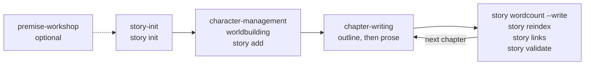

# Getting started

This page is for writers and developers who are new to Story Skills. It covers installing the skills in your agent, installing the optional `story` CLI, and a first session: creating a project, adding a character and a location, drafting chapter 1, and running the maintenance checks.

**On this page**

- [What you need](#what-you-need)
- [Install the skills](#install-the-skills)
- [Install the story CLI](#install-the-story-cli)
- [Update, pin, or remove](#update-pin-or-remove)
- [Your first session](#your-first-session)
- [Where to go next](#where-to-go-next)
- [Troubleshooting](#troubleshooting)

## What you need

- An agent that supports [Agent Skills](https://agentskills.io) (`SKILL.md`), such as Claude Code, Codex, GitHub Copilot in VS Code, Cursor, Windsurf, Gemini CLI, or OpenCode.
- Node 18 or newer if you want to run the `story` CLI. The CLI has no runtime dependencies.
- Optionally, git. A story project is a folder of markdown files, so version control works well with it and some features rely on it, such as `story compare --ref`.

The skills do the creative work: asking questions, outlining, and drafting. The CLI does the mechanical work: registries, word counts, link checks, validation, continuity checks, and exports. You can use the skills without installing the CLI, because the `story-maintenance` skill includes its own copy of the CLI. See [Core concepts](concepts.md) for how the two parts fit together.

## Install the skills

Pick the method for your agent. Each method installs the 21 skills in [`skills/`](../skills/); the Gemini CLI and Agent Skills CLI installers can also install a single skill.

### Claude Code

Type these inside a Claude Code session, not in a shell:

```text
/plugin marketplace add danjdewhurst/story-skills
/plugin install story-skills@story-skills
```

From a shell, the `claude` CLI does the same thing:

```shell
claude plugin marketplace add danjdewhurst/story-skills
claude plugin install story-skills@story-skills
```

The marketplace entry is [`.claude-plugin/marketplace.json`](../.claude-plugin/marketplace.json) and the plugin manifest is [`.claude-plugin/plugin.json`](../.claude-plugin/plugin.json).

### Codex

```shell
codex plugin marketplace add danjdewhurst/story-skills
codex plugin add story-skills@story-skills
```

Codex reads the marketplace from [`.agents/plugins/marketplace.json`](../.agents/plugins/marketplace.json) and the plugin manifest from [`.codex-plugin/plugin.json`](../.codex-plugin/plugin.json). The plugin offers starter prompts such as "Start a new story." and "Write the next chapter."

To work on the skills locally without the plugin, copy them into a directory Codex scans:

```shell
git clone https://github.com/danjdewhurst/story-skills.git
cp -r story-skills/skills/* ~/.agents/skills/   # user-wide
cp -r story-skills/skills/* .agents/skills/     # or this repository only
```

### Other agents: the Agent Skills CLI

For any agent that the [`skills` CLI](https://github.com/vercel-labs/skills) (run with `npx skills`) supports:

```shell
npx skills add danjdewhurst/story-skills
# or, with Bun only
bunx skills add danjdewhurst/story-skills
```

Add `--skill <name>` to install only some skills, or `--agent <name>` to target a specific agent.

Gemini CLI has its own installer:

```shell
gemini skills install https://github.com/danjdewhurst/story-skills.git
# or one skill
gemini skills install https://github.com/danjdewhurst/story-skills.git --path skills/chapter-writing
```

### Copy the skills by hand

If your agent has no installer, clone the repository and copy every folder in `skills/` into the agent's skills directory:

```shell
git clone https://github.com/danjdewhurst/story-skills.git
cp -r story-skills/skills/* <skills-directory>/
```

| Agent | Project directory | Global directory |
|-------|-------------------|------------------|
| Claude Code | `.claude/skills/` | `~/.claude/skills/` |
| GitHub Copilot (VS Code) | `.github/skills/` or `.agents/skills/` | `~/.copilot/skills/` |
| Cursor | `.agents/skills/` | |
| Windsurf | `.windsurf/skills/` | `~/.codeium/windsurf/skills/` |
| OpenCode | `.opencode/skills/` (also searches `.claude/skills/`) | `~/.config/opencode/skills/` |
| Codex | `.agents/skills/` | `~/.agents/skills/` |
| Anything else | your agent's documented skills directory, or `.agents/skills/` | |

For Gemini CLI, link the cloned folder instead of copying it: `gemini skills link story-skills/skills`.

Copy whole folders, not just `SKILL.md`. Each skill's `references/` files, and the bundled CLI at `story-maintenance/scripts/story.js` with the `package.json` beside it, have to stay next to it.

Outside coding agents, you can add a skill's `SKILL.md` and reference files to a Claude.ai or ChatGPT project as knowledge, or put them in a system prompt.

### Let your agent install it

The [README](../README.md#or-let-your-agent-install-it) has a prompt you can paste into any coding agent. It works out which agent it is running in and uses the matching method above.

### Check the skills are loaded

Restart or reload your agent after installing, then ask it:

```text
Which story skills do you have?
```

It should name skills such as `story-init`, `chapter-writing`, and `story-maintenance`. If it does not, check the install:

| Installer | How to check |
|-----------|--------------|
| Claude Code plugin | `claude plugin list` shows `story-skills@story-skills`; if its status is disabled, run `claude plugin enable story-skills@story-skills` |
| Codex plugin | `codex plugin list` shows `story-skills@story-skills` as `installed, enabled` |
| Agent Skills CLI | `npx skills list` (add `-g` for a global install) lists the skills |
| Manual copy | The agent's skills directory holds one folder per skill, each with a `SKILL.md` |

## Install the story CLI

This step is optional. Install the CLI if you want to run checks yourself in a terminal, in CI, or in an agent that does not have the skills installed. The npm package is `story-skills` and its command is `story`.

| Method | Command |
|--------|---------|
| Run without installing (npm) | `npx story-skills --help` |
| Run without installing (Bun) | `bunx story-skills --help` |
| Install globally | `npm install -g story-skills`, then `story --help` |
| Try unreleased changes from GitHub | `npx --yes --package github:danjdewhurst/story-skills story --help` |
| From a clone of this repository | `bun install`, then `bun run story -- --help` |
| Bundled copy in an installed skill | `node <skills-directory>/story-maintenance/scripts/story.js --help` |

Check the installed version:

```shell
story --version
```

```text
0.10.3
```

The skills look for the CLI in this order: `story`, then `bun run story --` from a Story Skills checkout, then the bundled `scripts/story.js` run with Node. If none is available, they make the same changes by hand. The rest of this page writes `story`; substitute whichever form you use. Every command and option is listed in the [CLI reference](cli-reference.md).

## Update, pin, or remove

Releases are tagged `vX.Y.Z` on GitHub and published to npm with the same version. The skills and the CLI are released together.

### Update the skills

| Installer | Update | Remove |
|-----------|--------|--------|
| Claude Code | `claude plugin marketplace update story-skills`, then `claude plugin update story-skills@story-skills` | `claude plugin uninstall story-skills@story-skills`, then optionally `claude plugin marketplace remove story-skills` |
| Codex | `codex plugin marketplace upgrade story-skills`, then `codex plugin add story-skills@story-skills` | `codex plugin remove story-skills@story-skills`, then optionally `codex plugin marketplace remove story-skills` |
| Agent Skills CLI | `npx skills update`, or re-run `npx skills add danjdewhurst/story-skills` | `npx skills remove`, then pick the story skills |
| Gemini CLI | Re-run `gemini skills install`; a linked folder updates when you `git pull` the clone | See `gemini skills --help` |
| Manual copy | `git pull` in the clone and copy the `skills/*` folders again | Delete the copied skill folders |

Inside a Claude Code session, the `/plugin` command opens the same install, update, and uninstall options. Restart your agent after an update so it reloads the skills.

The bundled CLI at `story-maintenance/scripts/story.js` lives inside the skill folder, so it updates, and is removed, with the skills.

### Update or pin the CLI

| Task | Command |
|------|---------|
| Update a global install | `npm install -g story-skills@latest` |
| Pin a global install to one release | `npm install -g story-skills@0.10.3` |
| Run one release without installing | `npx story-skills@0.10.3 --help` |
| Remove a global install | `npm uninstall -g story-skills` |

Pass `@latest` or a version to `npx` when you need to be sure which release runs, because `npx` can reuse a copy it downloaded earlier. To pin the skills for a manual copy, run `git checkout v0.10.3` in the clone before you copy the folders.

## Your first session

This walkthrough builds a small mystery, *The Sunken Ledger*. Each step shows what to ask your agent and the CLI commands the skill runs for you, so you can follow it either way. All the output below was captured by running these commands. Absolute paths are shortened to `~/stories`.

> [!NOTE]
> You only need to type the prompts that follow **Ask your agent**. The shell blocks show what the agent runs for you; run them yourself only if you want to.



### 1. Start the project

If all you have is a spark (an image, a character, a what-if) or several ideas you can't choose between, start one step earlier. Ask your agent "I have an idea for a story" and the [`premise-workshop`](../skills/premise-workshop/SKILL.md) skill turns it into a tested logline and premise, recommends a form (novel, novella, short story, and so on), brainstorms titles, and hands the result to `story-init` so you aren't asked twice. [Writing workflows](writing-workflows.md#premise-workshop) walks through a session.

When you know what you are writing, ask your agent:

```text
Start a new story.
```

The [`story-init`](../skills/story-init/SKILL.md) skill asks for the title, the form, genre and sub-genre, a two- or three-sentence synopsis, the setting era, two to four themes, the POV style, and the tense. It then scaffolds the project with `story init`:

```shell
cd ~/stories
story init "The Sunken Ledger" \
  --form novel \
  --genre mystery \
  --sub-genre coastal \
  --setting-era near-future \
  --pov third-person-limited \
  --tense past \
  --theme truth \
  --theme memory \
  --synopsis "A salvage diver finds a sealed room under a storm-damaged harbor."
```

```text
Created story project: ~/stories/the-sunken-ledger
```

The directory name and the story id (`the-sunken-ledger`) come from the title. Use `--dir` to choose a different directory. A title with no ASCII letters or digits, such as `Война и мир`, needs `--dir` with an ASCII folder name, and the story id comes from that folder name. `init` refuses a directory that already exists unless you pass `--force`, and even then it only adds missing starter files.

`--form` records the form and sets a default word target for it: 80,000 for a `novel`, 30,000 for a `novella`, 12,000 for a `novelette`, 5,000 for a `short-story`, 1,000 for `flash`, 10,000 for a `chapter-book`, and 500 for a `picture-book`. A `serial` gets no book-level target. Without `--form`, `init` writes neither field, so the skill passes `--form novel` if you don't choose.

The new project looks like this:

```text
the-sunken-ledger/
├── story.md
├── style-sheet.md
├── chapters/
│   └── _index.md
├── characters/
│   └── _index.md
├── continuity/
│   ├── state.md
│   ├── clues/_index.md
│   ├── promises/_index.md
│   └── questions/_index.md
├── glossary/
│   ├── _index.md
│   └── terms/
├── plot/
│   ├── _index.md
│   ├── arcs/
│   └── timeline.md
├── scenes/
│   └── _index.md
└── worldbuilding/
    ├── _index.md
    ├── artifacts/
    ├── factions/
    ├── locations/
    └── systems/
```

`story.md` is the story bible that every skill reads first. This is the file as `story init` writes it:

```markdown
---
title: The Sunken Ledger
schema-version: 2
genre: mystery
sub-genre: coastal
setting-era: near-future
status: planning
themes:
  - truth
  - memory
pov: third-person-limited
tense: past
form: novel
target-words: 80000
---

# The Sunken Ledger

## Synopsis

A salvage diver finds a sealed room under a storm-damaged harbor.

## Tone & Style

Add notes on the story's voice, texture, and emotional register.

## Notes
```

The skill then adds two fields to the frontmatter: a working `premise` (the book's controlling idea) and a `counter-premise` (the argument the antagonist embodies). For this book it might add:

```yaml
premise: "The truth surfaces because someone refuses to stop looking."
counter-premise: "Some doors stay shut because opening them costs too much."
```

Treat them as guesses that you will check during revision; the [`theme-craft`](../skills/theme-craft/SKILL.md) skill works on them in depth. (If you came from the premise workshop, these are the ones you tested there.) Publishing fields such as `isbn` and `description` wait until the book is finished; the [`publishing`](../skills/publishing/SKILL.md) skill fills them in. Each `_index.md` file is a registry: a table the CLI rebuilds from the entity files next to it. [Project format reference](project-format.md) describes every file and field.

Run the checks from inside the project. A new project passes, and `story next` suggests what to do first:

```shell
cd the-sunken-ledger
story validate .
story next .
```

```text
Project is valid: 0 errors, 0 warnings, 0 dismissed
```

```text
# Next Writing Actions: The Sunken Ledger

Checks: validate ok (0 errors, 0 warnings), links ok (0 errors, 0 warnings), continuity ok (0 errors, 0 warnings)

Actions:
- [P2] Draft chapter 1: Use story add chapter "Chapter 1" --number 1, then outline scenes to establish the next story beat.
- [P2] Create first character: Use story add character "Name" --role protagonist before drafting prose.
```

### 2. Add a character and a location

Ask your agent:

```text
Create a character: Ines Calloway, a salvage diver. She's the protagonist.
```

The [`character-management`](../skills/character-management/SKILL.md) skill reads `story.md` and the character registry, then asks about appearance, personality, backstory, wants and needs, voice (with sample dialogue), and arc. It creates the file with `story add character` and fills in the sections from your answers:

```shell
story add character "Ines Calloway" --role protagonist
```

```text
Created character ines-calloway: ~/stories/the-sunken-ledger/characters/ines-calloway.md
```

Next, a place. The [`worldbuilding`](../skills/worldbuilding/SKILL.md) skill handles locations, systems, factions, and artifacts. Ask your agent:

```text
Add a location: Grayling Shoal, the sandbank off the harbor where Ines dives.
```

```shell
story add location "Grayling Shoal" --type landmark --character ines-calloway
```

```text
Created location grayling-shoal: ~/stories/the-sunken-ledger/worldbuilding/locations/grayling-shoal.md
```

Every entity is named by a kebab-case id taken from its name: `ines-calloway`, `grayling-shoal`. Other files refer to it by that id. Links run both ways. The location lists Ines under `notable-characters`, and `story add` wrote the backlink into her file:

```yaml
---
name: Ines Calloway
role: protagonist
status: alive
aliases: []
relationships: []
locations:
  - grayling-shoal
tags: []
arc: ""
---
```

`story add` also rebuilds the registries, so `characters/_index.md` and `worldbuilding/_index.md` already list both entries. You only need `story reindex` after editing files by hand.

The same command creates the other entity kinds, such as `system`, `faction`, `artifact`, `arc`, `question`, `promise`, `clue`, `term`, `research`, and `matter`. See [`story add`](cli-reference.md#add) for their options, and [Skills catalogue](skills.md) for the skill that owns each one.

### 3. Draft chapter 1

Ask your agent:

```text
Write the next chapter.
```

The [`chapter-writing`](../skills/chapter-writing/SKILL.md) skill works outline-first:

1. **Gather context.** It reads `story.md`, `style-sheet.md`, the chapter and scene registries, `plot/_index.md`, `plot/timeline.md`, `continuity/state.md`, and the open questions and promises.
2. **Agree the scope.** It asks what the chapter covers, whose POV it uses, and where it is set.
3. **Outline.** It proposes a beat-by-beat outline, including what each scene's outcome should be and how the chapter ends, and revises it until you approve it.
4. **Draft.** It writes the prose in the POV and tense from `story.md`, using the character's voice notes and the location details.
5. **Update the records.** It adds a scene file for each scene, then updates the timeline, arcs, continuity state, and promises, and records how each scene and the chapter actually turned out.

The chapter and scene files come from `story add`:

```shell
story add chapter "The Door Under The Shoal" \
  --number 1 \
  --pov ines-calloway \
  --location grayling-shoal \
  --character ines-calloway

story add scene "Ines Finds The Door" \
  --chapter chapter-01 \
  --scene 1 \
  --pov ines-calloway \
  --location grayling-shoal \
  --character ines-calloway
```

```text
Created chapter chapter-01: ~/stories/the-sunken-ledger/chapters/chapter-01.md
Created scene chapter-01-scene-01: ~/stories/the-sunken-ledger/scenes/chapter-01-scene-01.md
```

The skill writes the prose straight into `chapters/chapter-01.md`, below the `## Chapter Text` heading. This is the file once the skill has finished, with the outline left as `story add` created it:

```markdown
---
title: The Door Under The Shoal
number: 1
pov: ines-calloway
locations:
  - grayling-shoal
characters:
  - ines-calloway
mentions: []
arcs-advanced: []
status: draft
mode: ""
date: ""
time: ""
hook: question
word-count: 84
---

# Chapter 1: The Door Under The Shoal

## Outline

1. Opening beat
2. Escalation
3. Turn or decision

---

## Chapter Text

The storm had taken the harbor wall in a single night. By morning the water off Grayling Shoal was brown with silt, and Ines Calloway was the only diver the council could find who would go down before the insurers arrived.

She went in at slack tide. Twenty metres down, where the shoal should have ended in sand, the current had scoured away a shelf of concrete and left a door.

It was steel, rimmed with rust, and it was locked from the inside.
```

`story add` creates a chapter with `status: outline` and `word-count: 0`. When the skill saves the prose it sets `status: draft`, and its post-write step runs `story wordcount . --write` to fill in `word-count`. If you write prose yourself, change the status by hand; the later values are `revised`, `final`, and `complete`. The post-write step also carries character, object, and knowledge state forward into `continuity/state.md` and moves its `current-chapter` up to `1`. Step 5 shows the warning you get when that update is missed.

Word counts start at `## Chapter Text`, so the outline above it never counts towards `word-count`. Characters who are present in the chapter go in `characters`. Characters who are only mentioned, remembered, or seen in flashback go in `mentions`. The continuity checks rely on that split.

The skill also added `hook: question`, because the chapter ends on a question (who locked the door from the inside?). `hook` records how a chapter ends: `cliffhanger`, `question`, `revelation`, `reversal`, `decision`, `emotional`, or `resolution`. `story add` doesn't set it unless you pass `--hook`.

The scene file, `scenes/chapter-01-scene-01.md`, holds the scene's machine-readable record: POV, location, cast, `state-changes`, and continuity notes. The skill set its `outcome` to `yes-but`: Ines finds what she dived for, but it is locked. Later sessions and the continuity and pacing checks read these records to learn where the story stands.

If you would rather write without an outline, ask for discovery drafting instead. The [`discovery-drafting`](../skills/discovery-drafting/SKILL.md) skill drafts first and reconciles the bible afterwards. Once a chapter's structure is settled, the [`line-editing`](../skills/line-editing/SKILL.md) skill polishes its sentences; the separate [better-writing](https://github.com/forjd/better-writing) skill is an optional extra. [Writing workflows](writing-workflows.md) covers all of these.

### 4. Run the maintenance loop

After a chapter is drafted, the skill runs the maintenance pass. You can run it yourself at any time:

```shell
story wordcount . --write
story reindex .
story links .
story validate .
```

```text
chapters/chapter-01.md: 84
Total: 84
Registries already up to date
Links are valid: 0 errors, 0 warnings, 0 dismissed
Project is valid: 0 errors, 0 warnings, 0 dismissed
```

| Command | What it does |
|---------|--------------|
| `story wordcount . --write` | Counts prose under `## Chapter Text` and writes `word-count` into each chapter and the total into `chapters/_index.md` |
| `story reindex .` | Rebuilds every `_index.md` registry table from the entity files |
| `story links .` | Checks that every id reference points at a real file and that backlinks exist |
| `story validate .` | Checks required files, the schema version, frontmatter fields and values, and registries |

Then check the story itself and ask what to do next:

```shell
story continuity .
story next .
```

```text
Continuity is consistent: 0 errors, 0 warnings, 0 dismissed
```

```text
# Next Writing Actions: The Sunken Ledger

Checks: validate ok (0 errors, 0 warnings), links ok (0 errors, 0 warnings), continuity ok (0 errors, 0 warnings)

Actions:
- [P3] Project is mechanically healthy: No deterministic maintenance issues are blocking the next writing pass.
- [P2] Draft chapter 2: Use story add chapter "Chapter 2" --number 2, then outline scenes to establish the next story beat.
```

`story continuity` checks the story rather than the files: characters who appear after they die, payoffs that land before their setup, questions answered before they are asked, and stale continuity state. [Continuity and analysis](continuity.md) explains each check.

The skill also runs `story pacing .`, which lines each chapter's length, scene outcomes, and hook up against the rest of the book. With one chapter there is little to compare, but it confirms the fields were recorded:

```shell
story pacing .
```

```text
Pacing: 1 scenes, 0 sequels, 1 of 1 chapters with hooks
Outcomes: 100% of recorded outcomes are setbacks or complications
Median chapter: 84 words

Ch  Words  Scenes  Sequels  Outcomes (yes/no/yes-but/no-and)  Hook
 1     84       1        0  0/0/1/0                           question
Pacing check complete: 0 errors, 0 warnings, 0 dismissed
```

As the book grows it warns about runs of easy wins, long stretches with no reaction scene, chapters far longer or shorter than the rest, and runs of chapters that end with everything resolved.

### 5. When a check fails

Suppose you edit chapter 1 by hand instead of through the skill. You add a second character, `oskar-lind`, to its `characters` list but forget to create his file, and you leave `continuity/state.md` at `current-chapter: 0`. Chapter 1 is `status: draft`, so the continuity checks now expect the state file to have caught up with it. `story links` reports the missing file:

```shell
story links .
```

```text
Link check failed: 1 errors, 0 warnings, 0 dismissed
error: chapters/chapter-01.md references missing character oskar-lind
```

`story doctor` runs all three check groups and turns the results into a prioritised list of repairs:

```shell
story doctor .
```

```text
# Story Doctor: The Sunken Ledger

Root: ~/stories/the-sunken-ledger

Checks:
- Validate: ok (0 errors, 0 warnings)
- Links: failed (1 errors, 0 warnings)
- Continuity: ok (0 errors, 1 warnings)

Actions:
- [P0] Fix broken references: Run story links . and repair 1 missing references or backlinks.
- [P1] Review continuity warnings: Run story continuity . and review 1 continuity warnings.
- [P2] Draft chapter 2: Use story add chapter "Chapter 2" --number 2, then outline scenes to establish the next story beat.
```

The continuity warning says what is stale:

```shell
story continuity .
```

```text
Continuity is consistent: 0 errors, 1 warnings, 0 dismissed
warning: continuity/state.md current-chapter 0 is behind the latest chapter 1; update continuity state after drafting
```

To fix both, create the character and set `current-chapter: 1` in `continuity/state.md`:

```shell
story add character "Oskar Lind" --role supporting
story links .
story continuity .
```

```text
Created character oskar-lind: ~/stories/the-sunken-ledger/characters/oskar-lind.md
Links are valid: 0 errors, 0 warnings, 0 dismissed
Continuity is consistent: 0 errors, 0 warnings, 0 dismissed
```

<details>
<summary>For scripts and CI</summary>

`story validate`, `story links`, and `story continuity` exit with status 1 when they find errors, so you can use them as gates in scripts and CI. They print their summary line and findings to stderr, not stdout. `story doctor`, `story next`, and `story report` are reports, not gates, and exit 0 even when checks fail. See [Automation and CI](automation.md#exit-codes).

</details>

## Where to go next

Once chapter 1 exists, these are the usual next steps:

- **Set up a style sheet.** Ask "Set up a style sheet for this book." The `voice-style` skill fills in `style-sheet.md`: `dialect`, `preferred` spellings, and `watch-words`. `story prose .` then lints every chapter for filter words, adverbs, said-bookisms, echoes, sentence rhythm, and repeated phrases. See [Writing workflows](writing-workflows.md#voice-and-house-style).
- **Plan the plot.** Ask "Create a plot arc." The `plot-structure` skill writes arcs under `plot/arcs/`. Chapters record the arcs they move forward in `arcs-advanced`.
- **Track setups and payoffs.** Use `story add question`, `story add promise`, and `story add clue` so that `story continuity` can check that every setup pays off, and in the right order. See [Continuity and analysis](continuity.md).
- **Track progress.** Add `target-words` and `deadline` to `story.md`, then run `story progress . --log` after each session. See [Continuity and analysis](continuity.md#story-progress).
- **Check names and voices.** Ask "Name a character" and the agent runs `story names` to catch clashes and look-alikes before a name sticks. Once there is dialogue, `story voices .` checks that each character sounds like themselves. See [Writing workflows](writing-workflows.md#voice-and-house-style).
- **Revise in named passes.** When the draft is done, ask "Set up the revision passes". `story passes . --init` writes a ladder from structure down to proof, and `story next .` tells you which pass comes next. Commit and run `git tag draft-1` before a pass, then `story compare . --ref draft-1` shows what it changed. See [Writing workflows](writing-workflows.md#revision-passes).
- **Polish the prose.** Ask "Line edit chapter 1". The `line-editing` skill proposes each change with a before, an after, and a reason, and applies only the ones you accept. See [Writing workflows](writing-workflows.md#line-editing).
- **Share a review copy.** `story build . --format html` writes one HTML file that beta readers open in a browser, with a label on every paragraph for them to cite. See [Writing workflows](writing-workflows.md#feedback-triage).
- **Build the book.** `story build .` writes a single markdown manuscript to `dist/`, and `story build . --format epub` (or `docx`, `shunn`, `html`, `print`, `narration`, `metadata`) writes other formats there. The [`publishing`](../skills/publishing/SKILL.md) skill takes a finished book through metadata, the print interior, and launch, and [`adaptation`](../skills/adaptation/SKILL.md) turns it into an audiobook script, screenplay, or translation. Treat `dist/` as disposable. If you use `story export` instead, keep its output in `dist/` too, for example `story export . --out dist/manuscript.md`. Written to the project root, `manuscript.md` makes `story validate` warn that the file is not part of the story project model. See [Import, export, and builds](manuscripts.md).
- **Bring in an existing draft.** `story import draft.md --title "Your Title"` splits a manuscript into a project. See [Import, export, and builds](manuscripts.md).
- **Write a sequel or prequel.** See [Series](series.md).
- **Automate it.** The GitHub Actions templates run the checks on every pull request and can draft a chapter on a schedule. See [Automation and CI](automation.md).

To explore finished projects, read the examples in [`examples/`](../examples/). [`examples/harbor-of-second-light/`](../examples/harbor-of-second-light/) has populated continuity state, and [`examples/the-unraveled-thread/`](../examples/the-unraveled-thread/) is deliberately broken to show the main kinds of continuity finding.

The [documentation index](README.md) lists every page, with a suggested reading order.

## Troubleshooting

| Symptom | Fix |
|---------|-----|
| `story: command not found` | Use `npx story-skills <command>`, install globally with `npm install -g story-skills`, or run the bundled copy with `node <skills-directory>/story-maintenance/scripts/story.js`. |
| `init` refuses the directory | The target already exists. Choose another `--dir`, or pass `--force` to add only the missing starter files. |
| The skills do not appear in your agent | Restart or reload the agent, then follow [Check the skills are loaded](#check-the-skills-are-loaded). For a manual install, check that you copied whole skill folders, including `references/` and `scripts/`, into a directory it scans. |
| The skills or CLI are out of date | See [Update, pin, or remove](#update-pin-or-remove). |
| A registry table is out of date after hand edits | Run `story reindex .`. |
| Word counts in `chapters/_index.md` are stale | Run `story wordcount . --write`. |
