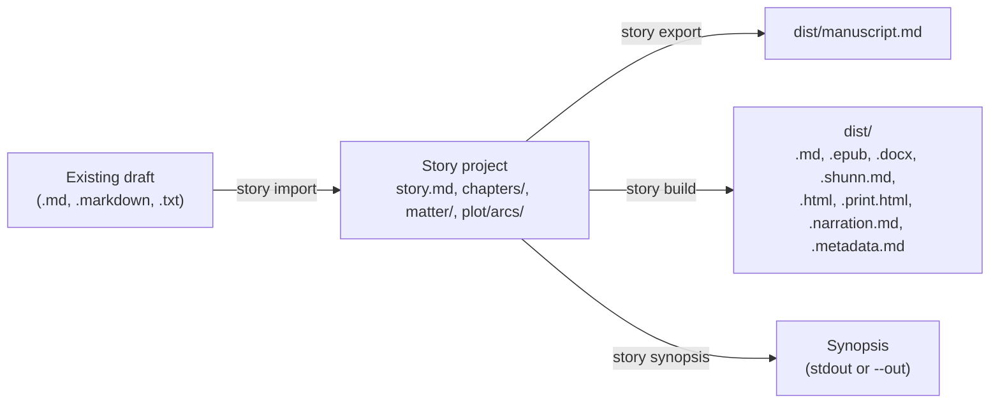

# Import, export, and builds

This page is for writers who want to bring an existing draft into Story Skills or get a finished book out of it. It covers `story import`, front and back matter, the publishing fields in `story.md`, `story export`, `story build` (markdown, EPUB, DOCX, Shunn manuscript format, an HTML review copy, a print interior, an audiobook narration script, and a retailer metadata sheet), and `story synopsis`.

All output shown was captured by running the commands against copies of the examples, with absolute paths shortened to `~/stories`.

**On this page**

- [Overview](#overview)
- [Import an existing manuscript](#import-an-existing-manuscript)
- [What goes into a manuscript](#what-goes-into-a-manuscript)
- [Front and back matter](#front-and-back-matter)
- [Publishing metadata in story.md](#publishing-metadata-in-storymd)
- [Export a markdown manuscript](#export-a-markdown-manuscript)
- [Build a book](#build-a-book): [EPUB](#epub), [DOCX](#docx), [Shunn](#shunn-standard-manuscript-format), [HTML review copy](#html-review-copy), [print interior](#print-interior), [narration script](#narration-script), [retailer metadata sheet](#retailer-metadata-sheet)
- [Build a synopsis](#build-a-synopsis)
- [Output paths and what is disposable](#output-paths-and-what-is-disposable)
- [Common errors](#common-errors)

## Overview

| Command | Reads | Writes | Default output |
|---------|-------|--------|----------------|
| `story import <source>` | A manuscript file or a folder of chapter files | A new story project | `./<title-in-kebab-case>/` |
| `story export [path]` | `story.md`, `chapters/`, `matter/` | One markdown manuscript | `dist/manuscript.md` |
| `story build [path]` | `story.md`, `chapters/`, `matter/`, the cover image, and (for narration) `pronunciation` fields in the bible | One book file, script, or sheet | `dist/<story-id>.<ext>` |
| `story synopsis [path]` | `story.md` and `plot/arcs/` | A synopsis scaffold | Printed to stdout |



Several skills drive these commands:

- [`story-maintenance`](../skills/story-maintenance/SKILL.md) handles import, export, and builds.
- [`submission`](../skills/submission/SKILL.md) builds Shunn manuscripts and rewrites the synopsis scaffold into submission copy.
- [`publishing`](../skills/publishing/SKILL.md) fills the publishing fields in `story.md`, then works through the metadata sheet, the EPUB, and the print interior.
- [`editorial-review`](../skills/editorial-review/SKILL.md) builds DOCX and HTML review copies for editors and beta readers, and tracks permissions for quoted matter.
- [`adaptation`](../skills/adaptation/SKILL.md) builds the narration script for an audiobook.

See the [Skills catalogue](skills.md) for all of them, and the [CLI reference](cli-reference.md) for installing and running the CLI.

## Import an existing manuscript

`story import` turns a draft you already have into a Story Skills project. It creates the same scaffold as `story init`, then splits your prose into numbered chapter files. It never writes character, location, or other bible files; instead it prints names that appear often, so you can decide which ones deserve an entry.

For a new, empty project, use `story init` instead; see [Getting started](getting-started.md).

### A first import

Here is a small draft, `draft.md`:

```markdown
# The Salt Road

The caravan left before the bells.

## Chapter 1: The Well

Ione Marsh counted the water skins twice. Ione Marsh did not trust the guide, and the guide knew it.
When the wind turned, Ione Marsh walked to the edge of the camp and asked Tobin for the map.
Tobin laughed, but Tobin handed it over, and Tobin said nothing about the torn corner.

## Chapter 2 — The Dunes

The dunes moved at night. Ione Marsh heard them shifting under the tent floor.

## Chapter III: The Oasis

At the oasis, Tobin finally told her the truth.
```

Import it with a title:

```shell
story import draft.md --title "The Salt Road"
```

```text
Imported 4 chapters (82 words) into ~/stories/the-salt-road
Entity candidates (review, then create with story add):
- Ione Marsh (4 mentions)
- Tobin (4 mentions)
```

The draft had three chapter headings but produced four chapters: the text before the first chapter heading became a chapter titled `Opening`, with the book title heading (`# The Salt Road`) dropped. The new project has the usual scaffold (`story.md`, `characters/`, `worldbuilding/`, `plot/`, `continuity/`, and so on; see the [Project format reference](project-format.md)) and one file per chapter:

```text
the-salt-road/chapters/
├── _index.md
├── chapter-01.md
├── chapter-02.md
├── chapter-03.md
└── chapter-04.md
```

Each chapter file gets starter frontmatter, a `# Chapter N: Title` heading, and the prose under `## Chapter Text`. This is `chapters/chapter-04.md`:

```markdown
---
title: The Oasis
number: 4
pov: ""
locations: []
characters: []
arcs-advanced: []
status: draft
word-count: 9
---

# Chapter 4: The Oasis

## Chapter Text

At the oasis, Tobin finally told her the truth.
```

Import fills in `word-count` and rebuilds the chapter registry, so you do not need to run `story wordcount` or `story reindex` afterwards. The `## Synopsis` section of `story.md` holds a placeholder, `Imported from draft.md. Replace with a 2-3 sentence synopsis.`, unless you pass `--synopsis`.

### How chapters are split

A chapter heading is a markdown heading of any level (`#` to `######`) whose text starts with the word `Chapter`, in any letter case (`CHAPTER 9 - Loud` counts too), or is a `Prologue`, `Epilogue`, `Interlude`, or `Afterword` heading:

| Heading in the source | Chapter title |
|-----------------------|---------------|
| `## Chapter 1: The Well` | `The Well` |
| `## Chapter 2 — The Dunes` | `The Dunes` |
| `### Chapter IV: Storm` | `Storm` |
| `## Chapter One: Arrival` | `Arrival` |
| `# Chapter 7. The Bridge` | `The Bridge` |
| `## Chapter 5` | `Chapter 5` |
| `# Chapter I Am Legend` | `I Am Legend` |
| `# Prologue` | `Prologue` |
| `## Epilogue` | `Epilogue` |
| `# Chapterhouse` | Not a chapter heading |
| `# Chapters` | Not a chapter heading |

The rules behind the table:

- The number after `Chapter` is optional and can be arabic (`12`), roman (`IV`), or spelled out up to ninety-nine (`One`, `Twenty-One`). A `:`, `.`, `-`, en dash, or em dash may separate it from the title.
- A `Prologue`, `Epilogue`, `Interlude`, or `Afterword` heading keeps its whole text as the title.
- Because the number is optional, a heading such as `## Chapter Notes` also starts a chapter (titled `Notes`).
- The source number is discarded. Chapters are renumbered 1, 2, 3, and so on in the order they appear.
- When a heading has no title after the number, the whole heading text becomes the title.

Import processes each source document in five steps:

1. Leading YAML frontmatter is removed, including frontmatter written by tools such as Pandoc or Obsidian that the CLI's own parser would reject. A leading `---` scene break is kept.
2. If the document has chapter headings, each heading starts a chapter and everything up to the next chapter heading is its prose. Text before the first chapter heading becomes a chapter titled `Opening`, with a leading `# Title` line removed.
3. If the document has no markdown chapter headings, as in a manuscript saved as plain text, it is split on chapter lines instead. A chapter line stands alone between blank lines, is at most 80 characters, and is either `Chapter` with a number (`Chapter 3`, `CHAPTER ONE: Arrival`) or one of `Prologue`, `Epilogue`, `Interlude`, and `Afterword`. A sentence that merely starts with `Chapter` does not split. A single short line before the first chapter line is taken as the book title and dropped; longer text there becomes an `Opening` chapter.
4. If the document has neither, the whole document becomes one chapter. Its title is the first `# ` heading in the document, and any text before that heading is kept in the prose. With no `# ` heading, the title comes from the file name: `02-smoke.txt` becomes `02 Smoke`.
5. Chapters whose prose is empty are dropped.

> [!NOTE]
> Only `Chapter`, `Prologue`, `Epilogue`, `Interlude`, and `Afterword` headings split a document. A `## Part Two` heading inside a single manuscript file stays in the prose of the chapter around it. If your draft uses other markers, rename them to `Chapter` headings before importing, or split the draft into one file per chapter and import the folder.

### Importing a folder of chapter files

A single source file is read as plain UTF-8 text, whatever its extension. Pass a directory to import every `.md`, `.markdown`, and `.txt` file directly inside it. Subdirectories and other file types are ignored. Each file is split with the rules above, so a folder of one-chapter files gives one chapter per file.

Files are ordered by the numbers in their names, compared numerically, so `chapter-2` comes before `chapter-10`. Files without a number go last, except files whose names start with `prologue`, `preface`, `foreword`, `introduction`, or `prelude`, which go first. Take a folder `chaps/` with four files:

```text
chaps/
├── chapter-10.md   "# The Door" followed by "The door opened."
├── chapter-2.txt   "Smoke rose over the hill."
├── notes.md        "Some notes here."
└── prologue.md     "Before it all."
```

```shell
story import chaps --title "Door And Smoke" --dir door
```

```text
Imported 4 chapters (14 words) into ~/stories/door
```

| File written | Source | Title |
|--------------|--------|-------|
| `chapter-01.md` | `prologue.md` | `Prologue` |
| `chapter-02.md` | `chapter-2.txt` | `Chapter 2` (from the file name) |
| `chapter-03.md` | `chapter-10.md` | `The Door` (from its `# The Door` heading) |
| `chapter-04.md` | `notes.md` | `Notes` |

Remove stray files such as notes from the folder before importing, or delete the chapter files they produce afterwards.

### Entity candidates

After importing, the CLI lists names that appear at least three times in the prose, most frequent first, up to 25 of them. It counts runs of capitalised words (`Mara Quill`, `The Long Pier` counted as `Long Pier`) and single capitalised words that follow a lowercase word mid-sentence, and it skips common words such as `The`, `He`, and `She`.

The list is a prompt for you, not a set of facts. Nothing is created from it. Review it, then create the entries that matter with `story add`:

```shell
story add character "Ione Marsh" --role protagonist
story add character "Tobin" --role supporting
```

The [`story-maintenance`](../skills/story-maintenance/SKILL.md) skill follows an import by creating character and location files from the candidates. [Writing workflows](writing-workflows.md) covers building out the bible, and [`discovery-drafting`](../skills/discovery-drafting/SKILL.md) uses the same extract-then-approve loop after each drafted chapter.

### Import options

`--title` is required. Import takes the same scaffold options as `story init`, except the series options and `--form`. Passing `--form` or a series option to import is an error (`--form does not apply to story import`); set `form` (and `target-words`, if you want one) in `story.md` after importing.

| Option | Effect |
|--------|--------|
| `--title <name>` | Story title. Required. The project folder and story id are the title in kebab case. |
| `--dir <path>` | Target directory, relative to the current directory. Defaults to the kebab-case title. |
| `--genre <name>`, `--sub-genre <name>`, `--setting-era <name>` | Written to `story.md`. |
| `--theme <name>`, `--themes <a,b>` | Themes for `story.md`. `--theme` is repeatable. |
| `--pov <style>`, `--tense <tense>` | Written to `story.md`. |
| `--synopsis <text>` | Replaces the placeholder synopsis in `story.md`. |
| `--force` | Import into a directory that already exists. See below. |

Import uses `--dir`, not `--path`. Passing `--path` is an error:

```text
import uses --dir for the target directory. --path is the project root for other commands.
```

### Re-importing with `--force`

Without `--force`, import refuses a target directory that already exists:

```text
~/stories/the-salt-road already exists. Use --force to add missing starter files; existing files are never overwritten.
```

With `--force`, import adds any missing starter files and leaves other existing files alone, with one exception: it **deletes every `chapter-NN.md` file in `chapters/`** before writing the imported chapters.

> [!WARNING]
> Chapter frontmatter you filled in (POV, locations, characters, status) is lost with the old chapter files. Scene files, bible entries, and `matter/` pages are kept, but scenes may now point at chapters with different content. Commit or back up the project before a forced import. The `story-maintenance` skill asks you before it runs one.

### Import limits and safety

- Each source file can be at most 5 MiB, and a source folder can contain at most 500 importable files.
- A source that is a symlink is refused. Inside a source folder, a symlink to a document is refused and any other symlink is skipped.
- Import never follows a symlinked target directory.

### After importing

An imported project validates, but it has no bible yet. `story validate` warns that each chapter has no machine-readable scene records:

```text
Project is valid: 0 errors, 4 warnings, 0 dismissed
warning: chapters/chapter-01.md has no machine-readable scene records
warning: chapters/chapter-02.md has no machine-readable scene records
warning: chapters/chapter-03.md has no machine-readable scene records
warning: chapters/chapter-04.md has no machine-readable scene records
```

A typical next pass:

1. Replace the synopsis placeholder in `story.md` and fill in its frontmatter.
2. Create characters and locations from the candidates with `story add`, then fill each chapter's `pov`, `characters`, and `locations`.
3. Add arcs, scenes, and continuity entries as you reverse-outline the draft.
4. Run `story links .` and `story validate .` after each batch of changes.

## What goes into a manuscript

Export and the book formats assemble the book from the same parts, in this order. The Shunn builds leave out every matter page, the narration script leaves out a front-matter copyright page, and the metadata sheet contains no prose at all.

1. The title from `story.md`.
2. A generated copyright page, when `story.md` sets `copyright` and no matter page is already a copyright page. See [Publishing metadata in story.md](#publishing-metadata-in-storymd).
3. Front matter pages from `matter/` with `placement: front`, by `order`.
4. Chapters from `chapters/`, by their `number` frontmatter (or the number in the file name when `number` is missing).
5. Back matter pages with `placement: back`, by `order`.

Only chapter prose goes in. Scene files, outlines, notes, and the bible do not. The CLI finds a chapter's prose this way:

- If the chapter has a `## Chapter Text` heading, the prose is everything after it.
- Otherwise, if it has a `## Outline` section, the prose is everything after the first `---` line following the outline. With no `---`, it is everything after `## Outline`.
- Otherwise, the prose is the whole body with a leading `# ` heading removed.

HTML comments (`<!-- ... -->`) in the prose are left out of the word count and of every build format, so they are a safe place for notes to yourself.

`story wordcount` uses the same rule, so the manuscript contains exactly the words that were counted. Keep notes and TODOs above `## Chapter Text`, or they end up in the book. The [reconcile loop](../skills/discovery-drafting/references/reconcile-loop.md) puts its post-hoc chapter notes there for this reason.

Each chapter gets the heading `Chapter N: Title`, built from its `number` and `title` frontmatter. Two chapters with the same `number` stop every export and build:

```text
Duplicate chapter number 3: refusing to build with colliding EPUB ids
```

A project with no chapters cannot be exported or built (`No chapters found to export`).

A chapter `number` that is not a positive integer also stops them:

```text
chapters/chapter-03.md: chapter number must be a positive integer to build
```

> [!IMPORTANT]
> Export, build, and synopsis refuse to run while an entity file, registry, or `story.md` fails to parse (`Cannot export: fix this file first`, `Cannot build: ...`, `Cannot build a synopsis: ...`), but they do not run the other checks. Run `story validate .` before you build a copy to send anyone.

## Front and back matter

Front and back matter are pages outside the chapters: a dedication, an epigraph, a copyright page, acknowledgments, an author's note, an about-the-author page, or an also-by list. Each page is a markdown file in `matter/`, indexed by `matter/_index.md`.

Create one with `story add matter`:

```shell
story add matter "Dedication"
story add matter "Acknowledgments" --placement back
```

```text
Created matter dedication: ~/stories/the-salt-road/matter/dedication.md
Created matter acknowledgments: ~/stories/the-salt-road/matter/acknowledgments.md
```

The new file is a scaffold with a heading and no text:

```markdown
---
title: Dedication
placement: front
order: 1
heading: true
---

# Dedication

```

| Field | Required | Values | Meaning |
|-------|----------|--------|---------|
| `title` | Yes | Text | The page title, used as its heading and in the EPUB table of contents. |
| `placement` | Yes | `front` or `back` | Before or after the chapters. `story add matter` defaults to `front`; `--placement` sets it. |
| `order` | No | Integer, 0 or more | Position within its placement. `story add matter` uses one more than the highest `order` already in that placement; `--order` sets it. Ties sort by file name. |
| `heading` | No | `true` or `false` | Whether the page shows its title as a heading. Defaults to `true`. Set `false` for a dedication or epigraph. |
| `permission` | No | `not-needed`, `pending`, `granted`, or `public-domain` | Whether quoted material on the page, such as an epigraph, lyrics, or a poem, is cleared for publication. |
| `rights-holder` | No | Text | Who granted permission for quoted material. |
| `credit` | No | Text | The credit line the rights holder asked for. |

The three permission fields are for your records; no build prints them. `story validate` checks their values and warns when a page's `permission` is still `pending` while `story.md` has `status: complete`, or is `granted` with no `rights-holder`. Put the credit line in the page text yourself. The [`editorial-review`](../skills/editorial-review/SKILL.md) skill walks through clearing permissions.

A matter page whose id is `copyright`, or whose title contains the word "Copyright" in any letter case, counts as the book's copyright page. The EPUB marks it as a copyright page wherever it sits. When it is front matter, the print interior places it before the contents and the narration script skips it; a back-matter copyright page stays at the end of the print interior and is narrated.

Matter file names must be kebab-case, because they become EPUB file names. A build stops on a name such as `matter/About_Me.md` with `matter/About_Me.md: matter file names must be kebab-case to build`.

The page text is found with the same rule as chapter prose. For a normal matter page, that is the file body with its leading `# ` heading removed, so the heading in the file is for you and the `heading` field decides what readers see. A page with no text is left out of every export and build, and `story validate` warns about it:

```text
warning: matter/acknowledgments.md has no text and is left out of export and build
```

The [`the-last-ember`](../examples/the-last-ember/matter/epigraph.md) example has an epigraph with `heading: false`.

Write matter text yourself. The `story-maintenance` skill will not invent acknowledgments, biographical facts, or copyright details; it asks you for them.

## Publishing metadata in story.md

`story.md` can hold the details that retailers, distributors, and ebook readers need. Every field is optional. The book formats read them, and `story validate` checks their shape. The [Project format reference](project-format.md) lists every `story.md` field; these are the ones builds use:

| Field | Type | Used by |
|-------|------|---------|
| `author` | Text | The author in the EPUB (`dc:creator`), HTML, print, narration, and metadata builds, and the byline in both Shunn builds. The plain DOCX build does not use it. |
| `authors` | List of text | Replaces `author` for co-authored books in every build except Shunn, which reads only `author`. `validate` warns when both are set. |
| `language` | BCP 47 tag, such as `en`, `en-GB`, or `fr` | EPUB `dc:language` and the `lang` attribute of every EPUB document; the `lang` attribute of the HTML and print builds; the metadata sheet. Defaults to `en`. |
| `isbn` | ISBN-13 or ISBN-10, hyphens and spaces allowed | The EPUB identifier (`urn:isbn:...`) in place of the story id; the generated copyright page; the metadata sheet. `validate` checks the checksum. Quote it, so a leading zero survives. |
| `publisher` | Text | EPUB `dc:publisher`, the generated copyright page, the metadata sheet. |
| `publication-date` | Date, such as `2026-10-01` | EPUB `dc:date`, the metadata sheet. |
| `description` | Text | EPUB `dc:description`, the metadata sheet. |
| `keywords` | List of text | The metadata sheet. `validate` warns above 7. |
| `subjects` | List of BISAC codes, such as `FIC022000` | EPUB `dc:subject`, the metadata sheet. `validate` rejects anything not shaped like a BISAC code. |
| `copyright` | Text, such as `Copyright © 2026 Ada Writer` | EPUB `dc:rights`, the generated copyright page, the metadata sheet. |
| `cover-alt` | Text | The EPUB cover image's alt text, instead of `Cover of <title>`; the metadata sheet. |
| `ai-disclosure` | Text | The generated copyright page and the metadata sheet. |
| `form` | `flash`, `short-story`, `novelette`, `novella`, `novel`, `serial`, `picture-book`, or `chapter-book` | The metadata sheet. `story init --form` sets it along with a default `target-words`, and `validate` warns when `target-words`, or the finished manuscript, falls outside the form's usual range. |

A value that fails validation does not stop a build: builds never validate the project first. An ISBN with a bad checksum, for example, is dropped, and the EPUB falls back to the story id as its identifier. Run `story validate .` before building a copy to send out.

### The generated copyright page

When `story.md` sets `copyright` and no matter page is a copyright page, `story export` and the markdown, EPUB, DOCX, HTML, and print builds add one as the first front matter page, without a heading. The Shunn builds and the narration script leave it out. On a copy of *The Last Ember* with these fields added:

```yaml
author: Ada Writer
language: en-GB
isbn: "978-0-306-40615-7"
publisher: Ember Press
copyright: "Copyright © 2026 Ada Writer"
```

`story export` starts:

```markdown
# The Last Ember

<!-- Generated by story export. -->

Copyright © 2026 Ada Writer

All rights reserved.

Published by Ember Press

ISBN 9780306406157

> An ember given is a fire kept. An ember taken is a debt the mountain remembers.
```

The page holds the `copyright` line, `All rights reserved.`, then `Published by` the `publisher`, the `isbn`, and the `ai-disclosure` text when each is set. The ISBN is printed as bare digits. For different wording, such as a Creative Commons licence or a disclaimer, write your own page with `story add matter "Copyright" --order 0` and set `heading: false`; the generated page is then left out. The [`publishing`](../skills/publishing/SKILL.md) skill has a template for it.

## Export a markdown manuscript

`story export` writes the whole book as one markdown file. With a dedication (`heading: false`) and acknowledgments (`heading: true`) filled in on the imported project from earlier:

```shell
story export . --out dist/manuscript.md
```

```text
Exported 4 chapters to ~/stories/the-salt-road/dist/manuscript.md
```

```markdown
# The Salt Road

<!-- Generated by story export. -->

For everyone who crossed the salt.

# Chapter 1: Opening

The caravan left before the bells.

# Chapter 2: The Well

Ione Marsh counted the water skins twice. Ione Marsh did not trust the guide, and the guide knew it.
When the wind turned, Ione Marsh walked to the edge of the camp and asked Tobin for the map.
Tobin laughed, but Tobin handed it over, and Tobin said nothing about the torn corner.

# Chapter 3: The Dunes

The dunes moved at night. Ione Marsh heard them shifting under the tent floor.

# Chapter 4: The Oasis

At the oasis, Tobin finally told her the truth.

# Acknowledgments

Thanks to the *first readers*.
```

The prose is copied as written, markdown included. Every heading is level 1, so the file converts cleanly with tools such as Pandoc.

| Option | Effect |
|--------|--------|
| `[path]` or `--path <path>` | Project root. Defaults to the current directory. |
| `--out <file>` | Output file. Defaults to `dist/manuscript.md`. See [Output paths](#output-paths-and-what-is-disposable). |

With `--out manuscript.md`, the manuscript lands in the project root, and `story validate` then warns about it:

```text
warning: manuscript.md is not part of the story project model and is ignored
```

The warning is harmless, and the default `dist/` path avoids it. `story build` with the default `markdown` format produces the same file in `dist/`, with the comment `Generated by story build.` instead.

## Build a book

`story build` writes one file into `dist/`. Pick the format with `--format`:

| `--format` | Output | Default file | Includes matter |
|------------|--------|--------------|-----------------|
| `markdown` (default) or `md` | Markdown manuscript, as `story export` | `dist/<story-id>.md` | Yes |
| `epub` | EPUB 3 ebook | `dist/<story-id>.epub` | Yes |
| `docx` | Word document | `dist/<story-id>.docx` | Yes |
| `docx` with `--shunn` | Word document in Shunn manuscript format | `dist/<story-id>.docx` | No |
| `shunn` | Plain-text Shunn manuscript | `dist/<story-id>.shunn.md` | No |
| `html` | Single-file review copy with a label on every paragraph | `dist/<story-id>.html` | Yes |
| `print` | Print interior as HTML with CSS paged media, to render to PDF | `dist/<story-id>.print.html` | Yes |
| `narration` | Audiobook narration script with a pronunciation guide and runtimes | `dist/<story-id>.narration.md` | Yes, except the copyright page |
| `metadata` | Retailer metadata sheet with a readiness checklist | `dist/<story-id>.metadata.md` | No prose at all |

The story id is the kebab-case title from `story.md`. Build every format of the example *The Last Ember* like this:

```shell
story build .
story build . --format epub
story build . --format docx
story build . --format shunn
story build . --format html
story build . --format print
story build . --format narration
story build . --format metadata
```

```text
Built 1 chapters as markdown to ~/stories/the-last-ember/dist/the-last-ember.md
Built 1 chapters as epub to ~/stories/the-last-ember/dist/the-last-ember.epub
Built 1 chapters as docx to ~/stories/the-last-ember/dist/the-last-ember.docx
Built 1 chapters as shunn to ~/stories/the-last-ember/dist/the-last-ember.shunn.md
Built 1 chapters as html to ~/stories/the-last-ember/dist/the-last-ember.html
Built 1 chapters as print to ~/stories/the-last-ember/dist/the-last-ember.print.html
Built 1 chapters as narration to ~/stories/the-last-ember/dist/the-last-ember.narration.md
Built 1 chapters as metadata to ~/stories/the-last-ember/dist/the-last-ember.metadata.md
```

The confirmation always counts chapters, even for the metadata sheet.

| Option | Effect |
|--------|--------|
| `[path]` or `--path <path>` | Project root. Defaults to the current directory. |
| `--format <name>` | `markdown` (or `md`), `epub`, `docx`, `shunn`, `html`, `print`, `narration`, or `metadata`. Case-insensitive. Defaults to `markdown`. |
| `--shunn` | With `--format docx`, apply Shunn formatting. An error with every other format. |
| `--trim <size>` | With `--format print`, the trim size: `5x8`, `5.25x8`, `5.5x8.5`, `6x9`, or `a5`. Defaults to `5.5x8.5`. An error with every other format. |
| `--out <file>` | Output file instead of the default in `dist/`. |

Any other format is an error:

```text
Unsupported build format: pdf. Supported formats: markdown, epub, docx, shunn, html, print, narration, metadata
```

For a book PDF, build the [print interior](#print-interior) and render it with a paged-media engine. For a quick PDF of a manuscript, open the DOCX in a word processor and export it.

`--format docx` and `--format docx --shunn` write to the same default file, so the second build replaces the first. Pass `--out` to keep both.

### EPUB

The EPUB build is an EPUB 3 package with one XHTML document per matter page and per chapter, and a navigation document that lists them in reading order under a `Contents` heading. It reads the [publishing metadata](#publishing-metadata-in-storymd) in `story.md`, and one more field:

| Field | Effect |
|-------|--------|
| `cover` | Path to a cover image inside the project, such as `art/cover.jpg`. The image is embedded as the EPUB cover and shown on a cover page before the front matter. Its alt text is `cover-alt`, or `Cover of <title>` when that is not set. |

```yaml
author: Ada Writer
cover: art/cover.png
```

The cover must be a `.gif`, `.jpeg`, `.jpg`, `.png`, or `.webp` file inside the project. `story validate` checks the path, and an EPUB build stops if it is wrong:

```text
story.md cover art/cover.png does not exist
```

Other formats do not read the image, so a DOCX build succeeds even with a broken cover path. With the cover and author set, *The Last Ember* builds to these entries:

```text
mimetype
META-INF/container.xml
OEBPS/content.opf
OEBPS/nav.xhtml
OEBPS/images/cover.png
OEBPS/cover.xhtml
OEBPS/front-epigraph.xhtml
OEBPS/chapter-01.xhtml
```

Chapter documents are named `chapter-NN.xhtml`, and matter documents `front-<id>.xhtml` or `back-<id>.xhtml`; a [generated copyright page](#the-generated-copyright-page) is `front-copyright.xhtml`. A `.jpeg` cover is stored as `images/cover.jpg`.

The package metadata comes from `story.md`:

- The identifier is `urn:isbn:<digits>` when `isbn` is set and valid, and the story id otherwise.
- Each name in `authors` (or the single `author`) becomes its own `dc:creator`.
- `language` sets `dc:language` and the `lang` of every document. It defaults to `en`.
- `publisher`, `publication-date`, `description`, each `subjects` code, and `copyright` become `dc:publisher`, `dc:date`, `dc:description`, `dc:subject`, and `dc:rights`. Fields that are not set are left out.

Each document is tagged for reading systems: chapters as `bodymatter chapter`, matter pages as `frontmatter` or `backmatter`, a copyright page as `copyright-page`, and the cover page as `cover`. A hidden landmarks list points at the first chapter, so readers open at the story. The package also carries EPUB Accessibility discovery metadata: a textual access mode (plus a visual one when there is a cover), a table of contents, a single reading order, structural navigation, no hazards, and, when there is a cover, a described cover image.

The copy of *The Last Ember* with the fields from [The generated copyright page](#the-generated-copyright-page) and no cover produces this metadata (abridged):

```xml
<dc:identifier id="book-id">urn:isbn:9780306406157</dc:identifier>
<dc:title>The Last Ember</dc:title>
<dc:creator>Ada Writer</dc:creator>
<dc:language>en-GB</dc:language>
<dc:publisher>Ember Press</dc:publisher>
<dc:rights>Copyright © 2026 Ada Writer</dc:rights>
<meta property="dcterms:modified">2000-01-01T00:00:00Z</meta>
<meta property="schema:accessMode">textual</meta>
<meta property="schema:accessibilityFeature">tableOfContents</meta>
```

### DOCX

The DOCX build is a Word document with:

- the book title in a centred `Title` style,
- each chapter, and each matter page with `heading: true`, under a `Heading 1` style,
- one Word paragraph per prose paragraph, with bold and italic carried over.

The `author` and `authors` fields are not used. For page layout, fonts, and headers, open the file in a word processor and apply your own styles.

### Shunn standard manuscript format

Shunn manuscript format is the plain layout that many agents, publishers, and short-fiction markets ask for. There are two Shunn builds:

```shell
story build . --format docx --shunn   # Word document
story build . --format shunn          # plain text in a .shunn.md file
```

Both read two `story.md` fields for the title page:

| Field | Type | Used for |
|-------|------|----------|
| `author` | Text | The byline under `by`. Left out when missing. The Shunn builds do not read `authors`, so set `author` for a co-authored book too. |
| `contact` | List of text lines (a single string also works) | Your name, address, email, and so on, one line each. |

```yaml
author: Ada Writer
contact:
  - Ada Writer
  - 12 Harbour Street, Portsmouth
  - ada@example.com
```

The title page lists the title, `by`, the author, `Approximately N words`, and the contact lines. `N` is the exact word count of chapter prose, as `story wordcount` reports it; round it yourself if a market wants a rounded figure. Each chapter starts on a new page, and front and back matter are left out, as submissions expect.

The start of *The Last Ember* in `--format shunn`, with those fields set:

```text
The Last Ember
by
Ada Writer

Approximately 993 words

Ada Writer
12 Harbour Street, Portsmouth
ada@example.com

# Chapter 1: The Ember Wakes

The grove was quieter than it should have been.
```

In the `.shunn.md` file, a form-feed character (`\f`) on its own line before each chapter heading marks the page break, and each prose paragraph is joined onto one line with a blank line after it. Markdown emphasis such as `*italic*` is left as written.

The DOCX version uses Courier New at 12 point and double line spacing throughout, centres the title page, starts each chapter with a page break and a bold chapter heading, and turns `**bold**` and `*italic*` into real bold and italic. It does not add a running header, page numbers, or custom margins. Add those in a word processor if a market requires them, and check each market's own guidelines.

The [`submission`](../skills/submission/SKILL.md) skill runs these builds as part of preparing a submission package.

### HTML review copy

`--format html` writes one self-contained HTML file for readers who never open a terminal: beta readers, critique partners, editors, and agents. It holds the title, the byline, a short note telling readers how to cite a paragraph, a contents list, and every matter page and chapter in reading order. It loads nothing from the network, works offline, and follows the reader's light or dark setting.

Every paragraph carries a small label that is also its link target: `ch03-p12` is chapter 3, paragraph 12. Readers quote the label in an email, a comment, or a GitHub issue, so each note points at an exact paragraph. On *Harbor of Second Light*, unchanged:

```shell
story build . --format html
```

```text
Built 1 chapters as html to ~/stories/harbor-of-second-light/dist/harbor-of-second-light.html
```

The body of the file starts:

```html
<header>
<h1>Harbor of Second Light</h1>
<p class="byline">Morgan Hale</p>
<p class="note">Review copy. Every paragraph has a label such as <code>ch03-p12</code> (chapter 3, paragraph 12). Quote the label with each note so the author can find the exact spot.</p>
</header>
<nav aria-label="Contents"><h2>Contents</h2><ol>
<li><a href="#ch01">Chapter 1: The Bell Under the Reef</a></li>
</ol></nav>
<section id="ch01" class="chapter"><h2>Chapter 1: The Bell Under the Reef</h2>
<p id="ch01-p1"><a class="anchor" href="#ch01-p1" title="Link to ch01-p1">ch01-p1</a>The bell was ringing under the reef.</p>
```

How the labels are made:

| Part | Section id | Paragraph labels |
|------|------------|------------------|
| Chapter | `ch` and the chapter `number`, padded to two digits: `ch01`, `ch12` | `ch01-p1`, `ch01-p2`, and so on |
| Front matter page | `matter-front-<id>` | `front-<id>-p1`, such as `front-epigraph-p1` |
| Back matter page | `matter-back-<id>` | `back-<id>-p1`, such as `back-acknowledgments-p1` |
| Generated copyright page | `matter-front-copyright` | `front-copyright-p1` |

Paragraphs are numbered from 1 within each chapter or page. A scene break is drawn as `* * *` and takes no number: in *Harbor of Second Light*, `ch01-p37` is the last paragraph before the break and `ch01-p38` the first after it. Prose is converted as in the [table below](#how-prose-is-converted-for-epub-docx-shunn-html-and-print), and all text is HTML-escaped. A matter page with `heading: false` gets a visually hidden heading, so screen readers still announce it. The label is faint until the reader hovers over or links to a paragraph; on a narrow screen it sits above the paragraph.

A label depends only on its chapter's `number` and that chapter's own paragraphs, so editing chapter 5 never moves a label in chapter 3. Revising a chapter does shift the labels after the edit within that chapter. When notes come back, match them to the build they were made against: tag the commit you shared, then run `story compare . --ref <tag>` to see what has moved since. The [`editorial-review`](../skills/editorial-review/SKILL.md) skill runs review rounds this way, and [`line-editing`](../skills/line-editing/SKILL.md) cites its own notes with the same labels.

For a project in a GitHub repository, the `review-copy.yml` workflow template rebuilds this file on every push and publishes it to GitHub Pages, and the `manuscript-note.yml` issue form asks readers for the label. See [Automation and CI](automation.md#review-copy-workflow).

### Print interior

`--format print` writes the interior of a paperback as one HTML file styled with CSS paged media. It is not a PDF. Render it to PDF with a paged-media engine such as [Paged.js](https://pagedjs.org/) (`pagedjs-cli`), [WeasyPrint](https://weasyprint.org/), or [Prince](https://www.princexml.com/), then send the PDF to your printer. Pick a trim size with `--trim`:

```shell
story build . --format print --trim 6x9
```

```text
Built 1 chapters as print to ~/stories/harbor-of-second-light/dist/harbor-of-second-light.print.html
```

| `--trim` | Page size | Words per page, for the estimate |
|----------|-----------|----------------------------------|
| `5x8` | 5 × 8 in | 230 |
| `5.25x8` | 5.25 × 8 in | 250 |
| `5.5x8.5` (default) | 5.5 × 8.5 in | 275 |
| `6x9` | 6 × 9 in | 300 |
| `a5` | 148 × 210 mm | 270 |

Any other size stops the build with `Unsupported trim size: 7x10. Supported sizes: 5x8, 5.25x8, 5.5x8.5, 6x9, a5`. The trim is not part of the default file name, so pass `--out` to keep interiors for two trims side by side.

The file opens with a comment that records the trim, the estimated page count, and how to render it:

```html
<!-- Print interior for 6x9 trim (6in x 9in), about 5 pages.
     Render to PDF with a CSS paged-media engine, for example:
       npx pagedjs-cli book.print.html -o book.pdf
       weasyprint book.print.html book.pdf
       prince book.print.html -o book.pdf
     Check the printer's current specs for margins, bleed, and fonts before upload. -->
```

The layout:

- **Page order.** A title page with the title and author; the copyright page, if there is one, on the page after it; a contents page listing the chapters with page numbers; the other front matter; the chapters; the back matter. The title page, contents, other front matter pages, chapters, and back matter pages each start on a right-hand page.
- **Running heads and page numbers.** Left-hand pages show the author at the top (the title when no author is set); right-hand pages show the current chapter title. Chapter and back matter pages have a centred page number at the foot. Front matter pages and blank pages have neither.
- **Margins.** 0.75 in top and bottom, 0.5 in on the outside edge. The inside (gutter) margin widens with the estimated page count so text does not disappear into the spine: 0.625 in up to 150 pages, 0.75 in up to 300, 0.875 in up to 500, and 1 in beyond.
- **Text.** 11 pt Georgia, or a similar serif, at 1.4 line spacing, justified and hyphenated, with indented paragraphs. The first paragraph of a chapter, and the first after a scene break, is not indented, and a chapter's first letter is enlarged. Scene breaks are centred asterisks.
- **Matter pages.** Paragraphs are not indented. Front matter pages are centred, apart from the copyright page, which is left-aligned at 9 pt.

The page estimate is chapter words divided by the trim's words per page, rounded up. It is for planning; the rendered PDF's real page count is what printers use to price the book and size the spine. Check the rendered PDF against your printer's current requirements for margins, bleed, and fonts before ordering a proof. Opened in a browser, the file shows the text in one column at the trim width, which is useful for proofreading but is not the paged layout.

The [`publishing`](../skills/publishing/SKILL.md) skill covers choosing a trim, rendering the PDF, and checking the proof.

### Narration script

`--format narration` writes a markdown script for recording an audiobook, whether you narrate it, hire a narrator, or use a synthetic voice. On *Harbor of Second Light*:

```shell
story build . --format narration
```

```markdown
# Harbor of Second Light: Narration Script

Estimated finished runtime: 0h 10m at 155 words per minute (1489 words). Narration pace varies; time a sample chapter and rescale.

## Pronunciation Guide

| Name | Say it | Kind |
| --- | --- | --- |
| Councillor Ilya Venn | EEL-ya VEN | character |

## Opening Credits

Harbor of Second Light. Written by Morgan Hale. Narrated by [narrator].

## Chapter 1: The Bell Under the Reef

[about 10 min]

The bell was ringing under the reef.
```

The script ends with closing credits: `The end. You have been listening to Harbor of Second Light, written by Morgan Hale, narrated by [narrator].` Replace `[narrator]` with the narrator's name.

What goes in:

- **Pronunciation guide.** Every `pronunciation` field on a character, location, faction, artifact, or glossary term, sorted by name. Characters with `status: cut` are left out. When there are none, the section says how to add them. Use plain respelling, such as `pronunciation: "SEER-ah VOSS"`; `story validate` rejects a value that is not text.
- **Sections.** Every front matter page except the copyright page, every chapter as `Chapter N: Title`, then every back matter page. Each opens with its estimated runtime, `[about N min]` or `[under 1 min]`.
- **Text.** Paragraphs as written, with markdown emphasis kept so the narrator can see where the stress falls. A scene break becomes `[pause]`. Blockquote markers are kept as well, so an epigraph reads `> An ember given is a fire kept.`
- **Runtime.** Every word in those sections, matter included, at 155 words per minute, rounded to the minute. Pace varies by narrator and genre, so time a sample chapter and rescale.

The [`adaptation`](../skills/adaptation/SKILL.md) skill prepares an audiobook from this script and writes it to `adaptations/audiobook/narration-script.md` with `--out`. The [`worldbuilding`](../skills/worldbuilding/SKILL.md) and [`character-management`](../skills/character-management/SKILL.md) skills add pronunciations when they create invented names.

### Retailer metadata sheet

`--format metadata` writes a markdown sheet with the fields a retailer or distributor upload form asks for, filled from `story.md`, then a checklist of what is still missing. Use it to fill in KDP, IngramSpark, Draft2Digital, and similar forms, and to see what the book still needs. The build succeeds however many fields are missing. *Harbor of Second Light* sets `author`, `language`, `description`, `keywords`, `subjects`, and `form`:

```shell
story build . --format metadata
```

```markdown
# Harbor of Second Light: Retailer Metadata

Generated from story.md. Retailer limits change; check each retailer's current requirements before upload.

| Field | Value |
| --- | --- |
| Title | Harbor of Second Light |
| Series | (missing) |
| Author(s) | Morgan Hale |
| ISBN | (missing) |
| Publisher | (missing) |
| Publication date | (missing) |
| Language | en |
| Genre | science-fiction / coastal-mystery |
| Form | novel |
| Word count | 1489 |
| Estimated print pages | 6 at 5.5x8.5, 5 at 6x9 |
| Description | 170 characters (limit 4000) |
| Keywords | 4 of 7: floating city; memory archive; salvage diver; near-future mystery |
| BISAC subjects | FIC028000; FIC022000 |
| Copyright | (missing) |
| Cover | (missing) |
| Cover alt text | (missing) |
| AI disclosure | (missing) |

## Description

When a storm exposes an illegal memory archive beneath a floating harbor, salvage diver Mara Quill finds proof that her dead brother was not the saboteur everyone blames.

## Readiness

- [x] Author named (`author` or `authors`)
- [ ] ISBN for this edition (`isbn`), or a retailer-assigned identifier
- [ ] Publisher or imprint (`publisher`)
- [ ] Publication date (`publication-date`)
- [x] Description under 4000 characters (`description`)
- [x] Keywords, up to 7 (`keywords`)
- [x] BISAC subjects (`subjects`)
- [ ] Copyright line (`copyright`) or copyright matter page
- [ ] Cover image (`cover`)
- [ ] Cover alt text (`cover-alt`)
- [ ] AI-use statement decided (`ai-disclosure`)
- [ ] Story status is complete
```

Notes on the fields:

- **Series** is the `series` id, with `, book N` when `book-number` is set, such as `the-ember-cycle, book 1`.
- **Word count** is chapter prose only, as `story wordcount` counts it.
- **Estimated print pages** uses the [print interior](#print-interior) estimate for the two most common trims.
- **Description** shows its length against a 4,000-character limit; the full text follows under `## Description`.
- **Cover** is the `cover` path as written. The sheet does not check that the file exists; `story validate` does.
- The copyright item is ticked by either a `copyright` line or a copyright matter page.

The limits are common defaults, not any one retailer's rules. The [`publishing`](../skills/publishing/SKILL.md) skill fills the missing fields with you, rebuilds the sheet until the checklist is clean, and checks each field against the retailer's current requirements.

### How prose is converted for EPUB, DOCX, Shunn, HTML, and print

The markdown export copies prose as written, and the narration script nearly does (see [Narration script](#narration-script)). The EPUB, DOCX, Shunn, HTML, and print builds convert it to paragraphs:

| In the chapter prose | In EPUB, DOCX, Shunn, HTML, and print output |
|----------------------|---------------------------------|
| Blank line | Paragraph break. Line breaks inside a paragraph become spaces. |
| `**bold**` or `__bold__` | Bold (the `.shunn.md` build keeps the markup) |
| `*italic*` or `_italic_` | Italic (the `.shunn.md` build keeps the markup). Underscores inside a word, as in `snake_case`, stay literal. |
| `***both***`, or emphasis nested inside emphasis (`*a **b** c*`) | Bold and italic together, following the CommonMark emphasis rules |
| A backslash before a markdown character, as in `\*literal\*` | The character itself, without the backslash |
| `<!-- comment -->` | Left out, as it is from word counts and every other build format |
| Three or more `-`, `*`, or `_` on a line of their own, optionally spaced (`---`, `***`, `* * *`) | Scene break, written as `* * *` |
| `#` heading markers | Removed; the heading text becomes an ordinary paragraph |
| `>` blockquote markers | Removed, so a quoted epigraph or letter reads as plain text |

Links, images, lists, and other markdown are not converted and appear as their literal text. Keep book prose to paragraphs, emphasis, and scene breaks.

### Reproducible builds

Builds are deterministic: the same sources produce byte-identical files. The HTML, print, narration, and metadata builds contain no dates or timestamps, so a diff between two builds shows only what changed in the book. EPUB and DOCX packages date every ZIP entry 1980-01-01, and drop control characters that XML does not allow. The EPUB `dcterms:modified` date comes from the `SOURCE_DATE_EPOCH` environment variable (whole seconds since the Unix epoch) when it is set, and is `2000-01-01T00:00:00Z` otherwise, including when the value is not a whole number of seconds or falls after the year 9999:

```shell
SOURCE_DATE_EPOCH=1700000000 story build . --format epub
```

That build records `2023-11-14T22:13:20Z` as the modified date. Set `SOURCE_DATE_EPOCH` when a retailer or reader app needs a real publication timestamp.

## Build a synopsis

`story synopsis` assembles a synopsis scaffold from the project's own files. It invents nothing, so it is only as good as your arc files.

```shell
story synopsis .
```

On *The Last Ember*:

```markdown
# Synopsis: The Last Ember

Premise: In a world where magic flows from living embers — fragments of a dying god's heart — Sera Voss returns to the Ashen Citadel to reclaim her birthright from Lord Maren, the usurper who murdered her parents and seized control of the Northern Reach.

## Sera's Reclamation

Sera and Kael have survived twelve years in the Whispering Vale. The embers are fading — even in the Vale, the wild motes grow dimmer each season.

Sera gathers information, allies, and ember power. She discovers the ember well beneath the citadel isn't just sealed — it's being drained.

Because Sera infiltrates the citadel through the Whisper Gate. Sera chooses to unseal the ember well and release its power back into the land rather than claim it.
```

The scaffold is built from:

1. **Premise**: the first sentence of the `## Synopsis` section in `story.md`, or `No premise recorded.` when that section is empty or holds only the starter text that `init` or `import` wrote.
2. **One section per arc** in `plot/arcs/`, in file-name order, headed with the arc's `name`:
   - the first two sentences of its `## Setup` section,
   - the first two sentences of its `## Rising Action` section,
   - a line starting `Because`, followed by the first sentence of `## Climax` and the first sentence of `## Resolution`.

Sections an arc does not have are skipped; an arc with none of them gets only its heading. The starter sentences that `story add arc` writes (`Initial state and inciting pressure.`, `First escalation.`, and so on) are skipped too, so an unfilled arc adds nothing but its heading. An arc without a `name` is headed with its file name in title case.

Sentences end at `.`, `?`, or `!` followed by a space. A period after `Dr`, `Mr`, `Mrs`, `Ms`, `St`, or a single capital letter (an initial) does not end a sentence, and a final sentence with no closing punctuation gets a period. In a list, each item counts as one sentence, without its bullet or number, and gets a period if it has no closing punctuation.

| Option | Effect |
|--------|--------|
| `[path]` or `--path <path>` | Project root. Defaults to the current directory. |
| `--pages <n>` | `1` (the default) for a 500-word budget, or `3` for 1,500 words. Any other value is an error. |
| `--out <file>` | Write the synopsis to this file instead of printing it. |

When the scaffold runs over budget, it is cut back in steps until it fits:

1. Every arc's rising action is dropped.
2. Every arc's resolution is dropped.
3. The text is truncated at the word limit and ends with `…`. Headings and paragraph breaks before the cut are kept, and a heading left with nothing under it is dropped.

A 3-page synopsis therefore keeps detail that a 1-page synopsis drops.

```shell
story synopsis . --pages 3 --out submission/synopsis-3-page.md
```

```text
Wrote synopsis to ~/stories/the-last-ember/submission/synopsis-3-page.md
```

The result is a draft, not submission copy. Literary agents expect present tense, the main characters' names in capitals on first use, and the ending, all in polished prose. The [`submission`](../skills/submission/SKILL.md) skill generates both lengths into `submission/`, then rewrites them. If the scaffold is thin, fill the arcs' Setup, Rising Action, Climax, and Resolution sections with the [`plot-structure`](../skills/plot-structure/SKILL.md) skill and run `story synopsis` again. See [Writing workflows](writing-workflows.md).

## Output paths and what is disposable

`--out` works the same way for `export`, `build`, `synopsis`, and `diagram`:

- A relative `--out` path is resolved against the **project root**, not your current directory. `story export ~/stories/the-salt-road --out dist/book.md` writes `~/stories/the-salt-road/dist/book.md`.
- A relative path must stay inside the project. `--out ../outside.md` is refused:

  ```text
  Refusing to access path outside project root: ~/stories/outside.md
  ```

- An absolute path can point anywhere, such as `--out ~/Desktop/the-salt-road.epub`.
- Missing parent folders are created. For a relative path, writing through a symlinked folder is refused. Writing onto a symlinked file is always refused.
- An existing output file is overwritten without asking, but project source never is. `--out` naming `story.md`, `style-sheet.md`, `progress.md`, or a path under `characters/`, `chapters/`, `scenes/`, `worldbuilding/`, `plot/`, `continuity/`, `glossary/`, `matter/`, or `research/` is refused:

  ```text
  Refusing to write generated output to chapters/chapter-01.md: it is project source. Use a path such as dist/ instead
  ```

- `--out` must name a file. An existing directory is refused with `--out dist is a directory: give a file path`.

Treat everything in `dist/` as disposable. It is regenerated from the markdown on every build, so never edit a built file to fix the book: change the chapter or matter file and build again. `story validate` and `story links` do not read `dist/`, and `story rename` and `story remove` never rewrite references inside it. The CLI does not create a `.gitignore`, so add `dist/` to your story repository's `.gitignore` unless you want to commit a particular build.

`submission/` is different. The `submission` skill keeps hand-edited package files there, such as the rewritten synopsis and the query letter. The CLI does not validate `submission/`, and builds never include it.

## Common errors

| Message | Cause | Fix |
|---------|-------|-----|
| `A story title is required` | `story import` without `--title` | Add `--title "Your Title"`. |
| `Cannot derive a story id from title ...` | The title has no ASCII letters or digits | Pass `--dir` with an ASCII folder name; the story id comes from the folder name. |
| `Unsupported tense "<tense>": ...` | `--tense` is not `past`, `present`, `future`, or `mixed` | Use one of those values. |
| `Refusing to import symlinked source: <path>` | The source, or a document inside a source folder, is a symlink | Import the real file or folder. |
| `Import source not found: <path>` | The source path is wrong | Check the path; it is relative to the current directory. |
| `No markdown or text files found in <dir>` | The folder has no `.md`, `.markdown`, or `.txt` files at its top level | Point at the folder that contains the chapter files. |
| `No chapter content found in import source` | Every document was empty after frontmatter was removed | Check the source files. |
| `<dir> already exists. Use --force ...` | The import target exists | Choose another `--dir`, or back up and use `--force`. |
| `<path> is not a story project: missing story.md` | The project path is wrong | Pass the folder that contains `story.md`. |
| `No chapters found to export` | The project has no chapter files | Add chapters first. |
| `Duplicate chapter number N: ...` | Two chapters share a `number` | Renumber one of them, then run `story reindex .`. |
| `... matter file names must be kebab-case to build` | A `matter/` file name is not kebab-case | Rename the file to a kebab-case name, such as `about-me.md`, then run `story reindex .`. |
| `story.md cover <path> ...` | The cover path is missing, outside the project, or not a supported image | Fix `cover` in `story.md`, or remove it. |
| `Unsupported build format: <name>. ...` | An unknown `--format` | Use `markdown`, `epub`, `docx`, `shunn`, `html`, `print`, `narration`, or `metadata`. |
| `Unsupported trim size: <size>. ...` | An unknown `--trim` with `--format print` | Use `5x8`, `5.25x8`, `5.5x8.5`, `6x9`, or `a5`. |
| `Unsupported synopsis length: <n>. Supported pages: 1, 3` | An unsupported `--pages` value | Use `1` or `3`. |
| `Refusing to access path outside project root: <path>` | A relative `--out` that leaves the project | Use a path inside the project, or an absolute path. |
| `Refusing to write through symlink: <path>` | The `--out` file is a symlink | Delete the symlink or choose another file. |
| `Refusing to write generated output to <path>: it is project source. ...` | `--out` names a project file or a path inside an entity folder | Write to `dist/` or another folder outside the project source. |
| `--out <path> is a directory: give a file path` | `--out` names an existing directory | Add a file name, such as `dist/book.epub`. |
| `Cannot export: fix this file first ...`, `Cannot build: ...`, or `Cannot build a synopsis: ...` | An entity file, registry, or `story.md` fails to parse | Fix the listed files; `story validate` reports them too. |
| `<file>: chapter number must be a positive integer to build` | A chapter's `number` is set but is not a positive integer, such as `three` or `0` | Set `number` to the chapter's number. |

## See also

- [Project format reference](project-format.md) for every `story.md`, chapter, and matter field.
- [CLI reference](cli-reference.md) for every command and option.
- [Writing workflows](writing-workflows.md) for drafting, revising, and preparing a submission.
- [Automation and CI](automation.md) for running checks in GitHub Actions.
- [Documentation index](README.md): every page, by audience and task
