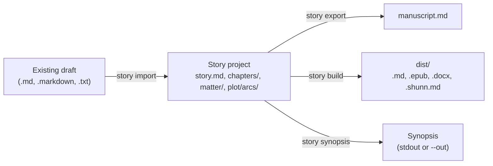

# Import, export, and builds

This page is for writers who want to bring an existing draft into Story Skills or get a finished book out of it. It covers `story import`, front and back matter, `story export`, `story build` (markdown, EPUB, DOCX, and Shunn manuscript format), and `story synopsis`.

All output shown was captured by running the commands against copies of the examples, with absolute paths shortened to `~/stories`.

**On this page**

- [Overview](#overview)
- [Import an existing manuscript](#import-an-existing-manuscript)
- [What goes into a manuscript](#what-goes-into-a-manuscript)
- [Front and back matter](#front-and-back-matter)
- [Export a markdown manuscript](#export-a-markdown-manuscript)
- [Build a book](#build-a-book): [EPUB](#epub), [DOCX](#docx), [Shunn](#shunn-standard-manuscript-format)
- [Build a synopsis](#build-a-synopsis)
- [Output paths and what is disposable](#output-paths-and-what-is-disposable)
- [Common errors](#common-errors)

## Overview

| Command | Reads | Writes | Default output |
|---------|-------|--------|----------------|
| `story import <source>` | A manuscript file or a folder of chapter files | A new story project | `./<title-in-kebab-case>/` |
| `story export [path]` | `story.md`, `chapters/`, `matter/` | One markdown manuscript | `manuscript.md` in the project root |
| `story build [path]` | `story.md`, `chapters/`, `matter/`, the cover image | One book file | `dist/<story-id>.<ext>` |
| `story synopsis [path]` | `story.md` and `plot/arcs/` | A synopsis scaffold | Printed to stdout |



Two skills drive these commands. [`story-maintenance`](../skills/story-maintenance/SKILL.md) handles import, export, and builds; [`submission`](../skills/submission/SKILL.md) builds Shunn manuscripts and rewrites the synopsis scaffold into submission copy. See the [Skills catalogue](skills.md) for both, and the [CLI reference](cli-reference.md) for installing and running the CLI.

## Import an existing manuscript

`story import` turns a draft you already have into a Story Skills project. It creates the same scaffold as `story init`, then splits your prose into numbered chapter files. It never writes character, location, or other bible files; instead it prints names that appear often, so you can decide which ones deserve an entry.

For a new, empty project, use `story init` instead; see [Getting started](getting-started.md).

### A first import

Here is a small draft, `draft.md`:

```markdown
# The Salt Road

The caravan left before the bells.

## Chapter 1: The Well

Ione Marsh counted the water skins twice. Ione Marsh did not trust the guide, and the guide knew it.
When the wind turned, Ione Marsh walked to the edge of the camp and asked Tobin for the map.
Tobin laughed, but Tobin handed it over, and Tobin said nothing about the torn corner.

## Chapter 2 — The Dunes

The dunes moved at night. Ione Marsh heard them shifting under the tent floor.

## Chapter III: The Oasis

At the oasis, Tobin finally told her the truth.
```

Import it with a title:

```shell
story import draft.md --title "The Salt Road"
```

```text
Imported 4 chapters (82 words) into ~/stories/the-salt-road
Entity candidates (review, then create with story add):
- Ione Marsh (4 mentions)
- Tobin (4 mentions)
```

The draft had three chapter headings but produced four chapters: the text before the first chapter heading became a chapter titled `Opening`, with the book title heading (`# The Salt Road`) dropped. The new project has the usual scaffold (`story.md`, `characters/`, `worldbuilding/`, `plot/`, `continuity/`, and so on; see the [Project format reference](project-format.md)) and one file per chapter:

```text
the-salt-road/chapters/
├── _index.md
├── chapter-01.md
├── chapter-02.md
├── chapter-03.md
└── chapter-04.md
```

Each chapter file gets starter frontmatter, a `# Chapter N: Title` heading, and the prose under `## Chapter Text`. This is `chapters/chapter-04.md`:

```markdown
---
title: The Oasis
number: 4
pov: ""
locations: []
characters: []
arcs-advanced: []
status: draft
word-count: 9
---

# Chapter 4: The Oasis

## Chapter Text

At the oasis, Tobin finally told her the truth.
```

Import fills in `word-count` and rebuilds the chapter registry, so you do not need to run `story wordcount` or `story reindex` afterwards. The `## Synopsis` section of `story.md` holds a placeholder, `Imported from draft.md. Replace with a 2-3 sentence synopsis.`, unless you pass `--synopsis`.

### How chapters are split

A chapter heading is a markdown heading of any level (`#` to `######`) whose text starts with the word `Chapter`, in any letter case (`CHAPTER 9 - Loud` counts too):

| Heading in the source | Chapter title |
|-----------------------|---------------|
| `## Chapter 1: The Well` | `The Well` |
| `## Chapter 2 — The Dunes` | `The Dunes` |
| `### Chapter IV: Storm` | `Storm` |
| `# Chapter 7. The Bridge` | `The Bridge` |
| `## Chapter 5` | `Chapter 5` |
| `# Chapter I Am Legend` | `I Am Legend` |
| `# Chapterhouse` | Not a chapter heading |
| `# Chapters` | Not a chapter heading |

The rules behind the table:

- The number after `Chapter` is optional and can be arabic (`12`) or roman (`IV`). A `:`, `.`, `-`, en dash, or em dash may separate it from the title.
- Because the number is optional, a heading such as `## Chapter Notes` also starts a chapter (titled `Notes`).
- The source number is discarded. Chapters are renumbered 1, 2, 3, and so on in the order they appear.
- When a heading has no title after the number, the whole heading text becomes the title.

Import processes each source document in four steps:

1. Leading YAML frontmatter is removed, including frontmatter written by tools such as Pandoc or Obsidian that the CLI's own parser would reject. A leading `---` scene break is kept.
2. If the document has chapter headings, each heading starts a chapter and everything up to the next chapter heading is its prose. Text before the first chapter heading becomes a chapter titled `Opening`, with a leading `# Title` line removed.
3. If the document has no chapter headings, the whole document becomes one chapter. Its title is the first `# ` heading in the document, and any text before that heading is kept in the prose. With no `# ` heading, the title comes from the file name: `02-smoke.txt` becomes `02 Smoke`.
4. Chapters whose prose is empty are dropped.

> [!NOTE]
> Only `Chapter` headings split a document. A `# Prologue` or `## Part Two` heading inside a single manuscript file stays in the prose of the chapter around it. If your draft uses other markers, rename them to `Chapter` headings before importing, or split the draft into one file per chapter and import the folder.

### Importing a folder of chapter files

A single source file is read as plain UTF-8 text, whatever its extension. Pass a directory to import every `.md`, `.markdown`, and `.txt` file directly inside it. Subdirectories and other file types are ignored. Each file is split with the rules above, so a folder of one-chapter files gives one chapter per file.

Files are ordered by the numbers in their names, compared numerically, so `chapter-2` comes before `chapter-10`. Files without a number go last, except files whose names start with `prologue`, `preface`, `foreword`, `introduction`, or `prelude`, which go first. Take a folder `chaps/` with four files:

```text
chaps/
├── chapter-10.md   "# The Door" followed by "The door opened."
├── chapter-2.txt   "Smoke rose over the hill."
├── notes.md        "Some notes here."
└── prologue.md     "Before it all."
```

```shell
story import chaps --title "Door And Smoke" --dir door
```

```text
Imported 4 chapters (14 words) into ~/stories/door
```

| File written | Source | Title |
|--------------|--------|-------|
| `chapter-01.md` | `prologue.md` | `Prologue` |
| `chapter-02.md` | `chapter-2.txt` | `Chapter 2` (from the file name) |
| `chapter-03.md` | `chapter-10.md` | `The Door` (from its `# The Door` heading) |
| `chapter-04.md` | `notes.md` | `Notes` |

Remove stray files such as notes from the folder before importing, or delete the chapter files they produce afterwards.

### Entity candidates

After importing, the CLI lists names that appear at least three times in the prose, most frequent first, up to 25 of them. It counts runs of capitalised words (`Mara Quill`, `The Long Pier` counted as `Long Pier`) and single capitalised words that follow a lowercase word mid-sentence, and it skips common words such as `The`, `He`, and `She`.

The list is a prompt for you, not a set of facts. Nothing is created from it. Review it, then create the entries that matter with `story add`:

```shell
story add character "Ione Marsh" --role protagonist
story add character "Tobin" --role supporting
```

The [`story-maintenance`](../skills/story-maintenance/SKILL.md) skill follows an import by creating character and location files from the candidates. [Writing workflows](writing-workflows.md) covers building out the bible, and [`discovery-drafting`](../skills/discovery-drafting/SKILL.md) uses the same extract-then-approve loop after each drafted chapter.

### Import options

`--title` is required. Import takes the same scaffold options as `story init`, except the series options.

| Option | Effect |
|--------|--------|
| `--title <name>` | Story title. Required. The project folder and story id are the title in kebab case. |
| `--dir <path>` | Target directory, relative to the current directory. Defaults to the kebab-case title. |
| `--genre <name>`, `--sub-genre <name>`, `--setting-era <name>` | Written to `story.md`. |
| `--theme <name>`, `--themes <a,b>` | Themes for `story.md`. `--theme` is repeatable. |
| `--pov <style>`, `--tense <tense>` | Written to `story.md`. |
| `--synopsis <text>` | Replaces the placeholder synopsis in `story.md`. |
| `--force` | Import into a directory that already exists. See below. |

Import uses `--dir`, not `--path`. Passing `--path` is an error:

```text
import uses --dir for the target directory. --path is the project root for other commands.
```

### Re-importing with `--force`

Without `--force`, import refuses a target directory that already exists:

```text
~/stories/the-salt-road already exists. Use --force to add missing starter files; existing files are never overwritten.
```

With `--force`, import adds any missing starter files and leaves other existing files alone, with one exception: it **deletes every `chapter-NN.md` file in `chapters/`** before writing the imported chapters.

> [!WARNING]
> Chapter frontmatter you filled in (POV, locations, characters, status) is lost with the old chapter files. Scene files, bible entries, and `matter/` pages are kept, but scenes may now point at chapters with different content. Commit or back up the project before a forced import. The `story-maintenance` skill asks you before it runs one.

### Import limits and safety

- Each source file can be at most 5 MiB, and a source folder can contain at most 500 importable files.
- A source that is a symlink is refused. Inside a source folder, a symlink to a document is refused and any other symlink is skipped.
- Import never follows a symlinked target directory.

### After importing

An imported project validates, but it has no bible yet. `story validate` warns that each chapter has no machine-readable scene records:

```text
Project is valid: 0 errors, 4 warnings, 0 dismissed
warning: chapters/chapter-01.md has no machine-readable scene records
warning: chapters/chapter-02.md has no machine-readable scene records
warning: chapters/chapter-03.md has no machine-readable scene records
warning: chapters/chapter-04.md has no machine-readable scene records
```

A typical next pass:

1. Replace the synopsis placeholder in `story.md` and fill in its frontmatter.
2. Create characters and locations from the candidates with `story add`, then fill each chapter's `pov`, `characters`, and `locations`.
3. Add arcs, scenes, and continuity entries as you reverse-outline the draft.
4. Run `story links .` and `story validate .` after each batch of changes.

## What goes into a manuscript

Export and every build format assemble the book from the same parts, in this order:

1. The title from `story.md`.
2. Front matter pages from `matter/` with `placement: front`, by `order`.
3. Chapters from `chapters/`, by their `number` frontmatter (or the number in the file name when `number` is missing).
4. Back matter pages with `placement: back`, by `order`.

Only chapter prose goes in. Scene files, outlines, notes, and the bible do not. The CLI finds a chapter's prose this way:

- If the chapter has a `## Chapter Text` heading, the prose is everything after it.
- Otherwise, if it has a `## Outline` section, the prose is everything after the first `---` line following the outline. With no `---`, it is everything after `## Outline`.
- Otherwise, the prose is the whole body with a leading `# ` heading removed.

`story wordcount` uses the same rule, so the manuscript contains exactly the words that were counted. Keep notes and TODOs above `## Chapter Text`, or they end up in the book. The [reconcile loop](../skills/discovery-drafting/references/reconcile-loop.md) puts its post-hoc chapter notes there for this reason.

Each chapter gets the heading `Chapter N: Title`, built from its `number` and `title` frontmatter. Two chapters with the same `number` stop every export and build:

```text
Duplicate chapter number 3: refusing to build with colliding EPUB ids
```

A project with no chapters cannot be exported or built (`No chapters found to export`).

> [!IMPORTANT]
> Export and build do not validate the project first, and a chapter file whose frontmatter cannot be parsed is silently left out. Run `story validate .` before you build a copy to send anyone.

## Front and back matter

Front and back matter are pages outside the chapters: a dedication, an epigraph, a copyright page, acknowledgments, an author's note, an about-the-author page, or an also-by list. Each page is a markdown file in `matter/`, indexed by `matter/_index.md`.

Create one with `story add matter`:

```shell
story add matter "Dedication"
story add matter "Acknowledgments" --placement back
```

```text
Created matter dedication: ~/stories/the-salt-road/matter/dedication.md
Created matter acknowledgments: ~/stories/the-salt-road/matter/acknowledgments.md
```

The new file is a scaffold with a heading and no text:

```markdown
---
title: Dedication
placement: front
order: 1
heading: true
---

# Dedication

```

| Field | Required | Values | Meaning |
|-------|----------|--------|---------|
| `title` | Yes | Text | The page title, used as its heading and in the EPUB table of contents. |
| `placement` | Yes | `front` or `back` | Before or after the chapters. `story add matter` defaults to `front`; `--placement` sets it. |
| `order` | No | Integer, 0 or more | Position within its placement. `story add matter` uses one more than the highest `order` already in that placement; `--order` sets it. Ties sort by file name. |
| `heading` | No | `true` or `false` | Whether the page shows its title as a heading. Defaults to `true`. Set `false` for a dedication or epigraph. |

Matter file names must be kebab-case, because they become EPUB file names. A build stops on a name such as `matter/About_Me.md` with `matter/About_Me.md: matter file names must be kebab-case to build`.

The page text is found with the same rule as chapter prose. For a normal matter page, that is the file body with its leading `# ` heading removed, so the heading in the file is for you and the `heading` field decides what readers see. A page with no text is left out of every export and build, and `story validate` warns about it:

```text
warning: matter/acknowledgments.md has no text and is left out of export and build
```

The [`the-last-ember`](../examples/the-last-ember/matter/epigraph.md) example has an epigraph with `heading: false`.

Write matter text yourself. The `story-maintenance` skill will not invent acknowledgments, biographical facts, or copyright details; it asks you for them.

## Export a markdown manuscript

`story export` writes the whole book as one markdown file. With a dedication (`heading: false`) and acknowledgments (`heading: true`) filled in on the imported project from earlier:

```shell
story export . --out dist/manuscript.md
```

```text
Exported 4 chapters to ~/stories/the-salt-road/dist/manuscript.md
```

```markdown
# The Salt Road

<!-- Generated by story export. -->

For everyone who crossed the salt.

# Chapter 1: Opening

The caravan left before the bells.

# Chapter 2: The Well

Ione Marsh counted the water skins twice. Ione Marsh did not trust the guide, and the guide knew it.
When the wind turned, Ione Marsh walked to the edge of the camp and asked Tobin for the map.
Tobin laughed, but Tobin handed it over, and Tobin said nothing about the torn corner.

# Chapter 3: The Dunes

The dunes moved at night. Ione Marsh heard them shifting under the tent floor.

# Chapter 4: The Oasis

At the oasis, Tobin finally told her the truth.

# Acknowledgments

Thanks to the *first readers*.
```

The prose is copied as written, markdown included. Every heading is level 1, so the file converts cleanly with tools such as Pandoc.

| Option | Effect |
|--------|--------|
| `[path]` or `--path <path>` | Project root. Defaults to the current directory. |
| `--out <file>` | Output file. Defaults to `manuscript.md` in the project root. See [Output paths](#output-paths-and-what-is-disposable). |

Without `--out`, the manuscript lands in the project root, and `story validate` then warns about it:

```text
warning: manuscript.md is not part of the story project model and is ignored
```

The warning is harmless, and writing to `dist/` avoids it. `story build` with the default `markdown` format produces the same file in `dist/`, with the comment `Generated by story build.` instead.

## Build a book

`story build` writes one book file into `dist/`. Pick the format with `--format`:

| `--format` | Output | Default file | Includes matter |
|------------|--------|--------------|-----------------|
| `markdown` (default) or `md` | Markdown manuscript, as `story export` | `dist/<story-id>.md` | Yes |
| `epub` | EPUB 3 ebook | `dist/<story-id>.epub` | Yes |
| `docx` | Word document | `dist/<story-id>.docx` | Yes |
| `docx` with `--shunn` | Word document in Shunn manuscript format | `dist/<story-id>.docx` | No |
| `shunn` | Plain-text Shunn manuscript | `dist/<story-id>.shunn.md` | No |

The story id is the kebab-case title from `story.md`. Build every format of the example *The Last Ember* like this:

```shell
story build .
story build . --format epub
story build . --format docx
story build . --format shunn
```

```text
Built 1 chapters as markdown to ~/stories/the-last-ember/dist/the-last-ember.md
Built 1 chapters as epub to ~/stories/the-last-ember/dist/the-last-ember.epub
Built 1 chapters as docx to ~/stories/the-last-ember/dist/the-last-ember.docx
Built 1 chapters as shunn to ~/stories/the-last-ember/dist/the-last-ember.shunn.md
```

| Option | Effect |
|--------|--------|
| `[path]` or `--path <path>` | Project root. Defaults to the current directory. |
| `--format <name>` | `markdown` (or `md`), `epub`, `docx`, or `shunn`. Case-insensitive. Defaults to `markdown`. |
| `--shunn` | With `--format docx`, apply Shunn formatting. Ignored with every other format. |
| `--out <file>` | Output file instead of the default in `dist/`. |

Any other format is an error:

```text
Unsupported build format: pdf. Supported formats: markdown, epub, docx, shunn
```

For a PDF, open the DOCX in a word processor and export it, or convert the markdown build with a tool such as Pandoc.

`--format docx` and `--format docx --shunn` write to the same default file, so the second build replaces the first. Pass `--out` to keep both.

### EPUB

The EPUB build is an EPUB 3 package with one XHTML document per matter page and per chapter, and a navigation document that lists them in reading order. Two optional `story.md` fields feed it:

| Field | Effect |
|-------|--------|
| `author` | Written as the book's `dc:creator`. |
| `cover` | Path to a cover image inside the project, such as `art/cover.jpg`. The image is embedded as the EPUB cover and shown on a cover page before the front matter. |

```yaml
author: Ada Writer
cover: art/cover.png
```

The cover must be a `.gif`, `.jpeg`, `.jpg`, `.png`, or `.webp` file inside the project. `story validate` checks the path, and an EPUB build stops if it is wrong:

```text
story.md cover art/cover.png does not exist
```

Other formats ignore `cover`, so a DOCX build succeeds even with a broken cover path. With the cover and author set, *The Last Ember* builds to these entries:

```text
mimetype
META-INF/container.xml
OEBPS/content.opf
OEBPS/nav.xhtml
OEBPS/images/cover.png
OEBPS/cover.xhtml
OEBPS/front-epigraph.xhtml
OEBPS/chapter-01.xhtml
```

Chapter documents are named `chapter-NN.xhtml`, and matter documents `front-<id>.xhtml` or `back-<id>.xhtml`. A `.jpeg` cover is stored as `images/cover.jpg`. The package identifier is the story id, and the language is always `en`.

### DOCX

The DOCX build is a Word document with:

- the book title in a centred `Title` style,
- each chapter, and each matter page with `heading: true`, under a `Heading 1` style,
- one Word paragraph per prose paragraph, with bold and italic carried over.

The `author` field is not used. For page layout, fonts, and headers, open the file in a word processor and apply your own styles.

### Shunn standard manuscript format

Shunn manuscript format is the plain layout that many agents, publishers, and short-fiction markets ask for. There are two Shunn builds:

```shell
story build . --format docx --shunn   # Word document
story build . --format shunn          # plain text in a .shunn.md file
```

Both read two `story.md` fields for the title page:

| Field | Type | Used for |
|-------|------|----------|
| `author` | Text | The byline under `by`. Left out when missing. |
| `contact` | List of text lines (a single string also works) | Your name, address, email, and so on, one line each. |

```yaml
author: Ada Writer
contact:
  - Ada Writer
  - 12 Harbour Street, Portsmouth
  - ada@example.com
```

The title page lists the title, `by`, the author, `Approximately N words`, and the contact lines. `N` is the exact word count of chapter prose, as `story wordcount` reports it; round it yourself if a market wants a rounded figure. Each chapter starts on a new page, and front and back matter are left out, as submissions expect.

The start of *The Last Ember* in `--format shunn`, with those fields set:

```text
The Last Ember
by
Ada Writer

Approximately 993 words

Ada Writer
12 Harbour Street, Portsmouth
ada@example.com

# Chapter 1: The Ember Wakes

The grove was quieter than it should have been.
```

In the `.shunn.md` file, a form-feed character (`\f`) on its own line before each chapter heading marks the page break, and each prose paragraph is joined onto one line with a blank line after it. Markdown emphasis such as `*italic*` is left as written.

The DOCX version uses Courier New at 12 point and double line spacing throughout, centres the title page, starts each chapter with a page break and a bold chapter heading, and turns `**bold**` and `*italic*` into real bold and italic. It does not add a running header, page numbers, or custom margins. Add those in a word processor if a market requires them, and check each market's own guidelines.

The [`submission`](../skills/submission/SKILL.md) skill runs these builds as part of preparing a submission package.

### How prose is converted for EPUB, DOCX, and Shunn

The markdown export copies prose as written. The EPUB, DOCX, and Shunn builds convert it to paragraphs:

| In the chapter prose | In EPUB, DOCX, and Shunn output |
|----------------------|---------------------------------|
| Blank line | Paragraph break. Line breaks inside a paragraph become spaces. |
| `**bold**` or `__bold__` | Bold (the `.shunn.md` build keeps the markup) |
| `*italic*` or `_italic_` | Italic (the `.shunn.md` build keeps the markup). Underscores inside a word, as in `snake_case`, stay literal. |
| Three or more `-`, `*`, or `_` on a line of their own, optionally spaced (`---`, `***`, `* * *`) | Scene break, written as `* * *` |
| `#` heading markers | Removed; the heading text becomes an ordinary paragraph |
| `>` blockquote markers | Removed, so a quoted epigraph or letter reads as plain text |

Links, images, lists, and other markdown are not converted and appear as their literal text. Keep book prose to paragraphs, emphasis, and scene breaks.

### Reproducible builds

Builds are deterministic: the same sources produce byte-identical files. EPUB and DOCX packages use fixed ZIP timestamps. The EPUB `dcterms:modified` date comes from the `SOURCE_DATE_EPOCH` environment variable (seconds since the Unix epoch) when it is set, and is `2000-01-01T00:00:00Z` otherwise:

```shell
SOURCE_DATE_EPOCH=1700000000 story build . --format epub
```

That build records `2023-11-14T22:13:20Z` as the modified date. Set `SOURCE_DATE_EPOCH` when a retailer or reader app needs a real publication timestamp.

## Build a synopsis

`story synopsis` assembles a synopsis scaffold from the project's own files. It invents nothing, so it is only as good as your arc files.

```shell
story synopsis .
```

On *The Last Ember*:

```markdown
# Synopsis: The Last Ember

Premise: In a world where magic flows from living embers — fragments of a dying god's heart — Sera Voss returns to the Ashen Citadel to reclaim her birthright from Lord Maren, the usurper who murdered her parents and seized control of the Northern Reach.

## Sera's Reclamation

Sera and Kael have survived twelve years in the Whispering Vale.  The embers are fading — even in the Vale, the wild motes grow dimmer each season.

Sera gathers information, allies, and ember power.  She discovers the ember well beneath the citadel isn't just sealed — it's being drained.

Because Sera infiltrates the citadel through the Whisper Gate. Sera chooses to unseal the ember well and release its power back into the land rather than claim it.
```

The scaffold is built from:

1. **Premise**: the first sentence of the `## Synopsis` section in `story.md`, or `No premise recorded.` when that section is empty.
2. **One section per arc** in `plot/arcs/`, in file-name order, headed with the arc's `name`:
   - the first two sentences of its `## Setup` section,
   - the first two sentences of its `## Rising Action` section,
   - a line starting `Because`, followed by the first sentence of `## Climax` and the first sentence of `## Resolution`.

Sections an arc does not have are skipped; an arc with none of them gets only its heading. An arc without a `name` is headed with its file name in title case.

Sentences end at `.`, `?`, or `!` followed by a space. A period after `Dr`, `Mr`, `Mrs`, `Ms`, `St`, or a single capital letter (an initial) does not end a sentence, and a final sentence with no closing punctuation gets a period. When two sentences from one section are joined, the second keeps its leading space, which is why the sample above shows two spaces between them.

| Option | Effect |
|--------|--------|
| `[path]` or `--path <path>` | Project root. Defaults to the current directory. |
| `--pages <n>` | `1` (the default) for a 500-word budget, or `3` for 1,500 words. Any other value is an error. |
| `--out <file>` | Write the synopsis to this file instead of printing it. |

When the scaffold runs over budget, it is cut back in steps until it fits:

1. Every arc's rising action is dropped.
2. Every arc's resolution is dropped.
3. The text is truncated at the word limit and ends with `…`.

A 3-page synopsis therefore keeps detail that a 1-page synopsis drops.

```shell
story synopsis . --pages 3 --out submission/synopsis-3-page.md
```

```text
Wrote synopsis to ~/stories/the-last-ember/submission/synopsis-3-page.md
```

The result is a draft, not submission copy. Literary agents expect present tense, the main characters' names in capitals on first use, and the ending, all in polished prose. The [`submission`](../skills/submission/SKILL.md) skill generates both lengths into `submission/`, then rewrites them. If the scaffold is thin, fill the arcs' Setup, Rising Action, Climax, and Resolution sections with the [`plot-structure`](../skills/plot-structure/SKILL.md) skill and run `story synopsis` again. See [Writing workflows](writing-workflows.md).

## Output paths and what is disposable

`--out` works the same way for `export`, `build`, and `synopsis`:

- A relative `--out` path is resolved against the **project root**, not your current directory. `story export ~/stories/the-salt-road --out dist/book.md` writes `~/stories/the-salt-road/dist/book.md`.
- A relative path must stay inside the project. `--out ../outside.md` is refused:

  ```text
  Refusing to access path outside project root: ~/stories/outside.md
  ```

- An absolute path can point anywhere, such as `--out ~/Desktop/the-salt-road.epub`.
- Missing parent folders are created. For a relative path, writing through a symlinked folder is refused. Writing onto a symlinked file is always refused.
- An existing output file is overwritten without asking.

Treat everything in `dist/` as disposable. It is regenerated from the markdown on every build, so never edit a built file to fix the book: change the chapter or matter file and build again. `story validate` and `story links` do not read `dist/`, and `story rename` and `story remove` never rewrite references inside it. The CLI does not create a `.gitignore`, so add `dist/` to your story repository's `.gitignore` unless you want to commit a particular build.

`submission/` is different. The `submission` skill keeps hand-edited package files there, such as the rewritten synopsis and the query letter. The CLI does not validate `submission/`, and builds never include it.

## Common errors

| Message | Cause | Fix |
|---------|-------|-----|
| `A story title is required` | `story import` without `--title` | Add `--title "Your Title"`. |
| `Cannot derive a story id from title ...` | The title has no ASCII letters or digits | Use a title that contains some. |
| `Unsupported tense "<tense>": ...` | `--tense` is not `past`, `present`, `future`, or `mixed` | Use one of those values. |
| `Refusing to import symlinked source: <path>` | The source, or a document inside a source folder, is a symlink | Import the real file or folder. |
| `Import source not found: <path>` | The source path is wrong | Check the path; it is relative to the current directory. |
| `No markdown or text files found in <dir>` | The folder has no `.md`, `.markdown`, or `.txt` files at its top level | Point at the folder that contains the chapter files. |
| `No chapter content found in import source` | Every document was empty after frontmatter was removed | Check the source files. |
| `<dir> already exists. Use --force ...` | The import target exists | Choose another `--dir`, or back up and use `--force`. |
| `<path> is not a story project: missing story.md` | The project path is wrong | Pass the folder that contains `story.md`. |
| `No chapters found to export` | The project has no chapter files | Add chapters first. |
| `Duplicate chapter number N: ...` | Two chapters share a `number` | Renumber one of them, then run `story reindex .`. |
| `... matter file names must be kebab-case to build` | A `matter/` file name is not kebab-case | Rename the file to a kebab-case name, such as `about-me.md`, then run `story reindex .`. |
| `story.md cover <path> ...` | The cover path is missing, outside the project, or not a supported image | Fix `cover` in `story.md`, or remove it. |
| `Unsupported build format: <name>. ...` | An unknown `--format` | Use `markdown`, `epub`, `docx`, or `shunn`. |
| `Unsupported synopsis length: <n>. Supported pages: 1, 3` | An unsupported `--pages` value | Use `1` or `3`. |
| `Refusing to access path outside project root: <path>` | A relative `--out` that leaves the project | Use a path inside the project, or an absolute path. |
| `Refusing to write through symlink: <path>` | The `--out` file is a symlink | Delete the symlink or choose another file. |

## See also

- [Project format reference](project-format.md) for every `story.md`, chapter, and matter field.
- [CLI reference](cli-reference.md) for every command and option.
- [Writing workflows](writing-workflows.md) for drafting, revising, and preparing a submission.
- [Automation and CI](automation.md) for running checks in GitHub Actions.
- [Documentation index](README.md): every page, by audience and task
