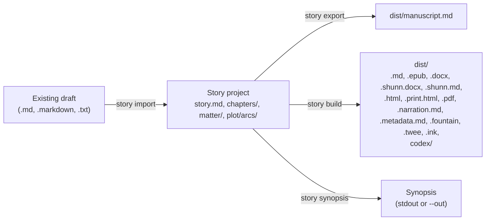

# Import, export, and builds

This page is for writers who want to bring an existing draft into Story Skills or get a finished book out of it. It covers `story import`, front and back matter, the publishing fields in `story.md`, `story export`, `story build` (markdown, EPUB, DOCX, Shunn manuscript format, an HTML review copy, a print interior, an audiobook narration script, a retailer metadata sheet, a Fountain screenplay skeleton, and a Twine story), and `story synopsis`.

All output shown was captured by running the commands against copies of the examples, with absolute paths shortened to `~/stories`.

**On this page**

- [Overview](#overview)
- [Import an existing manuscript](#import-an-existing-manuscript)
- [What goes into a manuscript](#what-goes-into-a-manuscript)
- [Front and back matter](#front-and-back-matter)
- [Publishing metadata in story.md](#publishing-metadata-in-storymd)
- [Export a markdown manuscript](#export-a-markdown-manuscript)
- [Build a book](#build-a-book): [story authors in collections and anthologies](#story-authors-in-collections-and-anthologies), [EPUB](#epub), [DOCX](#docx), [Shunn](#shunn-standard-manuscript-format), [HTML review copy](#html-review-copy), [print interior](#print-interior), [PDF output](#pdf-output), [narration script](#narration-script), [screenplay skeleton](#screenplay-skeleton-fountain), [retailer metadata sheet](#retailer-metadata-sheet), [Twine story](#twine-story), [ink story](#ink-story)
- [Build a synopsis](#build-a-synopsis)
- [Output paths and what is disposable](#output-paths-and-what-is-disposable)
- [Common errors](#common-errors)

## Overview

| Command | Reads | Writes | Default output |
|---------|-------|--------|----------------|
| `story import <source\|->` | A manuscript file, a folder of chapter files, or a manuscript piped to stdin (`-`) | A new story project | `./<title-in-kebab-case>/` |
| `story export [path]` | `story.md`, `chapters/`, `matter/` | One markdown manuscript | `dist/manuscript.md` |
| `story build [path]` | `story.md`, `chapters/`, `matter/`, the cover image, (for narration) `pronunciation` fields in the bible, and (for fountain) scene, location, and character records | One book file, script, or sheet | `dist/<story-id>.<ext>` |
| `story synopsis [path]` | `story.md` and `plot/arcs/` | A synopsis scaffold | Printed to stdout |


```mermaid
flowchart LR
  draft["Existing draft<br/>(.md, .markdown, .txt)"] -->|story import| project["Story project<br/>story.md, chapters/, matter/, plot/arcs/"]
  project -->|story export| manuscript["dist/manuscript.md"]
  project -->|story build| dist["dist/<br/>.md, .epub, .docx, .shunn.docx, .shunn.md,<br/>.html, .print.html, .pdf, .narration.md, .metadata.md, .fountain, .twee, .ink,<br/>codex/"]
  project -->|story synopsis| synopsis["Synopsis<br/>(stdout or --out)"]
```

Several skills drive these commands:

- [`story-maintenance`](../skills/story-maintenance/SKILL.md) handles import, export, and builds.
- [`submission`](../skills/submission/SKILL.md) builds Shunn manuscripts and rewrites the synopsis scaffold into submission copy.
- [`publishing`](../skills/publishing/SKILL.md) fills the publishing fields in `story.md`, then works through the metadata sheet, the EPUB, and the print interior.
- [`editorial-review`](../skills/editorial-review/SKILL.md) builds DOCX and HTML review copies for editors and beta readers, and tracks permissions for quoted matter.
- [`adaptation`](../skills/adaptation/SKILL.md) builds the narration script for an audiobook, the scene skeleton for a screenplay, and the Twine source for an interactive version.

See the [Skills catalogue](skills.md) for all of them, and the [CLI reference](cli-reference.md) for installing and running the CLI.

## Import an existing manuscript

`story import` turns a draft you already have into a Story Skills project. It creates the same scaffold as `story init`, then splits your prose into numbered chapter files. It never writes character, location, or other bible files; instead it prints names that appear often, so you can decide which ones deserve an entry.

For a new, empty project, use `story init` instead; see [Getting started](getting-started.md).

### A first import

Here is a small draft, `draft.md`:

```markdown
# The Salt Road

The caravan left before the bells.

## Chapter 1: The Well

Ione Marsh counted the water skins twice. Ione Marsh did not trust the guide, and the guide knew it.
When the wind turned, Ione Marsh walked to the edge of the camp and asked Tobin for the map.
Tobin laughed, but Tobin handed it over, and Tobin said nothing about the torn corner.

## Chapter 2 — The Dunes

The dunes moved at night. Ione Marsh heard them shifting under the tent floor.

## Chapter III: The Oasis

At the oasis, Tobin finally told her the truth.
```

Import it with a title:

```shell
story import draft.md --title "The Salt Road"
```

```text
Imported 4 chapters (82 words) into ~/stories/the-salt-road
Entity candidates (review, then create with story add):
- Ione Marsh (4 mentions)
- Tobin (4 mentions)
```

The draft had three chapter headings but produced four chapters: the text before the first chapter heading became a chapter titled `Opening`, with the book title heading (`# The Salt Road`) dropped. The new project has the usual scaffold (`story.md`, `characters/`, `worldbuilding/`, `plot/`, `continuity/`, and so on; see the [Project format reference](project-format.md)) and one file per chapter:

```text
the-salt-road/chapters/
├── _index.md
├── chapter-01.md
├── chapter-02.md
├── chapter-03.md
└── chapter-04.md
```

Each chapter file gets starter frontmatter, a `# Chapter N: Title` heading, and the prose under `## Chapter Text`. This is `chapters/chapter-04.md`:

```markdown
---
title: The Oasis
number: 4
pov: ""
locations: []
characters: []
arcs-advanced: []
status: draft
word-count: 9
---

# Chapter 4: The Oasis

## Chapter Text

At the oasis, Tobin finally told her the truth.
```

Import fills in `word-count` and rebuilds the chapter registry, so you do not need to run `story wordcount` or `story reindex` afterwards. The `## Synopsis` section of `story.md` holds a placeholder, `Imported from draft.md. Replace with a 2-3 sentence synopsis.`, unless you pass `--synopsis`.

### How chapters are split

A chapter heading is a markdown heading of any level (`#` to `######`, or a one-line setext heading underlined with `===` or `---` after a blank line) whose text starts with the word `Chapter`, in any letter case (`CHAPTER 9 - Loud` counts too), or is a `Prologue`, `Epilogue`, `Interlude`, or `Afterword` heading:

| Heading in the source | Chapter title |
|-----------------------|---------------|
| `## Chapter 1: The Well` | `The Well` |
| `## Chapter 2 — The Dunes` | `The Dunes` |
| `### Chapter IV: Storm` | `Storm` |
| `## Chapter One: Arrival` | `Arrival` |
| `# Chapter 7. The Bridge` | `The Bridge` |
| `## Chapter 5` | `Chapter N`, its new number |
| `## Chapter 6:` | `Chapter N`, its new number |
| `# Chapter 1: Arrival {#arrival .unnumbered}` | `Arrival` |
| `## Chapter 2: Arrival ##` | `Arrival` |
| `## Chapter 12.5: Half` | `Half` |
| `## Chapter One Hundred` | `Chapter N`, its new number |
| `# Chapter I Am Legend` | `I Am Legend` |
| `# Prologue` | `Prologue` |
| `## Epilogue` | `Epilogue` |
| `# Chapterhouse` | Not a chapter heading |
| `# Chapters` | Not a chapter heading |

The rules behind the table:

- The number after `Chapter` is optional and can be arabic (`12`, or a decimal such as `12.5`), roman (`IV`), or spelled out up to nine hundred and ninety-nine (`One`, `Twenty-One`, `One Hundred and Five`). A `:`, `.`, `-`, en dash, or em dash may separate it from the title.
- A `Prologue`, `Epilogue`, `Interlude`, or `Afterword` heading keeps its whole text as the title.
- Because the number is optional, a heading such as `## Chapter Notes` also starts a chapter (titled `Notes`).
- The source number is discarded. Chapters are renumbered 1, 2, 3, and so on in the order they appear.
- When a `Chapter` heading has no title after the number (`Chapter 6`, `Chapter Six:`), the chapter is titled `Chapter N` with its new number, and its heading is a plain `# Chapter N` rather than `# Chapter N: Chapter N`. Export and build print such a chapter the same way. A bare `Prologue:` is titled `Prologue`.
- A trailing Pandoc attribute block, such as `{#arrival .unnumbered}`, and closing hashes (`## Title ##`) are dropped from the title.
- A heading inside a closed code fence or an HTML comment is not a heading, so a commented-out outline never splits the manuscript.

Import processes each source document in six steps:

1. Leading YAML frontmatter is removed, including frontmatter written by tools such as Pandoc or Obsidian that the CLI's own parser would reject. A leading `---` scene break is kept: a `---` block that starts with a blank line, or holds a line that is not YAML (a key with spaces, such as `She said: go now.`), is prose.
2. The text is cleaned for its source type. In a markdown source (`.md` or `.markdown`), Pandoc's dash spellings become real dashes: `---` becomes an em dash (`—`) and `--` an en dash (`–`). Text inside inline code spans, closed `` ``` `` code fences, and HTML comments is left alone, and so is everything after a `<!--` that never closes. Link targets (`](...)`), autolinks (`<https://...>`), bare URLs such as `https://example.com/a--b` or `www.example.com/a--b`, email and `mailto:` addresses, and HTML tags (`<span class="x--y">`) keep their hyphens, and so do a line made only of dashes and spaces (a `---` or `- - -` scene break), a table separator row such as `|---|---|`, and an indented code line (four spaces or a tab). An indented line that continues a list item is prose, so its dashes are converted. In a plain-text source (`.txt`), leading tabs and spaces are removed from every line, so an indented paragraph from Scrivener or a word processor is not read as a markdown code block.
3. If the document has chapter headings, each heading starts a chapter and everything up to the next chapter heading is its prose. Text before the first chapter heading becomes a chapter titled `Opening`, with a leading `# Title` line (or a setext title underlined with `===`) removed. If that text is only HTML comments, they go to the top of the first chapter instead, and the `<!-- Generated by story export. -->` marker is dropped, so an exported manuscript re-imports with the same chapters. A part heading (`# Part Two: Sea`) directly before a chapter heading opens that chapter's prose.
4. If the document has no markdown chapter headings, as in a manuscript saved as plain text, it is split on chapter lines instead. A chapter line stands alone between blank lines, is at most 80 characters, and is either `Chapter` with a number (`Chapter 3`, `CHAPTER ONE: Arrival`) or one of `Prologue`, `Epilogue`, `Interlude`, and `Afterword`. The number, or the `Prologue`-style word, must end the line or be followed by a separator (`:`, `.`, `-`, `–`, `—`), with or without a title after it, so `Chapter 12 was the worst.`, `Chapter Nine Lives of a Cat`, and `Prologue of doom` do not split, while `Epilogue: After`, a bare `Prologue:`, and `Chapter 3:` (titled `Chapter N` with its new number) do. A single short line before the first chapter line is taken as the book title and dropped; longer text there becomes an `Opening` chapter.
5. If the document has neither, the whole document becomes one chapter. Its title is the first `# ` heading in the document (a lone `#` is a scene break, not a heading), and any text before that heading is kept in the prose. With no `# ` heading, the title comes from the file name: `02-smoke.txt` becomes `02 Smoke`.
6. Chapters whose prose is empty are dropped.

When a numbered `Chapter` line (one that would match the step 4 pattern) did not split the document, import prints a warning with the count and the first such line, for example `warning: mix.md: 3 plain-text chapter lines were not used to split chapters (first "Chapter 1" at line 5): the file has markdown chapter headings, ...`. That happens when a file mixes a markdown chapter heading (`# Prologue`) with plain `Chapter N` lines, since markdown headings take precedence for the whole file, or when a `Chapter N` line is followed directly by text with no blank line. Make the lines markdown headings, or add the blank lines, and import again with `--force`.

> [!NOTE]
> Only `Chapter`, `Prologue`, `Epilogue`, `Interlude`, and `Afterword` headings split a document. A `## Part Two` heading inside a single manuscript file stays in the prose: at the top of the chapter it comes just before, or otherwise in the chapter around it. If your draft uses other markers, rename them to `Chapter` headings before importing, or split the draft into one file per chapter and import the folder.

### Importing a folder of chapter files

A single source file is read as UTF-8 text, whatever its extension, and CRLF or bare CR (classic Mac OS) line endings are read as line breaks. A leading byte-order mark is dropped. A zip file (such as a `.docx`; export it to markdown first), a binary file, or text in another encoding such as Windows-1252 is refused rather than imported with replacement characters. Pass a directory to import every `.md`, `.markdown`, and `.txt` file directly inside it. Subdirectories, other file types, hidden files (`.name`), macOS AppleDouble files (`._name`), and Word lock files (`~$name`) are ignored.

A chapter file in Story Skills' own layout, such as one copied from another project, imports as one chapter: its `title` frontmatter is the title, `numbered: false` is kept, and its prose is the text under `## Chapter Text`, without the outline. Each file is split with the rules above, so a folder of one-chapter files gives one chapter per file.

Files are ordered by the numbers in their names, compared numerically, so `chapter-2` comes before `chapter-10`. Files without a number go last, except files whose names start with `prologue`, `preface`, `foreword`, `introduction`, or `prelude`, which go first. Take a folder `chaps/` with four files:

```text
chaps/
├── chapter-10.md   "# The Door" followed by "The door opened."
├── chapter-2.txt   "Smoke rose over the hill."
├── notes.md        "Some notes here."
└── prologue.md     "Before it all."
```

```shell
story import chaps --title "Door And Smoke" --dir door
```

```text
Imported 4 chapters (14 words) into ~/stories/door
```

| File written | Source | Title |
|--------------|--------|-------|
| `chapter-01.md` | `prologue.md` | `Prologue` |
| `chapter-02.md` | `chapter-2.txt` | `Chapter 2` (from the file name) |
| `chapter-03.md` | `chapter-10.md` | `The Door` (from its `# The Door` heading) |
| `chapter-04.md` | `notes.md` | `Notes` |

Remove stray files such as notes from the folder before importing, or delete the chapter files they produce afterwards.

### Importing from stdin

With `-` as the source, `import` reads the manuscript from standard input, so a draft another tool prints never needs a file of its own:

```shell
pandoc draft.docx -t markdown | story import - --title "The Salt Road"
```

Piped text is read as markdown, as a `.md` file is, and split the same way. A piped document with no chapter headings becomes one chapter titled `Chapter 1`, and the synopsis placeholder says `Imported from stdin`. Empty input, a terminal, and text that is not UTF-8 are refused; see [Reading from stdin](cli-reference.md#reading-from-stdin).

### Entity candidates

After importing, the CLI lists names that appear at least three times in the prose, most frequent first, up to 25 of them. It counts runs of capitalised words (`Mara Quill`, `The Long Pier` counted as `Long Pier`) and single capitalised words that follow a lowercase word mid-sentence, in any script (`Élodie`), with straight or curly apostrophes and hyphens (`O’Brien`, `King’s Road`, `Anna-Maria`). A word with a capital inside it (`McAllister`, `O’Brien`) counts at the start of a sentence too, and a possessive `’s` counts toward the name. It skips common words such as `The`, `He`, and `She`, and days and months.

The list is a prompt for you, not a set of facts. Nothing is created from it. Review it, then create the entries that matter with `story add`:

```shell
story add character "Ione Marsh" --role protagonist
story add character "Tobin" --role supporting
```

The [`story-maintenance`](../skills/story-maintenance/SKILL.md) skill follows an import by creating character and location files from the candidates. [Writing workflows](writing-workflows.md) covers building out the bible, and [`discovery-drafting`](../skills/discovery-drafting/SKILL.md) uses the same extract-then-approve loop after each drafted chapter.

### Import options

`--title` is required. Import takes the same scaffold options as `story init`, except the series options and `--form`. Passing `--form` or a series option to import is an error (`--form does not apply to story import`); set `form` (and `target-words`, if you want one) in `story.md` after importing.

| Option | Effect |
|--------|--------|
| `--title <name>` | Story title. Required. The project folder and story id are the title in kebab case. |
| `--dir <path>` | Target directory, relative to the current directory. Defaults to the kebab-case title. |
| `--genre <name>`, `--sub-genre <name>`, `--setting-era <name>` | Written to `story.md`. |
| `--theme <name>`, `--themes <a,b>` | Themes for `story.md`. `--theme` is repeatable. |
| `--pov <style>`, `--tense <tense>` | Written to `story.md`. |
| `--synopsis <text>` | Replaces the placeholder synopsis in `story.md`. |
| `--force` | Import into a directory that already exists. See below. |

Import uses `--dir`, not `--path`. Passing `--path` is an error:

```text
import uses --dir for the target directory. --path is the project root for other commands.
```

### Re-importing with `--force`

Without `--force`, import refuses a target directory that already exists:

```text
~/stories/the-salt-road already exists. Use --force to import into it: --force deletes every chapters/chapter-NN.md and writes the imported chapters in their place, adds missing starter files, keeps story.md and the other files, and reindexes. Commit or back up the project first.
```

With `--force`, import adds any missing starter files and leaves other existing files alone, with one exception: it **deletes every `chapter-NN.md` file in `chapters/`** before writing the imported chapters.

Before it changes anything, import checks that the project's other files parse, as `story reindex` would; if one does not, it names the file and leaves the project as it was. It holds the [project lock](cli-reference.md#where-commands-write) from reading the project's language, count unit, and style sheet to the final reindex, so while another story command is changing the project it refuses with exit code 4 and changes nothing. An existing `story.md` is kept, so a different `--title` or another `story.md` option is not applied, and import says so in a warning. It also prints a note to run `story links`, since scenes, bible entries, and continuity files may name chapters that are gone or changed.

> [!WARNING]
> Chapter frontmatter you filled in (POV, locations, characters, status) is lost with the old chapter files. Scene files, bible entries, and `matter/` pages are kept, but scenes may now point at chapters with different content. Commit or back up the project before a forced import. The `story-maintenance` skill asks you before it runs one.

### Import limits and safety

- Each source file, and a manuscript piped to stdin, can be at most 5 MiB, and a source folder can contain at most 500 importable files.
- No chapter file may come out over 5 MiB, the most any story command reads. A one-chapter manuscript near the limit is refused before anything is written: `Cannot import: chapter-01.md would be <n> bytes, over the 5242880 byte limit story reads. Split the manuscript with chapter headings first`.
- A source that is a symlink is refused. Inside a source folder, a symlink to a document is refused and any other symlink is skipped.
- Import never follows a symlinked target directory.
- A source folder that has a `story.md` is refused as a story project, so a project's bible files are never imported as chapters.

### After importing

An imported project validates, but it has no bible yet. `story validate` warns that each chapter has no machine-readable scene records:

```text
Project is valid: 0 errors, 4 warnings, 0 dismissed
warning: chapters/chapter-01.md has no machine-readable scene records [no-scene-records]
warning: chapters/chapter-02.md has no machine-readable scene records [no-scene-records]
warning: chapters/chapter-03.md has no machine-readable scene records [no-scene-records]
warning: chapters/chapter-04.md has no machine-readable scene records [no-scene-records]
```

A typical next pass:

1. Replace the synopsis placeholder in `story.md` and fill in its frontmatter.
2. Create characters and locations from the candidates with `story add`, then fill each chapter's `pov`, `characters`, and `locations`.
3. Add arcs, scenes, and continuity entries as you reverse-outline the draft.
4. Run `story reindex .`, `story wordcount . --write`, and `story check .` after each batch of changes.

## What goes into a manuscript

Export and the book formats assemble the book from the same parts, in this order. The Shunn builds leave out every matter page, the narration script leaves out a front-matter copyright page, and the metadata sheet contains no prose at all.

1. The title from `story.md`.
2. A generated copyright page, when `story.md` sets `copyright` and no matter page is already a copyright page. See [Publishing metadata in story.md](#publishing-metadata-in-storymd).
3. Front matter pages from `matter/` with `placement: front`, by `order`.
4. Chapters from `chapters/`, by their `number` frontmatter (or the number in the file name when `number` is missing).
5. Back matter pages with `placement: back`, by `order`.

Only chapter prose goes in. Scene files, outlines, notes, and the bible do not. The CLI finds a chapter's prose this way:

- If the chapter has a `## Chapter Text` heading, the prose is everything after it.
- Otherwise, if it has a `## Outline` section, the prose is everything after the `---` line directly below the outline's list. A `---` after prose is a scene break, not the divider. With no divider, it is everything after `## Outline`.
- Otherwise, the prose is the whole body with a leading `# ` heading removed.

HTML comments (`<!-- ... -->`) in the prose are left out of the word count and of every build format, so they are a safe place for notes to yourself. Close each one: `story validate` warns about a chapter whose `<!--` never closes, because the text after it then shows in builds. A `<!--` or `-->` inside a closed `` ``` `` code fence or an inline code span (`` `<!-- x -->` ``) is literal text: it neither opens nor closes a comment, and the validate warning ignores it.

`story wordcount` uses the same rule, so the manuscript contains exactly the words that were counted. Keep notes and TODOs above `## Chapter Text`, or they end up in the book. The [reconcile loop](../skills/discovery-drafting/references/reconcile-loop.md) puts its post-hoc chapter notes there for this reason.

Each chapter gets the heading `Chapter N: Title`, built from its `number` and `title` frontmatter. A chapter with `numbered: false` (a Prologue, Interlude, or Epilogue) is headed by its title alone and takes no number, so the chapters after it keep the author's numbering: chapter files Prologue, Arrival, Departure build as `Prologue`, `Chapter 1: Arrival`, `Chapter 2: Departure`. An unnumbered chapter needs a title. `story import` sets `numbered: false` for Prologue, Epilogue, Interlude, and Afterword headings and for headings Pandoc marks `{.unnumbered}` or `{-}`.

For a book not in English, set `language` in `story.md`: the headings follow the language's convention (`Kapitel 1: Die Glocke`, `第1章　風`), and `labels` changes them (see [Build labels](#build-labels)). Two chapters with the same `number` stop every export and build:

```text
Duplicate chapter number 3: refusing to build with colliding EPUB ids
```

A project with no chapters cannot be exported or built (`No chapters found to export`).

A chapter `number` that is not a positive integer also stops them:

```text
chapters/chapter-03.md: chapter number must be a positive integer to build
```

> [!IMPORTANT]
> Export, build, and synopsis refuse to run while an entity file, registry, or `story.md` fails to parse (`Cannot export: fix this file first`, `Cannot build: ...`, `Cannot build a synopsis: ...`), but they do not run the other checks. Run `story validate .` before you build a copy to send anyone.

## Front and back matter

Front and back matter are pages outside the chapters: a dedication, an epigraph, a copyright page, acknowledgments, an author's note, an about-the-author page, or an also-by list. Each page is a markdown file in `matter/`, indexed by `matter/_index.md`.

Create one with `story add matter`:

```shell
story add matter "Dedication"
story add matter "Acknowledgments" --placement back
```

```text
Created matter dedication: ~/stories/the-salt-road/matter/dedication.md
Created matter acknowledgments: ~/stories/the-salt-road/matter/acknowledgments.md
```

The new file is a scaffold with a heading and no text:

```markdown
---
title: Dedication
placement: front
order: 1
heading: true
---

# Dedication

```

| Field | Required | Values | Meaning |
|-------|----------|--------|---------|
| `title` | Yes | Text | The page title, used as its heading and in the EPUB table of contents. |
| `placement` | Yes | `front` or `back` | Before or after the chapters. `story add matter` defaults to `front`; `--placement` sets it. |
| `order` | No | Integer, 0 or more | Position within its placement. `story add matter` uses one more than the highest `order` already in that placement; `--order` sets it. Ties sort by file name. |
| `heading` | No | `true` or `false` | Whether the page shows its title as a heading. Defaults to `true`. Set `false` for a dedication or epigraph, with `story add matter "Dedication" --heading false` or by editing the scaffolded `heading:` line. |
| `permission` | No | `not-needed`, `pending`, `granted`, or `public-domain` | Whether quoted material on the page, such as an epigraph, lyrics, or a poem, is cleared for publication. |
| `rights-holder` | No | Text | Who granted permission for quoted material. |
| `credit` | No | Text | The credit line the rights holder asked for. |

The three permission fields are for your records; no build prints them. `story validate` checks their values and warns when a page's `permission` is still `pending` while `story.md` has `status: complete`, or is `granted` with no `rights-holder`. Put the credit line in the page text yourself. The [`editorial-review`](../skills/editorial-review/SKILL.md) skill walks through clearing permissions.

A matter page whose id is `copyright`, or whose title contains the word "Copyright" in any letter case, counts as the book's copyright page. The EPUB marks it as a copyright page wherever it sits. When it is front matter, the print interior places it before the contents and the narration script skips it; a back-matter copyright page stays at the end of the print interior and is narrated.

Matter file names must be kebab-case, because they become EPUB file names. A build stops on a name such as `matter/About_Me.md` with `matter/About_Me.md: matter file names must be kebab-case to build`.

The page text is found with the same rule as chapter prose. For a normal matter page, that is the file body with its leading `# ` heading removed, so the heading in the file is for you and the `heading` field decides what readers see. A page with no text is left out of every export and build, and `story validate` warns about it:

```text
warning: matter/acknowledgments.md has no text and is left out of export and build [empty-matter]
```

The [`the-last-ember`](../examples/the-last-ember/matter/epigraph.md) example has an epigraph with `heading: false`.

Write matter text yourself. The `story-maintenance` skill will not invent acknowledgments, biographical facts, or copyright details; it asks you for them.

## Publishing metadata in story.md

`story.md` can hold the details that retailers, distributors, and ebook readers need. Every field is optional. The book formats read them, and `story validate` checks their shape. The [Project format reference](project-format.md) lists every `story.md` field; these are the ones builds use:

| Field | Type | Used by |
|-------|------|---------|
| `author` | Text | The author in the EPUB (`dc:creator`), HTML, print, narration, and metadata builds, and the byline in both Shunn builds. The plain DOCX build does not use it. |
| `authors` | List of text | Replaces `author` for co-authored books in every build, including the Shunn byline. `validate` warns when both are set. |
| `editor` | Text, or a list of text | The editor of a collection or anthology. The EPUB names them as creators with the `edt` role; the HTML, print, codex, and Shunn title pages credit them under the authors as `Edited by` (the `edited-by` label); the print and Shunn running heads use the editor's name when no author is set; the metadata sheet lists them. Each story's own writer goes in its chapter's `author` field: see [Story authors in collections and anthologies](#story-authors-in-collections-and-anthologies). |
| `language` | BCP 47 tag, such as `en`, `en-GB`, or `fr` | EPUB `dc:language` and the `lang` attribute of every EPUB document; the `lang` attribute of the HTML and print builds; the metadata sheet; the language of all generated text (see [Build labels](#build-labels)). Defaults to `en`. A right-to-left language (such as `he`, `ar`, `fa`, or `ur`, or any tag with an Arabic or Hebrew script subtag) also sets `dir="rtl"` on every EPUB, HTML, and print document and `page-progression-direction="rtl"` on the EPUB spine, and the print interior opens from the right: chapters start on left-hand pages and the running heads swap sides. The language's script also picks the fonts and layout of the HTML, print, EPUB, and DOCX builds, and the DOCX build's Word language for any tag but `en`; see [Typesetting other scripts](#typesetting-other-scripts). |
| `isbn` | ISBN-13 or ISBN-10, hyphens and spaces allowed | The EPUB identifier (`urn:isbn:...`) in place of the story id; the generated copyright page; the metadata sheet. `validate` checks the checksum. Quote it, so a leading zero survives. |
| `publisher` | Text | EPUB `dc:publisher`, the generated copyright page, the metadata sheet. |
| `publication-date` | Date, such as `2026-10-01` | EPUB `dc:date`, the metadata sheet. |
| `description` | Text | EPUB `dc:description`, the metadata sheet. |
| `keywords` | List of text | The metadata sheet. `validate` warns above 7. |
| `subjects` | List of BISAC codes, such as `FIC022000` | EPUB `dc:subject`, the metadata sheet. `validate` rejects anything not shaped like a BISAC code. |
| `copyright` | Text, such as `Copyright © 2026 Ada Writer` | EPUB `dc:rights`, the generated copyright page, the metadata sheet. |
| `cover-alt` | Text | The EPUB cover image's alt text, instead of `Cover of <title>` in the book's language; the metadata sheet. |
| `ai-disclosure` | Text | The generated copyright page and the metadata sheet. |
| `labels` | List of `key: text` entries | Replaces any generated text in builds, such as the chapter headings or `All rights reserved.` See [Build labels](#build-labels). |
| `chapter-label` | Text, such as `Teil` | The word in every generated chapter heading, in place of the language's own (`Chapter` in English): `Teil 1: Die Glocke`. A `{n}` in it places the number, as in `第{n}章`. The same as a `chapter` entry in `labels`, which wins. |
| `chapter-numerals` | `western` (the default) or `native` | The numerals chapter headings print their numbers in. `native` uses the language's own: Han numerals in Japanese and Chinese (`第十二章`), the script's digits in Arabic, Persian, Hindi, Thai, and other languages that have them (`الفصل ١٢`). See [Chapter numerals](#chapter-numerals). |
| `contents-label` | Text, such as `Übersicht` | The table of contents heading, in place of the language's own (`Contents` in English). The same as a `contents` entry in `labels`, which wins. |
| `writing-mode` | `horizontal` (the default) or `vertical` | `vertical` sets a Japanese, Chinese, or Korean book in columns, top to bottom and right to left, in the EPUB, HTML, print, and DOCX builds, with pages that turn right to left. `validate` errors when the `language` is not set vertically; see [Typesetting other scripts](#typesetting-other-scripts). |
| `form` | `flash`, `short-story`, `novelette`, `novella`, `novel`, `serial`, `picture-book`, or `chapter-book` | The metadata sheet, and the Shunn layout: `short-story` and `flash` builds use the short-story layout (see [Shunn](#shunn-standard-manuscript-format)). `story init --form` sets it along with a default `target-words`, and `validate` warns when `target-words`, or the finished manuscript, falls outside the form's usual range. |

A value that starts with `[TODO`, such as the `[TODO: author to supply]` placeholder the publishing skill leaves, counts as missing: builds leave it out, the metadata sheet leaves its box unticked, and `validate` warns about it.

A value that fails validation does not stop a build: builds never validate the project first. An ISBN with a bad checksum, for example, is dropped, and the EPUB falls back to the story id as its identifier. Run `story validate .` before building a copy to send out.

### Build labels

Every piece of text a build generates for readers is in the book's `language`: chapter headings, the contents heading, the generated copyright page, the name screen readers announce for a scene break, the EPUB cover alt text, landmark, and accessibility summary, the HTML review copy's title, note, and link names, the Shunn title block, the narration script's spoken credits, the Fountain title page, and the codex site's page names, headings, table columns, and notes. The language packs translate these labels for Arabic (`ar`), Chinese (`zh`, Mandarin `cmn`, and the other Chinese languages in Simplified characters; `zh-Hant`, `zh-TW`, `zh-HK`, `zh-MO`, Cantonese `yue` or `zh-yue`, and Classical Chinese `lzh` get Traditional, and a script subtag wins, then a region, so `yue-Hans` and `yue-CN` are Simplified and `cmn-Hant` and `cmn-TW` Traditional, as their typesetting is), Dutch (`nl`), French (`fr`), German (`de`), Hebrew (`he`), Hindi (`hi`), Italian (`it`), Japanese (`ja`), Korean (`ko`), Persian (`fa`), Polish (`pl`), Portuguese (`pt`, in Brazilian Portuguese; `pt-PT` changes the few labels that differ, such as `Direitos de autor` and `ligação`), Russian (`ru`), Spanish (`es`), Swedish (`sv`), Turkish (`tr`), and Ukrainian (`uk`). Any other language gets the English labels.

Each pack follows its language's conventions. Chapter headings read `Kapitel 1: Die Glocke`, `Chapitre 1 : La Cloche` (a no-break space before the colon), `Глава 1. Колокол`, or `第1章　風` (an ideographic space). Numbers keep Latin digits in every language unless `chapter-numerals: native` asks for the language's own in chapter headings (see [Chapter numerals](#chapter-numerals)), with the language's separators in the Shunn word count (`Environ 87 000 mots` in French). Where a name would need a grammatical case or a suffix to agree with the words around it, as in Polish, Russian, Ukrainian, Turkish, and Korean, the labels set it after a colon or on its own instead. Have a native reader check the labels before you publish.

To change any label, list it under `labels` in `story.md`, one `key: text` entry per line. `{name}` places a value, and a label you leave out keeps the pack's text:

```yaml
language: de
labels:
  - chapter: Teil {n}
  - chapter-heading: "{chapter} – {title}"
  - all-rights-reserved: Alle Rechte bei der Autorin.
```

| Key | English | Used in |
|-----|---------|---------|
| `chapter` | `Chapter {n}` | Every numbered chapter heading. Without `{n}`, the number follows the label. |
| `chapter-heading` | `{chapter}: {title}` | A chapter heading with its title. A title that only repeats `{chapter}` is left out. |
| `contents` | `Contents` | The table of contents heading in the EPUB, HTML review copy, and print interior. |
| `and` | `{a} and {b}` | Bylines and credits with more than one author: three names read `A and B and C`. |
| `copyright` | `Copyright` | The generated copyright page's name in tables of contents. |
| `all-rights-reserved` | `All rights reserved.` | The generated copyright page. |
| `published-by` | `Published by {publisher}` | The generated copyright page. |
| `scene-break` | `Scene break` | What screen readers announce for a scene break in the HTML and print builds. |
| `cover-alt` | `Cover of {title}` | The EPUB cover's alt text when `cover-alt` is not set. |
| `start-of-content` | `Start of Content` | The EPUB landmark that points at the first chapter. |
| `accessibility-summary` | `Text-only book with a navigable table of contents, …` | The EPUB accessibility summary. |
| `accessibility-summary-cover` | `Text book with a described cover image, …` | The same, for a book with a cover. |
| `review-title` | `{title}: review copy` | The HTML review copy's page title. |
| `review-intro`, `review-intro-build` | `Review copy.`, `Review copy, build {build}.` | The first sentence of the review copy's note, without and with `--stamp`. |
| `review-labels` | `Every paragraph has a label such as {label} (chapter 3, paragraph 12).` | The review copy's note. |
| `review-quote`, `review-quote-build` | `Quote the label with each note, …` | The review copy's note, without and with `--stamp`. |
| `review-note-link` | `The Note link beside each label opens a note with these filled in.` | The review copy's note, with `--note-url`. |
| `note`, `note-title` | `Note`, `Write a note on {label}` | The note link beside each paragraph label, and its tooltip. |
| `anchor-title` | `Link to {label}` | A paragraph label's tooltip. |
| `by` | `by` | The line before the author in the Shunn title block. Empty leaves the line out. |
| `byline` | `by {names}` | A story's own author under its heading, from chapter `author`. |
| `edited-by` | `Edited by {names}` | The editor's credit from story.md `editor` on the HTML, print, codex, and Shunn title pages. |
| `approximate-words` | `Approximately {words} words` | The Shunn title block. |
| `approximate-characters` | `Approximately {characters} characters` | The Shunn title block of a book [counted in characters](project-format.md#counting-in-characters). |
| `narration-opening`, `narration-opening-anonymous` | `{title}. Written by {authors}. Narrated by {narrator}.` | The narration script's opening credits, with and without an author. |
| `narration-closing`, `narration-closing-anonymous` | `The end. You have been listening to {title}, …` | The narration script's closing credits, with and without an author. |
| `screenplay-credit` | `Written by` | The Fountain `Credit`. |
| `screenplay-source`, `screenplay-source-anonymous` | `Based on the {form} by {authors}` | The Fountain `Source`, with and without an author. `{form}` is the English noun for `form` (`novel`, `short story`), so other languages leave it out. |
| `codex-story-bible`, `codex-timeline`, `codex-threads`, `codex-progress` | `Story bible`, `Timeline`, `Threads and clues`, `Progress` | The [codex](#story-bible-site-codex) pages' names in the header and their headings. `codex-story-bible` also names the header's navigation for screen readers. |
| `codex-index-title` | `{title}: story bible` | The codex index page's title. |
| `codex-characters`, `codex-locations`, `codex-factions`, `codex-artifacts`, `codex-systems`, `codex-arcs` | `Characters`, `Locations`, … | Each kind of entity in the codex header, index, and counts, and as a field or column naming more than one. |
| `codex-character`, `codex-location`, `codex-faction`, `codex-artifact`, `codex-system`, `codex-arc` | `Character`, `Location`, … | An entity page's kind, the kind beside each backlink, and the field or column naming one. |
| `codex-chapters`, `codex-scenes`, `codex-questions`, `codex-promises`, `codex-clues` | `Chapters`, `Scenes`, … | The codex index counts, and the headings and columns that list them. |
| `codex-note-spoilers`, `codex-note-safe` | `Story bible with spoilers: …`, `Spoiler-safe story bible: …` | The note on the codex index page, with and without `--spoilers`. `{flag}` places `--spoilers`. |
| `codex-no-entities`, `codex-no-dates`, `codex-none` | `No characters, places, or other entities yet.`, … | What a codex page says when it has nothing to list. `{field}` places `date`. |
| `codex-relationships`, `codex-appears-in`, `codex-advanced-in`, `codex-linked-from`, `codex-changes`, `codex-knows`, `codex-notes` | `Relationships`, `Appears in`, … | The headings of a codex entity page. `codex-notes` also heads the timeline's notes column. |
| `codex-change`, `codex-known-from-start`, `codex-learned-in` | `From {chapter}: {field} becomes {value}`, … | A progression and a piece of knowledge on a spoiler codex's character page. |
| `codex-role`, `codex-aliases`, `codex-status`, `codex-dies-in`, `codex-revived-in`, `codex-type`, `codex-region`, `codex-setting`, `codex-notable-characters`, `codex-routes`, `codex-members`, `codex-owner`, `codex-themes`, `codex-pronunciation` | `Role`, `Aliases`, … | The fields on a codex entity page. `codex-status` also heads the status columns. |
| `codex-hours` | `{hours} h` | A route's travel time on a codex location page. |
| `codex-date`, `codex-time`, `codex-scene`, `codex-chapter`, `codex-pov`, `codex-words`, `codex-share`, `codex-first`, `codex-last`, `codex-longest-gap`, `codex-death`, `codex-target` | `Date`, `Time`, … | Codex table columns. |
| `codex-undated`, `codex-point-of-view`, `codex-presence`, `codex-plot-grid`, `codex-session-log` | `Undated`, `Point of view`, … | Codex timeline and progress page headings. |
| `codex-timeline-note`, `codex-threads-note`, `codex-clues-note`, `codex-grid-note` | `Story events in story-time order, as {command} lists them.`, … | The notes on the codex timeline, threads, and progress pages. `{command}` places the command, and `{flag}` places `--spoilers`; P, R, and x stay as the grids print them. |
| `codex-clue-totals-one`, `codex-clue-totals` | `{planted} of {total} planted, {revealed} revealed, {herrings} red herring.` | The clue totals on a spoiler codex, with one red herring and with any other number. |
| `codex-told-late`, `codex-flashback`, `codex-unspecified`, `codex-dies-in-chapter`, `codex-red-herring`, `codex-significance-delayed`, `codex-unknown` | `told out of order`, `flashback to {date}`, … | The notes beside codex rows. |
| `codex-question`, `codex-raised-in`, `codex-resolved-in`, `codex-promise`, `codex-planted-in`, `codex-paid-off-in`, `codex-clue` | `Question`, `Raised in`, … | The codex threads page's columns. |
| `codex-total-words`, `codex-total-characters`, `codex-target-words`, `codex-target-characters`, `codex-done`, `codex-remaining`, `codex-deadline`, `codex-character-count` | `Total words`, … | The codex progress page. `codex-character-count` is a count of written characters, on the progress page and the timeline's point-of-view table, for a book [counted in characters](project-format.md#counting-in-characters). |
| `codex-hook`, `codex-outcomes` | `Hook`, `Outcomes` | The plot grid's extra rows in a spoiler codex. |

`chapter-label` and `contents-label` still work and set `chapter` and `contents`; a `labels` entry wins over them. Quote a value that starts with `{` or contains `: `. A blank entry is ignored, so no title, heading, or landmark comes out empty, except `by`, where blank leaves the Shunn `by` line out; a `[TODO` placeholder is ignored like any other. An `and` label without both `{a}` and `{b}` would drop an author, so names are then joined with commas. `story validate` reports `labels` that is not a list of `key: text` entries, or an entry whose value is not text, as an error; an entry that names no label as an `unknown-label` warning; a blank entry (other than `by`) as a `blank-label` warning; and a `[TODO` entry as a `todo-placeholder` warning. Builds ignore all three.

#### Chapter numerals

Chapter headings print their numbers in Western digits (`第1章`, `الفصل 3`) unless `story.md` sets `chapter-numerals: native`, which prints them in the language's own numerals:

```yaml
language: ja
writing-mode: vertical
chapter-numerals: native
```

| Language | `native` prints | Chapters 1, 12, 21, 101 |
|----------|-----------------|-------------------------|
| Japanese (`ja`) | Han numerals, Japanese style: no `一` before `十`, `百`, or `千`, and no zero | `第一章`, `第十二章`, `第二十一章`, `第百一章` |
| Simplified Chinese (`zh`, `zh-CN`, `cmn`) | Han numerals, Chinese style: `一` before every `百` and `千`, and before `十` except at the start; `零` for skipped places | `第一章`, `第十二章`, `第二十一章`, `第一百零一章` |
| Traditional Chinese (`zh-Hant`, `zh-TW`, `yue`) | The same, with `萬` for ten thousand | `第一章`, `第十二章`, `第二十一章`, `第一百零一章` |
| Arabic (`ar`), Sorani Kurdish (`ckb`), Sindhi (`sd`) | Arabic-Indic digits | `١`, `١٢`, `٢١`, `١٠١` |
| Persian (`fa`) and Dari (`prs`), Urdu (`ur`), Pashto (`ps`), Kashmiri (`ks`), Punjabi in Shahmukhi (`pa-Arab`), Azerbaijani and Uzbek in Arabic script (`az-IR`, `az-Arab`, `uz-AF`, `uz-Arab`) | Extended Arabic-Indic digits | `۱`, `۱۲`, `۲۱`, `۱۰۱` |
| Hindi (`hi`), Marathi (`mr`), Nepali (`ne`), and other Devanagari languages | Devanagari digits | `१`, `१२`, `२१`, `१०१` |
| Thai (`th`) | Thai digits | `๑`, `๑๒`, `๒๑`, `๑๐๑` |

Bengali (and Manipuri, `mni`), Gurmukhi, Gujarati, Odia, Tamil, Telugu, Kannada, Malayalam, Lao, Tibetan, Myanmar, Khmer, traditional Mongolian (`mn-Mong`), Meitei Mayek (`mni-Mtei`), and N'Ko (`nqo`) books get their script's digits the same way, by the script the language is written in (see [Typesetting other scripts](#typesetting-other-scripts)). The `chapter` label places the number as before (`第{n}章`, `الفصل {n}`, or a `labels` entry of your own), so `native` changes only the number. Every heading that prints a chapter number uses it: the chapter's heading and its contents entry in the EPUB, HTML review copy, and print interior, and the markdown, Shunn, DOCX, narration, and Fountain builds. File names, EPUB ids, anchors, and paragraph labels such as `ch03-p12` keep Western digits, so links and review notes still match. The builds write the numerals out themselves rather than asking the system's locale data, so every machine builds the same bytes.

A title that only repeats the number, in either form (`第3章` or `第三章`), is left out, as for `chapter-heading`. Korean, Hebrew, and the Latin, Cyrillic, and other scripts without numerals of their own print Western digits; for them `story validate` reports `unsupported-chapter-numerals` and builds ignore the field:

```text
error: story.md chapter-numerals native needs a language with its own numerals, such as ja, zh, ar, fa, hi, or th; en prints 0-9, so builds ignore it [unsupported-chapter-numerals]
```

Text for the author, not the reader, stays in English: the retailer metadata sheet, the narration script's headings, runtime line, `[pause]` and `[narrator]` markers, the Fountain notes and synopses, Fountain's `INT.` and `EXT.` scene headings (which are Fountain syntax), the paragraph labels such as `ch03-p12`, and the chapter files `story add chapter` writes.

### The generated copyright page

When `story.md` sets `copyright` and no matter page is a copyright page, `story export` and the markdown, EPUB, DOCX, HTML, and print builds add one as the first front matter page, without a heading. The Shunn builds and the narration script leave it out. On a copy of *The Last Ember* with these fields added:

```yaml
author: Ada Writer
language: en-GB
isbn: "978-0-306-40615-7"
publisher: Ember Press
copyright: "Copyright © 2026 Ada Writer"
```

`story export` starts:

```markdown
# The Last Ember

<!-- Generated by story export. -->

Copyright © 2026 Ada Writer

All rights reserved.

Published by Ember Press

ISBN 9780306406157

> An ember given is a fire kept. An ember taken is a debt the mountain remembers.
```

The page holds the `copyright` line, `All rights reserved.`, then `Published by` the `publisher`, the `isbn`, and the `ai-disclosure` text when each is set, in the book's language (`Alle Rechte vorbehalten.` and `Erschienen bei` for `de`; see [Build labels](#build-labels)). The ISBN is printed as bare digits. For different wording, such as a Creative Commons licence or a disclaimer, write your own page with `story add matter "Copyright" --order 0 --heading false`; the generated page is then left out. The [`publishing`](../skills/publishing/SKILL.md) skill has a template for it.

## Export a markdown manuscript

`story export` writes the whole book as one markdown file. With a dedication (`heading: false`) and acknowledgments (`heading: true`) filled in on the imported project from earlier:

```shell
story export . --out dist/manuscript.md
```

```text
Exported 4 chapters to ~/stories/the-salt-road/dist/manuscript.md
```

```markdown
# The Salt Road

<!-- Generated by story export. -->

For everyone who crossed the salt.

# Chapter 1: Opening

The caravan left before the bells.

# Chapter 2: The Well

Ione Marsh counted the water skins twice. Ione Marsh did not trust the guide, and the guide knew it.
When the wind turned, Ione Marsh walked to the edge of the camp and asked Tobin for the map.
Tobin laughed, but Tobin handed it over, and Tobin said nothing about the torn corner.

# Chapter 3: The Dunes

The dunes moved at night. Ione Marsh heard them shifting under the tent floor.

# Chapter 4: The Oasis

At the oasis, Tobin finally told her the truth.

# Acknowledgments

Thanks to the *first readers*.
```

The prose is copied as written, markdown included, with LF line endings even when the chapters were checked out with CRLF. Every heading is level 1, so the file converts cleanly with tools such as Pandoc.

| Option | Effect |
|--------|--------|
| `[path]` or `--path <path>` | Project root. Defaults to the current directory. |
| `--out <file>` | Output file. Defaults to `dist/manuscript.md`. See [Output paths](#output-paths-and-what-is-disposable). |

With `--out manuscript.md`, the manuscript lands in the project root, and `story validate` then warns about it:

```text
warning: manuscript.md is not part of the story project model and is ignored [stray-file]
```

The warning is harmless, and the default `dist/` path avoids it. `story build` with the default `markdown` format produces the same file in `dist/`, with the comment `Generated by story build.` instead.

## Build a book

`story build` writes one file into `dist/`. Pick the format with `--format`:

| `--format` | Output | Default file | Includes matter |
|------------|--------|--------------|-----------------|
| `markdown` (default) or `md` | Markdown manuscript, as `story export` | `dist/<story-id>.md` | Yes |
| `epub` | EPUB 3 ebook | `dist/<story-id>.epub` | Yes |
| `docx` | Word document | `dist/<story-id>.docx` | Yes |
| `docx` with `--shunn` | Word document in Shunn manuscript format | `dist/<story-id>.shunn.docx` | No |
| `shunn` | Plain-text Shunn manuscript | `dist/<story-id>.shunn.md` | No |
| `html` | Single-file review copy with a label on every paragraph | `dist/<story-id>.html` | Yes |
| `print` | Print interior as HTML with CSS paged media, to render to PDF | `dist/<story-id>.print.html` | Yes |
| `print` with `--pdf` | Print interior rendered to PDF by an installed engine | `dist/<story-id>.pdf` | Yes |
| `shunn` with `--pdf` | Shunn manuscript rendered to PDF by an installed engine | `dist/<story-id>.shunn.pdf` | No |
| `narration` | Audiobook narration script with a pronunciation guide and runtimes | `dist/<story-id>.narration.md` | Yes, except the copyright page |
| `metadata` | Retailer metadata sheet with a readiness checklist | `dist/<story-id>.metadata.md` | No prose at all |
| `fountain` | Screenplay scene skeleton in Fountain, from the scene records | `dist/<story-id>.fountain` | No prose at all |
| `twee` | Twine story in Twee 3: one passage per chapter, linked by chapter `choices` | `dist/<story-id>.twee` | No |
| `ink` | ink story for inkle's Inky and inklecate: one knot per chapter, with chapter `choices` as choices | `dist/<story-id>.ink` | No |
| `codex` | Story bible as a static site of linked HTML pages: characters, places, factions, artifacts, systems, arcs, timeline, threads, and progress | `dist/codex/` (a folder) | No prose at all |

The story id is the kebab-case title from `story.md`. Build every format of the example *The Last Ember* like this:

```shell
story build .
story build . --format epub
story build . --format docx
story build . --format shunn
story build . --format html
story build . --format print
story build . --format narration
story build . --format metadata
story build . --format fountain
```

```text
Built 1 chapters as markdown to ~/stories/the-last-ember/dist/the-last-ember.md
Built 1 chapters as epub to ~/stories/the-last-ember/dist/the-last-ember.epub
Built 1 chapters as docx to ~/stories/the-last-ember/dist/the-last-ember.docx
Built 1 chapters as shunn to ~/stories/the-last-ember/dist/the-last-ember.shunn.md
Built 1 chapters as html to ~/stories/the-last-ember/dist/the-last-ember.html
Built 1 chapters as print to ~/stories/the-last-ember/dist/the-last-ember.print.html
Built 1 chapters as narration to ~/stories/the-last-ember/dist/the-last-ember.narration.md
Built 1 chapters as metadata to ~/stories/the-last-ember/dist/the-last-ember.metadata.md
Built 1 chapters as fountain to ~/stories/the-last-ember/dist/the-last-ember.fountain
warning: No setting (interior, exterior, or both) for whispering-vale: their scene headings are forced without INT. or EXT. [scene-no-setting]
```

The confirmation always counts chapters, even for the metadata sheet and the screenplay skeleton.

| Option | Effect |
|--------|--------|
| `[path]` or `--path <path>` | Project root. Defaults to the current directory. |
| `--format <name>` | `markdown` (or `md`), `epub`, `docx`, `shunn`, `html`, `print`, `narration`, `metadata`, `fountain`, `twee`, `ink`, or `codex`. Case-insensitive. Defaults to `markdown`. |
| `--shunn` | With `--format docx`, apply Shunn formatting. An error with every other format. |
| `--trim <size>` | With `--format print`, the trim size: `5x8`, `5.25x8`, `5.5x8.5`, `6x9`, or `a5`. Case-insensitive. Defaults to `5.5x8.5`. An error with every other format. |
| `--paper <letter\|a4>` | With `--format shunn --pdf` or `--format docx --shunn`, the manuscript's paper: `letter` (US Letter) or `a4`. Case-insensitive. Defaults to `letter`. An error with every other build, including the Shunn markdown file, which has no pages. See [Paper size](#paper-size). |
| `--pdf` | With `--format print` or `--format shunn`, render to PDF with an installed engine. An error with every other format. See [PDF output](#pdf-output). |
| `--pdf-engine <name\|path>` | With `--pdf`, the engine to use: `prince`, `weasyprint`, `pagedjs-cli`, `chrome`, or the path to one. |
| `--spoilers` | With `--format codex`, include notes, statuses, deaths, knowledge, clues, and resolutions. An error with every other format. |
| `--out <file>` | Output file instead of the default in `dist/`; for `codex`, a folder. |

Any other format is an error:

```text
Unsupported build format: pdf. Supported formats: markdown, epub, docx, shunn, html, print, narration, metadata, fountain, twee, ink, codex
```

For a book PDF, build the [print interior](#print-interior) with `--pdf`. For a manuscript PDF, build the [Shunn manuscript](#shunn-standard-manuscript-format) with `--pdf`. Both need a paged-media engine installed; see [PDF output](#pdf-output).

### Story authors in collections and anthologies

In a collection or anthology, each chapter is one story, and a story by another writer names them in its chapter's `author` field: one name, or a list for a story written together. The book's own credit goes in `story.md`: `author` for a collection by one writer, and `editor` for an anthology's editor.

```yaml
# story.md
editor: Miriam Hale
labels:
  - chapter-heading: "{title}"

# chapters/chapter-03.md
title: The Lantern Room
author:
  - Tomas Reyes
  - Ada Writer
```

Every build prints the story's author under its heading, as `by Tomas Reyes and Ada Writer` (the `byline` label, in the book's language): an italic line in the EPUB and the markdown build, a centred italic `Byline` paragraph in the DOCX build, a line under the heading in the HTML review copy, the print interior, and the Shunn builds, and a note beside the story in the codex progress table. The byline is not prose, so `story wordcount`, the Shunn length, and every other count leave it out. A chapter without `author` prints no byline, and `story split` copies a story's `author` to both halves. A `[TODO` placeholder in `author` is left out of builds, and `story validate` warns about it. The Shunn short-story layout (`form: short-story` or `flash`) runs the chapters together as one story, so it prints no chapter bylines.

The EPUB package lists the book's authors and editors as `dc:creator` and each story author not already credited as a `dc:contributor`, in reading order. Once a book has an editor or a story author, every name carries its [MARC relator](https://id.loc.gov/vocabulary/relators.html) role (`aut` or `edt`, or both for an editor who also wrote a story) through a `refines` entry, so a reading system can tell the editor from the writers. A book by its authors alone keeps plain `dc:creator` entries. [`salt-and-lantern`](../examples/salt-and-lantern/) is an anthology set up this way.

### EPUB

The EPUB build is an EPUB 3 package with one XHTML document per matter page and per chapter, and a navigation document that lists them in reading order under a contents heading in the book's language (`Contents` in English; see [Build labels](#build-labels)). It reads the [publishing metadata](#publishing-metadata-in-storymd) in `story.md`, and one more field:

| Field | Effect |
|-------|--------|
| `cover` | Path to a cover image inside the project, such as `art/cover.jpg`. The image is embedded as the EPUB cover and shown on a cover page before the front matter. Its alt text is `cover-alt`, or `Cover of <title>` when that is not set. |

```yaml
author: Ada Writer
cover: art/cover.png
```

The cover must be a `.gif`, `.jpeg`, `.jpg`, `.png`, or `.webp` file inside the project, no larger than 50 MiB, and not a symlink. `story validate` checks the path, and an EPUB build stops if it is wrong:

```text
story.md cover art/cover.png does not exist
```

Other formats do not read the image, so a DOCX build succeeds even with a broken cover path. With the cover and author set, *The Last Ember* builds to these entries:

```text
mimetype
META-INF/container.xml
OEBPS/content.opf
OEBPS/nav.xhtml
OEBPS/images/cover.png
OEBPS/cover.xhtml
OEBPS/front-epigraph.xhtml
OEBPS/chapter-01.xhtml
```

Chapter documents are named `chapter-NN.xhtml`, and matter documents `front-<id>.xhtml` or `back-<id>.xhtml`; a [generated copyright page](#the-generated-copyright-page) is `front-copyright.xhtml`. A `.jpeg` cover is stored as `images/cover.jpg`.

The package metadata comes from `story.md`:

- The identifier is `urn:isbn:<digits>` when `isbn` is set and valid, and the story id otherwise.
- Each name in `authors` (or the single `author`) becomes its own `dc:creator`.
- `language` sets `dc:language` and the `lang` of every document. It defaults to `en`.
- `publisher`, `publication-date`, `description`, each `subjects` code, and `copyright` become `dc:publisher`, `dc:date`, `dc:description`, `dc:subject`, and `dc:rights`. Fields that are not set are left out.

The look of the text is left to the reading system unless `story.md` has a [build style](#build-styles), which adds `style.css` and, with `css`, the writer's own `extra.css`.

Each document is tagged for reading systems: chapters as `bodymatter chapter`, matter pages as `frontmatter` or `backmatter`, a copyright page as `copyright-page`, and the cover page as `cover`. A hidden landmarks list points at the first chapter, so readers open at the story. The package also carries EPUB Accessibility discovery metadata: a textual access mode (plus a visual one when there is a cover), a table of contents, a single reading order, structural navigation, no hazards, and, when there is a cover, a described cover image.

The copy of *The Last Ember* with the fields from [The generated copyright page](#the-generated-copyright-page) and no cover produces this metadata (abridged):

```xml
<dc:identifier id="book-id">urn:isbn:9780306406157</dc:identifier>
<dc:title>The Last Ember</dc:title>
<dc:creator>Ada Writer</dc:creator>
<dc:language>en-GB</dc:language>
<dc:publisher>Ember Press</dc:publisher>
<dc:rights>Copyright © 2026 Ada Writer</dc:rights>
<meta property="dcterms:modified">2000-01-01T00:00:00Z</meta>
<meta property="schema:accessMode">textual</meta>
<meta property="schema:accessibilityFeature">tableOfContents</meta>
```

### DOCX

The DOCX build is a Word document with:

- the book title in a centred `Title` style,
- each chapter, and each matter page with `heading: true`, under a `Heading 1` style,
- one Word paragraph per prose paragraph, with bold and italic carried over, in a `Normal` style of 12 pt Times New Roman at 1.5 line spacing with a half-inch first-line indent,
- scene breaks centred in a `Scene Break` style.

The `author` and `authors` fields are not used. For page layout, headers, and other fonts, open the file in a word processor and change the styles.

For a `language` other than `en`, the document declares it, so Word spell-checks and lays out the text in that language, and picks East Asian or complex-script fonts for the book's script. A right-to-left book has every paragraph and run marked right to left. See [Typesetting other scripts](#typesetting-other-scripts).

### Shunn standard manuscript format

Shunn manuscript format is the plain layout that many agents, publishers, and short-fiction markets ask for. There are two Shunn builds:

```shell
story build . --format docx --shunn   # Word document in a .shunn.docx file
story build . --format shunn          # plain text in a .shunn.md file
story build . --format shunn --pdf    # PDF, with an installed engine
```

All three read these `story.md` fields for the title page:

| Field | Type | Used for |
|-------|------|----------|
| `author` or `authors` | Text, or a list of text | The byline under `by`. As in every build, `authors` wins when both are set, and its names are joined with "and". Left out when neither is set. |
| `editor` | Text, or a list of text | An anthology's editor, credited after the byline as `Edited by Miriam Hale`. With no author set, the editor's credit takes the byline's place, and the PDF's running head uses the editor's name. |
| `contact` | List of text lines (a single string also works) | Your name, address, email, and so on, one line each. |

```yaml
author: Ada Writer
contact:
  - Ada Writer
  - 12 Harbour Street, Portsmouth
  - ada@example.com
```

The title page lists the title, `by` and the author (both left out when no author is set), `Approximately N words`, and the contact lines, in the book's language: `von` and `Etwa 87.000 Wörter` in German, and the author alone, with no `by`, in languages that set a byline that way, such as Japanese and Russian (see [Build labels](#build-labels)). `N` is the word count of chapter prose, as `story wordcount` reports it, rounded as Shunn format asks: exact under 1,000 words, to the nearest 100 under 40,000, and to the nearest 1,000 above that. Each chapter starts on a new page under its heading, and front and back matter are left out, as submissions expect. When `story.md` sets `form: short-story` or `form: flash`, both builds use Shunn's short-story layout instead: the text runs on from the title block with no chapter headings or page breaks, chapters are joined as sections with a centred `#` between them, every scene break is a `#` as well, and a chapter with no prose is skipped.

The start of *The Last Ember* in `--format shunn`, with those fields set:

```text
The Last Ember
by
Ada Writer

Approximately 993 words

Ada Writer
12 Harbour Street, Portsmouth
ada@example.com

# Chapter 1: The Ember Wakes

The grove was quieter than it should have been.
```

In the `.shunn.md` file, a form-feed character (`\f`) on its own line before each chapter heading marks the page break, and each prose paragraph is joined onto one line with a blank line after it. Markdown emphasis such as `*italic*` is left as written.

The DOCX version uses Courier New at 12 point and double line spacing throughout, indents each paragraph's first line half an inch, centres the title page and scene breaks, starts each chapter with a page break and a bold chapter heading, and turns `**bold**` and `*italic*` into real bold and italic. It sets the page to US Letter (or A4 with `--paper a4`) with 1 in margins. It does not add a running header or page numbers. Add those in a word processor if a market requires them, and check each market's own guidelines.

The PDF is laid out as Shunn sets a manuscript page: US Letter (or A4 with `--paper a4`) with 1 in margins, Courier New 12 pt, double-spaced, with the contact lines at the top left of the first page and the length at the top right, the title and byline centred below them, and a running head of the author, title, and page number at the top right of every later page. Chapters, and the short-story layout, follow the other Shunn builds. See [PDF output](#pdf-output) for the engines it can use.

#### Paper size

Shunn's format is set on US Letter, which North American agents and magazines expect, so the PDF and DOCX use it unless you ask for A4, the paper most markets elsewhere print on:

```shell
story build . --format shunn --pdf --paper a4
story build . --format docx --shunn --paper a4
```

Only the page changes: the margins stay 1 in (about 25 mm) on either paper, as Shunn sets them, and the text, spacing, and title page are the same. The paper is not taken from the book's `language`, because a writer's language does not say where they are submitting: a British writer may send to an American magazine on Letter, and a book in French may go to a Canadian market that wants Letter too. Check the market's guidelines. To use A4 for every build, set it once in `story.md`:

```yaml
cli-defaults:
  - command: build
    paper: a4
```

Like a default `--pdf-engine`, a default paper waits for a build it applies to: the Shunn PDF and DOCX use it, and every other build ignores it, so `story build . --format epub` still works. `story validate` reports a default paper other than `letter` or `a4`.

The [`submission`](../skills/submission/SKILL.md) skill runs these builds as part of preparing a submission package.

### HTML review copy

`--format html` writes one self-contained HTML file for readers who never open a terminal: beta readers, critique partners, editors, and agents. It holds the title, the byline, a short note telling readers how to cite a paragraph, a contents list, and every matter page and chapter in reading order. It loads nothing from the network, works offline, and follows the reader's light or dark setting.

Every paragraph carries a small label that is also its link target: `ch03-p12` is chapter 3, paragraph 12. Readers quote the label in an email, a comment, or a GitHub issue, so each note points at an exact paragraph. On *Harbor of Second Light*, unchanged:

```shell
story build . --format html
```

```text
Built 1 chapters as html to ~/stories/harbor-of-second-light/dist/harbor-of-second-light.html
```

The body of the file starts:

```html
<header>
<h1>Harbor of Second Light</h1>
<p class="byline">Morgan Hale</p>
<p class="note">Review copy. Every paragraph has a label such as <code>ch03-p12</code> (chapter 3, paragraph 12). Quote the label with each note, with the paragraph's first few words, so the author can find the exact spot after the text changes.</p>
</header>
<nav aria-label="Contents"><h2>Contents</h2><ol>
<li><a href="#ch01">Chapter 1: The Bell Under the Reef</a></li>
</ol></nav>
<section id="ch01" class="chapter"><h2>Chapter 1: The Bell Under the Reef</h2>
<p id="ch01-p1"><a class="anchor" href="#ch01-p1" title="Link to ch01-p1">ch01-p1</a>The bell was ringing under the reef.</p>
```

How the labels are made:

| Part | Section id | Paragraph labels |
|------|------------|------------------|
| Chapter | `ch` and the printed chapter number, padded to two digits: `ch01`, `ch12` | `ch01-p1`, `ch01-p2`, and so on |
| Unnumbered chapter (`numbered: false`) | Its title in kebab case, such as `prologue`; `unnumbered-<NN>` with the file's number when that is blank or taken | `prologue-p1`, and so on |
| Front matter page | `matter-front-<id>` | `front-<id>-p1`, such as `front-epigraph-p1` |
| Back matter page | `matter-back-<id>` | `back-<id>-p1`, such as `back-acknowledgments-p1` |
| Generated copyright page | `matter-front-copyright` | `front-copyright-p1` |

Paragraphs are numbered from 1 within each chapter or page. A scene break is drawn as `* * *`, or as a [build style](#build-styles)'s `scene-break`, and takes no number: in *Harbor of Second Light*, `ch01-p37` is the last paragraph before the break and `ch01-p38` the first after it. Prose is converted as in the [table below](#how-prose-is-converted-for-epub-docx-shunn-html-and-print), and all text is HTML-escaped. A matter page with `heading: false` gets a visually hidden heading, so screen readers still announce it. The label is faint until the reader hovers over or links to a paragraph; on a narrow screen it sits above the paragraph.

A label depends only on its chapter's printed number and that chapter's own paragraphs, so editing chapter 5 never moves a label in chapter 3. A label is a position, not a permanent id: revising a chapter shifts the labels after the edit within that chapter, and `story move` changes the chapter part. Name the build with `--stamp` (`story build . --format html --stamp beta-round-1` prints `Review copy, build beta-round-1.` at the top), tag the commit you shared, and ask readers to quote the paragraph's first few words with the label. To find where an old label's paragraph is now, run `story compare . --ref <tag> --anchor <label>` (repeat `--anchor` for several notes). It labels the tagged version exactly as this build does and reports the paragraph's current label, whether its text is unchanged or edited, or its first few words when it is gone:

```text
$ story compare . --ref beta-round-1 --anchor ch01-p3 --anchor ch01-p20 --anchor ch09-p3
ch01-p3 -> ch01-p4 (text unchanged)
ch01-p20 -> ch01-p21 (text unchanged)
ch09-p3: no such label in git ref beta-round-1
Comparison complete: 0 errors, 0 warnings, 0 dismissed
```

That is *Harbor of Second Light* after one new paragraph near the start of chapter 1.

See [`compare`](cli-reference.md#mapping-review-copy-labels) for how paragraphs are matched. The [`editorial-review`](../skills/editorial-review/SKILL.md) skill runs review rounds this way, and [`line-editing`](../skills/line-editing/SKILL.md) cites its own notes with the same labels.

`--note-url <url>` adds a faint **Note** link beside every label, to that address with the label, the `--stamp` build, and the paragraph's first six words as prefilled query parameters (`title`, `anchor`, `build`, `quote`). Pointed at a GitHub new-issue link for the `manuscript-note.yml` form, one click opens a note with those fields filled in. Builds without `--note-url` are unchanged.

For a project in a GitHub repository, the `review-copy.yml` workflow template rebuilds this file on every push, links every label to the `manuscript-note.yml` issue form with `--note-url`, and publishes it to GitHub Pages. See [Automation and CI](automation.md#review-copy-workflow).

### Print interior

`--format print` writes the interior of a paperback as one HTML file styled with CSS paged media. It is not a PDF. Add `--pdf` to have the CLI render it with a paged-media engine you have installed, such as [Paged.js](https://pagedjs.org/) (`pagedjs-cli`), [WeasyPrint](https://weasyprint.org/), or [Prince](https://www.princexml.com/) (see [PDF output](#pdf-output)), or render the HTML with one yourself, then send the PDF to your printer. Pick a trim size with `--trim`:

```shell
story build . --format print --trim 6x9
```

```text
Built 1 chapters as print to ~/stories/harbor-of-second-light/dist/harbor-of-second-light.print.html
```

| `--trim` | Page size | Words per page, for the estimate | Characters per page |
|----------|-----------|----------------------------------|---------------------|
| `5x8` | 5 × 8 in | 230 | 480 |
| `5.25x8` | 5.25 × 8 in | 250 | 520 |
| `5.5x8.5` (default) | 5.5 × 8.5 in | 275 | 580 |
| `6x9` | 6 × 9 in | 300 | 640 |
| `a5` | 148 × 210 mm | 270 | 560 |

A book [counted in characters](project-format.md#counting-in-characters) (Chinese, Japanese) is estimated in characters per page: a full page of this horizontal layout, less the short lines that dialogue and paragraph ends leave, as the word figures allow. It is rougher than the word estimate, and a vertical layout sets a different count.

Any other size stops the build with `Unsupported trim size: 7x10. Supported sizes: 5x8, 5.25x8, 5.5x8.5, 6x9, a5`. The trim is not part of the default file name, so pass `--out` to keep interiors for two trims side by side.

The file opens with a comment that records the trim, the estimated page count, and how to render it:

```html
<!-- Print interior for 6x9 trim (6in x 9in), about 10 pages.
     Render to PDF with a CSS paged-media engine, for example:
       npx pagedjs-cli book.print.html -o book.pdf
       weasyprint book.print.html book.pdf
       prince book.print.html -o book.pdf
     Check the printer's current specs for margins, bleed, and fonts before upload. -->
```

The layout:

- **Page order.** A title page with the title and author; the copyright page, if there is one, on the page after it; a contents page listing the chapters with page numbers; the other front matter; the chapters; the back matter. The title page, contents, other front matter pages, chapters, and back matter pages each start on a right-hand page.
- **Running heads and page numbers.** Left-hand pages show the author at the top (the title when no author is set); right-hand pages show the current chapter title, or nothing on a back matter page with `heading: false`. Chapter and back matter pages have a centred page number at the foot. Front matter pages and blank pages have neither.
- **Margins.** 0.75 in top and bottom, 0.5 in on the outside edge. The inside (gutter) margin widens with the estimated page count so text does not disappear into the spine: 0.625 in up to 150 pages, 0.75 in up to 300, 0.875 in up to 500, and 1 in beyond.
- **Text.** 11 pt Georgia, or a similar serif, at 1.4 line spacing, justified and hyphenated, with indented paragraphs. The first paragraph of a chapter, and the first after a scene break, is not indented, and a chapter's first letter is enlarged. Scene breaks are centred asterisks. A book in another script gets fonts for it, and a script without capitals (Japanese, Arabic, Hindi) keeps its first letter at size and drops the small caps and italic running heads; see [Typesetting other scripts](#typesetting-other-scripts). A [build style](#build-styles) in `story.md` changes the fonts, headings, scene breaks, first letter, and paragraphs.
- **Matter pages.** Paragraphs are not indented. Front matter pages are centred, apart from the copyright page, which is left-aligned at 9 pt.

The page estimate follows this layout: two pages for the title page and its back (the copyright page or a blank), the contents (a page per 25 chapters), and then each matter page, chapter, and back matter page rounded up to whole pages at the trim's words per page, with about a third of a page for a heading's sink and half a blank page on average for starting on a right-hand page. A 60-chapter, 80,000-word book at 6x9 comes to about 336 pages, not the 267 its words alone would fill. It is still for planning; the rendered PDF's real page count is what printers use to price the book and size the spine. Check the rendered PDF against your printer's current requirements for margins, bleed, and fonts before ordering a proof. Opened in a browser, the file shows the text in one column at the trim width, which is useful for proofreading but is not the paged layout.

The [`publishing`](../skills/publishing/SKILL.md) skill covers choosing a trim, rendering the PDF, and checking the proof.

### PDF output

`--pdf` turns the print interior or the Shunn manuscript straight into a PDF, using a paged-media engine already on your machine. The CLI bundles none. It looks for these on your `PATH`, in this order, and uses the first it finds:

1. [Prince](https://www.princexml.com/) (`prince`): commercial, free for non-commercial use with a watermark on the first page.
2. [WeasyPrint](https://weasyprint.org/) (`weasyprint`): free; `pip install weasyprint`.
3. [Paged.js CLI](https://pagedjs.org/) (`pagedjs-cli`): free; `npm install -g pagedjs-cli`.
4. Chrome, Chromium, or Edge, in headless mode: a fallback that prints running heads and page numbers only from Chrome 131 and does not leave blank pages to start chapters on the right.

```shell
story build . --format print --trim 6x9 --pdf
story build . --format shunn --pdf --pdf-engine weasyprint
```

```text
Built 1 chapters as print PDF (weasyprint) to ~/stories/harbor-of-second-light/dist/harbor-of-second-light.pdf
Built 1 chapters as shunn PDF (weasyprint) to ~/stories/harbor-of-second-light/dist/harbor-of-second-light.shunn.pdf
```

`--pdf-engine` picks the engine by name (`prince`, `weasyprint`, `pagedjs-cli`, `chrome`), by a browser's command name (`chromium`, `msedge`), or by the path to its executable, for one that is not on your `PATH`. To use one engine for every PDF build of a project, set its name (never a path, so a project cannot pick a program to run) in `story.md`:

```yaml
cli-defaults:
  - command: build
    pdf-engine: prince
```

With no engine installed, the build stops (exit code 4) and lists what to install. The CLI runs the engine on a temporary copy of the HTML and writes only the PDF, so no `.print.html` file is left in `dist/`; build without `--pdf` when you want the HTML too. Different engines lay out the same HTML slightly differently, so check the page count and proof in the PDF you will upload. See the [CLI reference](cli-reference.md#pdf-output) for the details.

### Narration script

`--format narration` writes a markdown script for recording an audiobook, whether you narrate it, hire a narrator, or use a synthetic voice. On *Harbor of Second Light*:

```shell
story build . --format narration
```

```markdown
# Harbor of Second Light: Narration Script

Estimated finished runtime: 0h 10m at 155 words per minute (1489 words). Narration pace varies; time a sample chapter and rescale.

## Pronunciation Guide

| Name | Say it | Kind |
| --- | --- | --- |
| Councillor Ilya Venn | EEL-ya VEN | character |

## Opening Credits

Harbor of Second Light. Written by Morgan Hale. Narrated by [narrator].

## Chapter 1: The Bell Under the Reef

[about 10 min]

The bell was ringing under the reef.
```

The script ends with closing credits: `The end. You have been listening to Harbor of Second Light, written by Morgan Hale, narrated by [narrator].` Replace `[narrator]` with the narrator's name. The credits are spoken, so they are in the book's language (see [Build labels](#build-labels)); the rest of the script is working notes, in English.

What goes in:

- **Pronunciation guide.** Every `pronunciation` field on a character, location, system, faction, artifact, or glossary term, sorted by name. Characters with `status: cut` are left out. When there are none, the section says how to add them. Use plain respelling, such as `pronunciation: "SEER-ah VOSS"`; `story validate` rejects a value that is not text.
- **Sections.** Every front matter page except the copyright page, every chapter under its heading (`Chapter N: Title`, or the title alone for an unnumbered chapter), then every back matter page. Each opens with its estimated runtime, `[about N min]` or `[under 1 min]`.
- **Text.** Paragraphs as written, with markdown emphasis kept so the narrator can see where the stress falls. A scene break, in any of the forms the [table below](#how-prose-is-converted-for-epub-docx-shunn-html-and-print) lists (including `\* \* \*` and a lone `#`), becomes `[pause]`, and a backslash at the end of a line is dropped. Blockquote markers are kept as well, so an epigraph reads `> An ember given is a fire kept.`
- **Runtime.** Every word in those sections, matter included, at the language's narration pace, rounded to the minute: 155 words per minute in English, and an estimate for most languages with translated labels (120 for German, 135 for French), with English's pace for Persian, Hindi, and every language without a pack. A book [counted in characters](project-format.md#counting-in-characters) is timed in characters: 300 a minute for Japanese and Chinese, about the pace of Japanese broadcast narration (Mandarin narration runs a little slower, and the count includes punctuation, which is not read), and the same 300 for a book in another language set to `count-unit: characters`. The first line names the rate and unit used. Pace varies by narrator and genre, so time a sample chapter and rescale.

The [`adaptation`](../skills/adaptation/SKILL.md) skill prepares an audiobook from this script and writes it to `adaptations/audiobook/narration-script.md` with `--out`. The [`worldbuilding`](../skills/worldbuilding/SKILL.md) and [`character-management`](../skills/character-management/SKILL.md) skills add pronunciations when they create invented names.

### Screenplay skeleton (Fountain)

`--format fountain` writes the start of a screenplay adaptation in [Fountain](https://fountain.io), the plain-text screenplay markup that Highland, Beat, Fade In, WriterSolo, Afterwriting, and other screenwriting apps open. It does not convert prose: turning a chapter into action and dialogue means choosing what a camera can show, which is writing, not formatting. The build lays out what the records already say, one scene heading per scene record, and leaves the pages to the writer. On *Harbor of Second Light*:

```shell
story build . --format fountain
```

```fountain
Title: Harbor of Second Light
Credit: Written by
Author: Morgan Hale
Source: Based on the novel by Morgan Hale

[[Scene skeleton built by story build from the scene records. Notes and synopses are not printed. Draft the action and dialogue under each heading, and merge, cut, or reorder scenes as the adaptation needs.]]

## Chapter 1: The Bell Under the Reef

EXT. BELLWETHER REEF

= Reef Bell Discovery

[[Source: chapter-01-scene-01]]
[[Characters: MARA QUILL]]
[[Outcome: yes-but]]
```

What goes in:

- **Title page.** `Title`, then `Credit: Written by` and `Author` from `author` or `authors` in `story.md` (left out when neither is set), and `Source: Based on the <form> by <author>`, where the form is `novel`, `novella`, `short story`, and so on from `form`, or `book` when `form` is not set. In another language, `Credit` and `Source` are in that language and leave the form out: `Source: Nach einer Vorlage von <author>` in German. Add `Draft date` and `Contact` by hand.
- **Sections.** One `##` section per chapter, under its book heading, leaving `#` for the acts you add. Sections are not printed. A chapter with no scene records gets a note saying so, and a warning.
- **Scene headings.** One per scene record, in reading order: chapters by number, scenes by `scene` number. The heading is `INT.`, `EXT.`, or `INT./EXT.` from `setting` (`interior`, `exterior`, or `both`; the scene's own `setting` wins over its location's), the location's `name` in capitals (both read as the location stands in the scene's chapter, after its [progressions](project-format.md#progressions)), and the time of day. Named times read as `DAWN`, `MORNING`, `DAY` (`midday` and `afternoon`), `EVENING`, and `NIGHT`; an `HH:MM` time reads as `DAY` from 06:00 to 17:59 and `NIGHT` otherwise; any other value is printed in capitals as written. A scene with no `time` takes its chapter's. With no `setting` on the scene or its location, the heading is forced with a leading period (`.BELLWETHER REEF`) rather than guessing interior or exterior, and the build warns once per location. A scene with no `location` reads `LOCATION TBD`, and one whose `location` has no record reads the id as a name (`sea-cave` as `SEA CAVE`); both warn.
- **Notes and synopses.** Under each heading, the scene title as a synopsis (`= Reef Bell Discovery`) and notes for the source scene id, the cast in capitals (`pov`, unless the pov is only in `mentions`, then `characters`, by character name), the story date and time, `flashback-to`, `dilemma`, and `outcome`. Screenwriting apps do not print notes or synopses, so the script prints as headings until you write under them. Keep the `[[Source: ...]]` notes so each screen scene traces back to the book.
- **Escaping.** Names, titles, and notes are single lines with Fountain's markers neutralised: `*` and `_` are escaped with a backslash, and `[[`, `]]`, and `/*` cannot open a note or boneyard. A forced heading always starts with a single period and a letter or digit, and a heading never ends with `#`, which Fountain reads as a scene number.

Scenes whose `chapter` is not in the book are left out, with a warning. Front and back matter and chapter prose are never included.

The [`adaptation`](../skills/adaptation/SKILL.md) skill uses this build as the first draft of `adaptations/screenplay/<story-id>.fountain`: `story build . --format fountain --out adaptations/screenplay/<story-id>.fountain` writes it once, and refuses to replace it after that, so the drafted script is safe from a rebuild. Build to `dist/` to compare a new skeleton with the draft.

### Retailer metadata sheet

`--format metadata` writes a markdown sheet with the fields a retailer or distributor upload form asks for, filled from `story.md`, then a checklist of what is still missing. Use it to fill in KDP, IngramSpark, Draft2Digital, and similar forms, and to see what the book still needs. The build succeeds however many fields are missing. *Harbor of Second Light* sets `author`, `language`, `description`, `keywords`, `subjects`, and `form`:

```shell
story build . --format metadata
```

```markdown
# Harbor of Second Light: Retailer Metadata

Generated from story.md. Retailer limits change; check each retailer's current requirements before upload.

| Field | Value |
| --- | --- |
| Title | Harbor of Second Light |
| Series | (missing) |
| Author(s) | Morgan Hale |
| ISBN | (missing) |
| Publisher | (missing) |
| Publication date | (missing) |
| Language | en |
| Genre | science-fiction / coastal-mystery |
| Form | novel |
| Word count | 1489 |
| Estimated print pages | 10 at 5.5x8.5, 10 at 6x9 |
| Description | 170 characters (limit 4000) |
| Keywords | 4 of 7: floating city; memory archive; salvage diver; near-future mystery |
| BISAC subjects | FIC028000; FIC022000 |
| Copyright | (missing) |
| Cover | (missing) |
| Cover alt text | (missing) |
| AI disclosure | (missing) |

## Description

When a storm exposes an illegal memory archive beneath a floating harbor, salvage diver Mara Quill finds proof that her dead brother was not the saboteur everyone blames.

## Readiness

- [x] Author named (`author` or `authors`)
- [ ] ISBN for this edition (`isbn`), or a retailer-assigned identifier
- [ ] Publisher or imprint (`publisher`)
- [ ] Publication date (`publication-date`)
- [x] Description under 4000 characters (`description`)
- [x] Keywords, up to 7 (`keywords`)
- [x] BISAC subjects (`subjects`)
- [ ] Copyright line (`copyright`) or copyright matter page
- [ ] Cover image (`cover`)
- [ ] Cover alt text (`cover-alt`)
- [ ] AI-use statement decided (`ai-disclosure`)
- [x] Permissions cleared for quoted matter (`permission`)
- [x] No `[TODO` markers in chapter prose
- [ ] Story status is complete
```

Notes on the fields:

- **Series** is the `series-title` (or the `series` id when there is none), with `, book N` when `book-number` is set, such as `the-ember-cycle, book 1` or `The Ember Cycle, book 1`.
- **Word count** is chapter prose only, as `story wordcount` counts it.
- **Estimated print pages** uses the [print interior](#print-interior) estimate for the two most common trims.
- **Description** shows its length against a 4,000-character limit; the full text follows under `## Description`.
- **Cover** is the `cover` path as written. The readiness box is ticked only when that file is an image the EPUB build would accept.
- The copyright item is ticked by either a `copyright` line or a copyright matter page.
- The permissions item is ticked unless a matter page has `permission: pending`; it then reads ``Permissions cleared for quoted matter (`permission`; pending: <ids>)``, naming each pending page.

The limits are common defaults, not any one retailer's rules. The [`publishing`](../skills/publishing/SKILL.md) skill fills the missing fields with you, rebuilds the sheet until the checklist is clean, and checks each field against the retailer's current requirements.

### Twine story

`--format twee` writes the book as [Twee 3](https://github.com/iftechfoundation/twine-specs/blob/master/twee-3-specification.md), the text format of the [Twine](https://twinery.org) interactive fiction editor. Each chapter becomes a passage named by its chapter id, and the [`choices`](project-format.md#branching-chapters) in its frontmatter become links. [`examples/the-gull-rock-light`](../examples/the-gull-rock-light/) is a branching story built this way:

```shell
story build . --format twee
```

```text
Built 6 chapters as twee to ~/stories/the-gull-rock-light/dist/the-gull-rock-light.twee
```

```twee
:: StoryTitle
The Gull Rock Light

:: StoryData
{
  "ifid": "649C4AC9-78FE-4B32-B821-24D0802D1DD9",
  "start": "chapter-01"
}

:: chapter-01
The supply boat backs off the landing before your boots are dry. ...

[[Search the rocks for Tobias->chapter-02]]
[[Climb the tower to the lamp->chapter-03]]

:: chapter-02
...
```

- The story starts at the first chapter. A chapter with no choices is an ending, unless no chapter has choices at all: then each chapter links to the next with `[[Continue->chapter-NN]]`, so a linear book still plays through.
- The passage text is the chapter prose as written, without the chapter heading. A line that starts with `::` is escaped as `\::` so it cannot open a new passage. Front and back matter are left out.
- `StoryData` names no story format, so Twine uses its default (Harlowe) and Tweego its own or the one you pass with `-f`. Story formats read markup differently: Chapbook reads markdown, Harlowe reads `*` and `**` emphasis, SugarCube uses its own. Pick one and check how the prose looks in it.
- The IFID, the id every Twine story carries, comes from `ifid` in `story.md`. Without one, the build derives it from the story id, so every rebuild writes the same one, and warns: `story.md has no ifid, so the build derived <IFID> from the story id; add ifid: <IFID> to story.md to keep it if the title changes`. Add that line: a new title means a new derived IFID, and two books with one title would share it. The example sets `ifid`.
- The build stops, listing each problem, while a choice is malformed or leads to a chapter that does not exist yet, a chapter file name is not kebab-case, or `ifid` is not a version 4 UUID. It warns about chapters no choice path reaches.

Compile the file with [Tweego](https://www.motoslave.net/tweego/) (`tweego -o gull-rock.html dist/the-gull-rock-light.twee`) or import it into Twine 2 with **Library > Import**. The [adaptation skill](../skills/adaptation/references/interactive-fiction.md) plans the branches.

### ink story

`--format ink` writes the same branching book as [ink](https://www.inklestudios.com/ink/), inkle's narrative scripting language, for the Inky editor, the `inklecate` compiler, and game engines through inkjs or the Unity integration. It follows the same rules as the [Twine story](#twine-story): the same start, endings, IFID, checks, and refusals, with `Cannot build ink until these are fixed:` in place of `twee`.

```shell
story build . --format ink
```

```ink
# title: The Gull Rock Light
# ifid: 649C4AC9-78FE-4B32-B821-24D0802D1DD9

-> chapter_01

=== chapter_01 ===
The supply boat backs off the landing before your boots are dry. ...

+ [Search the rocks for Tobias] -> chapter_02
+ [Climb the tower to the lamp] -> chapter_03

=== chapter_05 ===
...

-> END
```

- The title, the author (`authors` or `author` in `story.md`, left out when neither is set), and the IFID are global tags at the top, which a game reads from `story.globalTags`. A divert to the first chapter's knot starts the story.
- Each chapter is a knot named by its chapter id with `-` written as `_`, since ink names cannot contain hyphens: `chapter-03` becomes `chapter_03`. A name ink would reject, one that starts with a digit or is a reserved word such as `true` or `else`, gets a leading `_` (`01` becomes `_01`). Chapter ids never start with `-`, so no two chapters share a knot.
- Each choice is a sticky choice, `+ [text] -> knot`, so a chapter the reader returns to on a loop offers every choice again, as a Twine link does. A chapter with no choices ends with `-> END`. With no choices anywhere, each chapter diverts straight to the next (`-> chapter_02`) and the last ends the story.
- The prose is the chapter's, without the heading. ink prints each source line as its own line, so the lines of each paragraph are joined with spaces, as the other builds read them; a line ending in two spaces or a backslash keeps its break, as in verse. The text is escaped so ink prints it as text: a backslash goes before `\`, `{`, `}`, `|`, `#`, `[`, `]`, `~`, the `-` of `->`, and the `<` of `<-` and `<>`, and between the slashes of `//` and `/*`, which would start a comment. A line starting with `*`, `+`, `-`, or `=`, or with `INCLUDE`, `VAR`, `CONST`, `LIST`, `EXTERNAL`, or `TODO`, gets a backslash in front. Choice text gets the same inline escapes. ink drops leading and repeated spaces and has no markdown, so `*emphasis*` shows as written.

Open the file in [Inky](https://github.com/inkle/inky) to play it, or compile it with `inklecate -o gull-rock.json dist/the-gull-rock-light.ink`.

### Story bible site (codex)

`story build --format codex` writes the story bible as a small static website in `dist/codex/`, for browsing the cast and world the way World Anvil, Campfire, or NovelCrafter's codex show them. It is built from the same views the other commands print (`timeline`, `clues`, `grid`, `progress`, and `mentions`), so the site and the terminal never disagree.

```text
dist/codex/
  index.html            every entity, grouped by kind, with counts
  characters/<id>.html  one page per character
  locations/<id>.html   ... and per location, faction, artifact, system, and arc
  timeline.html         dated scenes in story-time order, undated ones, POV balance, presence
  threads.html          open questions and promises (with --spoilers: all of them, and the clue grid)
  progress.html         length against target, chapters, the plot grid, and the session log
```

Each entity page shows the entity's fields, its relationships, the chapters it appears in (listed in a chapter's or scene's frontmatter, or named in drafted prose), and the other entity pages that link to it: a location page lists the characters whose `locations` name it. Every name links to its page. The pages are plain HTML with inline CSS, a dark-mode palette, and the book's language, direction, and fonts, as the [review copy](#html-review-copy) sets them; there is no script and nothing is loaded from elsewhere, so the folder works opened from disk or served from any static host. The site's own page names, headings, table columns, and notes are in the book's language too, and `labels` in `story.md` rewords any of them (the `codex-` keys in [Build labels](#build-labels)). Entity fields, statuses, and chapter titles are shown as written, and command names and the grids' P, R, and x stay as the CLI prints them.

**Spoilers.** By default the codex is safe to share with readers: it leaves out each entity file's notes (its markdown body), character, faction, artifact, and arc statuses, deaths and revivals, `arc` lines, artifact owners and locations, `progressions`, `knowledge-state`, the clue grid, chapter hooks and scene outcomes, and resolved questions and promises with their payoffs. Add `--spoilers` for the author's whole bible, with all of these, the story synopsis, and each entity file's notes rendered as HTML. A spoiler build is for you and your collaborators; do not publish it where readers will find it.

Like every build, the codex is deterministic and carries no date: the progress page shows only what does not change from day to day, so it leaves out streaks, pace, and days to the deadline (see `story progress` for those). A rebuild writes every page first, each replacing its old copy, then removes the pages an earlier codex wrote that this one did not, so a removed character's page goes too and an interrupted build still leaves a whole codex behind. Only pages the codex wrote are removed (they carry a `generator` meta tag naming it); a page you add to the folder by hand stays. The progress page reads `progress.md`, so the build refuses to run while that file does not parse. `--out` names the folder; it is refused when it holds the project, is project source, or already holds files that are not an earlier codex, so `--out dist` with other builds in it is refused rather than cleared.

To publish the codex with GitHub Pages, see [Story bible on GitHub Pages](automation.md#story-bible-on-github-pages).

### Build styles

The EPUB, the HTML review copy, and the print interior share one look: Georgia, centred chapter headings, indented paragraphs, and asterisks for scene breaks. A `build-style` block in `story.md` changes it. Pick a preset, override any part of it, and add a stylesheet of your own if you need more:

```yaml
build-style:
  - preset: elegant
    scene-break: "~"
    css: styles/book.css
```

The frontmatter has no nested fields, so `build-style` is a list of `key: value` entries like `cli-defaults`, usually one. *Harbor of Second Light* uses `preset: elegant` with `scene-break: "~"`.

| Key | Values | Effect |
|-----|--------|--------|
| `preset` | `classic` (default), `modern`, `elegant` | A set of the choices below. |
| `body-font` | font names, comma-separated | The text font, such as `Iowan Old Style, Georgia, serif`. Names are quoted for you; the generic families (`serif`, `sans-serif`, `system-ui`, and the rest) stay bare. |
| `heading-font` | font names, comma-separated | The chapter heading and title font. Running heads and page numbers in the print interior use it too. |
| `heading-style` | `centered`, `small-caps`, `left` | Chapter headings centred, centred in spaced small capitals, or bold and set flush with the start of the line (the right in a right-to-left book). |
| `scene-break` | one line of text | What a scene break prints, such as `"* * *"`, `"~"`, or `"❦"`. Quote it: YAML reads an unquoted `*` as an alias. |
| `drop-caps` | `true`, `false` | A drop cap about three lines deep on each chapter's first paragraph, or none. Unset, the print interior keeps its enlarged first letter. |
| `paragraphs` | `indented`, `block` | A first-line indent with no space between paragraphs, or no indent with space between them. |
| `css` | a `.css` file in the project | An extra stylesheet added after the build's own rules, so it can override them. |

The presets:

| Preset | Fonts | Headings | Scene break | Drop caps | Paragraphs |
|--------|-------|----------|-------------|-----------|------------|
| `classic` | Georgia (an EPUB keeps the reader's font) | Each build's own | `* * *` | Print interior's enlarged first letter | Each build's own: indented in print, blocks in the review copy, the reading system's in the EPUB |
| `modern` | Classic text, sans-serif headings (Avenir Next, Segoe UI, Helvetica Neue, Arial) | `left` | `• • •` | None | `block` |
| `elegant` | Palatino, Book Antiqua, or Iowan Old Style | `small-caps` | `❦` | `true` | `indented` |

A key set in `build-style` beats the preset's choice, so `preset: elegant` with `drop-caps: false` keeps everything elegant but the drop cap. A key cannot be set twice.

Without `build-style`, or with `preset: classic` and nothing else, every build is byte for byte what it was before the field existed. A styled EPUB adds `style.css` with the style's rules and marks its scene breaks (`<p class="scene-break">`) and its chapter and matter documents (`class="chapter"`, `class="matter"`) for them. Any choice the style leaves unset stays with the reading system, as before.

**Other scripts.** A preset's fonts are Latin fonts, so a book in another script keeps the fonts for its script (see [Typesetting other scripts](#typesetting-other-scripts)) and takes the rest of the preset. A `body-font` or `heading-font` you name comes first, followed by the script's fonts, so a character your font lacks still has one. Small capitals and drop caps need a script with capitals, as the enlarged first letter does, and are left out of vertical text.

**The extra stylesheet.** `css` names a UTF-8 `.css` file inside the project, no larger than 5 MiB, and not a symlink. The review copy and print interior carry it in a second `<style>` element after their own; the EPUB stores it as `extra.css`, lists it in the package manifest, and links it from every document after `style.css`. One file serves all three formats, so scope a rule when it should reach only one: `main` exists only in the review copy, `.title-page` only in the print interior, and `@page` rules matter only to a paged-media engine. Keep the file self-contained: an `@import` or `url()` that points at another file is not packaged. Line endings and a byte order mark are normalised, so the build is the same on every system.

The Shunn manuscript (`--format shunn`, `--format docx --shunn`, and their PDFs) follows a fixed submission format, and the DOCX build uses Word styles you change in Word, so neither reads `build-style`.

`story validate` reports `invalid-build-style` for a value that is not a list of entries, an unknown key, a key set twice, a preset, heading style, or paragraph style it does not know, a font list with characters CSS could misread (`;`, `{`, `}`, `<`, `>`, `/`, `\`, or parentheses), a blank or multi-line scene break, a `drop-caps` other than `true` or `false`, and a `css` path that is not a `.css` file, is outside the project, is missing, is a symlink, or contains `</style`. The EPUB, HTML, and print builds stop on the same problems:

```text
Cannot build until story.md build-style is fixed:
story.md build-style css styles/book.css does not exist
```

### How prose is converted for EPUB, DOCX, Shunn, HTML, and print

The markdown export copies prose as written, and the narration script nearly does (see [Narration script](#narration-script)). The EPUB, DOCX, Shunn, HTML, and print builds convert it to paragraphs:

| In the chapter prose | In EPUB, DOCX, Shunn, HTML, and print output |
|----------------------|---------------------------------|
| Blank line | Paragraph break. Other line breaks inside a paragraph become spaces. |
| A backslash, or two or more spaces, at the end of a line inside a paragraph | A hard line break, so verse, lyrics, and a letter's sign-off keep their lines: `<br>` in HTML and print, `<br/>` in EPUB, a line break in DOCX, and a backslash break in the `.shunn.md` build. The `\` never shows. |
| `**bold**` or `__bold__` | Bold (the `.shunn.md` build keeps the markup) |
| `*italic*` or `_italic_` | Italic (the `.shunn.md` build keeps the markup). Underscores inside a word, as in `snake_case`, stay literal. |
| `***both***`, or emphasis nested inside emphasis (`*a **b** c*`) | Bold and italic together, following the CommonMark emphasis rules |
| A backslash before a markdown character, as in `\*literal\*` | The character itself, without the backslash |
| `<!-- comment -->` | Left out, as it is from word counts and every other build format |
| Three or more `-`, `*`, `_`, or `~` on a line of their own, optionally spaced (`---`, `***`, `* * *`, `~~~`) or backslash-escaped as Pandoc writes them (`\* \* \*`), or a lone `#` paragraph | Scene break, written as `* * *` |
| `#` heading markers | Removed; the heading text becomes an ordinary paragraph, also in the narration script. A heading with no text (`## `) is dropped. |
| `` `code` `` spans and `` ``` `` fenced code | The code as plain text, without backticks or fence lines, and with no emphasis inside a span (the `.shunn.md` build keeps the backticks) |
| `[text](target)` links and `` images | The link's text only; images are left out |
| `>` blockquote paragraphs | A block quotation, indented on both sides: `<blockquote>` in EPUB, HTML, and print, the `Quote` style in DOCX, a half-inch block indent in the Shunn DOCX, and kept `>` markers in the `.shunn.md` build. Consecutive quoted paragraphs share one quotation, and nested `>>` markers are read as one level. |

Lists and other markdown are not converted and appear as their literal text. Keep book prose to paragraphs, emphasis, and scene breaks.

### Typesetting other scripts

The book's `language` decides its script: the tag's script subtag when it has one (`sr-Latn`, `zh-Hant`), else the language's usual script (`ja` is Japanese, `zh-TW` and `yue` Traditional Chinese, `cmn` Simplified, `ru` Cyrillic, `fa` Arabic, `chr` Cherokee), else Latin. The tag is read as the language packs read it, the same on every runtime: an old or three-letter code counts as its modern one (`iw` is Hebrew, `jpn` Japanese), and `zh-yue` is Cantonese. Only the subtag right after the language is a script, so an extension or private-use subtag (`ar-u-nu-latn`, `en-x-hani`) never changes it. A Latin-script book builds exactly as an English one does. For other scripts:

- **Fonts.** The HTML review copy, the print interior, and the EPUB name serif fonts for the script: system fonts on macOS, Windows, and Android first, then Noto, then the generic `serif`. Japanese, for example, is `"Hiragino Mincho ProN", "Yu Mincho", YuMincho, "MS Mincho", "Noto Serif JP", "Noto Serif CJK JP", serif`. There are stacks for Japanese, Simplified and Traditional Chinese, Korean, Arabic, Hebrew, Devanagari, Thai, Cherokee, and Cyrillic and Greek; other scripts use the Latin stack, and the browser finds each missing character in a font of its own. An EPUB in a Latin script has no stylesheet, so the reader's own font applies, unless a [build style](#build-styles) sets one; another script's EPUB adds `style.css` with the font stack.
- **Capitals.** Small caps, the print interior's enlarged first letter, and italic running heads need a script with capitals and italics. A script without them, such as Japanese, Chinese, Arabic, Hebrew, Devanagari, or Thai, leaves them out. `ja-Latn` (romaji) keeps them.
- **DOCX.** Any `language` but `en` is written, in its usual form (`jpn` as `ja`, `zh-hant-tw` as `zh-Hant-TW`), as Word's language for the text (`w:lang`), with its East Asian or complex-script language too where the script needs one, so Word checks spelling and breaks lines for it. Japanese, Chinese, and Korean text uses MS Mincho, SimSun (Simplified), PMingLiU (Traditional), or Batang; Hindi uses Mangal and Thai Tahoma. A right-to-left book marks every paragraph, run, and the section right to left, and bold and italic reach complex-script text.

#### Vertical text

`writing-mode: vertical` in `story.md` sets a book in columns read top to bottom, right to left, as Japanese and Chinese novels often are, and Korean ones can be:

```yaml
language: ja
writing-mode: vertical
```

The EPUB adds `writing-mode: vertical-rl` (and the older `-epub-writing-mode`) in `style.css` and turns its pages right to left (`page-progression-direction="rtl"`), with `<meta name="primary-writing-mode" content="vertical-rl"/>` in the package for Kindle. The HTML review copy and the print interior set `writing-mode: vertical-rl`, and the print interior opens from the right like a right-to-left book: chapters start on left-hand pages and the running heads swap sides. The DOCX section is set `tbRl`, Word's vertical layout. Render a vertical print interior with an engine that sets vertical text, such as [Vivliostyle](https://vivliostyle.org/) or Prince.

Only Japanese, Chinese, and Korean can go vertical: `ja`, `zh` (and `zh-Hant`, `zh-TW`, `yue`, `cmn`, `lzh`), `ko`, or a tag with a `Jpan`, `Hani`, `Hans`, `Hant`, `Kore`, or `Hang` script subtag. For any other language, `story validate` reports `unsupported-writing-mode` and builds ignore the field:

```text
error: story.md writing-mode vertical needs a language set in vertical columns, such as ja, zh, zh-Hant, or ko; en is set horizontally, so builds ignore it [unsupported-writing-mode]
```

Traditional Mongolian (`mn-Mong`) is vertical too, but its columns run left to right (`vertical-lr`), which the builds do not set yet; `validate` says so with the same code.

### Reproducible builds

Builds are deterministic: the same sources produce byte-identical files. The HTML, print, narration, metadata, twee, ink, and codex builds contain no dates or timestamps (an HTML build prints a `--stamp` label only when you pass one), so a diff between two builds shows only what changed in the book. EPUB and DOCX packages date every ZIP entry 1980-01-01, and drop control characters that XML does not allow. Entries are deflated at a fixed level, which keeps repeat builds identical, and their names carry the ZIP UTF-8 name flag; the EPUB `mimetype` entry stays first and uncompressed as the OCF container format requires. The EPUB `dcterms:modified` date comes from the `SOURCE_DATE_EPOCH` environment variable (whole seconds since the Unix epoch) when it is set, and is `2000-01-01T00:00:00Z` otherwise, including when the value is not a whole number of seconds or falls after the year 9999:

```shell
SOURCE_DATE_EPOCH=1700000000 story build . --format epub
```

That build records `2023-11-14T22:13:20Z` as the modified date. Set `SOURCE_DATE_EPOCH` when a retailer or reader app needs a real publication timestamp.

## Build a synopsis

`story synopsis` assembles a synopsis scaffold from the project's own files. It invents nothing, so it is only as good as your arc files.

```shell
story synopsis .
```

On *The Last Ember*:

```markdown
# Synopsis: The Last Ember

Logline: In a world where magic flows from living embers — fragments of a dying god's heart — Sera Voss returns to the Ashen Citadel to reclaim her birthright from Lord Maren, the usurper who murdered her parents and seized control of the Northern Reach.

## Sera's Reclamation

Sera and Kael have survived twelve years in the Whispering Vale. The embers are fading — even in the Vale, the wild motes grow dimmer each season.

Sera gathers information, allies, and ember power. She discovers the ember well beneath the citadel isn't just sealed — it's being drained.

Because Sera infiltrates the citadel through the Whisper Gate. Sera chooses to unseal the ember well and release its power back into the land rather than claim it.
```

The scaffold is built from:

1. **Logline**: the first sentence of the `## Synopsis` section in `story.md`, or `No logline recorded.` when that section is empty or holds only the starter text that `init` or `import` wrote.
2. **One section per arc** in `plot/arcs/`, in file-name order, headed with the arc's `name`. With `--pages 1` it takes:
   - the first two sentences of its `## Setup` section,
   - the first two sentences of its `## Rising Action` section,
   - a line starting `Because`, followed by the first sentence of `## Climax` and the first sentence of `## Resolution`. When the climax starts with a common opener such as `The`, `A`, `She`, `They`, `It`, or `When`, that word is lowercased (`Because she chooses...`); a name keeps its capital (`Because Sera infiltrates...`). Only a whole word is lowercased, so `A.J.` and `He-Man` keep theirs.

Sections an arc does not have are skipped; an arc with none of them gets only its heading. The starter sentences that `story add arc` writes (`Initial state and inciting pressure.`, `First escalation.`, and so on) are skipped too, so an unfilled arc adds nothing but its heading. An arc without a `name` is headed with its file name in title case.

With `--pages 3` each arc takes up to four Setup sentences, eight Rising Action sentences, and two sentences each from Climax and Resolution. On *The Last Ember* that adds two more Setup sentences, four more Rising Action sentences, and a second sentence of climax and of resolution to the `Because` line.

Sentences end at `.`, `?`, `!`, or `…` followed by a space, and a full stop inside closing quotes (`"Run."`) ends one too. A period after a title or initial (`Dr`, `Mr`, `Mrs`, `Ms`, `St`, `Mt`, `Jr`, `Sr`, `Prof`, `Capt`, `Gen`, `Col`, `Lt`, `Sgt`, `Rev`, `Fr`, `e.g.`, `i.e.`, a single letter, or a dotted initialism such as `U.S.`) never ends a sentence. After `No.`, `vs.`, `etc.`, `a.m.`, or `p.m.` the sentence ends unless the next word starts in lower case or with a digit, so `No. 5` and `9 a.m. sharp` continue while `She leaves at 9 a.m. Then the tide turns.` is two sentences, and a final sentence with no closing punctuation gets a period. In a list, each item counts as one sentence, without its bullet or number, and gets a period if it has no closing punctuation. A book in another language splits at its own stops and quote marks (`。`, `؟`, `।`, `« … »`); see [Sentences and dialogue in other languages](continuity.md#sentences-and-dialogue-in-other-languages).

| Option | Effect |
|--------|--------|
| `[path]` or `--path <path>` | Project root. Defaults to the current directory. |
| `--pages <n>` | `1` (the default) for a 500-word budget, or `3` for 1,500 words. Any other value is an error. |
| `--out <file>` | Write the synopsis to this file instead of printing it. |

When the scaffold runs over budget, it is cut back in steps until it fits:

1. Every arc's rising action is dropped.
2. Every arc's resolution is dropped.
3. The text is truncated at the word limit and ends with `…`. Headings and paragraph breaks before the cut are kept, and a heading left with nothing under it is dropped.

A 3-page synopsis therefore takes more from each arc and keeps detail that a 1-page synopsis drops.

```shell
story synopsis . --pages 3 --out submission/synopsis-3-page.md
```

```text
Wrote synopsis to ~/stories/the-last-ember/submission/synopsis-3-page.md
```

The result is a draft, not submission copy. Literary agents expect present tense, the main characters' names in capitals on first use, and the ending, all in polished prose. The [`submission`](../skills/submission/SKILL.md) skill generates both lengths into `submission/`, then rewrites them. If the scaffold is thin, fill the arcs' Setup, Rising Action, Climax, and Resolution sections with the [`plot-structure`](../skills/plot-structure/SKILL.md) skill and run `story synopsis` again. See [Writing workflows](writing-workflows.md).

## Output paths and what is disposable

`--out` works the same way for `export`, `build`, `synopsis`, and `diagram`:

- A relative `--out` path is resolved against the **project root**, not your current directory. `story export ~/stories/the-salt-road --out dist/book.md` writes `~/stories/the-salt-road/dist/book.md`.
- A relative path must stay inside the project. `--out ../outside.md` is refused:

  ```text
  Refusing to access path outside project root: ~/stories/outside.md
  ```

- An absolute path can point anywhere, such as `--out ~/Desktop/the-salt-road.epub`.
- Missing parent folders are created. For a relative path, writing through a symlinked folder is refused. Writing onto a symlinked file is always refused.
- The output is written to a temporary file beside the target and renamed over it, so a failed write leaves the old file intact. An existing file keeps its permissions and a read-only one is refused (`Cannot write to dist/manuscript.md: permission denied`). An `--out` file that is a hard link to another file is replaced by a new file with the same permissions, and the file it was linked to is left unchanged. When that replacement fails, the error reads `Cannot replace hard-linked <path>: <code>`.
- An existing output file is overwritten without asking, but project source never is. `--out` naming `story.md`, `style-sheet.md`, `progress.md`, or a path under `characters/`, `chapters/`, `scenes/`, `worldbuilding/`, `plot/`, `continuity/`, `glossary/`, `matter/`, or `research/` is refused:

  ```text
  Refusing to write generated output to chapters/chapter-01.md: it is project source. Use a path such as dist/ instead
  ```

  Folder names match in any letter case, so `Chapters/x.md` is refused too, and a path through a symlinked folder is checked against the real folder it points to: with `lnk` linked to `chapters`, `--out lnk/x.md` is refused. The real path is compared in any letter case too, on every system, so on a case-insensitive disk such as the macOS default an absolute path typed in another case (`/users/me/book/chapters/x.md` for a project at `/Users/me/Book`) is refused. On a case-sensitive disk this errs on the safe side: a sibling folder that differs from the project only in case is refused as well.
- The skill-owned folders `feedback/`, `submission/`, `publishing/`, and `adaptations/` take a new generated file, such as the synopsis draft in `submission/`, but an existing file there is never replaced, because it may be a reader's notes or a draft you have since rewritten. Delete it first to regenerate it:

  ```text
  Refusing to overwrite submission/synopsis-1-page.md: files in feedback/, submission/, publishing/, adaptations/ may hold hand-written work. Delete it first to regenerate it, or use a path such as dist/ instead
  ```
- `--out` must name a file, except for `--format codex`, which takes a folder (see [Story bible site](#story-bible-site-codex)). `--out dist`, an existing folder, or any path ending in `/` is refused with `--out <path> is a directory: give a file path`, whether or not the folder exists yet; an empty `--out` is refused with `--out needs a file path`.

Treat everything in `dist/` as disposable. It is regenerated from the markdown on every build, so never edit a built file to fix the book: change the chapter or matter file and build again. `story validate` and `story links` do not read `dist/`, and `story rename` and `story remove` never rewrite references inside it. `story init` and `story import` write a `.gitignore` that lists `dist/` when the project has none. They never edit an existing one, and print a note when it does not ignore `dist/`: add the line yourself unless you want to commit a particular build. A project created by an older version or by hand needs the line added too.

`submission/` is different. The `submission` skill keeps hand-edited package files there, such as the rewritten synopsis and the query letter. The CLI does not validate `submission/`, and builds never include it.

## Common errors

| Message | Cause | Fix |
|---------|-------|-----|
| `A story title is required` | `story import` without `--title` | Add `--title "Your Title"`. |
| `Cannot derive a story id from title ...` | The title has no ASCII letters or digits, and no Cyrillic or Greek to transliterate | Pass `--dir` with an ASCII folder name; the story id comes from the folder name. |
| `Unsupported tense "<tense>": ...` | `--tense` is not `past`, `present`, `future`, or `mixed` | Use one of those values. |
| `Refusing to import symlinked source: <path>` | The source, or a document inside a source folder, is a symlink | Import the real file or folder. |
| `Import source not found: <path>` | The source path is wrong | Check the path; it is relative to the current directory. |
| `<source> is already a story project (it has story.md); ...` | The source folder is a Story Skills project, not a draft | Point `import` at the manuscript files. |
| `No markdown or text files found in <dir>` | The folder has no `.md`, `.markdown`, or `.txt` files at its top level | Point at the folder that contains the chapter files. |
| `No chapter content found in import source` | Every document was empty after frontmatter was removed | Check the source files. |
| `Cannot import <file>: it is a zip archive ...`, `... not valid UTF-8 text ...` | The source is a `.docx` or other zip, a binary file, or text in another encoding | Save or export it as UTF-8 markdown or plain text. |
| `<dir> already exists. Use --force to import into it: ...` | The import target exists | Choose another `--dir`, or back up the project and use `--force`, which replaces its chapters. |
| `<path> is not a story project: missing story.md` | The project path is wrong | Pass the folder that contains `story.md`. |
| `No chapters found to export` | The project has no chapter files | Add chapters first. |
| `Duplicate chapter number N: ...` | Two chapters share a `number` | Renumber one of them, then run `story reindex .`. |
| `... matter file names must be kebab-case to build` | A `matter/` file name is not kebab-case | Rename the file to a kebab-case name, such as `about-me.md`, then run `story reindex .`. |
| `story.md cover <path> ...` | The cover path is missing, outside the project, or not a supported image | Fix `cover` in `story.md`, or remove it. |
| `Unsupported build format: <name>. ...` | An unknown `--format` | Use `markdown`, `epub`, `docx`, `shunn`, `html`, `print`, `narration`, `metadata`, `fountain`, `twee`, `ink`, or `codex`. |
| `Refusing to write the codex into <path>: it holds other files. ...` | `--format codex` with an `--out` folder that already holds files from something else, such as `dist` | Use a new or empty folder, such as `dist/codex`. |
| `Cannot build twee until these are fixed: ...` or `Cannot build ink ...` | A chapter's `choices` is malformed or leads to a missing chapter, a chapter file name is not kebab-case, or `ifid` is malformed | Fix each listed problem; `story validate` and `story links` report most of them too. |
| `Unsupported trim size: <size>. ...` | An unknown `--trim` with `--format print` | Use `5x8`, `5.25x8`, `5.5x8.5`, `6x9`, or `a5`. |
| `Unsupported paper: <paper>. ...` | An unknown `--paper` with the Shunn PDF or DOCX | Use `letter` or `a4`. |
| `--paper applies only to --format shunn --pdf and --format docx --shunn ...` | `--paper` with another build | Leave it out, or use `--trim` to size a print interior. |
| `Unsupported synopsis length: <n>. Supported pages: 1, 3` | An unsupported `--pages` value | Use `1` or `3`. |
| `Refusing to access path outside project root: <path>` | A relative `--out` that leaves the project | Use a path inside the project, or an absolute path. |
| `<path>: Refusing to write through symlink` | The `--out` file is a symlink | Delete the symlink or choose another file. |
| `Refusing to write generated output to <path>: it is project source. ...` | `--out` names a project file or a path inside an entity folder | Write to `dist/` or another folder outside the project source. |
| `Refusing to overwrite <path>: files in feedback/, submission/, ... may hold hand-written work. ...` | `--out` names an existing file in a skill-owned folder | Delete the file first if you mean to regenerate it, or write to `dist/`. |
| `--out <path> is a directory: give a file path` | `--out` names a directory, such as `dist` | Add a file name, such as `dist/book.epub`. |
| `Cannot export: fix this file first ...`, `Cannot build: ...`, or `Cannot build a synopsis: ...` | An entity file, registry, or `story.md` fails to parse | Fix the listed files; `story validate` reports them too. |
| `<file>: chapter number must be a positive integer to build` | A chapter's `number` is set but is not a positive integer, such as `three` or `0` | Set `number` to the chapter's number. |

## See also

- [Project format reference](project-format.md) for every `story.md`, chapter, and matter field.
- [CLI reference](cli-reference.md) for every command and option.
- [Writing workflows](writing-workflows.md) for drafting, revising, and preparing a submission.
- [Automation and CI](automation.md) for running checks in GitHub Actions.
- [Documentation index](README.md): every page, by audience and task
