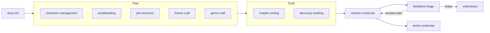

# Skills catalogue

This page is for writers and agent operators who want to know what each of the 16 Story Skills does and which one to reach for. For every skill it covers when an agent picks it up, which files it reads and writes, which `story` commands it runs, and the reference files it loads.

**On this page**

- [How skills work](#how-skills-work)
- [Which skill do I want?](#which-skill-do-i-want)
- [How the skills fit together](#how-the-skills-fit-together)
- [Skills at a glance](#skills-at-a-glance)
- Skill details: [Setting up](#setting-up) · [Planning](#planning) · [Drafting](#drafting) · [Revising and reviewing](#revising-and-reviewing) · [Publishing](#publishing) · [Series](#series) · [Maintenance](#maintenance)
- [Companion skill: better-writing](#companion-skill-better-writing)
- [Testing skill changes](#testing-skill-changes)

## How skills work

Each skill is a folder under [`skills/`](../skills/) containing a `SKILL.md` file and, usually, a `references/` folder. The `SKILL.md` frontmatter has a `name` and a `description`. The description lists the phrases that should trigger the skill ("start a new story", "write the next chapter", "continuity check"), and your agent matches your request against those descriptions to decide which skill to load. You don't need to name a skill. Asking in plain words is enough, though naming one ("use the scene-craft skill") also works.

Once loaded, a skill tells the agent what to read, what to ask you, which files to edit, and which maintenance commands to run afterwards. Reference files hold templates and craft guidance that the skill loads when it needs them, so the main instructions stay short.

The skills split the work the same way throughout:

- **Skills make the creative decisions**, and they ask you before inventing canon.
- **The `story` CLI does the mechanical work**: validation, registry rebuilds, word counts, link and continuity checks. See the [CLI reference](cli-reference.md).
- **Story content is plain markdown.** Agents write chapters and entity files directly. They never create project-local build or generator scripts to emit story files.

This page is the reference: triggers, files read and written, CLI commands, and reference files for each skill. [Writing workflows](writing-workflows.md) shows the same skills in use, step by step. The **CLI** line for each skill lists which commands it runs; what each command does and when to run it is covered once, in [the maintenance loop](writing-workflows.md#the-maintenance-loop) and [When to run what](continuity.md#when-to-run-what).

### Finding the CLI

Every skill that runs maintenance looks for the CLI in the same order:

1. `story <command>`, when the npm package is installed
2. `bun run story -- <command>`, from a Story Skills repository checkout
3. `node ../story-maintenance/scripts/story.js <command>`, the bundled fallback, resolved relative to the skill folder

`story-maintenance` itself uses `node scripts/story.js`, because the fallback sits inside its own folder. The fallback is a single Node file with no dependencies, so copied skill installs work without npm:

```shell
$ node skills/story-maintenance/scripts/story.js --version
0.8.2
```

If none of the three is available, skills fall back to doing the registry, backlink, and word-count checks by hand. Agents run the CLI where it is installed and never copy `story.js` into your story project.

## Which skill do I want?

| You want to... | Skill | Try saying |
|----------------|-------|------------|
| Start a new book from scratch | [story-init](#story-init) | "Start a new story" |
| Turn an existing manuscript into a project | [story-maintenance](#story-maintenance) (`story import`) | "Import my draft" |
| Add or change a character, relationship, or family tree | [character-management](#character-management) | "Create a character" |
| Build a place, magic system, faction, or important object | [worldbuilding](#worldbuilding) | "Design a magic system" |
| Choose a story structure, plan arcs, track foreshadowing | [plot-structure](#plot-structure) | "Create a plot arc" |
| Work out what the book is about, or design the antagonist | [theme-craft](#theme-craft) | "What's my story really about?" |
| Follow a genre's rules: fair-play clues, romance beats, a ticking clock | [genre-craft](#genre-craft) | "Plan a fair-play mystery" |
| Check real-world facts and record sources | [research](#research) | "Fact-check the sailing in chapter 4" |
| Draft the next chapter from an outline | [chapter-writing](#chapter-writing) | "Write the next chapter" |
| Draft without an outline and tidy the bible afterwards | [discovery-drafting](#discovery-drafting) | "I want to discovery-write" |
| Fix a flat scene, weak dialogue, an info dump, or an opening | [scene-craft](#scene-craft) | "Fix the info dump in chapter 2" |
| Keep spelling, voice, and house style consistent, or lint prose | [voice-style](#voice-style) | "Set up a style sheet for this book" |
| Revise, line edit, or continuity-check existing chapters | [revision-continuity](#revision-continuity) | "Continuity-check chapter 3" |
| Process notes from alpha or beta readers | [feedback-triage](#feedback-triage) | "Triage the beta feedback" |
| Write a sequel, prequel, or companion book | [series-continuity](#series-continuity) | "Start a prequel to The Last Ember" |
| Query agents, write a blurb, or track submissions | [submission](#submission) | "Help me query agents" |
| Find out what a character knew at a given chapter | [story-maintenance](#story-maintenance) (`story knowledge`) | "What did Kael know by chapter 4?" |
| Validate, reindex, count words, export, or build | [story-maintenance](#story-maintenance) | "Validate my story project" |

## How the skills fit together

Most books move through the skills roughly in this order. `story-maintenance` runs underneath all of them, and `scene-craft`, `voice-style`, and `research` are used whenever they are needed rather than at one fixed point.



The main handoffs:

- `chapter-writing` owns new drafting, and `revision-continuity` owns edits to existing chapters.
- `discovery-drafting` passes batches to `revision-continuity` at the midpoint and when the draft is complete.
- `feedback-triage` produces a revision plan, and `revision-continuity` carries it out.
- `theme-craft` and `genre-craft` audits feed `revision-continuity` as developmental revision plans.
- `submission` sends readiness blockers back to `revision-continuity`.
- `series-continuity` starts the next book and checks canon shared between books.

## Skills at a glance

| Skill | Main files it writes | CLI commands it runs |
|-------|----------------------|----------------------|
| [story-init](#story-init) | Whole project scaffold, `story.md`, all registries | `init`, `validate` (then suggests `next`) |
| [character-management](#character-management) | `characters/*.md`, `characters/_index.md` | `add character`, `reindex`, `links`, `validate` |
| [worldbuilding](#worldbuilding) | `worldbuilding/{locations,systems,factions,artifacts}/*.md` | `add faction`, `add artifact`, `reindex`, `links`, `validate` |
| [plot-structure](#plot-structure) | `plot/_index.md`, `plot/arcs/*.md`, `plot/timeline.md`, `continuity/{promises,questions}/` | `add arc`, `add chapter`, `add scene`, `timeline`, `reindex`, `links`, `validate` |
| [theme-craft](#theme-craft) | `story.md` premise fields, character arc fields, `continuity/theme-audit.md` | `reindex`, `links`, `validate` |
| [genre-craft](#genre-craft) | `continuity/clues/`, promises, `story.md` genre fields | `add clue`, `reindex`, `links`, `validate`, `continuity` |
| [research](#research) | `research/*.md` | `add research`, `reindex`, `links`, `validate` |
| [chapter-writing](#chapter-writing) | `chapters/chapter-NN.md`, `scenes/*.md`, timeline, continuity | `wordcount --write`, `reindex`, `links`, `validate`, `next`, `progress --log` |
| [discovery-drafting](#discovery-drafting) | Chapters, post-hoc notes, reconciled bible files | `wordcount --write`, `reindex`, `links`, `validate`, `continuity`, `progress --log` |
| [scene-craft](#scene-craft) | `scenes/*.md` planning fields and sections | `reindex`, `links`, `validate`, `continuity` |
| [voice-style](#voice-style) | `style-sheet.md`, chapter prose | `prose`, `validate`, `wordcount --write`, `links`, `rename character` |
| [revision-continuity](#revision-continuity) | Chapters and every dependent record | `report`, `wordcount --write`, `reindex`, `links`, `validate`, `continuity`, `doctor`, `prose`, `timeline`, `compare`, `series` |
| [feedback-triage](#feedback-triage) | `feedback/round-N/*.md` | `reindex`, `links`, `validate`, `continuity` |
| [series-continuity](#series-continuity) | A new linked project, carried entity files, `fact` ids | `init --follows`/`--precedes`, `series`, `reindex`, `links`, `validate`, `continuity` |
| [submission](#submission) | `submission/*.md`, Shunn builds in `dist/` | `validate`, `links`, `continuity`, `prose`, `wordcount --write`, `report`, `synopsis`, `build` |
| [story-maintenance](#story-maintenance) | Registries, word counts, exports, `dist/` | Every CLI command |

## Setting up

### story-init

**Purpose.** Creates a new story project: the story bible (`story.md`), the style sheet, every registry, the scene and continuity folders, the glossary, and the chapter tracker. See [Getting started](getting-started.md) for a walkthrough and [Project format reference](project-format.md) for the files it creates.

**Triggers.** "Start a new story", "initialize a story project", "create a story", "new book", "set up a story".

**Not for.** Adding to an existing project (use the domain skills), a sequel or prequel (use [series-continuity](#series-continuity)), or converting an existing manuscript (run `story import <source> --title "{Title}"` and build the bible from the entity candidates it prints; see [Import, export, and builds](manuscripts.md)).

**Workflow.**

1. Asks for the title, genre and sub-genre, a two- or three-sentence synopsis, setting era, two to four themes, POV style, and tense.
2. Scaffolds the project with the CLI:

   ```shell
   story init "{Title}" --genre "{genre}" --sub-genre "{sub-genre}" --setting-era "{era}" --pov "{pov-style}" --tense "{tense}" --synopsis "{synopsis}" --theme "{theme-1}" --theme "{theme-2}"
   ```

   The title must contain ASCII letters or digits, because the story id recorded in every registry comes from it. `--dir` sets only the directory. `init` refuses an existing directory unless you pass `--force`, and with `--force` it only adds missing starter files.
3. Drafts a working `premise` (value plus cause) and `counter-premise` in `story.md` as hypotheses to revisit in revision, not commitments.
4. Without the CLI, writes the same folder layout and empty registries by hand from the templates in the skill.
5. Suggests next steps (a first character, worldbuilding, plot structure, the style sheet, `story next .`) and runs `story validate` on the new project.

**Reads.** Nothing beyond your answers.

**Writes.** `story.md`, `style-sheet.md`, `characters/_index.md`, `worldbuilding/_index.md` and its four subfolders, `plot/_index.md`, `plot/arcs/`, `plot/timeline.md`, `scenes/_index.md`, `continuity/state.md`, the `questions`, `promises`, and `clues` registries, `glossary/_index.md`, `glossary/terms/`, and `chapters/_index.md`.

**References.**

- [`title-logline.md`](../skills/story-init/references/title-logline.md): title craft (comps, hook phrasing, the title as a promise) and the logline recipe. The `submission` skill reuses it for the pitch.

`story-init` also defines the conventions every other skill follows: kebab-case ids, YAML frontmatter on every file, `_index.md` files as authoritative registries, bidirectional links, `status: deceased` plus `died-in` for deaths, `characters` versus `mentions`, and no project-local generator scripts. [Core concepts](concepts.md) explains them.

## Planning

### character-management

**Purpose.** Creates and updates character profiles, relationships, and family trees in `characters/`.

**Triggers.** "Create a character", "update a character", "add a character", "build a family tree", "character relationships", "character timeline", "character arc", "character profile".

**Workflow.**

1. Reads `story.md` for genre, themes, and tone, and `characters/_index.md` for the existing cast.
2. Asks for the name and role: `protagonist`, `antagonist`, `supporting`, `minor`, `narrator`, or `deuteragonist`.
3. Builds the profile through conversation: appearance, personality, backstory, external wants and internal needs, voice (with sample dialogue), arc, and key life events.
4. Writes `characters/{name-kebab}.md` from the template, or scaffolds it with `story add character "{Name}" --role "{role}"`.
5. Adds every relationship in both directions using the inverse pairs in `relationship-types.md`, and updates the Relationship Map and Family Trees sections of `characters/_index.md`.

**Reads.** `story.md`, `characters/_index.md`, existing character files, and linked location, faction, artifact, and arc files when checking cross-references.

**Writes.** `characters/*.md`, `characters/_index.md`, and the matching backlink in any related character file.

**CLI.** `story add character`, then `story reindex .`, `story links .`, `story validate .`.

**References.**

- [`character-template.md`](../skills/character-management/references/character-template.md): the full profile template, including `arc-type`, `lie`, `truth`, `ghost-wound`, and an Antagonist Design section.
- [`relationship-types.md`](../skills/character-management/references/relationship-types.md): family, social, and story-role relationship types with their inverse pairs.
- [`ensemble-cast.md`](../skills/character-management/references/ensemble-cast.md): running a large cast with an anchor character, A/B/C story braiding, thematic relevance per character, and merging characters. It warns that `story reindex` keeps only the Relationship Map and Family Trees sections of `characters/_index.md`, so notes under any other heading there are lost.
- [`supporting-characters.md`](../skills/character-management/references/supporting-characters.md): role vocabulary (mentor, foil, confidant, love interest, comic relief, threshold guardian) and what each supporting role needs.

### worldbuilding

**Purpose.** Creates locations, systems (magic, politics, technology, religion, economy, military, social, education), factions, and artifacts under `worldbuilding/`.

**Triggers.** "Create a location", "add a location", "magic system", "political system", "build the world", "add culture", "world history", "technology system", "religion", "economy".

**Workflow.**

- **Locations:** covers atmosphere, history, culture, notable features, and current state. Saves to `worldbuilding/locations/{name-kebab}.md` and adds the location id to each notable character's `locations` list.
- **Systems:** uses the prompts for that system type in `world-element-types.md`, saves to `worldbuilding/systems/{name-kebab}.md`, and cross-references the characters who use it.
- **Factions:** `story add faction "{Name}" --type "{family|guild|government|military|religion|company|community|criminal|other}"`, covering ideology, power base, members, and conflicts.
- **Artifacts:** `story add artifact "{Name}" --type "{object|weapon|document|technology|relic|symbol|resource|other}"`, covering function, costs, history, and current owner and location.

Every element goes into the matching table in `worldbuilding/_index.md`, and the world overview is kept current.

**Reads.** `story.md`, `worldbuilding/_index.md`, and the character files it links.

**Writes.** `worldbuilding/**/*.md`, `worldbuilding/_index.md`, and backlinks in character files.

**CLI.** `story add faction`, `story add artifact`, then `story reindex .`, `story links .`, `story validate .`. The skill writes location and system files from its templates, but the CLI can also scaffold them with `story add location "{Name}"` (with `--region`, `--population`, `--controlled-by`) and `story add system "{Name}"` (with `--prevalence`).

**References.**

- [`location-template.md`](../skills/worldbuilding/references/location-template.md): location file template.
- [`system-template.md`](../skills/worldbuilding/references/system-template.md): system file template.
- [`faction-template.md`](../skills/worldbuilding/references/faction-template.md): faction file template.
- [`artifact-template.md`](../skills/worldbuilding/references/artifact-template.md): artifact and object file template.
- [`world-element-types.md`](../skills/worldbuilding/references/world-element-types.md): the questions to answer for each system type (magic, political, technology, religion, economic, military, social, education).

### plot-structure

**Purpose.** Chooses a story structure and manages arcs, plot points, foreshadowing, the master timeline, and setup/payoff records.

**Triggers.** "Create a plot arc", "story structure", "add a plot point", "story timeline", "track foreshadowing", "pacing", "act structure", "story arc", "plot outline".

**Workflow.**

1. **Structure:** recommends a model from `structure-models.md` based on genre (three-act when unclear), sets the `structure` field in `plot/_index.md`, and fills in the beat sheet.
2. **Arcs:** asks for the name, type (`main`, `subplot`, `character`, `thematic`), characters, themes, and optionally the MICE threads the arc carries (`mice-threads: [event, character]`). Builds setup, escalations, climax, and resolution, and saves `plot/arcs/{arc-kebab}.md`. It can scaffold the file first with `story add arc "{Name}" --type main --character {id} --theme {theme}`.
3. **Plot points:** adds rows to the arc's Plot Points table and to `plot/timeline.md`. A plot point that makes a promise to the reader, or raises a mystery, gets a file in `continuity/promises/` or `continuity/questions/`.
4. **Timeline:** keeps `plot/timeline.md` in chronological order using the `| When | Event | Arc | Chapter |` format, and compares it with `story timeline .` output for the written scenes.
5. **Foreshadowing:** tracks each arc's items as `planned`, `planted`, or `paid-off`.
6. **Scaffolding:** creates chapter and scene files with `story add chapter "{Title}" --number {N} --pov {id} --arc {arc-id}` and `story add scene "{Title}" --chapter chapter-{NN} --scene {M} --pov {id} --location {id}`.

**Reads.** `story.md`, `plot/_index.md`, `characters/_index.md`, and arc files.

**Writes.** `plot/_index.md`, `plot/arcs/*.md`, `plot/timeline.md`, `continuity/promises/*.md`, and `continuity/questions/*.md`.

**CLI.** `story add arc`, `story add chapter`, `story add scene`, `story timeline .`, then `story reindex .`, `story links .`, `story validate .`.

**References.**

- [`arc-template.md`](../skills/plot-structure/references/arc-template.md): arc file template with Setup, Rising Action, Climax, Resolution, Plot Points, and Foreshadowing sections.
- [`question-template.md`](../skills/plot-structure/references/question-template.md): template for mystery and open-question files.
- [`promise-template.md`](../skills/plot-structure/references/promise-template.md): template for setup/payoff files.
- [`structure-models.md`](../skills/plot-structure/references/structure-models.md): beat sheets for three-act, the hero's journey, Save the Cat, kishotenketsu, five-act, the Fichtean curve, and Harmon's story circle, plus how to choose between them.
- [`mice-quotient.md`](../skills/plot-structure/references/mice-quotient.md): milieu, inquiry, character, and event threads, their start and end rules, and the `mice-threads` arc field.
- [`short-story-form.md`](../skills/plot-structure/references/short-story-form.md): one dominant change, single effect, and narrow scope for short fiction.
- [`outlining-ladder.md`](../skills/plot-structure/references/outlining-ladder.md): premise, beat sheet, step outline, and full outline, with an exit criterion for each rung.

### theme-craft

**Purpose.** Treats theme as a working mechanism: a controlling idea, lie/truth character arcs, the antagonist as the counter-argument, motifs, and a theme audit after the draft.

**Triggers.** "Theme", "controlling idea", "premise", "moral argument", "character arc", "flat arc", "negative arc", "the lie", "antagonist design", "motif", "symbolism", "theme audit".

**Workflow.**

1. **Working premise.** Writes `premise` and `counter-premise` in `story.md` frontmatter as one-sentence value-plus-cause statements. If you prefer to find the theme while drafting, it records `premise: tbd-discovery`.
2. **Lie/truth machinery.** Adds `arc-type` (`change-positive`, `change-negative`, or `flat`), `lie`, `truth`, and `ghost-wound` to the protagonist's and antagonist's files, and checks their turning points against the arc type.
3. **Antagonist.** Gives the antagonist an edge over the protagonist, a defensible belief in the counter-premise, a want, wound, and plan, and scenes they win.
4. **Motifs.** Chooses two or three concrete motifs and tracks where each is planted, how it varies, and how it pays off in a motif ledger.
5. **Theme audit.** After a complete draft, records findings and a `theme-holds` or `theme-broken` verdict in `continuity/theme-audit.md`, and hands structural fixes to [revision-continuity](#revision-continuity).

It never fixes an audit finding by adding a speech or narration that explains the theme. It reworks the characters' choices instead.

**Reads.** `story.md`, character files, `plot/_index.md` theme tracking, and the opening and closing chapters.

**Writes.** `story.md` premise fields, character arc fields, the motif ledger (`continuity/motifs.md` or a table in an arc file), and `continuity/theme-audit.md`. The CLI does not scan, validate, or reindex the motif ledger or the theme audit.

**CLI.** `story reindex .`, `story links .`, `story validate .`.

**References.**

- [`controlling-idea.md`](../skills/theme-craft/references/controlling-idea.md): the controlling idea as value plus cause, the counter-premise, and the working-premise workflow.
- [`lie-truth.md`](../skills/theme-craft/references/lie-truth.md): the lie, the truth, the ghost wound, and the three arc types.
- [`antagonist-design.md`](../skills/theme-craft/references/antagonist-design.md): the worthy opponent, planning the antagonist as a protagonist, and personifying institutional opposition.
- [`motif-symbolism.md`](../skills/theme-craft/references/motif-symbolism.md): plant-and-vary, echoing a motif in the ending, the motif ledger, and restraint rules.
- [`theme-audit.md`](../skills/theme-craft/references/theme-audit.md): the audit procedure and its five questions.

### genre-craft

**Purpose.** Genre packs that turn each genre's conventions into checkable rules, ledgers, and revision audits. Use it when setting a project up and again in revision.

**Triggers.** "Mystery", "fair play", "clue", "red herring", "romance beats", "HEA", "thriller", "ticking clock", "horror", "dread", "MG", "YA", "middle grade", "young adult", "science fiction", "sci-fi", "serial", "episodic", "web serial", "genre conventions".

**Not for.** Genre voice at the sentence level (that is the `better-writing` skill's job) or literary fiction, whose conventions don't reduce to checkable rules.

**Workflow.**

1. Loads the pack that matches `story.md` `genre` and `sub-genre`. Multi-genre books load every matching pack. Where packs conflict, you decide which contract wins in each section, and the decision is recorded in `story.md`.
2. Applies the pack's constraints while planning:
   - **Mystery:** records every clue and red herring with `story add clue "..." --planted chapter-NN --payoff chapter-NN`, marking clues the reader sees before understanding them with `significance-delayed: true` (the `--significance-delayed` flag sets it). A clue added with `--planted` starts as `status: planted`; without it, the clue starts as `planned`. `--status` overrides either default.
   - **Thriller:** records every promised deadline in `continuity/promises/` and tracks story time in `plot/timeline.md`.
   - **Serial:** records `season-goal` in `story.md` and `episode-question` in each installment.
   - **MG/YA:** records `target-words` in `story.md` and checks protagonist age and how much adults are involved.
   - **Science fiction:** writes the speculative element's rules, costs, and limits in `worldbuilding/systems/` before the climax relies on them.
3. Drafts alongside [chapter-writing](#chapter-writing) and [scene-craft](#scene-craft).
4. Runs the pack's audit checklist during a developmental revision pass.
5. Records any deliberate departure from the pack in `story.md` with the reason, so a later audit doesn't undo it.

**Reads.** `story.md`, plot files, and `continuity/`.

**Writes.** `continuity/clues/*.md`, `continuity/promises/*.md`, `story.md` genre fields and notes, and audit findings in the revision plan or `continuity/`.

**CLI.** `story add clue`, then `story reindex .`, `story links .`, `story validate .`, `story continuity .`. `story continuity` reports a clue paid off before it is planted as an error. See [Continuity and analysis](continuity.md#promises-questions-and-clues).

**References.**

- [`mystery-fair-play.md`](../skills/genre-craft/references/mystery-fair-play.md): fair-play rules, clue-planting techniques, red-herring discipline, the gather-the-suspects reveal, and the clue ledger.
- [`romance-beats.md`](../skills/genre-craft/references/romance-beats.md): paraphrased romance beat concepts, the HEA/HFN contract, and the black moment.
- [`thriller.md`](../skills/genre-craft/references/thriller.md): the ticking clock, power imbalance, set pieces, mini-cliffhanger chapter endings, and pairing with the Fichtean curve.
- [`horror.md`](../skills/genre-craft/references/horror.md): ordering dread, terror, and gross-out, the uncanny, monster rules stated early, and recovery periods.
- [`mg-ya.md`](../skills/genre-craft/references/mg-ya.md): word-count norms, voice and stakes by age, keeping adults out of the way, and content boundaries.
- [`scifi-pipeline.md`](../skills/genre-craft/references/scifi-pipeline.md): the load-bearing test, rules stated before they are exploited, and the worldbuilding-to-plot pipeline.
- [`serial-episodic.md`](../skills/genre-craft/references/serial-episodic.md): the season goal, the question each episode asks, a reward in every installment, recap discipline, and arc-specific stakes that prevent endless escalation. Book-level canon across a series belongs to [series-continuity](#series-continuity).

### research

**Purpose.** Records the real-world facts a story relies on in `research/` notes, each with its question, sourced findings, status, and the chapters that use it.

**Triggers.** "Research", "fact-check", "check the history", "is this accurate", "research notes", "sources", "historical accuracy", "technical accuracy", "how would this really work", "verify a detail".

**Not for.** Invented world facts ([worldbuilding](#worldbuilding)) or continuity inside the story ([revision-continuity](#revision-continuity)).

**Workflow.** Opens a note with `story add research`, researches with whatever tools the session has, records each finding next to its source, and sets `status` to `open`, `verified`, or `disputed`. A fact recalled without a source stays `open`. Sensitive or lived-experience topics also get a human authenticity reader, recorded through [feedback-triage](#feedback-triage). [Writing workflows](writing-workflows.md#research) walks through a full session.

`story validate .` warns about a `final` or `complete` chapter that relies on open or disputed research, and about `verified` notes with no sources.

**Reads.** `research/` notes and the chapters listed in `used-in`.

**Writes.** `research/*.md` and `research/_index.md` (created by the first `story add research`).

**CLI.** `story add research`, then `story reindex .`, `story links .`, `story validate .`. `story rename` and `story remove` keep `used-in` current when chapters change.

**References.**

- [`research-practice.md`](../skills/research/references/research-practice.md): what needs checking, how to judge sources, and how to record findings and deliberate departures.

## Drafting

### chapter-writing

**Purpose.** Drafts chapters outline-first: gathers context, agrees a beat-by-beat outline with you, writes the prose, then updates every dependent record.

**Triggers.** "Write a chapter", "next chapter", "chapter outline", "draft chapter", "continue the story", "write a scene", "outline a chapter".

**Prerequisites.** `story.md` and at least one character. A plot structure is recommended but not required for early chapters.

**Workflow.** Five steps every time: gather context, scope the chapter, agree a beat-by-beat outline, write, then update the dependent records. [Writing workflows](writing-workflows.md#6-write-chapters-outline-first) walks through each step. Two details matter for the files it produces:

- The approved outline stays above `## Chapter Text`, and word counts start at that heading, so the outline never inflates `word-count`.
- Each scene gets a `scenes/chapter-{NN}-scene-{NN}.md` record with `pov`, `location`, `characters`, `mentions`, `arcs-advanced`, `status`, and `state-changes`. Scenes inside the chapter prose are separated by `---`.

When `story.md` links other books, reveals the series depends on get a stable `fact` id (see [Series](series.md)). Revising an existing chapter belongs to [revision-continuity](#revision-continuity).

**Reads.** `story.md`, `style-sheet.md` (when present), `chapters/_index.md`, `plot/_index.md`, `plot/timeline.md`, `scenes/_index.md`, `continuity/state.md`, the questions and promises registries, and the POV character's file. After chapter one it also reads the previous chapter and the active arcs.

**Companion skill.** Before drafting, it checks for the [`better-writing`](https://github.com/forjd/better-writing) skill and uses it for voice calibration and a final prose pass. If that skill is missing, it offers you the link and asks before any install, then continues with its own `writing-guidelines.md`.

**Writes.** `chapters/chapter-NN.md`, `chapters/_index.md`, `scenes/*.md`, `plot/timeline.md`, arc files, `continuity/` records, and `progress.md` when you keep a log.

**CLI.** `story add chapter` and `story add scene` for scaffolds, then `story wordcount . --write`, `story reindex .`, `story links .`, `story validate .`, `story next .`, and `story progress . --log`. It skips `--log` if you don't keep a progress log.

**References.**

- [`chapter-template.md`](../skills/chapter-writing/references/chapter-template.md): chapter frontmatter plus the Outline and Chapter Text sections.
- [`scene-template.md`](../skills/chapter-writing/references/scene-template.md): the scene record, with Purpose, Sequel, and Continuity Notes sections.
- [`writing-guidelines.md`](../skills/chapter-writing/references/writing-guidelines.md): quick prose guidance on showing, POV consistency, dialogue, pacing, scene structure, sensory detail, chapter openings and endings, and continuity. [scene-craft](#scene-craft) covers these in depth.

### discovery-drafting

**Purpose.** Drafting without an outline ("pantsing"). You start from a one-paragraph story kernel, write forward, and bring the bible up to date after each chapter. It is the counterpart to chapter-writing's outline-first approach.

**Triggers.** "Pantsing", "discovery write", "write without an outline", "discovery draft", "write into the dark", "story kernel", "reconcile a chapter", "reverse outline", "cut a subplot", "dead end", "drafting sprint", "writing cadence".

**Not for.** Mysteries and other clue-dependent genres where setup has to come before payoff (use chapter-writing with [genre-craft](#genre-craft)), or revising existing chapters. You can switch mode per project or per chapter.

**Workflow.**

1. **Kernel.** Writes the kernel (a character in a situation, a want, an obstacle, a tone signal) under `## Story Kernel` in `story.md` and sets `draft-mode: discovered`.
2. **Draft forward.** Writes in sessions of re-read, write, and a note for next time. Questions about the bible are left inline as `[TODO: check bible]` rather than stopping the draft; these markers stay in the prose, counting towards its words, until the reconcile loop clears them. Only the note for next time goes above `## Chapter Text`. Prose standards and `style-sheet.md` still apply.
3. **Reconcile loop** after every chapter:
   - extract new entity and promise candidates for your approval
   - reverse-outline the chapter into the chapter file and `scenes/`
   - diff it against the bible (new, contradiction, enrichment, dangling)
   - update the bible or revise the chapter, never neither
   - add a `## Chapter Notes (post-hoc)` section and set `mode: discovered` in the chapter frontmatter
4. **Batch review** every three to five chapters: re-reads the post-hoc notes, sweeps promises and questions for dangling setups, and cuts dead ends. Abandoned ledger entries keep a reason, and cut characters keep their file with `status: cut`.
5. **Cadence.** Logs sessions with `story progress . --log`, and hands batches to [revision-continuity](#revision-continuity) at the midpoint and at the end of the draft.
6. **Close out.** Flags any `mode: discovered` chapter that lacks post-hoc notes or a completed diff.

**Reads.** `story.md` and its kernel, `style-sheet.md`, the previous chapter's post-hoc notes and last few pages at the start of each session, and, in the reconcile loop and batch reviews, the bible files and the promise and question ledgers.

**Writes.** `story.md` (kernel and `draft-mode`), chapters and their post-hoc notes, `scenes/`, and whichever bible files the reconcile step updates.

**CLI.** After each reconcile loop: `story wordcount . --write`, `story reindex .`, `story links .`, `story validate .`, `story continuity .`. `story add chapter --mode discovered` scaffolds a chapter already marked as discovered.

**References.**

- [`story-kernel.md`](../skills/discovery-drafting/references/story-kernel.md): what goes in the kernel, where to record it, and when discovery mode is the wrong choice.
- [`reconcile-loop.md`](../skills/discovery-drafting/references/reconcile-loop.md): the four-step loop, post-hoc chapter notes, the `mode: discovered` flag, and a per-chapter checklist.
- [`dead-ends.md`](../skills/discovery-drafting/references/dead-ends.md): recognising a dead end, the cut procedure, and the darling log.
- [`drafting-cadence.md`](../skills/discovery-drafting/references/drafting-cadence.md): daily targets, the draft log, batch reviews, session shape, and recovering a broken cadence.

### scene-craft

**Purpose.** Planning and checking at the scene level, between plot beats and chapter prose. It adds to chapter-writing's outline-first workflow rather than replacing it.

**Triggers.** "Plan a scene", "scene structure", "sequel scene", "dialogue subtext", "deep POV", "psychic distance", "try fail", "scene cards", "exposition", "info dump", "flashback", "time skip", "story opening", "first page hook", "introduce a character".

**Workflow.**

1. Matches the problem to a reference:

   | Symptom | Reference |
   |---------|-----------|
   | Incidents with no breathing room | `scene-sequel.md` |
   | The middle sags or resolves too easily | `try-fail.md` |
   | Several POVs or timelines to order | `scene-cards.md` |
   | Flat conversation or blurred voices | `dialogue-subtext.md` |
   | Distant narration or head-hopping | `deep-pov.md` |
   | Worldbuilding facts piling up | `exposition.md` |
   | Past events or a time jump | `flashbacks-time.md` |
   | Opening a book or chapter, or introducing a character | `openings.md` |

2. Asks you for anything it can't establish from the files (scene purpose, viewpoint, location, whether canon should change) rather than guessing.
3. Writes the planning inputs (sequel beats, try/fail positions, what each speaker secretly wants, psychic distance, exposition audit, flashback trigger, hook check) into the chapter outline or the scene file before drafting or revising.
4. Records machine-readable state on the scene file: `sequel: true`, `dilemma`, a `## Sequel` section, `flashback-to` for flashbacks (a freeform note that `story validate` checks is a single value but continuity checks ignore; flashback-only characters move to `mentions`), and current `state-changes`.
5. Runs the reference's checklist, and marks intentional departures (a deliberate info dump, say) in the scene's planning notes so a later audit leaves them alone.

**Reads.** The reference file for the craft problem at hand, the scene file in `scenes/`, the chapter outline or prose, and whatever project files settle the scene's purpose, viewpoint, and location.

**Writes.** `scenes/*.md` frontmatter and `## Planning`, `## Scene Card`, or `## Sequel` sections; chapter outlines; and `continuity/state.md` plus entity files when a scene decision changes canon.

**CLI.** `story reindex .`, `story links .`, `story validate .`, `story continuity .`. `story add scene` accepts `--sequel` and `--dilemma` and writes them into the scene frontmatter; the `## Sequel` section is added by hand.

**References.**

- [`scene-sequel.md`](../skills/scene-craft/references/scene-sequel.md): Swain's reaction, dilemma, decision sequel, and the scene record fields.
- [`try-fail.md`](../skills/scene-craft/references/try-fail.md): escalating try/fail cycles and Story Grid's Five Commandments.
- [`scene-cards.md`](../skills/scene-craft/references/scene-cards.md): the scene card (start state, change, end state), reordering, and braiding POV lines.
- [`dialogue-subtext.md`](../skills/scene-craft/references/dialogue-subtext.md): subtext as a planning input, dialogue as negotiation, a recipe for distinct voices, the tag-swap test, and beat economy.
- [`deep-pov.md`](../skills/scene-craft/references/deep-pov.md): psychic distance as a zoom level, checkable deep-POV rules, and a post-draft check.
- [`exposition.md`](../skills/scene-craft/references/exposition.md): the info-dump test, drip-feeding, exposition carried by conflict, and in-world documents.
- [`flashbacks-time.md`](../skills/scene-craft/references/flashbacks-time.md): entering and leaving a flashback, the flashback-as-tension-cheat warning, and time skips.
- [`openings.md`](../skills/scene-craft/references/openings.md): in medias res, the first-page hook check, and introducing characters.

### voice-style

**Purpose.** Records the book's voice and surface conventions in `style-sheet.md` and enforces them with `story prose`, so the voice holds across chapters, sessions, and agents.

**Triggers.** "Create a style sheet", "style guide", "house style", "keep the voice consistent", "voice drift", "British or American spelling", "character voices", "lint the prose", "prose check", "filter words", "said-bookisms", "overused words", "repeated phrases", "similar character names".

**Not for.** Character personality or arc ([character-management](#character-management)) or scene craft such as deep POV ([scene-craft](#scene-craft)).

**Workflow.**

1. Reads `story.md`, `style-sheet.md`, and two or three drafted chapters or a sample you supply. With no prose yet, it asks for a paragraph that sounds right or three books with a similar voice.
2. Records choices the prose already makes rather than inventing new ones, and asks you which form wins when the draft is inconsistent.
3. Sets the frontmatter: `dialect` (`british`, `american`, or `unspecified`), one `preferred` entry (`use` and `avoid`) per variant, `watch-words`, and `allow-words`.
4. Writes one line per major speaker under Character Voices, each linked to the character file, which remains canon.
5. Runs `story prose .`, fixes every avoided spelling, and treats the other findings as prompts to reread rather than orders. It asks before renaming a character whose name is too close to another's, then uses `story rename character <id> "<New Name>"`.

`chapter-writing` and `discovery-drafting` read `style-sheet.md` before drafting, and the copyedit pass in `revision-continuity` enforces it. Projects created before the style sheet existed can add one with `story init "<title>" --dir . --force`, which only adds missing files.

**Reads.** `story.md` (genre, POV, tense, and tone), `style-sheet.md`, and two or three drafted chapters or a sample you supply.

**Writes.** `style-sheet.md` and chapter prose.

**CLI.** `story validate .`, `story prose .`, `story wordcount . --write`, `story links .`, and `story rename character` for a name change.

**References.**

- [`style-sheet-guide.md`](../skills/voice-style/references/style-sheet-guide.md): each style-sheet section, the frontmatter format, and how to extract a voice description from sample prose.
- [`prose-checks.md`](../skills/voice-style/references/prose-checks.md): what each `story prose` count measures, its warning threshold, and when to keep the flagged text.

## Revising and reviewing

### revision-continuity

**Purpose.** Revises existing chapters without breaking continuity: targeted edits, audits, developmental passes, line edits, and checks before the next chapter. See [Continuity and analysis](continuity.md) for the checks it relies on.

**Triggers.** "Revise a chapter", "edit prose", "continuity check", "find inconsistencies", "audit character state", "check timeline consistency", "line edit", "developmental edit", "polish a draft", "prepare for the next revision pass".

**Pass types.** It asks which pass you want unless you have said: continuity audit, developmental revision, reverse outline, theme audit, pacing waveform, reveal economy, removability audit, line edit, copyedit, fact check, or proof/polish. [Pick a pass](writing-workflows.md#1-pick-a-pass) describes each one and how to ask for it.

**Workflow.**

1. Takes a draft snapshot before any pass that touches more than one chapter. In a git project it asks before committing, then tags the snapshot (for example `draft-1`), and it never pushes or rewrites history. Without git, it offers `git init` or copies the project folder beside it, never inside it.
2. Reads `story.md`, `chapters/_index.md`, the target chapters and their neighbours, referenced entity and arc files, matching scenes, `continuity/`, and `plot/timeline.md`.
3. Writes a short plan: what changes, what must stay fixed, and which other files are affected.
4. Edits the markdown directly, then updates the chapter `status` (`draft` to `revised`, and to `final` only when appropriate), timeline, scenes, continuity records, arc plot points, and entity files.
5. Runs the continuity checklist for what the CLI can't judge: character knowledge, carried-forward state, travel time, world rules, and chapter references.
6. For an audit, reports findings by severity with file references and concrete fixes. For a revision, summarises what changed.

**Reads.** `story.md`, `chapters/_index.md`, the target chapters and their neighbours, the character, location, system, and arc files they reference, their scene files, `continuity/state.md`, open questions and promises, and `plot/timeline.md`. Each audit adds its own reads, such as `style-sheet.md` and `glossary/` for a copyedit or `research/` notes for a fact check.

**Writes.** Chapter prose and `status`, `plot/timeline.md`, `scenes/*.md`, `continuity/state.md`, question and promise files, arc plot points and foreshadowing rows, and character or location files whose state changed. Copyedits can also update `style-sheet.md` and `glossary/`.

**CLI.** It starts by running or reading `story report .`. After edits it runs `story wordcount . --write`, `story reindex .`, `story links .`, `story validate .`, `story continuity .`, and `story doctor .`, plus `story series .` when `story.md` has `follows` or `precedes` links. It then compares the result with the snapshot:

```shell
story compare . --ref draft-1
story compare . --against ../the-tide-room-draft-1
```

`story compare` reports per-chapter word changes, added and removed chapters, and the share of paragraphs left unchanged. Chapters are matched by id, so a renumbered chapter shows as one removed and one added. It only reads git; it never commits or tags.

**References.** None. It draws on the references of [scene-craft](#scene-craft), [theme-craft](#theme-craft), [voice-style](#voice-style), and [genre-craft](#genre-craft).

### feedback-triage

**Purpose.** Handles alpha and beta reader feedback in rounds: one file per reader, no revision until the round is complete, then a synthesis with a readiness verdict and a revision plan.

**Triggers.** "Process beta reader feedback", "alpha reader feedback", "feedback round", "synthesize reader feedback", "reader notes", "beta feedback", "readiness check".

**Not for.** Revising the manuscript ([revision-continuity](#revision-continuity) runs the plan) or the agent's own critique of the draft.

**Workflow.**

1. **Set up the round.** Picks the chapters and two to four readers, creates `feedback/round-{N}/`, and adds a stub `feedback/round-{N}/{reader-kebab}.md` per reader. The stubs double as the round's checklist.
2. **Collect.** Records each reader's notes, quoted or closely paraphrased, and checks every problem note against canon: verified, contradicts canon (usually a setup problem), or outside canon's scope. Nothing is revised until every reader is in, or the round is formally closed without a late reader.
3. **Synthesise.** Sorts each finding as convergent (two or more readers agree), divergent (readers disagree, adjudicated against canon and premise), single-reader (weighed by how specific it is), or declined with a recorded reason. Writes `feedback/round-{N}/synthesis.md` with a `readiness` verdict of `ready`, `needs-revision`, or `not-ready`, and a numbered revision plan that names files.
4. **Hand off.** A `needs-revision` or `not-ready` verdict goes to [revision-continuity](#revision-continuity). A `ready` verdict closes the round.

When reader confusion reveals a gap in clarity, it creates or resolves files in `continuity/questions/` as well.

**Reads.** `story.md`, every reader file in the round, and the bible files a note needs checking against.

**Writes.** `feedback/round-N/*.md` and `continuity/questions/*.md`.

**CLI.** `story reindex .`, `story links .`, `story validate .`, `story continuity .`. The CLI doesn't read `feedback/`, so these commands check the `continuity/questions/` changes and the rest of the project, not the feedback files themselves.

**References.**

- [`feedback-template.md`](../skills/feedback-triage/references/feedback-template.md): the per-reader file, with `reader`, `round`, `chapters-read`, and `overall-verdict` frontmatter, and the canon check.
- [`synthesis-template.md`](../skills/feedback-triage/references/synthesis-template.md): the synthesis file, its four finding categories, the readiness verdict, and the revision plan.

## Publishing

### submission

**Purpose.** Gets a finished manuscript ready to submit: a readiness check, the submission package (pitch, comp titles, query letter, synopses, blurb), a Shunn-format build, and a tracker of where the book has gone. See [Import, export, and builds](manuscripts.md) for the build formats.

**Triggers.** "Write a query letter", "query", "querying", "pitch", "blurb", "back cover copy", "jacket copy", "comp titles", "comparable titles", "synopsis for agents", "submit to agents", "submission tracker", "self-publishing description", "retailer description".

**Hard rules.** It never invents your bio, contact details, agents, guidelines, or responses (it leaves `[TODO: author to supply]` where your details belong), and it never sends or uploads anything; you submit. [Submission prep](writing-workflows.md#submission-prep) lists the rules in full.

**Workflow.**

1. **Readiness check.** Runs the checks and gives a `ready`, `ready-with-caveats`, or `not-ready` verdict. Blockers go to [revision-continuity](#revision-continuity).
2. **Package.** Drafts the pitch (using the logline recipe in `story-init`'s `title-logline.md`), comp titles, query letter, 1- and 3-page synopses, and blurb. The synopses start from a `story synopsis` scaffold that the agent rewrites into prose.
3. **Build.** `story build . --format docx --shunn` or `--format shunn` for agents and magazines, `--format epub` or `--format docx` for self-publishing.
4. **Track.** Creates `submission/tracker.md` the first time you report a submission and records only what you tell it.

[Submission prep](writing-workflows.md#submission-prep) walks through each step, with the length and format rules for every file.

**Reads.** `story.md` (`status`, `genre`, `sub-genre`, `premise`, `author`, `contact`, and the synopsis), the manuscript, the main arc files, and the protagonist's character file. If `status` is not `complete` or `revising`, it warns you that the readiness check will fail until the draft is finished.

**Writes.** `submission/query.md`, `submission/comps.md`, `submission/synopsis-1-page.md`, `submission/synopsis-3-page.md`, `submission/blurb.md`, and `submission/tracker.md`, each with a `type` and `updated` in its frontmatter. The CLI doesn't validate `submission/`, and builds never include it.

**CLI.** The readiness check runs `story validate .`, `story links .`, `story continuity .`, `story prose .`, `story wordcount . --write`, and `story report .`. The package uses `story synopsis . --pages 1` and `--pages 3` with `--out`, and `story build` for the manuscript.

**References.**

- [`query-letter.md`](../skills/submission/references/query-letter.md): query structure, length, personalisation, and common mistakes.
- [`blurb.md`](../skills/submission/references/blurb.md): back-cover and retailer description formulas, length, and taglines.
- [`comp-titles.md`](../skills/submission/references/comp-titles.md): choosing and phrasing comparable titles, and the verification rule.
- [`word-count-norms.md`](../skills/submission/references/word-count-norms.md): rough word-count ranges by category, to confirm with you for your market.
- [`tracker-template.md`](../skills/submission/references/tracker-template.md): the tracker template and what each status means.

## Series

### series-continuity

**Purpose.** Plans and maintains sequels, prequels, and companion books as linked projects, and checks the canon they share. Each book stays a standalone project. The books point at each other through `series`, `book-number`, `follows`, and `precedes` in `story.md`. See [Series](series.md) for the full model.

**Triggers.** "Write a sequel", "write a prequel", "start book two", "continue the series", "companion novel", "spin-off", "link books in a series", "carry characters into the next book", "series continuity", "series bible".

**Not for.** A standalone book ([story-init](#story-init)) or continuity within one book ([revision-continuity](#revision-continuity)). The structure of individual serial installments belongs to [genre-craft](#genre-craft).

**Workflow.**

1. Reads the existing book: `story.md`, the character and world registries, the timeline, `continuity/state.md`, open questions and promises, and the final chapters.
2. Asks for the new book's title, synopsis, relationship (sequel, prequel, or companion), the time gap, and which characters and places return.
3. Creates the linked project from the folder that contains the existing book:

   ```shell
   story init "{Title}" --follows {existing-book-dir} --synopsis "{synopsis}"
   story init "{Title}" --precedes {existing-book-dir} --synopsis "{synopsis}"
   ```

   `init` writes the backlink into the existing book, inherits `series`, `genre`, `sub-genre`, `pov`, and `tense`, and sets `book-number` when any linked book already has one.
4. Adds a `## Series Notes` section recording where the book sits in the chronology and which canon it must not contradict.
5. Copies only the entities the new book uses, keeping the filename id and `name` identical (new epithets go in `aliases`), setting state for this book's starting point, removing references to chapters in the other book such as `died-in`, and pruning or carrying every link. It never copies chapters, scenes, arcs, questions, promises, or `continuity/state.md`.
6. Gives series-relevant knowledge a stable `fact` id in `knowledge-state`, with `learned-in` only in the book where the character learns it on the page.

**Reads.** The existing book first: `story.md`, `characters/_index.md`, `worldbuilding/_index.md`, `plot/timeline.md`, `continuity/state.md`, open questions and promises, and the final chapters.

**Writes.** A new project, both books' `story.md`, carried entity files, and `continuity/state.md` fact ids.

**CLI.** After carrying entities into the new book it runs `story reindex .`, `story links .`, `story validate .`, and `story series .`. After any later change to series links or carried entities, it runs `story validate .`, `story links .`, `story continuity .`, and `story series .` in each affected book.

`story series` orders the linked books by chronology and reports deaths that are undone in a later book, dead characters appearing on the page, facts learned twice across books, name drift, and destroyed artifacts that return. `story links` also checks the series links and their backlinks.

**References.** None; the skill is self-contained.

## Maintenance

### story-maintenance

**Purpose.** Runs the deterministic side of a project through the CLI: validation, reindexing, word counts, links, continuity, prose linting, timeline, progress, comparison, series checks, reports, migration, entity operations, import, export, builds, knowledge queries, and synopses. The creative skills still own story decisions. The [CLI reference](cli-reference.md) documents every command and flag.

**Triggers.** "Validate my story project", "reindex", "repair registries", "check links", "check continuity", "count words", "summarize the project", "import an existing manuscript", "export a manuscript", "run the story CLI".

**When each command fits.** The skill picks commands the same way the rest of the docs describe: [the maintenance loop](writing-workflows.md#the-maintenance-loop) for the five commands that follow most edits, [When to run what](continuity.md#when-to-run-what) for the analysis commands, and the [command summary](cli-reference.md#command-summary) for everything else, including `import`, `migrate`, `add`/`rename`/`remove`, `knowledge`, `export`, `build`, and `synopsis`.

**Reads.** The CLI's output, and the project files a finding names when it fixes them.

**Failure handling.** It treats CLI errors as findings to fix, and fixes broken references, stale registries, and wrong word counts when the task implies it. It never rewrites prose just to satisfy a check, and it reports warnings that reflect deliberate choices instead of changing them. `story import --force` deletes every `chapter-NN.md` in `chapters/` before writing, so it confirms with you first. If `story reindex` fails on a corrupt `plot/_index.md`, it restores the frontmatter from git or deletes the file so reindex rebuilds it, rather than editing story content.

**Files.** [`scripts/story.js`](../skills/story-maintenance/scripts/story.js) is the bundled Node fallback of the CLI, generated from `src/` by `bun run build:fallback` (see the [Development guide](development.md#the-bundled-fallback)).

## Companion skill: better-writing

[`better-writing`](https://github.com/forjd/better-writing) is a separate skill for prose quality: voice calibration, checks against generic writing, and a final pass before saving. `chapter-writing` looks for it before drafting, in `~/.claude/skills/better-writing`, `.claude/skills/better-writing`, and `skills/better-writing`. It does not yet look in `.agents/skills/`, so on Codex and other agents that use that directory, tell the agent where better-writing is installed. The `deep-pov.md` and `dialogue-subtext.md` references in scene-craft, and `genre-craft` with its `mg-ya.md` reference, leave voice calibration and sentence-level polish to it. Install it the same way as Story Skills:

```shell
npx skills add forjd/better-writing
```

## Testing skill changes

The [`evals/`](../evals/) directory holds regression fixtures for the fiction-writing skills (`canon-keeping`, `no-invention`, `promise-payoff`, `question-stays-open`, `voice-preservation`, `anti-slop`, `genre-craft-mystery`, `revision-continuity`, `series-continuity`). Each fixture is a drafting brief seeded with canon that must survive and traps a lazy draft would spring. Agents using the skills never load it. See the [Development guide](development.md#evals) and [`evals/README.md`](../evals/README.md) before changing a skill's instructions.

## See also

- [Getting started](getting-started.md): install the skills and create your first project
- [Core concepts](concepts.md): the bible, registries, ids, and bidirectional links the skills rely on
- [Writing workflows](writing-workflows.md): the skills combined into end-to-end sessions
- [CLI reference](cli-reference.md): every command the skills run
- [Documentation index](README.md): every page, by audience and task
