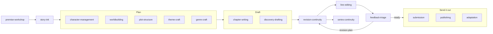

# Skills catalogue

This page is for writers and agent operators who want to know what each of the 21 Story Skills does and which one to reach for. For every skill it covers when an agent picks it up, which files it reads and writes, which `story` commands it runs, and the reference files it loads.

**On this page**

- [How skills work](#how-skills-work)
- [Which skill do I want?](#which-skill-do-i-want)
- [How the skills fit together](#how-the-skills-fit-together)
- [Skills at a glance](#skills-at-a-glance)
- Skill details: [Setting up](#setting-up) · [Planning](#planning) · [Drafting](#drafting) · [Revising and reviewing](#revising-and-reviewing) · [Sending it out](#sending-it-out) · [Series](#series) · [Maintenance](#maintenance)
- [Companion skill: better-writing](#companion-skill-better-writing)
- [Testing skill changes](#testing-skill-changes)

## How skills work

Each skill is a folder under [`skills/`](../skills/) containing a `SKILL.md` file and, usually, a `references/` folder. The `SKILL.md` frontmatter has a `name` and a `description`. The description lists the phrases that should trigger the skill ("start a new story", "write the next chapter", "continuity check"), and your agent matches your request against those descriptions to decide which skill to load. You don't need to name a skill. Asking in plain words is enough, though naming one ("use the scene-craft skill") also works.

Nearly every trigger phrase belongs to one skill (the exception is "character arc", which both character-management and theme-craft list), and most descriptions end with a "NOT for" line that points neighbouring requests elsewhere. That is why similar-sounding requests can land on different skills: "premise" goes to premise-workshop but "controlling idea" to theme-craft, "pacing" and "sagging middle" go to plot-structure but "chapter hook" to scene-craft, and "voice fingerprints" goes to voice-style but "everyone sounds the same" to line-editing. The **Triggers** and **Not for** lines below list them for each skill.

Once loaded, a skill tells the agent what to read, what to ask you, which files to edit, and which maintenance commands to run afterwards. Reference files hold templates and craft guidance that the skill loads when it needs them, so the main instructions stay short.

The skills split the work the same way throughout:

- **Skills make the creative decisions**, and they ask you before inventing canon.
- **The `story` CLI does the mechanical work**: validation, registry rebuilds, word counts, link and continuity checks. See the [CLI reference](cli-reference.md).
- **Story content is plain markdown.** Agents write chapters and entity files directly. They never create project-local build or generator scripts to emit story files.

This page is the reference: triggers, files read and written, CLI commands, and reference files for each skill. [Writing workflows](writing-workflows.md) shows the same skills in use, step by step. The **CLI** line for each skill lists which commands it runs; what each command does and when to run it is covered once, in [the maintenance loop](writing-workflows.md#the-maintenance-loop) and [When to run what](continuity.md#when-to-run-what).

### Finding the CLI

Every skill that runs maintenance looks for the CLI in the same order:

1. `story <command>`, when the npm package is installed
2. `bun run story -- <command>`, from a Story Skills repository checkout
3. `node ../story-maintenance/scripts/story.js <command>`, the bundled fallback, resolved relative to the skill folder

`story-maintenance` itself uses `node scripts/story.js`, because the fallback sits inside its own folder. The fallback is a single Node file with no dependencies, so copied skill installs work without npm:

```shell
$ node skills/story-maintenance/scripts/story.js --version
0.10.7
```

If none of the three is available, skills fall back to doing the registry, backlink, and word-count checks by hand. Agents run the CLI where it is installed and never copy `story.js` into your story project.

## Which skill do I want?

| You want to... | Skill | Try saying |
|----------------|-------|------------|
| Turn a spark into a tested premise, choose a form, or brainstorm titles | [premise-workshop](#premise-workshop) | "I have an idea for a story" |
| Start a new book from scratch | [story-init](#story-init) | "Start a new story" |
| Turn an existing manuscript into a project | [story-maintenance](#story-maintenance) (`story import`) | "Import my draft" |
| Add or change a character, relationship, or family tree | [character-management](#character-management) | "Create a character" |
| Build a place, magic system, faction, or object; set travel times, a calendar, or naming rules | [worldbuilding](#worldbuilding) | "Design a magic system" |
| Choose a story structure, plan arcs, track foreshadowing, fix a sagging middle | [plot-structure](#plot-structure) | "Create a plot arc" |
| Work out what the book is about, or design the antagonist | [theme-craft](#theme-craft) | "What's the controlling idea?" |
| Follow a genre's rules: fair-play clues, romance beats, a ticking clock | [genre-craft](#genre-craft) | "Plan a fair-play mystery" |
| Check real-world facts, plan interviews or site visits, and record sources | [research](#research) | "Fact-check the sailing in chapter 4" |
| Draft the next chapter from an outline | [chapter-writing](#chapter-writing) | "Write the next chapter" |
| Draft without an outline and tidy the bible afterwards | [discovery-drafting](#discovery-drafting) | "I want to discovery-write" |
| Fix a flat scene, an info dump, an opening, or a chapter ending | [scene-craft](#scene-craft) | "Fix the info dump in chapter 2" |
| Keep spelling, voice, and house style consistent, or lint prose | [voice-style](#voice-style) | "Set up a style sheet for this book" |
| Revise or continuity-check existing chapters, or work through revision passes | [revision-continuity](#revision-continuity) | "Continuity-check chapter 3" |
| Line edit, copyedit, proofread, or make the voices distinct | [line-editing](#line-editing) | "Line edit chapter 3" |
| Process notes from alpha or beta readers, or send them a review copy | [feedback-triage](#feedback-triage) | "Triage the beta feedback" |
| Brief a sensitivity reader, clear permissions, disclose AI use, or work with an editor or co-author | [editorial-review](#editorial-review) | "Do I need a sensitivity reader?" |
| Write a sequel, prequel, or companion book | [series-continuity](#series-continuity) | "Start a prequel to The Last Ember" |
| Query agents, write a blurb, or track submissions | [submission](#submission) | "Help me query agents" |
| Self-publish: ISBNs, metadata, print interior, launch, rights | [publishing](#publishing) | "Help me self-publish this book" |
| Make an audiobook script, screenplay, picture book, comic, or translation | [adaptation](#adaptation) | "Make an audiobook narration script" |
| Find out what a character knew at a given chapter | [story-maintenance](#story-maintenance) (`story knowledge`) | "What did Kael know by chapter 4?" |
| Validate, reindex, count words, export, build, or draw a diagram | [story-maintenance](#story-maintenance) | "Validate my story project" |

## How the skills fit together

Most books move through the skills roughly in this order. `story-maintenance` runs underneath all of them, and `scene-craft`, `voice-style`, `research`, and `editorial-review` are used whenever they are needed rather than at one fixed point.



The main handoffs:

- `premise-workshop` hands a brief (title, logline, premise, form, genre) to `story-init`.
- `chapter-writing` owns new drafting, `revision-continuity` owns structural and continuity edits to existing chapters, and `line-editing` owns the sentence-level passes that follow them.
- `discovery-drafting` passes batches to `revision-continuity` at the midpoint and when the draft is complete.
- `feedback-triage` produces a revision plan, and `revision-continuity` carries it out. `editorial-review` routes sensitivity reads and editor letters into `feedback-triage`.
- `theme-craft` and `genre-craft` audits feed `revision-continuity` as developmental revision plans.
- `submission` sends readiness blockers back to `revision-continuity` and hands self-publishing production to `publishing`.
- `publishing` owns metadata, builds for sale, launch, and rights; `adaptation` owns other forms and languages.
- `series-continuity` starts the next book and checks canon shared between books.

## Skills at a glance

| Skill | Main files it writes | CLI commands it runs |
|-------|----------------------|----------------------|
| [premise-workshop](#premise-workshop) | Optional `premise-notes.md`, then `story.md` premise fields and notes after init | `init --form`, `names`, `validate`, `report` |
| [story-init](#story-init) | Whole project scaffold, `story.md`, all registries | `init --form`, `validate` (then suggests `next`) |
| [character-management](#character-management) | `characters/*.md`, `characters/_index.md` | `names`, `add character`, `diagram relationships`, `reindex`, `links`, `validate` |
| [worldbuilding](#worldbuilding) | `worldbuilding/{locations,systems,factions,artifacts}/*.md` | `names`, `add faction`, `add artifact`, `diagram locations`, `reindex`, `links`, `validate` |
| [plot-structure](#plot-structure) | `plot/_index.md`, `plot/arcs/*.md`, `plot/timeline.md`, `continuity/{promises,questions}/` | `add arc`, `add chapter`, `add scene`, `timeline`, `pacing`, `clues`, `diagram timeline`/`arcs`/`clues`, `reindex`, `links`, `validate` |
| [theme-craft](#theme-craft) | `story.md` premise fields, character arc fields, `continuity/theme-audit.md` | `reindex`, `links`, `validate` |
| [genre-craft](#genre-craft) | `continuity/clues/`, promises, `story.md` genre fields | `add clue`, `clues`, `diagram clues`, `pacing`, `reindex`, `links`, `validate`, `continuity` |
| [research](#research) | `research/*.md` | `add research`, `reindex`, `links`, `validate` |
| [chapter-writing](#chapter-writing) | `chapters/chapter-NN.md`, `scenes/*.md`, timeline, continuity | `wordcount --write`, `reindex`, `links`, `validate`, `next`, `pacing`, `progress --log` |
| [discovery-drafting](#discovery-drafting) | Chapters, post-hoc notes, reconciled bible files | `wordcount --write`, `reindex`, `links`, `validate`, `continuity`, `progress --log` |
| [scene-craft](#scene-craft) | `scenes/*.md` planning fields and sections, chapter `hook` | `reindex`, `links`, `validate`, `continuity`, `pacing` |
| [voice-style](#voice-style) | `style-sheet.md`, character `voice-words`/`voice-avoid`, chapter prose | `prose`, `voices`, `names`, `validate`, `wordcount --write`, `links`, `rename character` |
| [revision-continuity](#revision-continuity) | Chapters and every dependent record, `story.md` `revision-passes` | `report`, `passes`, `next`, `wordcount --write`, `reindex`, `links`, `validate`, `continuity`, `doctor`, `pacing`, `clues`, `voices`, `prose`, `timeline`, `diagram`, `compare`, `series` |
| [line-editing](#line-editing) | Chapter prose, `style-sheet.md`, character voice fields | `passes`, `prose`, `voices`, `build --format narration`/`html`/`print`, `wordcount --write`, `links`, `validate` |
| [feedback-triage](#feedback-triage) | `feedback/round-N/*.md` | `build --format html`, `reindex`, `links`, `validate`, `continuity` |
| [editorial-review](#editorial-review) | Research `risk` and `reviewed-by`, matter permission fields, `story.md` `ai-disclosure` and `authors` | `add research`, `build --format docx`/`html`/`shunn`/`metadata`, `compare`, `reindex`, `links`, `validate`, `wordcount --write` |
| [series-continuity](#series-continuity) | A new linked project, carried entity files, `fact` ids | `init --follows`/`--precedes`, `series`, `reindex`, `links`, `validate`, `continuity` |
| [submission](#submission) | `submission/*.md`, Shunn builds in `dist/` | `validate`, `links`, `continuity`, `prose`, `wordcount --write`, `report`, `synopsis`, `build` |
| [publishing](#publishing) | `story.md` publishing metadata, copyright matter page, `publishing/*.md` | `validate`, `links`, `continuity`, `prose`, `wordcount --write`, `passes`, `add matter`, `build --format metadata`/`epub`/`print`, `reindex` |
| [adaptation](#adaptation) | `pronunciation` fields, `adaptations/**`, a translated sibling project | `build --format narration`, `timeline`, `names`, `init --form picture-book`, `compare --against`, `reindex`, `links`, `validate`, `continuity` |
| [story-maintenance](#story-maintenance) | Registries, word counts, exports, `dist/` | Every CLI command |

## Setting up

### premise-workshop

**Purpose.** Turns a spark (an image, a what-if, a character, a setting, a feeling) into a premise that can carry a book, before `story init` builds the project. It generates what-ifs, stress-tests loglines, drafts the `premise` and `counter-premise`, names the stakes, recommends a form, brainstorms titles, sanity-checks the idea against comparable books, and hands a brief to [story-init](#story-init). You choose; the skill offers options and tests.

**Triggers.** "Brainstorm a story idea", "I have an idea for a story", "what if", "develop a premise", "is this idea strong enough", "workshop my logline", "premise", "story concept", "what should I write", "short story or novel", "novella or novel", "name my book", "title ideas".

**Not for.** Creating the project folder ([story-init](#story-init)), the controlling idea, arcs, or lie/truth machinery of a book already under way ([theme-craft](#theme-craft)), outlining once the premise is settled ([plot-structure](#plot-structure) or [discovery-drafting](#discovery-drafting)), or comp titles and pitch for submission ([submission](#submission)).

**Workflow.**

1. **Capture the spark** in your words, sort it (image, what-if, character, setting, feeling), and ask what drew you to it. That answer is kept as the check on later drift.
2. **Generate 8 to 12 what-ifs** from different angles (invert it, raise the cost, move it in time or place, give it to the wrong person). You pick one to three; it doesn't rank them unless asked.
3. **Workshop the logline** for each pick with the recipe in `story-init`'s `title-logline.md`, then run the stress tests (active protagonist, opposition that can win, a choice at the end, personal stakes, enough situation for the length), reporting each as pass, weak, or fail with one revision per weak test.
4. **Draft `premise` and `counter-premise`** as value-plus-cause hypotheses, or record `premise: tbd-discovery`. The logline goes in the Synopsis section, not `premise`.
5. **Name the stakes** on three levels: external, relational, and internal. At least two must be concrete and personal.
6. **Choose the form** by counting the idea's moving parts (POV characters, threads, locations, time span): `novel`, `novella`, `novelette`, `short-story`, `flash`, `serial`, `picture-book`, or `chapter-book`.
7. **Brainstorm titles**, cut to a shortlist of five, and test them. Once a project exists, `story names` checks title words and new names against every entity.
8. **Sanity-check against two or three comparable books** you name. It never invents titles, authors, or sales claims, and marks the list unverified unless web search confirmed each book.
9. **Hand off** a one-screen brief. On approval it follows `story-init`, quoting every value in single quotes for the shell because workshop text is your own words:

   ```shell
   story init 'The Keeper of Skerry Light' --form novella --genre fantasy --sub-genre coastal --synopsis 'A lighthouse keeper who has never left the rock must choose between the light and her drowned brother.' --theme isolation
   ```

   It then hand-edits `premise` and `counter-premise` into `story.md`, and moves the stakes, kept what-ifs, title shortlist, and comps into `## Notes`.

**Reads.** Your answers; after init, `story.md` and the registries that `story names` checks.

**Writes.** Optionally `premise-notes.md` in the current directory, outside the future project folder, while no project exists. After init it offers to move that file into the project as `notes/premise-notes.md`, and deletes it only when you ask. In the new project it writes `story.md` `premise`, `counter-premise`, and `## Notes`.

**CLI.** `story init --form`, `story names "<candidate>" ... --path .`, then `story validate .` and `story report .`. `story validate` warns when `target-words` is outside the chosen form's usual range.

**References.**

- [`what-if-generation.md`](../skills/premise-workshop/references/what-if-generation.md): angles for turning an image, character, setting, or question into what-ifs that carry conflict, with worked examples.
- [`premise-tests.md`](../skills/premise-workshop/references/premise-tests.md): logline stress tests, the three levels of stakes, and common premise failures with fixes.
- [`form-choice.md`](../skills/premise-workshop/references/form-choice.md): matching an idea's scope to a form, what each form does well, and the `form` values.
- [`title-and-comps.md`](../skills/premise-workshop/references/title-and-comps.md): title families, shortlist tests, `story names` checks, and the comparable-title sanity check.

It also borrows `title-logline.md` from story-init and `controlling-idea.md` from theme-craft.

### story-init

**Purpose.** Creates a new story project: the story bible (`story.md`), the style sheet, every registry, the scene and continuity folders, the glossary, and the chapter tracker. See [Getting started](getting-started.md) for a walkthrough and [Project format reference](project-format.md) for the files it creates.

**Triggers.** "Start a new story", "initialize a story project", "create a story", "new book", "set up a story".

**Not for.** Adding to an existing project (use the domain skills), a sequel or prequel (use [series-continuity](#series-continuity)), finding the idea itself when you have only a vague notion or several competing ideas (run [premise-workshop](#premise-workshop) first), or converting an existing manuscript (run `story import <source> --title "{Title}"` and build the bible from the entity candidates it prints; see [Import, export, and builds](manuscripts.md)).

**Workflow.**

1. Asks for the title, form, genre and sub-genre, a two- or three-sentence synopsis, setting era, two to four themes, POV style, and tense. If a `premise-workshop` session produced a premise, logline, genre, and form, it reuses them rather than asking again.
2. Scaffolds the project with the CLI:

   ```shell
   story init "{Title}" --form "{form}" --genre "{genre}" --sub-genre "{sub-genre}" --setting-era "{era}" --pov "{pov-style}" --tense "{tense}" --synopsis "{synopsis}" --theme "{theme-1}" --theme "{theme-2}"
   ```

   `--form` records `form` in `story.md` and, when no target is given, sets a default `target-words`: novel 80,000, novella 30,000, novelette 12,000, short story 5,000, flash 1,000, chapter book 10,000, picture book 500. Serials get no book-level default. Without `--form`, `init` writes neither field, so the skill passes `--form novel` if you don't choose. The story id recorded in every registry comes from the title, and `--dir` sets only the directory. A title with no ASCII letters or digits needs `--dir` with an ASCII folder name, and the story id then comes from the folder name. `init` refuses an existing directory unless you pass `--force`, and with `--force` it only adds missing starter files.
3. Drafts a working `premise` (value plus cause) and `counter-premise` in `story.md` as hypotheses to revisit in revision, not commitments.
4. Without the CLI, writes the same folder layout and empty registries by hand from the templates in the skill.
5. Suggests next steps (workshop the premise if it is still a guess, a first character, worldbuilding, plot structure, the style sheet, `story next .`) and runs `story validate` on the new project.

It doesn't ask for publishing metadata (`isbn`, `publisher`, `description`, `keywords`, and the rest). That waits for [publishing](#publishing).

**Reads.** Your answers, or the brief from `premise-workshop`.

**Writes.** `story.md`, `style-sheet.md`, `characters/_index.md`, `worldbuilding/_index.md` and its four subfolders, `plot/_index.md`, `plot/arcs/`, `plot/timeline.md`, `scenes/_index.md`, `continuity/state.md`, the `questions`, `promises`, and `clues` registries, `glossary/_index.md`, `glossary/terms/`, and `chapters/_index.md`.

**References.**

- [`title-logline.md`](../skills/story-init/references/title-logline.md): title craft (comps, hook phrasing, the title as a promise) and the logline recipe. The `submission` skill reuses it for the pitch.

`story-init` also defines the conventions every other skill follows: kebab-case ids, YAML frontmatter on every file, `_index.md` files as authoritative registries, bidirectional links, `status: deceased` plus `died-in` for deaths, `characters` versus `mentions`, and no project-local generator scripts. [Core concepts](concepts.md) explains them.

## Planning

### character-management

**Purpose.** Creates and updates character profiles, relationships, and family trees in `characters/`.

**Triggers.** "Create a character", "update a character", "add a character", "build a family tree", "character relationships", "character timeline", "character arc", "character profile", "relationship graph", "name a character".

**Not for.** Character voices or dialogue style ([voice-style](#voice-style)).

**Workflow.**

1. Reads `story.md` for genre, themes, and tone, and `characters/_index.md` for the existing cast.
2. Asks for the name and role: `protagonist`, `antagonist`, `supporting`, `minor`, `narrator`, or `deuteragonist`. Before settling the name it runs `story names "{Name}"`, which fails on an exact clash with any existing character, alias, location, faction, artifact, system, or glossary term, and warns about look-alikes and names sharing an initial with a major character. Invented names follow the culture's rules in worldbuilding's `naming-languages.md`.
3. Builds the profile through conversation: appearance, personality, backstory, external wants and internal needs, voice (with sample dialogue), `voice-words` (words they reach for) and `voice-avoid` (words they would never say), `pronunciation` for an invented or easily misread name, arc, and key life events.
4. Writes `characters/{name-kebab}.md` from the template, or scaffolds it with `story add character "{Name}" --role "{role}"`.
5. Adds every relationship in both directions using the inverse pairs in `relationship-types.md`, and updates the Relationship Map and Family Trees sections of `characters/_index.md`.
6. Generates the relationship graph from frontmatter with `story diagram relationships` (add `--out dist/relationships.mmd` to save it) rather than drawing it by hand. Family edges are styled distinctly, so the family tree stands out. Each pair gets one edge, so the diagram can't show a one-way relationship; `story links` finds those.

`voice-words` and `voice-avoid` are short lists (three to eight entries) that `story voices` checks. `pronunciation` feeds the narrator's guide in `story build --format narration`.

**Reads.** `story.md`, `characters/_index.md`, existing character files, and linked location, faction, artifact, and arc files when checking cross-references.

**Writes.** `characters/*.md`, `characters/_index.md`, and the matching backlink in any related character file.

**CLI.** `story names`, `story add character`, `story diagram relationships`, then `story reindex .`, `story links .`, `story validate .`.

**References.**

- [`character-template.md`](../skills/character-management/references/character-template.md): the full profile template, including `pronunciation`, `voice-words`, `voice-avoid`, `arc-type`, `lie`, `truth`, `ghost-wound`, and an Antagonist Design section.
- [`relationship-types.md`](../skills/character-management/references/relationship-types.md): family, social, and story-role relationship types with their inverse pairs.
- [`ensemble-cast.md`](../skills/character-management/references/ensemble-cast.md): running a large cast with an anchor character, A/B/C story braiding, thematic relevance per character, and merging characters. It notes that `story reindex` keeps the Relationship Map and Family Trees sections of `characters/_index.md`, and any other `## ` section there, after the generated ones.
- [`supporting-characters.md`](../skills/character-management/references/supporting-characters.md): role vocabulary (mentor, foil, confidant, love interest, comic relief, threshold guardian) and what each supporting role needs.

### worldbuilding

**Purpose.** Creates locations, systems (magic, politics, technology, religion, economy, military, social, education), factions, and artifacts under `worldbuilding/`.

**Triggers.** "Create a location", "add a location", "magic system", "political system", "build the world", "add culture", "world history", "technology system", "religion", "economy", "map", "travel times", "routes", "calendar", "moons", "seasons", "naming language", "conlang names", "trade routes", "supply lines", "magic cost".

**Workflow.**

- **Locations:** covers atmosphere, history, culture, notable features, current state, routes to other locations (travel time in hours and mode), and a `pronunciation` for an invented name. Checks an invented name with `story names "{Candidate}"` first. Saves to `worldbuilding/locations/{name-kebab}.md` and adds the location id to each notable character's `locations` list.
- **Routes:** records travel as `routes` on the location file (`to`, `hours`, `mode`), not in prose notes. A route is two-way unless the other location declares its own route back. `story links` checks each `to` exists, `story continuity` errors when a character moves between dated scenes faster than the route allows, and `story diagram locations` draws the network as a Mermaid map-graph labelled in hours.
- **Systems:** uses the prompts for that system type in `world-element-types.md`, saves to `worldbuilding/systems/{name-kebab}.md`, and cross-references the characters who use it. Calendars, naming languages, economies, and magic costs also use their own references below.
- **Factions:** `story add faction "{Name}" --type "{family|guild|government|military|religion|company|community|criminal|other}"`, covering ideology, power base, members, and conflicts.
- **Artifacts:** `story add artifact "{Name}" --type "{object|weapon|document|technology|relic|symbol|resource|other}"`, covering function, costs, history, and current owner and location.

Every element goes into the matching table in `worldbuilding/_index.md`, and the world overview is kept current.

**Reads.** `story.md`, `worldbuilding/_index.md`, and the character files it links.

**Writes.** `worldbuilding/**/*.md`, `worldbuilding/_index.md`, and backlinks in character files.

**CLI.** `story names`, `story add faction`, `story add artifact`, `story diagram locations`, then `story reindex .`, `story links .`, `story validate .`. The skill writes location and system files from its templates, but the CLI can also scaffold them with `story add location "{Name}"` (with `--region`, `--population`, `--controlled-by`) and `story add system "{Name}"` (with `--prevalence`). Routes are added by hand; `story add location` has no route flag.

**References.**

- [`location-template.md`](../skills/worldbuilding/references/location-template.md): location file template, including the optional `pronunciation` and `routes`.
- [`system-template.md`](../skills/worldbuilding/references/system-template.md): system file template.
- [`faction-template.md`](../skills/worldbuilding/references/faction-template.md): faction file template.
- [`artifact-template.md`](../skills/worldbuilding/references/artifact-template.md): artifact and object file template.
- [`world-element-types.md`](../skills/worldbuilding/references/world-element-types.md): the questions to answer for each system type (magic, political, technology, religion, economic, military, social, education).
- [`maps-and-routes.md`](../skills/worldbuilding/references/maps-and-routes.md): recording `routes`, the `story diagram locations` map-graph, and the continuity travel check.
- [`calendars.md`](../skills/worldbuilding/references/calendars.md): recording a custom calendar, seasons, and moons as a system file, and dating scenes consistently.
- [`naming-languages.md`](../skills/worldbuilding/references/naming-languages.md): phonology sketches, naming rules per culture, pronunciation, and the `story names` collision check.
- [`economy-logistics.md`](../skills/worldbuilding/references/economy-logistics.md): prices and wages, supply lines, magic and technology costs, and a travel speeds table by mode.

### plot-structure

**Purpose.** Chooses a story structure and manages arcs, plot points, foreshadowing, the master timeline, and setup/payoff records.

**Triggers.** "Create a plot arc", "story structure", "add a plot point", "story timeline", "track foreshadowing", "pacing", "sagging middle", "act structure", "story arc", "plot outline".

**Not for.** Scene outcomes or writing a chapter hook ([scene-craft](#scene-craft)). This skill owns pacing at book level.

**Workflow.**

1. **Structure:** reads `story.md` for genre, themes, and `form`. For `short-story` and `flash` it uses `short-story-form.md` instead of a multi-act beat sheet. Otherwise it recommends a model from `structure-models.md` based on genre (three-act when unclear), sets the `structure` field in `plot/_index.md`, and fills in the beat sheet.
2. **Arcs:** asks for the name, type (`main`, `subplot`, `character`, `thematic`), characters, themes, and optionally the MICE threads the arc carries (a `mice-threads` list such as `event` and `character`). Builds setup, escalations, climax, and resolution, and saves `plot/arcs/{arc-kebab}.md`. It can scaffold the file first with `story add arc "{Name}" --type main --character {id} --theme {theme}`.
3. **Plot points:** adds rows to the arc's Plot Points table and to `plot/timeline.md`. A plot point that makes a promise to the reader, or raises a mystery, gets a file in `continuity/promises/` or `continuity/questions/`.
4. **Timeline:** keeps `plot/timeline.md` in chronological order using the `| When | Event | Arc | Chapter |` format, and compares it with `story timeline .` output for the written scenes. `story diagram timeline` draws dated scenes and chapters as a Mermaid timeline, and `story diagram arcs` shows which chapters advance each arc.
5. **Foreshadowing:** tracks each arc's items as `planned`, `planted`, or `paid-off`. For mystery clues, `story clues .` prints the fair-play matrix and `story diagram clues` the plant-to-reveal flow.
6. **Pacing:** plans each scene's `outcome` (`yes`, `no`, `yes-but`, `no-and`) and each chapter's `hook` (`cliffhanger`, `question`, `revelation`, `reversal`, `decision`, `emotional`, `resolution`) in the outline, then runs `story pacing .` for a per-chapter dashboard. Its warnings (runs of `yes` outcomes, scene units with no sequel, length outliers, runs of `resolution` endings, drafted chapters with no hook) are prompts to reread, not rules.
7. **Scaffolding:** creates chapter and scene files with `story add chapter "{Title}" --number {N} --pov {id} --arc {arc-id}` and `story add scene "{Title}" --chapter chapter-{NN} --scene {M} --pov {id} --location {id}`. `--hook` and `--outcome` set the pacing fields at scaffold time.

**Reads.** `story.md`, `plot/_index.md`, `characters/_index.md`, and arc files.

**Writes.** `plot/_index.md`, `plot/arcs/*.md`, `plot/timeline.md`, `continuity/promises/*.md`, `continuity/questions/*.md`, and scene `outcome` and chapter `hook` fields.

**CLI.** `story add arc`, `story add chapter`, `story add scene`, `story timeline .`, `story diagram timeline`, `story diagram arcs`, `story clues .`, then `story reindex .`, `story links .`, `story validate .`, `story pacing .`. Generated diagrams go in `dist/` via `--out`, never in entity folders.

**References.**

- [`arc-template.md`](../skills/plot-structure/references/arc-template.md): arc file template with Setup, Rising Action, Climax, Resolution, Plot Points, and Foreshadowing sections.
- [`question-template.md`](../skills/plot-structure/references/question-template.md): template for mystery and open-question files.
- [`promise-template.md`](../skills/plot-structure/references/promise-template.md): template for setup/payoff files.
- [`structure-models.md`](../skills/plot-structure/references/structure-models.md): beat sheets for three-act, the hero's journey, Save the Cat, kishotenketsu, five-act, the Fichtean curve, and Harmon's story circle, plus how to choose between them.
- [`mice-quotient.md`](../skills/plot-structure/references/mice-quotient.md): milieu, inquiry, character, and event threads, their start and end rules, and the `mice-threads` arc field.
- [`short-story-form.md`](../skills/plot-structure/references/short-story-form.md): one dominant change, single effect, and narrow scope for short fiction, and recording the `form` field (`story init --form short-story` or `flash`).
- [`outlining-ladder.md`](../skills/plot-structure/references/outlining-ladder.md): premise, beat sheet, step outline, and full outline, with an exit criterion for each rung.

### theme-craft

**Purpose.** Treats theme as a working mechanism: a controlling idea, lie/truth character arcs, the antagonist as the counter-argument, motifs, and a theme audit after the draft.

**Triggers.** "Theme", "controlling idea", "thematic argument", "moral argument", "character arc", "flat arc", "negative arc", "the lie", "antagonist design", "motif", "symbolism", "theme audit".

**Not for.** Finding or testing a story premise before a project exists ([premise-workshop](#premise-workshop)). The word "premise" on its own triggers premise-workshop; ask for the controlling idea or the thematic argument to reach this skill.

**Workflow.**

1. **Working premise.** Writes `premise` and `counter-premise` in `story.md` frontmatter as one-sentence value-plus-cause statements. If you prefer to find the theme while drafting, it records `premise: tbd-discovery`.
2. **Lie/truth machinery.** Adds `arc-type` (`change-positive`, `change-negative`, or `flat`), `lie`, `truth`, and `ghost-wound` to the protagonist's and antagonist's files, and checks their turning points against the arc type.
3. **Antagonist.** Gives the antagonist an edge over the protagonist, a defensible belief in the counter-premise, a want, wound, and plan, and scenes they win.
4. **Motifs.** Chooses two or three concrete motifs and tracks where each is planted, how it varies, and how it pays off in a motif ledger.
5. **Theme audit.** After a complete draft, records findings and a `theme-holds` or `theme-broken` verdict in `continuity/theme-audit.md`, and hands structural fixes to [revision-continuity](#revision-continuity).

It never fixes an audit finding by adding a speech or narration that explains the theme. It reworks the characters' choices instead.

**Reads.** `story.md`, character files, `plot/_index.md` theme tracking, and the opening and closing chapters.

**Writes.** `story.md` premise fields, character arc fields, the motif ledger (`continuity/motifs.md` or a table in an arc file), and `continuity/theme-audit.md`. The CLI does not scan, validate, or reindex the motif ledger or the theme audit.

**CLI.** `story reindex .`, `story links .`, `story validate .`.

**References.**

- [`controlling-idea.md`](../skills/theme-craft/references/controlling-idea.md): the controlling idea as value plus cause, the counter-premise, and the working-premise workflow.
- [`lie-truth.md`](../skills/theme-craft/references/lie-truth.md): the lie, the truth, the ghost wound, and the three arc types.
- [`antagonist-design.md`](../skills/theme-craft/references/antagonist-design.md): the worthy opponent, planning the antagonist as a protagonist, and personifying institutional opposition.
- [`motif-symbolism.md`](../skills/theme-craft/references/motif-symbolism.md): plant-and-vary, echoing a motif in the ending, the motif ledger, and restraint rules.
- [`theme-audit.md`](../skills/theme-craft/references/theme-audit.md): the audit procedure and its five questions.

### genre-craft

**Purpose.** Genre packs that turn each genre's conventions into checkable rules, ledgers, and revision audits. Use it when setting a project up and again in revision.

**Triggers.** "Mystery", "fair play", "clue", "red herring", "romance beats", "HEA", "thriller", "ticking clock", "horror", "dread", "MG", "YA", "middle grade", "young adult", "science fiction", "sci-fi", "serial", "episodic", "web serial", "genre conventions".

**Not for.** Genre voice at the sentence level (that is the `better-writing` skill's job) or literary fiction, whose conventions don't reduce to checkable rules.

**Workflow.**

1. Loads the pack that matches `story.md` `genre` and `sub-genre`. Multi-genre books load every matching pack. Where packs conflict, you decide which contract wins in each section, and the decision is recorded in `story.md`.
2. Applies the pack's constraints while planning:
   - **Mystery:** records every clue and red herring with `story add clue "..." --planted chapter-NN --payoff chapter-NN`, marking clues the reader sees before understanding them with `significance-delayed: true` (the `--significance-delayed` flag sets it) and misleading clues with `red-herring: true` (`--red-herring`), whose `payoff` is the chapter that debunks them. A clue added with `--planted` naming an existing chapter starts as `status: planted`; otherwise it starts as `planned`. `--status` overrides either default. `story clues .` prints the fair-play matrix and `story diagram clues` the plant-to-reveal flow.
   - **Thriller:** records every promised deadline in `continuity/promises/` and tracks story time in `plot/timeline.md`. Thriller and serial chapter endings are checked with `story pacing .` (chapter `hook` values and runs of `resolution` endings).
   - **Serial:** records `season-goal` in `story.md` and `episode-question` in each installment.
   - **MG/YA:** records `target-words` in `story.md` and checks protagonist age and how much adults are involved.
   - **Science fiction:** writes the speculative element's rules, costs, and limits in `worldbuilding/systems/` before the climax relies on them.
3. Drafts alongside [chapter-writing](#chapter-writing) and [scene-craft](#scene-craft).
4. Runs the pack's audit checklist during a developmental revision pass.
5. Records any deliberate departure from the pack in `story.md` with the reason, so a later audit doesn't undo it.

**Reads.** `story.md`, plot files, and `continuity/`.

**Writes.** `continuity/clues/*.md`, `continuity/promises/*.md`, `story.md` genre fields and notes, and audit findings in the revision plan or `continuity/`.

**CLI.** `story add clue`, then `story reindex .`, `story links .`, `story validate .`, `story continuity .`, and `story clues .` for a mystery. `story continuity` reports a clue paid off before it is planted as an error. `story clues` warns about a payoff with no plant, a late plant (in the payoff chapter or the one before), a clue with no `characters`, three or more live clues with none `significance-delayed`, and a red herring with no `payoff`. See [Continuity and analysis](continuity.md#promises-questions-and-clues).

**References.**

- [`mystery-fair-play.md`](../skills/genre-craft/references/mystery-fair-play.md): fair-play rules, clue-planting techniques, red-herring discipline (`red-herring: true`), the gather-the-suspects reveal, the clue ledger, the `story clues` fair-play matrix, and `story diagram clues`.
- [`romance-beats.md`](../skills/genre-craft/references/romance-beats.md): paraphrased romance beat concepts, the HEA/HFN contract, and the black moment.
- [`thriller.md`](../skills/genre-craft/references/thriller.md): the ticking clock, power imbalance, set pieces, mini-cliffhanger chapter endings, and pairing with the Fichtean curve.
- [`horror.md`](../skills/genre-craft/references/horror.md): ordering dread, terror, and gross-out, the uncanny, monster rules stated early, and recovery periods.
- [`mg-ya.md`](../skills/genre-craft/references/mg-ya.md): word-count norms, voice and stakes by age, keeping adults out of the way, and content boundaries.
- [`scifi-pipeline.md`](../skills/genre-craft/references/scifi-pipeline.md): the load-bearing test, rules stated before they are exploited, and the worldbuilding-to-plot pipeline.
- [`serial-episodic.md`](../skills/genre-craft/references/serial-episodic.md): the season goal, the question each episode asks, a reward in every installment, recap discipline, and arc-specific stakes that prevent endless escalation. Book-level canon across a series belongs to [series-continuity](#series-continuity).

### research

**Purpose.** Investigates the real-world facts a story relies on and records them in `research/` notes, each with its question, a search plan, cited findings, a confidence level, a status, and the chapters that use it. Research here is active work: precise questions, primary sources where they exist, interviews, and site visits.

**Triggers.** "Research", "fact-check", "check the history", "is this accurate", "research notes", "sources", "historical accuracy", "technical accuracy", "how would this really work", "verify a detail", "interview an expert", "plan a site visit", "expert review".

**Not for.** Invented world facts ([worldbuilding](#worldbuilding)) or continuity inside the story ([revision-continuity](#revision-continuity)).

**Workflow.** [Writing workflows](writing-workflows.md#research) walks through a full session.

1. **Open a note** with `story add research`, setting the fields that describe it: `--accuracy` (`must-be-accurate`, `blended`, or `invented`; invented notes need no sources and never trigger the open-research warning), `--method` (`fact`, `reading`, `interview`, `site-visit`, `expert-review`), `--confidence` (`high`, `medium`, `low`; start low), and `--risk` once per value when getting it wrong could harm a reader, a real person, or you (`legal`, `medical`, `weapons`, `safety`, `cultural`, `defamation`, `technical`).
2. **Plan the investigation** in a `## Search Plan` section: the specific claims the prose makes, the terms, archives, and people to try, which sources are primary, and what counts as enough.
3. **Research** with whatever tools the session has, or hand you the search plan and ask for sources. Each finding gets a full citation (author or institution, title, date, page or URL), with exact wording quoted where a claim rests on it. `status` is `open`, `verified`, or `disputed`; a fact recalled without a source stays `open`. Interviews and site visits get prepared questions and consent first.
4. **Flag risk, never advise.** A note with any `risk` needs a qualified human reviewer before its chapters are final, recorded by hand in the `reviewed-by` list (there is no flag for it). The skill never gives legal, medical, or safety advice and never treats its own research as the review. Real, living people and sensitivity reads go through [editorial-review](#editorial-review), and the reader's notes through [feedback-triage](#feedback-triage).
5. **Connect it to the story** through `used-in` and a `## Story Use` section recording deliberate departures.

`story validate .` warns about a `final` or `complete` chapter that relies on open or disputed research, about `verified` notes with no sources, and about a note with a `risk` used in a final or complete chapter with no `reviewed-by`.

**Reads.** `research/` notes and the chapters listed in `used-in`.

**Writes.** `research/*.md` and `research/_index.md` (created by the first `story add research`).

**CLI.** `story add research`, then `story reindex .`, `story links .`, `story validate .`. `story rename` and `story remove` keep `used-in` current when chapters change.

**References.**

- [`research-practice.md`](../skills/research/references/research-practice.md): what needs checking, forming questions, search plans, judging sources, citing quotes, confidence, accuracy levels, risk and reviewers, and deliberate departures.
- [`interviews-and-site-visits.md`](../skills/research/references/interviews-and-site-visits.md): preparing an interview, consent, recording interview and visit notes, planning a site visit, and expert review.

## Drafting

### chapter-writing

**Purpose.** Drafts chapters outline-first: gathers context, agrees a beat-by-beat outline with you, writes the prose, then updates every dependent record.

**Triggers.** "Write a chapter", "next chapter", "chapter outline", "draft chapter", "continue the story", "write a scene", "outline a chapter".

**Prerequisites.** `story.md` and at least one character. A plot structure is recommended but not required for early chapters.

**Workflow.** Five steps every time: gather context, scope the chapter, agree a beat-by-beat outline, write, then update the dependent records. [Writing workflows](writing-workflows.md#6-write-chapters-outline-first) walks through each step. Four details matter for the files it produces:

- The approved outline stays above `## Chapter Text`, and word counts start at that heading, so the outline never inflates `word-count`.
- Each scene gets a `scenes/chapter-{NN}-scene-{NN}.md` record with `pov`, `location`, `characters`, `mentions`, `arcs-advanced`, `status`, and `state-changes`. Scenes inside the chapter prose are separated by `---`.
- The outline plans each scene's intended `outcome` (`yes`, `no`, `yes-but`, `no-and`) and how the chapter ends. After drafting, the skill records what actually happened on the page: `outcome` on each goal-driven scene record and `hook` on the chapter (`cliffhanger`, `question`, `revelation`, `reversal`, `decision`, `emotional`, `resolution`).
- Each speaker gets their recorded voice, using `voice-words` and avoiding `voice-avoid` from their character file.

When `story.md` links other books, reveals the series depends on get a stable `fact` id (see [Series](series.md)). Revising or continuity-checking an existing chapter belongs to [revision-continuity](#revision-continuity); line edits, copyedits, and proofing belong to [line-editing](#line-editing).

**Reads.** `story.md`, `style-sheet.md` (when present), `chapters/_index.md`, `plot/_index.md`, `plot/timeline.md`, `scenes/_index.md`, `continuity/state.md`, the questions and promises registries, and the POV character's file. After chapter one it also reads the previous chapter and the active arcs.

**Prose pass and companion skill.** The [line-editing](#line-editing) skill ships with Story Skills and owns the prose-quality pass; run it on a drafted chapter before marking it `revised`. The separate [`better-writing`](https://github.com/forjd/better-writing) skill is an optional complement: before drafting, chapter-writing checks for it and uses it for voice calibration and a final pass. If it is missing, the skill offers you the link and asks before any install, then continues with its own `writing-guidelines.md`.

**Writes.** `chapters/chapter-NN.md`, `chapters/_index.md`, `scenes/*.md`, `plot/timeline.md`, arc files, `continuity/` records, and `progress.md` when you keep a log.

**CLI.** `story add chapter` and `story add scene` for scaffolds, then `story wordcount . --write`, `story reindex .`, `story links .`, `story validate .`, `story next .`, `story pacing .`, and `story progress . --log`. `story pacing` shows the new chapter's words, scene outcomes, and hook beside the rest of the book. It skips `--log` if you don't keep a progress log.

**References.**

- [`chapter-template.md`](../skills/chapter-writing/references/chapter-template.md): chapter frontmatter, including the optional `hook`, plus the Outline and Chapter Text sections.
- [`scene-template.md`](../skills/chapter-writing/references/scene-template.md): the scene record, including the optional `outcome`, with Purpose, Sequel, and Continuity Notes sections.
- [`writing-guidelines.md`](../skills/chapter-writing/references/writing-guidelines.md): quick prose guidance on showing, POV consistency, dialogue, pacing, scene structure, sensory detail, chapter openings and endings, and continuity. [scene-craft](#scene-craft) covers these in depth.

### discovery-drafting

**Purpose.** Drafting without an outline ("pantsing"). You start from a one-paragraph story kernel, write forward, and bring the bible up to date after each chapter. It is the counterpart to chapter-writing's outline-first approach.

**Triggers.** "Pantsing", "discovery write", "write without an outline", "discovery draft", "write into the dark", "story kernel", "reconcile a chapter", "reverse outline", "cut a subplot", "dead end", "drafting sprint", "writing cadence".

**Not for.** Mysteries and other clue-dependent genres where setup has to come before payoff (use chapter-writing with [genre-craft](#genre-craft)), or revising existing chapters. You can switch mode per project or per chapter.

**Workflow.**

1. **Kernel.** Writes the kernel (a character in a situation, a want, an obstacle, a tone signal) under `## Story Kernel` in `story.md` and sets `draft-mode: discovered`.
2. **Draft forward.** Writes in sessions of re-read, write, and a note for next time. Questions about the bible are left inline as `[TODO: check bible]` rather than stopping the draft; these markers stay in the prose, counting towards its words, until the reconcile loop clears them. Only the note for next time goes above `## Chapter Text`. Prose standards and `style-sheet.md` still apply.
3. **Reconcile loop** after every chapter:
   - extract new entity and promise candidates for your approval
   - reverse-outline the chapter into the chapter file and `scenes/`
   - diff it against the bible (new, contradiction, enrichment, dangling)
   - update the bible or revise the chapter, never neither
   - add a `## Chapter Notes (post-hoc)` section and set `mode: discovered` in the chapter frontmatter
4. **Batch review** every three to five chapters: re-reads the post-hoc notes, sweeps promises and questions for dangling setups, and cuts dead ends. Abandoned ledger entries keep a reason, and cut characters keep their file with `status: cut`.
5. **Cadence.** Logs sessions with `story progress . --log`, and hands batches to [revision-continuity](#revision-continuity) at the midpoint and at the end of the draft.
6. **Close out.** Flags any `mode: discovered` chapter that lacks post-hoc notes or a completed diff.

**Reads.** `story.md` and its kernel, `style-sheet.md`, the previous chapter's post-hoc notes and last few pages at the start of each session, and, in the reconcile loop and batch reviews, the bible files and the promise and question ledgers.

**Writes.** `story.md` (kernel and `draft-mode`), chapters and their post-hoc notes, `scenes/`, and whichever bible files the reconcile step updates.

**CLI.** After each reconcile loop: `story wordcount . --write`, `story reindex .`, `story links .`, `story validate .`, `story continuity .`. `story add chapter --mode discovered` scaffolds a chapter already marked as discovered.

**References.**

- [`story-kernel.md`](../skills/discovery-drafting/references/story-kernel.md): what goes in the kernel, where to record it, and when discovery mode is the wrong choice.
- [`reconcile-loop.md`](../skills/discovery-drafting/references/reconcile-loop.md): the four-step loop, post-hoc chapter notes, the `mode: discovered` flag, and a per-chapter checklist.
- [`dead-ends.md`](../skills/discovery-drafting/references/dead-ends.md): recognising a dead end, the cut procedure, and the darling log.
- [`drafting-cadence.md`](../skills/discovery-drafting/references/drafting-cadence.md): daily targets, the draft log, batch reviews, session shape, and recovering a broken cadence.

### scene-craft

**Purpose.** Planning and checking at the scene level, between plot beats and chapter prose. It adds to chapter-writing's outline-first workflow rather than replacing it.

**Triggers.** "Plan a scene", "scene structure", "sequel scene", "dialogue subtext", "deep POV", "psychic distance", "try fail", "scene cards", "exposition", "info dump", "flashback", "time skip", "story opening", "first page hook", "introduce a character", "scene outcome", "yes-but no-and", "chapter hook".

**Not for.** Book-level pacing or act structure ([plot-structure](#plot-structure)).

**Workflow.**

1. Matches the problem to a reference:

   | Symptom | Reference |
   |---------|-----------|
   | Incidents with no breathing room | `scene-sequel.md` |
   | The middle sags or resolves too easily | `try-fail.md` |
   | Several POVs or timelines to order | `scene-cards.md` |
   | Flat conversation or blurred voices | `dialogue-subtext.md` |
   | Distant narration or head-hopping | `deep-pov.md` |
   | Worldbuilding facts piling up | `exposition.md` |
   | Past events or a time jump | `flashbacks-time.md` |
   | Opening a book or chapter, or introducing a character | `openings.md` |

2. Asks you for anything it can't establish from the files (scene purpose, viewpoint, location, whether canon should change) rather than guessing.
3. Writes the planning inputs (sequel beats, try/fail positions, what each speaker secretly wants, psychic distance, exposition audit, flashback trigger, hook check) into the chapter outline or the scene file before drafting or revising.
4. Records machine-readable state on the scene file: `outcome` (`yes`, `no`, `yes-but`, or `no-and`, preferring the complicating `yes-but` and `no-and`), `sequel: true`, `dilemma`, a `## Sequel` section, `flashback-to` for flashbacks (a freeform note that `story validate` checks is a single value but continuity checks ignore; flashback-only characters move to `mentions`), and current `state-changes`. When the scene ends its chapter, it sets the chapter's `hook`.
5. Runs the reference's checklist and `story pacing .`, and marks intentional departures (a deliberate info dump, say) in the scene's planning notes so a later audit leaves them alone. `story pacing` warns after three or more consecutive `yes` outcomes, four or more scene units without a sequel, and three or more chapters in a row ending on `resolution`.

**Reads.** The reference file for the craft problem at hand, the scene file in `scenes/`, the chapter outline or prose, and whatever project files settle the scene's purpose, viewpoint, and location.

**Writes.** `scenes/*.md` frontmatter and `## Planning`, `## Scene Card`, or `## Sequel` sections; chapter outlines and the chapter `hook`; and `continuity/state.md` plus entity files when a scene decision changes canon.

**CLI.** `story reindex .`, `story links .`, `story validate .`, `story continuity .`, `story pacing .`. `story add scene` accepts `--sequel`, `--dilemma`, and `--outcome`, and `story add chapter` accepts `--hook`, writing them into frontmatter; the `## Sequel` section is added by hand.

**References.**

- [`scene-sequel.md`](../skills/scene-craft/references/scene-sequel.md): Swain's reaction, dilemma, decision sequel, and the scene record fields.
- [`try-fail.md`](../skills/scene-craft/references/try-fail.md): escalating try/fail cycles, the four scene `outcome` values and their effect on pressure, and Story Grid's Five Commandments.
- [`scene-cards.md`](../skills/scene-craft/references/scene-cards.md): the scene card (start state, change, end state), reordering, and braiding POV lines.
- [`dialogue-subtext.md`](../skills/scene-craft/references/dialogue-subtext.md): subtext as a planning input, dialogue as negotiation, a recipe for distinct voices, the tag-swap test, and beat economy.
- [`deep-pov.md`](../skills/scene-craft/references/deep-pov.md): psychic distance as a zoom level, checkable deep-POV rules, and a post-draft check.
- [`exposition.md`](../skills/scene-craft/references/exposition.md): the info-dump test, drip-feeding, exposition carried by conflict, and in-world documents.
- [`flashbacks-time.md`](../skills/scene-craft/references/flashbacks-time.md): entering and leaving a flashback, the flashback-as-tension-cheat warning, and time skips.
- [`openings.md`](../skills/scene-craft/references/openings.md): in medias res, the first-page hook check, and introducing characters.

### voice-style

**Purpose.** Records the book's voice and surface conventions in `style-sheet.md` and enforces them with `story prose`, so the voice holds across chapters, sessions, and agents.

**Triggers.** "Create a style sheet", "style guide", "house style", "keep the voice consistent", "voice drift", "British or American spelling", "character voices", "lint the prose", "prose check", "filter words", "said-bookisms", "overused words", "repeated phrases", "similar character names", "voice fingerprints".

**Not for.** Character personality or arc ([character-management](#character-management)), scene craft such as deep POV ([scene-craft](#scene-craft)), or the line-by-line prose pass itself: line edit, copyedit, read-aloud, and proof belong to [line-editing](#line-editing), which reads this style sheet and runs the same checks. "Everyone sounds the same" goes to line-editing too.

**Workflow.**

1. Reads `story.md`, `style-sheet.md`, and two or three drafted chapters or a sample you supply. With no prose yet, it asks for a paragraph that sounds right or three books with a similar voice.
2. Records choices the prose already makes rather than inventing new ones, and asks you which form wins when the draft is inconsistent.
3. Sets the frontmatter: `dialect` (`british`, `american`, or `unspecified`), one `preferred` entry (`use` and `avoid`) per variant, `watch-words`, and `allow-words`.
4. Writes one line per major speaker under Character Voices, each linked to the character file, which remains canon. Words a speaker reaches for go in the character file's `voice-words` list and words they would never say in `voice-avoid`, so `story voices` can check them.
5. Runs `story prose .`, fixes every avoided spelling, and treats the other findings as prompts to reread rather than orders. It asks before renaming a character whose name is too close to another's, checks the replacement with `story names "<Candidate>"`, then uses `story rename character <id> "<New Name>"`.
6. Runs `story voices .`, which fingerprints each character's attributed dialogue and warns when a character says a `voice-avoid` word, when two characters with five or more lines each sound alike, and when a `voice-words` entry is never said. It revises the dialogue, or asks before updating the character's voice lists when the draft has found a better voice.

`story voices` attributes a line only when the narration names the speaker next to a speech verb (`"...," Sera said`, `said Kael`), or when the paragraph's narration names exactly one character. Pronoun tags (`she said`) are never attributed, so a close-third POV character is often under-counted. [Continuity and analysis](continuity.md) covers the output.

`chapter-writing` and `discovery-drafting` read `style-sheet.md` before drafting, and the copyedit in `line-editing` enforces it. Projects created before the style sheet existed can add one with `story init "<title>" --dir . --force`, which only adds missing files.

**Reads.** `story.md` (genre, POV, tense, and tone), `style-sheet.md`, character voice fields, and two or three drafted chapters or a sample you supply.

**Writes.** `style-sheet.md`, character `voice-words` and `voice-avoid` (with your approval), and chapter prose.

**CLI.** `story validate .`, `story prose .`, `story voices .`, `story wordcount . --write`, `story links .`, and `story names` plus `story rename character` for a name change.

**References.**

- [`style-sheet-guide.md`](../skills/voice-style/references/style-sheet-guide.md): each style-sheet section, the frontmatter format, and how to extract a voice description from sample prose.
- [`prose-checks.md`](../skills/voice-style/references/prose-checks.md): what each `story prose` count measures, its warning threshold, and when to keep the flagged text.

## Revising and reviewing

### revision-continuity

**Purpose.** Revises existing chapters without breaking continuity: targeted edits, audits, developmental and structural passes, and checks before the next chapter. It also tracks a full revision as a ladder of named passes. See [Continuity and analysis](continuity.md) for the checks it relies on.

**Triggers.** "Revise a chapter", "continuity check", "find inconsistencies", "audit character state", "check timeline consistency", "developmental edit", "structural revision", "revision passes", "what pass next", "pacing check" (as a revision pass), "clue check", "prepare for the next revision pass".

**Not for.** Planning book structure ([plot-structure](#plot-structure)), scene-level craft ([scene-craft](#scene-craft)), voice consistency ([voice-style](#voice-style)). It runs the sentence-level line edit, copyedit, and proof passes by handing them to [line-editing](#line-editing), which owns the "line edit" and "polish this chapter" triggers.

**Named revision passes.** A full revision is tracked in `story.md` `revision-passes`, so the big structural work happens before the polish and the order survives between sessions:

```shell
story passes . --init            # write the default ladder, keeping existing entries
story passes .                   # checklist with the checks each pass runs
story passes . --start pacing    # mark a pass in-progress
story passes . --done pacing     # mark it done
story next .                     # with status: revising, recommends the next unfinished pass
```

The default ladder is `structure`, `character`, `theme`, `continuity`, `pacing`, `line`, `copyedit`, `proof`. `--start` with a new kebab-case name (`fact-check`, `sensitivity`) appends a custom pass as `in-progress`. A pass is marked done only when its checks are clean or every remaining finding is a recorded decision. [Revision passes](writing-workflows.md#revision-passes) shows the ladder in use.

| Pass | Checks `story passes` lists | Workflow |
|------|-----------------------------|----------|
| `structure` | `story timeline`, `story pacing`, `story diagram arcs` | Reverse outline, pacing waveform, removability audit |
| `character` | `story voices`, `story knowledge <id> --at <chapter>`, `story diagram relationships` | Developmental revision (motivation, arcs) |
| `theme` | `story report` | Theme audit |
| `continuity` | `story continuity`, `story clues`, `story links` | Continuity audit, reveal economy, fact check |
| `pacing` | `story pacing` | Pacing waveform |
| `line` | `story prose`, `story voices` | Line edit ([line-editing](#line-editing)) |
| `copyedit` | `story prose` and `style-sheet.md` | Copyedit ([line-editing](#line-editing)) |
| `proof` | `story build --format print`, `story build --format html` | Proof ([line-editing](#line-editing)) |

**Pass types.** It asks which pass you want unless you have said: continuity audit, developmental revision, reverse outline, theme audit, pacing waveform (`story pacing`), reveal economy (`story clues`), removability audit, voice differentiation (`story voices`), line edit, copyedit, fact check, or proof/polish. The line edit, copyedit, and proof hand off to `line-editing` for the full procedure. [Pick a pass](writing-workflows.md#2-pick-a-pass) describes each one and how to ask for it.

**Workflow.**

1. Takes a draft snapshot before any pass that touches more than one chapter. In a git project it asks before committing, then tags the snapshot (for example `draft-1`), and it never pushes or rewrites history. Without git, it offers `git init` or copies the project folder beside it, never inside it.
2. Reads `story.md`, `chapters/_index.md`, the target chapters and their neighbours, referenced entity and arc files, matching scenes, `continuity/`, and `plot/timeline.md`.
3. Writes a short plan: what changes, what must stay fixed, and which other files are affected.
4. Edits the markdown directly, then updates the chapter `status` (`draft` to `revised`, and to `final` only when appropriate), timeline, scenes, continuity records, arc plot points, and entity files.
5. Runs the continuity checklist for what the CLI can't judge: character knowledge, carried-forward state, travel time between places with no `routes`, world rules, and chapter references. `story continuity` already errors when a character crosses a recorded route faster than its `hours` allow.
6. For an audit, reports findings by severity with file references and concrete fixes. For a revision, summarises what changed.

**Reads.** `story.md`, `chapters/_index.md`, the target chapters and their neighbours, the character, location, system, and arc files they reference, their scene files, `continuity/state.md`, open questions and promises, and `plot/timeline.md`. Each audit adds its own reads, such as `style-sheet.md` and `glossary/` for a copyedit or `research/` notes for a fact check.

**Writes.** Chapter prose and `status`, `plot/timeline.md`, `scenes/*.md`, `continuity/state.md`, question and promise files, arc plot points and foreshadowing rows, character or location files whose state changed, and `story.md` `revision-passes`. Copyedits can also update `style-sheet.md` and `glossary/`.

**CLI.** It starts by running or reading `story report .`, and `story passes .` when the book is in a named-pass revision. After edits it runs `story wordcount . --write`, `story reindex .`, `story links .`, `story validate .`, `story continuity .`, and `story doctor .`, plus `story series .` when `story.md` has `follows` or `precedes` links. Structural and reveal passes add `story pacing .` and `story clues .`, dialogue changes add `story voices .`, and a named pass ends with `story passes . --done <pass>`. It then compares the result with the snapshot:

```shell
story compare . --ref draft-1
story compare . --against ../the-tide-room-draft-1
```

`story compare` reports per-chapter word changes, added and removed chapters, and the share of paragraphs left unchanged. Chapters are matched by id, so a renumbered chapter shows as one removed and one added. It only reads git; it never commits or tags.

**References.** None. It draws on the references of [scene-craft](#scene-craft), [theme-craft](#theme-craft), [voice-style](#voice-style), [genre-craft](#genre-craft), and [line-editing](#line-editing).

### line-editing

**Purpose.** Owns the prose-quality passes that come after structure is settled: the line edit, character-voice differentiation, the copyedit against `style-sheet.md`, a read-aloud pass, and a proof pass on a built copy. Every change is proposed with a before/after and a one-line rationale so you can accept or reject it. Your voice is the standard, not the agent's taste.

**Triggers.** "Line edit", "edit my prose", "polish this chapter", "tighten the prose", "improve the sentences", "copyedit", "proofread", "proof pass", "check grammar and punctuation", "dialogue punctuation", "make the voices distinct", "everyone sounds the same", "read it aloud", "read-aloud pass", "text to speech".

**Not for.** Structural, plot, or continuity revision ([revision-continuity](#revision-continuity); line-edit only after those passes, or the polish is wasted), setting house style or the voice description ([voice-style](#voice-style); this skill applies it), scene-level craft such as deep POV or subtext ([scene-craft](#scene-craft)), or acting on external reader notes ([feedback-triage](#feedback-triage)).

**Hard rules.** It never rewrites a passage wholesale without your permission, and applies only the edits you accept unless you tell it to apply them all. A line edit never changes events, facts, or who knows what; an edit that would goes to revision-continuity. Edits are made in the chapter markdown, never through a script that rewrites prose in bulk.

**Workflow.**

1. **Scope and permission.** Asks which chapters and which pass, and how heavy the edit should be: light (errors and clear improvements, the default), medium (tighten and clarify), or heavy (restructure sentences and paragraphs). Snapshots before a multi-chapter pass and marks it with `story passes . --start line`, running `story passes . --init` first if the book has no ladder yet.
2. **Line edit.** Reads `story.md`, the style sheet's Voice section, and the chapter, runs `story prose .`, and works paragraph by paragraph through clarity, precision, economy, rhythm, POV distance, and voice. Edits come in batches of about 20, highest impact first, each with location, before, after, and a rationale naming the effect (*cuts a filter word*, *restores past tense*), never "sounds better".
3. **Differentiate voices.** Runs `story voices .`. For pairs that sound alike, it proposes line-level changes that follow each character's Voice & Speech Patterns. For a character with no voice notes, it proposes `voice-words` and `voice-avoid` from their best lines and asks before adding them. Pronoun-tagged and untagged lines are invisible to the report, so it reads those by hand.
4. **Copyedit.** Marks `story passes . --start copyedit`, fixes every avoided spelling from `story prose .`, then works through grammar, punctuation, dialogue punctuation, capitalisation, hyphenation, numbers, and consistency of names and terms against the style sheet and glossary. Each new decision goes into `style-sheet.md` in the same change. It tells you plainly that this pass does not replace a professional copyeditor for a book going to print.
5. **Read aloud.** Builds `story build . --format narration` and offers to play chapters with the system's text-to-speech (`say` on macOS, `espeak-ng` or `spd-say` on Linux), asking before installing anything. Stumbles, unintended rhymes, and runs of same-length sentences become edit notes.
6. **Proof.** Marks `story passes . --start proof`, builds the copy a reader will see (`story build . --format html` and `story build . --format print --trim 6x9`), and proofs it for typos introduced by editing, doubled words, broken scene breaks, headings, matter pages, and widows and orphans, citing locations by paragraph anchor (`ch03-p12`). Rendering the print HTML to PDF needs a paged-media engine you install.
7. **Close.** Summarises what changed and what was kept on purpose, moves chapter `status` from `draft` to `revised` only with your agreement, and marks the pass done, for example `story passes . --done line`.

**Reads.** `story.md`, `style-sheet.md` (built first with voice-style if it is missing or thin), the glossary, character files, and the chapters in scope.

**Writes.** Chapter prose below `## Chapter Text`, `style-sheet.md` decisions, character `voice-words` and `voice-avoid` with your approval, chapter `status`, and `story.md` `revision-passes`.

**CLI.** `story passes`, `story prose .`, `story voices .`, `story build . --format narration`, `--format html`, and `--format print`, then `story wordcount . --write`, `story prose .`, `story voices .`, `story links .`, and `story validate .` after editing.

**Companion skill.** [`better-writing`](#companion-skill-better-writing) is an optional complement for anti-generic checks; line-editing doesn't depend on it.

**References.**

- [`line-edit-checklist.md`](../skills/line-editing/references/line-edit-checklist.md): paragraph-level checks (clarity, precision, economy, rhythm, POV distance, voice) and the levers for differentiating character voices.
- [`copyedit-checklist.md`](../skills/line-editing/references/copyedit-checklist.md): copyedit checks against the style sheet (grammar, punctuation, dialogue punctuation, consistency) and the proof pass on built copies.
- [`read-aloud-guide.md`](../skills/line-editing/references/read-aloud-guide.md): running a read-aloud pass with the narration build and system text-to-speech, and what to listen for.
- [`edit-note-format.md`](../skills/line-editing/references/edit-note-format.md): presenting edits as before/after with a rationale, batching, and recording accepted and rejected changes.

### feedback-triage

**Purpose.** Handles alpha and beta reader feedback in rounds: one file per reader, no revision until the round is complete, then a synthesis with a readiness verdict and a revision plan.

**Triggers.** "Process beta reader feedback", "alpha reader feedback", "feedback round", "synthesize reader feedback", "reader notes", "beta feedback", "readiness check", "review copy", "send the draft to readers", "share with readers who don't use GitHub".

**Not for.** Revising the manuscript ([revision-continuity](#revision-continuity) runs the plan), the agent's own critique of the draft, or rounds with a professional editor ([editorial-review](#editorial-review)).

**Workflow.**

1. **Set up the round.** Picks the chapters and two to four readers and creates `feedback/round-{N}/`. It builds a review copy readers can open without a terminal, `story build . --format html`: one HTML file in `dist/` with a table of contents and a clickable anchor beside every paragraph (`ch03-p12` is chapter 3, paragraph 12), which readers cite in their notes. For a project on GitHub it offers, with your approval, the `templates/github/review-copy.yml` workflow (publishes the copy to GitHub Pages on each push to `main`) and the `manuscript-note.yml` issue form (anchor, note type, how much it affected the read, and the note; create a `manuscript-note` label first). It then adds a stub `feedback/round-{N}/{reader-kebab}.md` per reader. The stubs double as the round's checklist.
2. **Collect.** Records each reader's notes, quoted or closely paraphrased, keeping each note's paragraph anchor in its **Where** line, and checks every problem note against canon: verified, contradicts canon (usually a setup problem), or outside canon's scope. Nothing is revised until every reader is in, or the round is formally closed without a late reader. Sensitivity and authenticity reads use the same file shape; editorial-review commissions them.
3. **Synthesise.** Sorts each finding as convergent (two or more readers agree), divergent (readers disagree, adjudicated against canon and premise), single-reader (weighed by how specific it is), or declined with a recorded reason. Writes `feedback/round-{N}/synthesis.md` with a `readiness` verdict of `ready`, `needs-revision`, or `not-ready`, and a numbered revision plan that names files.
4. **Hand off.** A `needs-revision` or `not-ready` verdict goes to [revision-continuity](#revision-continuity). A `ready` verdict closes the round.

When reader confusion reveals a gap in clarity, it creates or resolves files in `continuity/questions/` as well.

Anchors are paragraph positions, so a revision moves them. Rebuild and resend the review copy between rounds rather than reusing old anchors.

**Reads.** `story.md`, every reader file in the round, and the bible files a note needs checking against.

**Writes.** `feedback/round-N/*.md`, `continuity/questions/*.md`, and, with your approval, the GitHub workflow and issue form under `.github/`.

**CLI.** `story build . --format html` for the review copy, then `story reindex .`, `story links .`, `story validate .`, `story continuity .`. The CLI doesn't read `feedback/`, so these commands check the `continuity/questions/` changes and the rest of the project, not the feedback files themselves.

**References.**

- [`feedback-template.md`](../skills/feedback-triage/references/feedback-template.md): the per-reader file, with `reader`, `round`, `chapters-read`, and `overall-verdict` frontmatter, paragraph-anchor citations, the note to send readers with the review copy, and the canon check.
- [`synthesis-template.md`](../skills/feedback-triage/references/synthesis-template.md): the synthesis file, its four finding categories, the readiness verdict, and the revision plan.

### editorial-review

**Purpose.** Runs the workflows that involve people outside the agent: briefing sensitivity and authenticity readers, a real-people and defamation-risk pass, permissions for quoted material, an AI-use disclosure statement, rounds with a human editor, review copies for readers who never open a terminal, and collaboration between co-authors. It prepares materials, tracks state in frontmatter, and flags risks.

**Triggers.** "Sensitivity reader", "authenticity reader", "cultural review", "is this portrayal okay", "real people in my novel", "defamation", "can I use song lyrics", "epigraph permission", "permissions", "quote permission", "fair use", "AI disclosure", "do I need to disclose AI", "send to my editor", "editorial round", "Word file for my editor", "editor review copy", "co-author", "collaborate on a book", "shared world", "back up my book".

**Not for.** Contracts or selling rights ([publishing](#publishing)), synthesising reader notes ([feedback-triage](#feedback-triage); this skill hands notes to it), fact-checking ([research](#research); this skill adds the review layer on top), the agent's own prose edit ([line-editing](#line-editing)) or structural revision ([revision-continuity](#revision-continuity)), or query letters and retailer copy ([submission](#submission)).

**Hard rules.** It gives no legal advice: it flags risk and recommends a publishing lawyer. It never contacts anyone, and never sends, emails, uploads, pushes, or publishes without your instruction. It never records a review, permission, credit, or disclosure you have not confirmed; unknown values stay `pending` or unset. Reviewers are named in `reviewed-by` only with their consent, otherwise by role. It never commits, tags, pushes, or changes branches without your approval.

**Workflow.**

1. **Sensitivity and authenticity reads.** Finds the characters, settings, and research notes that touch lived experience you don't share, adds `cultural` to the grounding notes' `risk` list (or opens one with `story add research ... --method expert-review --risk cultural`), and prepares a brief: chapters, characters, specific questions, your research so far, deadline, and fee. Sensitivity reading is paid professional work. It builds what the reader receives (`story build . --format docx` or `--format html`), records the returned notes as a feedback round for feedback-triage, and adds the reader to the note's `reviewed-by` once their notes are incorporated.
2. **Real people and defamation.** Lists every real or recognisable person or organisation, classifies each portrayal, and flags risky ones in a research note whose `risk` list includes `defamation` or `legal`, recommending a lawyer's review before publication.
3. **Permissions.** Finds every epigraph, lyric, poem, and extract, and records `permission` (`not-needed`, `pending`, `granted`, `public-domain`), `rights-holder`, and `credit` in the matter file's frontmatter. Song lyrics almost always need permission, and fair use is a narrow defence. It never sets `granted` or `public-domain` without your confirmation.
4. **AI-use disclosure.** Asks how AI tools were used and how much published text was generated rather than written by you, then drafts a plain `ai-disclosure` statement for `story.md`. It asks you to check each retailer's, agent's, or market's current terms rather than quoting policy from memory. `story build . --format metadata` shows the statement.
5. **Editor rounds.** With your approval, tags the draft sent (`sent-to-editor-1`) and builds the file the editor wants (`story build . --format docx`, or `--format shunn`). When edits come back you accept or reject them in Word, and the agent transfers the accepted text into the markdown chapter by chapter, never by a bulk script. Queries that change events go to revision-continuity, editorial letters to feedback-triage, and `story compare . --ref sent-to-editor-1` shows how deep the round went.
6. **Review copies.** Builds the HTML copy with paragraph anchors and offers the GitHub Pages workflow and issue form (see [feedback-triage](#feedback-triage)), warning that a public Pages site makes the manuscript public.
7. **Collaboration and backups.** Lists every author under `authors` in `story.md`, and sets up one branch per author or chapter, pull requests to `main`, a `CODEOWNERS` file for shared-world canon, and a remote pushed after every session as the backup. Two people typing in one file at once is out of scope; take turns per file through branches.

`story validate .` warns when a note with any `risk` is used in a `final` or `complete` chapter with no `reviewed-by`, when a matter page is still `permission: pending` on a complete story, and when `granted` has no `rights-holder`.

**Reads.** `story.md`, drafted chapters, character and setting files, `research/` notes, and `matter/` pages.

**Writes.** Research notes (`risk`, `reviewed-by`), matter frontmatter (`permission`, `rights-holder`, `credit`), `story.md` `ai-disclosure` and `authors`, feedback rounds, and, with your approval, `.github/` files and `CODEOWNERS`.

**CLI.** `story add research`, `story build . --format docx`, `html`, `shunn`, or `metadata`, `story compare . --ref <tag>`, then `story reindex .`, `story links .`, `story validate .`, and `story wordcount . --write` after changes.

**References.**

- [`sensitivity-reader-brief.md`](../skills/editorial-review/references/sensitivity-reader-brief.md): when to hire a sensitivity or authenticity reader, finding and paying them, a brief template, and incorporating notes.
- [`real-people-and-permissions.md`](../skills/editorial-review/references/real-people-and-permissions.md): the real-people and defamation-risk pass, permissions for epigraphs, lyrics, and quotations, and the matter-file permission fields.
- [`editor-rounds.md`](../skills/editorial-review/references/editor-rounds.md): sending a manuscript to a human editor, snapshot tags, taking DOCX edits back into markdown, and HTML review copies with paragraph anchors.
- [`collaboration.md`](../skills/editorial-review/references/collaboration.md): multi-author projects, git branching per author, `CODEOWNERS` for shared worlds, and backups.

## Sending it out

### submission

**Purpose.** Gets a finished manuscript ready to submit: a readiness check, the submission package (pitch, comp titles, query letter, synopses, blurb), a Shunn-format build, and a tracker of where the book has gone. See [Import, export, and builds](manuscripts.md) for the build formats.

**Triggers.** "Write a query letter", "query", "querying", "pitch", "blurb", "back cover copy", "jacket copy", "comp titles", "comparable titles", "synopsis for agents", "submit to agents", "submission tracker", "self-publishing description", "retailer description".

**Not for.** Self-publishing production (ISBNs, retailer metadata, print interiors, launch, rights): use [publishing](#publishing), which reuses the blurb and retailer description this skill drafts. Also not for revising the manuscript ([revision-continuity](#revision-continuity)) or reader feedback rounds ([feedback-triage](#feedback-triage)).

**Hard rules.** It never invents your bio, contact details, agents, guidelines, or responses (it leaves `[TODO: author to supply]` where your details belong), and it never sends or uploads anything; you submit. [Submission prep](writing-workflows.md#submission-prep) lists the rules in full.

**Workflow.**

1. **Readiness check.** Runs the checks and gives a `ready`, `ready-with-caveats`, or `not-ready` verdict. Blockers go to [revision-continuity](#revision-continuity).
2. **Package.** Drafts the pitch (using the logline recipe in `story-init`'s `title-logline.md`), comp titles, query letter, 1- and 3-page synopses, and blurb. The synopses start from a `story synopsis` scaffold that the agent rewrites into prose.
3. **Build.** `story build . --format docx --shunn` or `--format shunn` for agents and magazines. Self-publishing builds (EPUB, print) hand off to [publishing](#publishing). `story build . --format metadata` gives a one-page sheet to check the pitch facts against: title, series, author, word count, description length against retailer limits, keywords, subjects, and missing fields. When you self-publish, it keeps `submission/blurb.md` and the `description` field in `story.md` in step. If `story.md` has an `ai-disclosure`, it asks you to check each agent's or market's policy on AI-assisted work.
4. **Track.** Creates `submission/tracker.md` the first time you report a submission and records only what you tell it.

[Submission prep](writing-workflows.md#submission-prep) walks through each step, with the length and format rules for every file.

**Reads.** `story.md` (`status`, `genre`, `sub-genre`, `premise`, `author`, `contact`, and the synopsis), the manuscript, the main arc files, and the protagonist's character file. If `status` is not `complete` or `revising`, it warns you that the readiness check will fail until the draft is finished.

**Writes.** `submission/query.md`, `submission/comps.md`, `submission/synopsis-1-page.md`, `submission/synopsis-3-page.md`, `submission/blurb.md`, and `submission/tracker.md`, each with a `type` and `updated` in its frontmatter. The CLI doesn't validate `submission/`, and builds never include it.

**CLI.** The readiness check runs `story validate .`, `story links .`, `story continuity .`, `story prose .`, `story wordcount . --write`, and `story report .`. The package uses `story synopsis . --pages 1` and `--pages 3` with `--out`, `story build` for the manuscript, and `story build . --format metadata` for the fact sheet.

**References.**

- [`query-letter.md`](../skills/submission/references/query-letter.md): query structure, length, personalisation, and common mistakes.
- [`blurb.md`](../skills/submission/references/blurb.md): back-cover and retailer description formulas, length, and taglines.
- [`comp-titles.md`](../skills/submission/references/comp-titles.md): choosing and phrasing comparable titles, and the verification rule.
- [`word-count-norms.md`](../skills/submission/references/word-count-norms.md): rough word-count ranges by category, to confirm with you for your market.
- [`tracker-template.md`](../skills/submission/references/tracker-template.md): the tracker template and what each status means.

### publishing

**Purpose.** Takes a final manuscript into readers' hands: fills the publishing metadata in `story.md`, writes the copyright page, builds and checks the ebook and print interior, walks you through distribution, pricing, and launch, and keeps an inventory of the rights you hold. Planning files live under `publishing/`. You make every account, upload, purchase, payment, and signature; the skill prepares, checks, and records. See [Import, export, and builds](manuscripts.md) for the build formats.

**Triggers.** "Self-publish", "publish my book", "ISBN", "copyright page", "book metadata", "BISAC", "keywords", "KDP", "IngramSpark", "Draft2Digital", "go wide", "Kindle Unlimited", "print interior", "trim size", "paperback", "ebook", "EPUB", "cover wrap", "spine width", "pricing", "launch plan", "ARC team", "advance readers", "newsletter", "reader magnet", "Amazon ads", "BookBub", "rights", "foreign rights", "audio rights", "film rights", "publishing contract".

**Not for.** Permission to quote lyrics, epigraphs, or other material in the book ([editorial-review](#editorial-review)), query letters, agent submission, synopsis, or blurb drafting ([submission](#submission)), audiobook scripts, screenplays, translations, or other forms ([adaptation](#adaptation)), or revising the manuscript ([revision-continuity](#revision-continuity)). This skill owns contracts and rights sales.

**Hard rules.** It never invents an ISBN, publisher or imprint name, publication date, price, review, endorsement, sales figure, award, or bestseller claim; it asks or leaves `[TODO: author to supply]`. It never states current retailer specs, royalty rates, or fees as fact, giving working figures and telling you to check. Legal, tax, and contract matters are not legal or tax advice: it flags issues and recommends an agent, a publishing lawyer, an accountant, or an author organisation's contract-vetting service. It never creates accounts, uploads, buys, signs, or sends. `ai-disclosure` must say what actually happened.

**Workflow.**

1. **Readiness.** Runs `story validate .`, `story links .`, `story continuity .`, `story prose .`, `story wordcount . --write`, and `story build . --format metadata`, whose readiness checklist lists every missing field. Because `validate` only warns about pending permissions once the story is `complete`, and about unreviewed risky research only when a final chapter uses it, it also searches `matter/` for `permission: pending` and `research/` for `risk:` directly. It says so if `story passes .` shows unfinished revision passes.
2. **Metadata.** Fills `isbn`, `publisher`, `publication-date`, `language`, `description`, `keywords`, `subjects`, `copyright`, `cover-alt`, `ai-disclosure`, and `authors` for co-written books, taking the description from `submission/blurb.md` when it exists, and rebuilds the metadata sheet until the checklist is clean.
3. **ISBNs and copyright page.** Explains ISBN choices (one per format and edition, who issues them, the trade-offs of a free retailer ISBN), then creates the copyright page with `story add matter "Copyright" --order 0 --heading false`. Without that page, every build except Shunn generates a minimal one from `copyright`. Each quoted page in `matter/` gets its `permission`, `rights-holder`, and `credit`.
4. **Ebook.** `story build . --format epub`, which carries accessibility metadata, language, semantic markup, a landmarks nav, and the cover with `cover-alt`. If EPUBCheck or Ace by DAISY is installed, it runs them on the file.
5. **Print interior.** You choose a trim size (`5x8`, `5.25x8`, `5.5x8.5`, `6x9`, `a5`), it builds `story build . --format print --trim 6x9`, and you render the HTML to PDF with a paged-media engine you have (`pagedjs-cli`, WeasyPrint, or Prince; the CLI bundles none). It checks the PDF against the printer's requirements, and tells you to get the spine width and cover wrap from the printer's calculator and to order a printed proof.
6. **Distribution and pricing.** Lays out KDP, IngramSpark, aggregators such as Draft2Digital, and direct sales, and the exclusivity-versus-wide trade-off. You decide; it records the choices.
7. **Retailer page copy.** Drafts the short and long descriptions, series-page copy, and enhanced-content ideas into `publishing/retailer-copy.md`, and copies the chosen long description into `description`.
8. **Launch.** Builds `publishing/launch-plan.md` on a T-90 to T+30 timeline: ARC team, newsletter and reader magnet, street team, preorder, launch week, and paid ads with a test budget and stop rules. It records only the results you report.
9. **Rights and contracts.** Keeps `publishing/rights.md` (every right, who holds it, the term, reversion), reads a contract offer against the red-flag checklist and lists each matching clause with the question to ask, and drafts one-sheets for rights you want to license.

One `story.md` holds one edition's metadata. When the ebook and print ISBNs differ, it sets the one being built in `isbn` before each build and keeps both in the copyright page and `publishing/rights.md`. After any manuscript change it rebuilds every format and rechecks page count and spine width.

**Reads.** `story.md` (`title`, `status`, `author` or `authors`, `genre`, `series`, `book-number`, `cover`, and any publishing fields), `submission/blurb.md`, `matter/`, `research/`, and the build output. If `status` is not `complete`, it says metadata and launch planning can start but the files must be rebuilt after the last revision.

**Writes.** `story.md` publishing fields, `matter/copyright.md`, matter permission fields, and `publishing/launch-plan.md`, `publishing/retailer-copy.md`, `publishing/rights.md`, and `publishing/one-sheet-{right}.md`, each with a `type` and `updated` in its frontmatter. The CLI doesn't validate `publishing/`, and builds never include it.

**CLI.** The readiness commands above, `story add matter`, `story build . --format metadata`, `--format epub`, and `--format print --trim <size>`, then `story reindex .`, `story wordcount . --write`, `story validate .`, and `story build . --format metadata` after changes.

**References.**

- [`metadata-checklist.md`](../skills/publishing/references/metadata-checklist.md): every publishing field, ISBN sources and trade-offs, keywords, BISAC subjects, descriptions, AI disclosure, and CIP or PCN notes.
- [`copyright-page.md`](../skills/publishing/references/copyright-page.md): the copyright page template, optional lines, permissions credits, and legal deposit notes.
- [`print-interior.md`](../skills/publishing/references/print-interior.md): trim size choice, page-count estimates, rendering to PDF, printer checks, cover wrap, and proofs.
- [`launch-plan.md`](../skills/publishing/references/launch-plan.md): distribution and exclusivity, pricing considerations, and the T-90 to T+30 launch timeline with ARCs, newsletter, and ad testing.
- [`contract-red-flags.md`](../skills/publishing/references/contract-red-flags.md): clause-by-clause red flags for publishing and rights contracts, and where to get a professional review.
- [`rights-one-sheet.md`](../skills/publishing/references/rights-one-sheet.md): the rights inventory template and one-sheets for foreign, audio, and film rights.

### adaptation

**Purpose.** Turns a story project into another form or language: an audiobook narration script, a screenplay in Fountain, a picture-book pagination plan, a comics script, an interactive-fiction branch map, or a translated edition. The story project stays the source of truth. Adaptation files live in `adaptations/`, except translations, which become their own project folder with the same ids.

**Triggers.** "Make an audiobook", "narration script", "narrator", "ACX", "Findaway", "pronunciation guide", "how long is the audiobook", "adapt to a screenplay", "Fountain", "screenplay", "picture book", "spreads", "illustration notes", "art notes", "comic script", "comics script", "graphic novel", "panels", "interactive fiction", "Ink", "Twine", "choose your own adventure", "translate the book", "translation", "foreign edition", "glossary for translators".

**Not for.** Publishing metadata, print, ebook, launch, or rights deals ([publishing](#publishing); audio and film rights one-sheets live there), agent submission ([submission](#submission)), or new prose in the source book ([chapter-writing](#chapter-writing)). Nonfiction and poetry are outside the story project model.

**Hard rules.** It never changes the source manuscript to suit an adaptation without your approval. It never puts adaptation `.md` files in the project root, where `story validate` reports them as stray files; they go in `adaptations/` or use another extension such as `.fountain`. It never invents a pronunciation for a real place, person, or language. It gives working figures for audio-platform specs and tells you to check the current spec, and treats narrator, illustrator, and translator contracts as matters for publishing's contract checklist and a professional.

**Workflow.** If `status` is not `revising` or `complete`, it warns that adapting a changing draft means redoing the adaptation.

1. **Audiobook.** Adds `pronunciation` (plain respelling with the stressed syllable in capitals, such as `SEER-sha`) to every character, location, faction, artifact, and glossary term a narrator could say wrong, asking you for any not yet decided. Then builds the script with `story build . --format narration --out adaptations/audiobook/narration-script.md`: a pronunciation guide table, each chapter with an estimated finished runtime at 155 words per minute, scene breaks as `[pause]`, and a total runtime. It reviews the script for what reads badly aloud and drafts the production checklist (route such as ACX or Findaway Voices by Spotify, audition script, retail sample, file list, credits, AI narration disclosure) in `adaptations/audiobook/production.md`.
2. **Screenplay.** Builds a scene list from the scene records (reading order, or `story timeline .` for story-time order), marks each scene keep, merge, cut, or externalise, saves `adaptations/screenplay/scene-list.md`, and writes `adaptations/screenplay/{story-id}.fountain` act by act at about one page per minute.
3. **Picture book.** Sets `form: picture-book`, or starts a new project with `story init "Title" --form picture-book` (target 500 words), plans 32 pages and 14 story spreads with a page-turn beat on each in `adaptations/picture-book/pagination.md`, and keeps one chapter per spread with the art notes in the plan, not the prose.
4. **Comics.** A page plan in `adaptations/comics/page-plan.md`, then a full script with pages, panels, captions, balloons, and SFX.
5. **Interactive fiction.** Maps scenes to nodes, agrees a branching structure with you, records `adaptations/interactive/branch-map.md`, and writes Ink (`.ink`) or Twine (`.twee`) source.
6. **Translation.** Adds a `## Translations` section to each glossary term, checks translated names with `story names`, and copies the project to a new folder without `dist/`. In the copy it sets `language`, removes `series`, `book-number`, `follows`, and `precedes` (copied values break `story links` and `story series`), and keeps every English id. It writes a target-language style sheet, then runs `story validate`, `story links`, and `story continuity` on the translation and `story compare ../book-es --against .` to compare the chapter sets.

**Reads.** `story.md` (`title`, `form`, `language`, `status`), chapter and scene records, and the character, location, and glossary files the adaptation touches.

**Writes.** `pronunciation` fields and glossary `## Translations` sections in the source project, planning and script files under `adaptations/audiobook/`, `screenplay/`, `picture-book/`, `comics/`, and `interactive/`, and a translated sibling project. Markdown planning files carry a `type` (`audiobook-production`, `scene-list`, `pagination-plan`, `page-plan`, `branch-map`, `translation-notes`) and `updated`. The CLI doesn't validate `adaptations/`, and builds never include it.

**CLI.** `story build . --format narration`, `story timeline .`, `story names`, `story init --form picture-book`, and `story compare --against`, then `story reindex .`, `story links .`, `story validate .` after adding pronunciations or translations or setting `form` or `language`, plus `story wordcount . --write` after changing chapters in a picture-book or translated project.

**References.**

- [`audiobook.md`](../skills/adaptation/references/audiobook.md): narration script review, pronunciation, runtime, production routes, narrator auditions, the audio file checklist, and AI narration disclosure.
- [`fountain.md`](../skills/adaptation/references/fountain.md): the scene list from scene records, novel-to-screen choices, and Fountain syntax.
- [`picture-book.md`](../skills/adaptation/references/picture-book.md): 32-page and 14-spread pagination, page-turn beats, text and illustration interplay, the spread brief template, and art notes.
- [`comics-script.md`](../skills/adaptation/references/comics-script.md): page and panel script format, pacing per page, balloon limits, and page-turn reveals.
- [`interactive-fiction.md`](../skills/adaptation/references/interactive-fiction.md): branch maps from scenes, branching structures, state, and Ink and Twine syntax.
- [`translation.md`](../skills/adaptation/references/translation.md): the glossary as term base, per-language style sheets, name decisions, and continuity across language editions.

## Series

### series-continuity

**Purpose.** Plans and maintains sequels, prequels, and companion books as linked projects, and checks the canon they share. Each book stays a standalone project. The books point at each other through `series`, `book-number`, `follows`, and `precedes` in `story.md`. See [Series](series.md) for the full model.

**Triggers.** "Write a sequel", "write a prequel", "start book two", "continue the series", "companion novel", "spin-off", "link books in a series", "carry characters into the next book", "series continuity", "series bible".

**Not for.** A standalone book ([story-init](#story-init)) or continuity within one book ([revision-continuity](#revision-continuity)). The structure of individual serial installments belongs to [genre-craft](#genre-craft).

**Workflow.**

1. Reads the existing book: `story.md`, the character and world registries, the timeline, `continuity/state.md`, open questions and promises, and the final chapters.
2. Asks for the new book's title, synopsis, relationship (sequel, prequel, or companion), the time gap, and which characters and places return.
3. Creates the linked project from the folder that contains the existing book:

   ```shell
   story init "{Title}" --follows {existing-book-dir} --synopsis "{synopsis}"
   story init "{Title}" --precedes {existing-book-dir} --synopsis "{synopsis}"
   ```

   `init` writes the backlink into the existing book, inherits `series`, `genre`, `sub-genre`, `pov`, and `tense`, and sets `book-number` when any linked book already has one.
4. Adds a `## Series Notes` section recording where the book sits in the chronology and which canon it must not contradict.
5. Copies only the entities the new book uses, keeping the filename id and `name` identical (new epithets go in `aliases`), setting state for this book's starting point, removing references to chapters in the other book such as `died-in`, and pruning or carrying every link. It never copies chapters, scenes, arcs, questions, promises, or `continuity/state.md`.
6. Gives series-relevant knowledge a stable `fact` id in `knowledge-state`, with `learned-in` only in the book where the character learns it on the page.

**Reads.** The existing book first: `story.md`, `characters/_index.md`, `worldbuilding/_index.md`, `plot/timeline.md`, `continuity/state.md`, open questions and promises, and the final chapters.

**Writes.** A new project, both books' `story.md`, carried entity files, and `continuity/state.md` fact ids.

**CLI.** After carrying entities into the new book it runs `story reindex .`, `story links .`, `story validate .`, and `story series .`. After any later change to series links or carried entities, it runs `story validate .`, `story links .`, `story continuity .`, and `story series .` in each affected book.

`story series` orders the linked books by chronology and reports deaths that are undone in a later book, dead characters appearing on the page, facts learned twice across books, name drift, and destroyed artifacts that return. `story links` also checks the series links and their backlinks.

**References.** None; the skill is self-contained.

## Maintenance

### story-maintenance

**Purpose.** Runs the deterministic side of a project through the CLI: validation, reindexing, word counts, links, continuity, prose linting, pacing, clue, voice, and name checks, revision-pass tracking, Mermaid diagrams, timeline, progress, comparison, series checks, reports, migration, entity operations, import, export, builds, knowledge queries, and synopses. The creative skills still own story decisions. The [CLI reference](cli-reference.md) documents every command and flag.

**Triggers.** "Validate my story project", "reindex", "repair registries", "check links", "check continuity", "count words", "summarize the project", "import an existing manuscript", "export a manuscript", "build a review copy or print interior", "generate a diagram", "check pacing, clues, voices, or names", "track revision passes", "run the story CLI".

**When each command fits.** The skill picks commands the same way the rest of the docs describe: [the maintenance loop](writing-workflows.md#the-maintenance-loop) for the five commands that follow most edits, [When to run what](continuity.md#when-to-run-what) for the analysis commands (`pacing`, `clues`, `voices`, `names`, `passes`, `diagram`, `timeline`, `prose`), and the [command summary](cli-reference.md#command-summary) for everything else, including `init --form`, `import`, `migrate`, `add`/`rename`/`remove`, `knowledge`, `export`, `build` (markdown, EPUB, DOCX, Shunn, HTML review copy, print interior, narration script, metadata sheet), and `synopsis`.

**Reads.** The CLI's output, and the project files a finding names when it fixes them.

**Failure handling.** It treats CLI errors as findings to fix, and fixes broken references, stale registries, and wrong word counts when the task implies it. It never rewrites prose just to satisfy a check, and it reports warnings that reflect deliberate choices instead of changing them. `story import --force` deletes every `chapter-NN.md` in `chapters/` before writing, so it confirms with you first. If `story reindex` fails on a corrupt `plot/_index.md`, it restores the frontmatter from git or deletes the file so reindex rebuilds it, rather than editing story content.

**Files.** [`scripts/story.js`](../skills/story-maintenance/scripts/story.js) is the bundled Node fallback of the CLI, generated from `src/` by `bun run build:fallback` (see the [Development guide](development.md#the-bundled-fallback)).

## Companion skill: better-writing

[`better-writing`](https://github.com/forjd/better-writing) is a separate skill for prose quality: voice calibration, checks against generic writing, and a final pass before saving. It is optional: the in-repo [line-editing](#line-editing) skill owns the prose-quality pass and doesn't depend on it. `chapter-writing` looks for it before drafting, in `~/.claude/skills/better-writing`, `.claude/skills/better-writing`, and `skills/better-writing`. It does not yet look in `.agents/skills/`, so on Codex and other agents that use that directory, tell the agent where better-writing is installed. The `deep-pov.md` and `dialogue-subtext.md` references in scene-craft, and `genre-craft` with its `mg-ya.md` reference, leave voice calibration and sentence-level polish to it. Install it the same way as Story Skills:

```shell
npx skills add forjd/better-writing
```

## Testing skill changes

The [`evals/`](../evals/) directory holds regression fixtures for the fiction-writing skills (`canon-keeping`, `no-invention`, `promise-payoff`, `question-stays-open`, `voice-preservation`, `anti-slop`, `genre-craft-mystery`, `revision-continuity`, `series-continuity`). Each fixture is a drafting or editing brief seeded with canon that must survive and traps a lazy draft would spring. Agents using the skills never load it. See the [Development guide](development.md#evals) and [`evals/README.md`](../evals/README.md) before changing a skill's instructions.

## See also

- [Getting started](getting-started.md): install the skills and create your first project
- [Core concepts](concepts.md): the bible, registries, ids, and bidirectional links the skills rely on
- [Writing workflows](writing-workflows.md): the skills combined into end-to-end sessions
- [CLI reference](cli-reference.md): every command the skills run
- [Documentation index](README.md): every page, by audience and task
