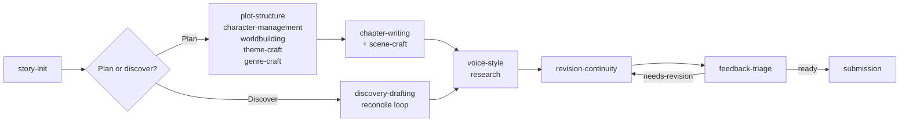

# Writing workflows

This page is for writers who draft with an AI agent (Claude Code, Codex, or another Agent Skills host) and want to know which skills to use, in what order, and which checks to run. It walks through complete workflows, from a blank project to a submission package, with the prompts you would type and the project state each one leaves behind.

For what the files mean, see [Core concepts](concepts.md) and the [Project format reference](project-format.md). For every command and flag, see the [CLI reference](cli-reference.md). For a one-paragraph summary of each skill, see the [Skills catalogue](skills.md).

## Choose your path

Each workflow stands on its own, so skip the ones that do not apply to your book.

| Workflow | Use it when | Main skills |
|----------|-------------|-------------|
| [Plotting-first](#plotting-first-from-premise-to-chapter-one) | You want the structure, cast, and world planned before any prose | `plot-structure`, `chapter-writing` |
| [Discovery drafting](#discovery-drafting) | You want to write without an outline and build the bible afterwards | `discovery-drafting` |
| [Scene-level craft](#scene-level-craft) | A single scene needs planning or repair | `scene-craft` |
| [Theme](#theme) | You want the premise, arcs, and motifs to carry the theme | `theme-craft` |
| [Voice and house style](#voice-and-house-style) | You want consistent spelling, usage, and voice across chapters | `voice-style` |
| [Research](#research) | The book depends on real-world facts | `research` |
| [Revision passes](#revision-passes) | You have a draft to improve | `revision-continuity` |
| [Feedback triage](#feedback-triage) | Alpha or beta readers have sent notes | `feedback-triage` |
| [Submission prep](#submission-prep) | The manuscript is finished and going to agents or retailers | `submission` |

Every workflow has the same layout: the goal, the skills involved, numbered steps with example prompts, the checks to run, and the result. If you are new, read [How the workflows fit together](#how-the-workflows-fit-together) and [Before you start](#before-you-start) first. [Checks by workflow](#checks-by-workflow) at the end is a quick reference.

## How the workflows fit together

A Story Skills project moves through the same broad stages whatever your method. The skills below are the ones that own each stage; the `story` CLI runs the mechanical checks between them.



| Stage | Skills | Main CLI checks |
|-------|--------|-----------------|
| Set up | `story-init` | `story init`, `story validate`, `story next` |
| Plan | `plot-structure`, `character-management`, `worldbuilding`, `theme-craft`, `genre-craft` | `story reindex`, `story links`, `story validate` |
| Draft | `chapter-writing` or `discovery-drafting`, with `scene-craft` | `story wordcount --write`, `story continuity`, `story progress --log` |
| Keep it consistent | `voice-style`, `research` | `story prose`, `story validate` |
| Revise | `revision-continuity`, `theme-craft` (theme audit) | `story continuity`, `story doctor`, `story compare` |
| Get outside readers | `feedback-triage` | `story continuity`, `story validate` |
| Send it out | `submission` | `story synopsis`, `story build --format shunn` |

Sequels and prequels add `series-continuity` on top of any of these; see [Series](series.md).

## Before you start

### How skills get picked up

You do not call a skill by name. Each skill's `description` lists the phrases that trigger it, so the agent loads the right one when you ask in plain language: "start a new story" loads `story-init`, "write the next chapter" loads `chapter-writing`, "process beta reader feedback" loads `feedback-triage`. You can also name the skill directly ("use the scene-craft skill to check this scene") when a request could match more than one.

The prompts on this page are examples. Rephrase them freely; the skill asks for anything it needs that is not in the project files.

### How the agent runs the CLI

Every skill uses the first CLI it finds: the installed `story` command, then `bun run story --` from a Story Skills checkout, then the bundled fallback that ships inside the `story-maintenance` skill. If none is available, the skill does the registry, backlink, and word-count work by hand. [Core concepts](concepts.md#the-bundled-fallback-cli) explains the lookup, and [Getting started](getting-started.md#install-the-story-cli) covers installation.

The commands on this page use `story` and assume you are in the project root, so the path argument is `.`.

### The maintenance loop

Almost every workflow ends with some subset of these five commands:

| Command | Run it when | What it does |
|---------|-------------|--------------|
| `story wordcount . --write` | Prose changed | Recounts prose under `## Chapter Text` and writes `word-count` into chapter frontmatter |
| `story reindex .` | You hand-edited entity files | Rebuilds every `_index.md` registry table from the files |
| `story links .` | References changed | Checks that every id points at a real file and that backlinks exist both ways |
| `story validate .` | Always, last | Checks structure, frontmatter fields and values, and registries |
| `story continuity .` | Chapters or scenes changed | Checks deaths, question, promise, and clue ordering, casts, and `continuity/state.md` |

`story add` rebuilds the registries itself, so you only need `story reindex .` after editing files by hand. `story next .` runs `validate`, `links`, and `continuity` and turns their results into a prioritised to-do list, which makes it a good way to start a session.

## Plotting-first: from premise to chapter one

**Goal:** plan the story's structure, cast, and world before drafting, then write chapters from approved outlines.

**Skills, in order:** `story-init` → `plot-structure` → `character-management` → `worldbuilding` → (`theme-craft`, `genre-craft`) → `chapter-writing`.

The running example on this page is a new book, *The Gannet Point Light*: a 1950s coastal mystery about Nell Carrow, a lighthouse keeper's daughter. It is a different project from *The Tide Room* in [Getting started](getting-started.md), and the later workflows on this page keep using it.

### 1. Create the project

```text
Start a new story. It's a coastal mystery set in the 1950s, third-person
limited, past tense. A lighthouse keeper's daughter finds a drowned man in
the tide room. Themes: grief and duty.
```

The [`story-init`](../skills/story-init/SKILL.md) skill asks for anything missing (title, sub-genre, setting era, 2 to 4 themes, POV, tense), then scaffolds the project with the CLI:

```shell
story init "The Gannet Point Light" --genre mystery --sub-genre coastal \
  --setting-era 1950s --pov third-person-limited --tense past \
  --synopsis "A lighthouse keeper's daughter finds a drowned man in the tide room." \
  --theme grief --theme duty
```

It then fills in the `story.md` bible: the synopsis, a Tone & Style section derived from the genre and themes, and a working `premise` and `counter-premise`. Treat both as guesses. The skill says to revise the premise later if the draft argues something different, rather than bending the draft to fit.

The skill finishes with `story validate` and suggests `story next` as a next step. A fresh project is valid, and `story next` tells you where to go:

```text
# Next Writing Actions: The Gannet Point Light

Checks: validate ok (0 errors, 0 warnings), links ok (0 errors, 0 warnings), continuity ok (0 errors, 0 warnings)

Actions:
- [P2] Draft chapter 1: Use story add chapter "Chapter 1" --number 1, then outline scenes to establish the next story beat.
- [P2] Create first character: Use story add character "Name" --role protagonist before drafting prose.
```

If you already have a manuscript, skip this step and use `story import` instead; see [Import, export, and builds](manuscripts.md#import-an-existing-manuscript).

### 2. Choose a structure and build the main arc

```text
What story structure fits this book? Then help me build the main arc.
```

[`plot-structure`](../skills/plot-structure/SKILL.md) reads `story.md`, recommends a model from its [structure models reference](../skills/plot-structure/references/structure-models.md) (three-act, hero's journey, Save the Cat, kishotenketsu, five-act, Fichtean curve, Harmon's story circle), sets `structure` in `plot/_index.md`, and writes the beat sheet. It then builds the arc through conversation (setup, escalations, climax, resolution) and saves it to `plot/arcs/`:

```shell
story add arc "The Drowned Stranger" --type main --character nell-carrow --theme grief
```

Useful follow-up prompts:

```text
Add a plot point: in chapter 6 Nell finds the lamp log has been altered.
Track foreshadowing for the altered log. Plant it in chapter 2.
Which MICE threads does this arc open, and in what order should they close?
How far should I outline before drafting?
```

The last one uses the [outlining ladder](../skills/plot-structure/references/outlining-ladder.md): premise, beat sheet, step outline, full outline, each with an exit criterion. Most novels stop at the step outline.

When a plot point creates a mystery or a setup that needs a payoff, the skill records it in the continuity ledgers, not only in the arc:

```shell
story add question "Who was the drowned man" --introduced chapter-01
story add promise "The Lamp Log" --planted chapter-01
```

Plans can name characters and chapters that do not exist yet, but `story links` treats every id without a file as an error. At this stage, before the cast or any chapter scaffold exists, it reports:

```text
Link check failed: 3 errors, 0 warnings, 0 dismissed
error: plot/arcs/the-drowned-stranger.md references missing character nell-carrow
error: continuity/questions/who-was-the-drowned-man.md references missing chapter chapter-01
error: continuity/promises/the-lamp-log.md references missing chapter chapter-01
```

`story validate` still passes, because it checks structure rather than references. The character error clears in step 3. Chapter ids in ledgers, arc bodies, and `plot/timeline.md` stay errors until those chapters exist, so either scaffold them with `story add chapter` or expect these errors until you draft that far. If you would rather keep `story links` clean throughout, build the cast before the arc.

### 3. Build the cast

```text
Create the protagonist, Nell Carrow. She's twenty-three and has kept the
light alongside her father since her mother drowned.
```

[`character-management`](../skills/character-management/SKILL.md) asks for a role (`protagonist`, `antagonist`, `supporting`, `minor`, `narrator`, or `deuteragonist`) and then works through appearance, personality, backstory, external want and internal need, voice (it will ask for sample dialogue), arc, and key life events. It writes `characters/nell-carrow.md` from its [character template](../skills/character-management/references/character-template.md), or runs `story add character "Nell Carrow" --role protagonist` and fills the file in.

Relationships are always written both ways. Ask for one and the skill adds the inverse to the other character's file and updates the Relationship Map in `characters/_index.md`:

```text
Silas Carrow is Nell's father. Add the relationship and start a family tree.
```

### 4. Build the world

```text
Create the lighthouse at Gannet Point as a location.
Design the harbor's smuggling economy as a system.
Add the Coastguard Board as a government faction.
```

[`worldbuilding`](../skills/worldbuilding/SKILL.md) handles locations, systems (magic, political, technology, religion, economic, military, social, education), factions, and artifacts. Each goes in its own folder under `worldbuilding/` and is cross-linked to the characters who use it: a location's `notable-characters` must match each character's `locations` list, a faction's `members` must be real character ids, and an artifact's `owner` must be a real character or faction. `story links` reports any reference that points nowhere and any location or character that is missing its backlink.

### 5. Add the thematic and genre layers (optional)

Run these two skills before drafting if the book depends on them:

```text
Give Nell a lie, a truth, and a ghost wound. Is her arc positive or flat?
Design the antagonist as the counter-argument to the premise.
This is a mystery. Set up the fair-play rules and the clue ledger.
```

[`theme-craft`](../skills/theme-craft/SKILL.md) adds `arc-type`, `lie`, `truth`, and `ghost-wound` to character files; see [Theme](#theme) below. [`genre-craft`](../skills/genre-craft/SKILL.md) loads the pack for the genre in `story.md` (mystery, romance, thriller, horror, MG/YA, science fiction, or serial) and applies its constraints up front. For a mystery that means ledgering every clue:

```shell
story add clue "The wet footprints" --planted chapter-02 --payoff chapter-09 --significance-delayed
```

`--significance-delayed` marks a clue the reader sees before understanding it. `story continuity` reports a payoff chapter that comes before the planted chapter as an error.

Record any deliberate break from a genre's conventions in `story.md` with a reason, so a later audit does not "fix" it.

### 6. Write chapters outline-first

```text
Write the next chapter.
```

[`chapter-writing`](../skills/chapter-writing/SKILL.md) follows the same five steps every time:

1. **Gather context.** It reads `story.md`, `style-sheet.md`, the chapter, plot, and scene registries, `plot/timeline.md`, `continuity/state.md`, the open questions and promises, the previous chapter, and the active arcs.
2. **Scope the chapter.** It asks what the chapter covers, whose POV, and which locations, and suggests the next beats from the arcs.
3. **Outline.** It proposes a beat-by-beat outline: what each beat accomplishes, POV and location, which plot points advance, what to plant or pay off, and which state changes to record. You approve or revise it before any prose is written.
4. **Draft.** It writes the prose in the POV character's voice and the tense from `story.md`, into `chapters/chapter-NN.md`, with the approved outline kept above `## Chapter Text`. Word counts start at that heading, so the outline never inflates them. It also creates a `scenes/chapter-NN-scene-NN.md` record for each scene.
5. **Update everything else.** Chapter registry, timeline, arc plot points, scene records, `continuity/state.md`, foreshadowing status. It flags character changes (an injury, a revelation) for you to confirm.

The chapter-writing skill checks whether the separate [`better-writing`](https://github.com/forjd/better-writing) skill is installed. If it is, the agent uses it for a final prose pass. If not, the agent asks before installing anything and otherwise falls back to its own [writing guidelines](../skills/chapter-writing/references/writing-guidelines.md).

The chapter and scene scaffolds come from the CLI:

```shell
story add chapter "The Drowned Man" --number 1 --pov nell-carrow --arc the-drowned-stranger
story add scene "Low Water" --chapter chapter-01 --scene 1 --pov nell-carrow --location gannet-point-light
```

### Checks

After each chapter, `chapter-writing` runs:

```shell
story wordcount . --write
story reindex .
story links .
story validate .
story next .
story progress . --log
```

`story next .` summarises continuity warnings as a single action. Run `story continuity .` to see them in full, because that is where most first-draft slips show up. Here is what it reported on the example chapter before the cast lists were filled in:

```text
Continuity is consistent: 0 errors, 3 warnings, 0 dismissed
warning: chapters/chapter-01.md POV character nell-carrow is not listed in characters
warning: scenes/chapter-01-scene-01.md POV character nell-carrow is not listed in characters
warning: scenes/chapter-01-scene-01.md is set in gannet-point-light but chapters/chapter-01.md does not list that location
```

Adding `nell-carrow` to both `characters` lists and `gannet-point-light` to the chapter's `locations` clears all three. `story continuity` also warns when `current-chapter` in `continuity/state.md` falls behind the latest drafted chapter, but it cannot tell whether the state entries themselves are complete, so bringing the state forward stays part of step 5.

Set `target-words` and `deadline` in `story.md` and `story progress` measures pace against them. `--log` also appends the session to `progress.md`:

```text
Logged 132 words for 2026-09-24 in /path/to/the-gannet-point-light/progress.md
Progress: 132 of 80,000 words (0.2%)
Remaining: 79,868 words
Deadline: 2027-03-31 (188 days left): 425 words a day needed
Sessions: 1 logged; last 2026-09-24 (+0 words since)
Progress checked: 0 errors, 0 warnings, 0 dismissed
```

### Result

```text
the-gannet-point-light/
├── story.md                 # bible with premise, themes, target-words
├── style-sheet.md
├── progress.md              # session log from story progress --log
├── characters/              # nell-carrow.md, silas-carrow.md + _index.md
├── worldbuilding/
│   ├── locations/gannet-point-light.md
│   └── factions/coastguard-board.md
├── plot/
│   ├── _index.md            # structure model, arcs table, theme tracking
│   ├── arcs/the-drowned-stranger.md
│   └── timeline.md
├── chapters/chapter-01.md   # outline above ## Chapter Text, prose below
├── scenes/chapter-01-scene-01.md
└── continuity/
    ├── state.md
    ├── questions/who-was-the-drowned-man.md
    ├── promises/the-lamp-log.md
    └── clues/the-wet-footprints.md
```

The tree leaves out the `_index.md` registries that `story init` creates for each domain, and `glossary/` is there from `story init`, empty until you add terms.

For a fuller planned project, open [`examples/harbor-of-second-light`](../examples/harbor-of-second-light/story.md) or [`examples/the-last-ember`](../examples/the-last-ember/story.md).

## Discovery drafting

**Goal:** write without an outline and keep the bible accurate by reconciling each chapter into it afterwards.

**Skills, in order:** `story-init` → `character-management` (one character is enough) → `discovery-drafting` → `revision-continuity` at the midpoint and the end.

[`discovery-drafting`](../skills/discovery-drafting/SKILL.md) is the counterpart to outline-first `chapter-writing`. You still get a bible; it is written after the prose rather than before. The skill says not to use it for mysteries or other clue-dependent books where setups must be planted before payoffs. For those, plan with `chapter-writing` and the `genre-craft` mystery pack. You can mix modes per chapter.

### 1. Write the kernel

```text
I want to discovery-write this one. Help me write a story kernel.
```

The kernel is one paragraph of 3 to 6 sentences: a character in an unstable situation, a want, an obstacle or pressure, and a tone signal. It deliberately leaves out plot beats, an ending, a theme statement, a cast list, and worldbuilding. The [kernel reference](../skills/discovery-drafting/references/story-kernel.md) gives this example:

```markdown
A retired cartographer who falsifies maps for smugglers discovers her
latest commission describes a city that shouldn't exist — and someone is
paying in real gold to reach it. She wants the money and wants to know if
she drew something true by accident. The client is lying about why they
need the route, and her old guild contacts are watching. A tense,
low-magic caper with the unease of a ghost story.
```

The skill stores it under `## Story Kernel` in `story.md` and sets `draft-mode: discovered` in the frontmatter. It also agrees a writing target with you, records the daily rhythm in a `## Draft Log` or `## Notes` section, and sets `target-words` (and `deadline`, if you have one) in `story.md`.

### 2. Draft forward

```text
Let's write chapter one. Just go, don't stop to plan.
```

Each session has three parts, described in the [drafting cadence reference](../skills/discovery-drafting/references/drafting-cadence.md):

1. **Re-read** the kernel, the previous chapter's post-hoc notes, and the last few pages. No editing.
2. **Write forward.** When the agent needs a fact it has not settled, it leaves `[TODO: check bible]` inline and keeps going. When stuck, it goes back a few hundred words and tries a different choice.
3. **Close** with a `[TODO]` note above `## Chapter Text` saying where the next session starts.

The inline `[TODO: check bible]` markers sit in the prose until the reconcile loop clears them, and they count towards the chapter's words in the meantime. Only the end-of-session note goes above `## Chapter Text`: anything below that heading is counted by `story wordcount` and shipped by `story export`, so a stray TODO left in the prose ends up in the book.

Discovery changes the planning order, not the prose standard: the skill still reads `style-sheet.md` and uses the `scene-craft` tools.

The chapter scaffold records the mode:

```shell
story add chapter "What the Sea Kept" --mode discovered
```

### 3. Run the reconcile loop after every chapter

```text
Reconcile chapter one into the bible.
```

The [reconcile loop](../skills/discovery-drafting/references/reconcile-loop.md) runs after every chapter and before the next:

1. **Extract** new entity candidates (characters, places, factions, objects, rules) and new promises and questions. The agent lists them and waits for your approval before creating any file, the same way `story import` handles candidates.
2. **Reverse-outline** the chapter: one line per scene, the state changes, and anything planted. This goes into the chapter file above the prose and into `scenes/` records.
3. **Diff** against the bible. Each finding is *new*, *contradiction*, *enrichment*, or *dangling*.
4. **Reconcile.** Every diff ends in one of two outcomes: update the bible, or revise the chapter. Leaving both as they are is not allowed, because an unresolved diff becomes a continuity bug.

The chapter then gets a `## Chapter Notes (post-hoc)` section above `## Chapter Text` recording what was discovered, what was cut or left dangling, and open questions. The next session starts by reading it.

### 4. Batch reviews and dead ends

Every 3 to 5 chapters:

```text
Run a batch review of chapters 4 to 7. Anything dead?
```

The agent rereads the post-hoc notes, sweeps the promise and question ledgers for setups with no plausible payoff, and applies the [dead-ends reference](../skills/discovery-drafting/references/dead-ends.md). A thread is a dead end when it meets two of three tests: it has not advanced for two consecutive chapters, removing it changes nothing downstream, and the post-hoc notes say the interest is gone. A thread with a payoff recorded in `continuity/promises/` is a slow burn, not a dead end. For each dead end you decide with the agent whether to cut it clean, fold its best element into another thread, or prune it to a single scene or mention.

Cut threads are logged, not deleted. An abandoned promise, question, or clue keeps its file with `status: abandoned` and a recorded reason, and a cut character keeps their file with `status: cut` and is dropped from casts, relationships, and arcs. `story validate` accepts both statuses. Each cut also goes into a `## Cut Threads` log in the project notes, so a later book can find the material.

At the midpoint and at draft completion, the skill hands the batch to `revision-continuity` for developmental checks before you continue.

### Checks

After each reconcile loop:

```shell
story wordcount . --write
story reindex .
story links .
story validate .
story continuity .
```

Log each session with `story progress . --log`. `story validate` warns about chapters that have no scene records yet, which in a discovery project usually means the reverse outline has not been done:

```text
warning: chapters/chapter-02.md has no machine-readable scene records
```

### Result

The layout is the same as a plotted project. The differences are in the content:

- `story.md` has `draft-mode: discovered`, a `## Story Kernel` section, and a draft log.
- Each discovered chapter has `mode: discovered`, a reverse outline, and a `## Chapter Notes (post-hoc)` section above `## Chapter Text`.
- Arcs, locations, and most characters appear only once a reconcile loop has approved them.
- Cut material stays in place with `status: cut` or `status: abandoned`.

When the draft is complete, any `mode: discovered` chapter without post-hoc notes counts as unfinished maintenance. The skill flags these before handing the manuscript to revision.

## Scene-level craft

**Goal:** plan or repair individual scenes: pacing, dialogue, viewpoint, exposition, flashbacks, and openings.

**Skills:** `scene-craft`, used inside `chapter-writing` while planning and inside `revision-continuity` while revising.

### 1. Name the problem

Describe the scene and what feels wrong:

```text
The scene after the body is found feels rushed. Plan a sequel for it.
Chapter 4's argument between Nell and Silas reads flat. Check the subtext.
Does chapter one's first page hook?
I need a flashback to the night Nell's mother drowned. Where should it go?
```

[`scene-craft`](../skills/scene-craft/SKILL.md) starts by identifying which problem you have, then loads the matching reference:

| Symptom | Reference |
|---------|-----------|
| Incidents with no breathing room | [Scene and sequel](../skills/scene-craft/references/scene-sequel.md): reaction, dilemma, decision |
| The middle sags or resolves too easily | [Try/fail cycles](../skills/scene-craft/references/try-fail.md) |
| Several POVs or timelines to order | [Scene cards](../skills/scene-craft/references/scene-cards.md) |
| Flat conversation or voices that blur | [Dialogue subtext](../skills/scene-craft/references/dialogue-subtext.md) and the tag-swap test |
| Distant narration or head-hopping | [Deep POV and psychic distance](../skills/scene-craft/references/deep-pov.md) |
| World facts piling up undelivered | [Exposition](../skills/scene-craft/references/exposition.md) |
| A flashback or time jump | [Flashbacks and time](../skills/scene-craft/references/flashbacks-time.md) |
| The book's opening or a character introduction | [Openings](../skills/scene-craft/references/openings.md) |

### 2. Plan the scene

The skill does not guess at scene purpose, viewpoint, location, or whether a change alters canon. It asks. It writes the planning inputs (sequel beats, try/fail positions, subtext wants, zoom level) into the chapter outline or a `## Planning` or `## Scene Card` section of the scene file, so they are not only in the chat.

### 3. Record it in the scene file

The skill also records the result in scene frontmatter. A sequel scene can be scaffolded directly:

```shell
story add scene "The Keeper's Choice" --chapter chapter-01 --scene 2 \
  --pov nell-carrow --sequel --dilemma "Tell her father or hide the body"
```

which produces:

```yaml
---
title: "The Keeper's Choice"
chapter: chapter-01
scene: 2
pov: nell-carrow
location: ""
characters: []
mentions: []
arcs-advanced: []
status: outline
date: ""
time: ""
sequel: true
dilemma: Tell her father or hide the body
state-changes: []
---
```

The scaffold's body has only `## Purpose` and `## Continuity Notes`; the skill adds a `## Sequel` section with the reaction, dilemma, and decision beats.

For flashbacks, the skill sets `flashback-to:` (a free-text note that `story validate` checks is a single value and continuity checks ignore) and moves characters who appear only in the flashback to `mentions`, so `story continuity` does not flag a dead character as present.

### 4. Leave deliberate rule-breaking alone

The skill will not rewrite prose just to satisfy a checklist. If a scene breaks a rule on purpose (a deliberate info dump, say), it notes that in the scene's planning notes so a later audit leaves it alone.

### Checks

```shell
story reindex .
story links .
story validate .
story continuity .
```

### Result

Scene files in `scenes/` carry `sequel`, `dilemma`, `flashback-to`, and complete `state-changes`, plus planning sections in the body. Canon changes (new knowledge, moved objects, changed relationships) are reflected in `continuity/state.md` and the affected entity files.

## Theme

**Goal:** make the theme do work in the story: a premise the ending proves, characters whose arcs test it, and motifs that pay off.

**Skill:** [`theme-craft`](../skills/theme-craft/SKILL.md), at story start, during character design, and after a full draft. Theme runs alongside drafting rather than after it, and is best started with the premise.

### 1. Set a working premise

```text
Help me sharpen the premise and counter-premise.
```

The skill writes a one-sentence controlling idea (value plus cause) and its counter-premise, stored as `premise:` and `counter-premise:` in `story.md`. If you would rather find the theme in the draft, the skill records `premise: tbd-discovery` and moves on.

### 2. Give the main characters a lie and a truth

```text
Build the lie/truth machinery for Nell and for the antagonist.
```

For the protagonist, the antagonist, and any supporting character whose arc touches the theme, the skill adds `arc-type` (`change-positive`, `change-negative`, or `flat`), `lie`, `truth`, and `ghost-wound` to the character file. It checks the character's turning points against the arc type. A flat arc needs escalating tests of conviction. A negative arc needs the truth offered and refused.

### 3. Make the antagonist the counter-argument

The antagonist gets a defensible belief in the counter-premise, a want, a wound, a plan, and scenes the antagonist wins.

### 4. Choose and track motifs

```text
Choose two or three motifs and track them.
```

The skill picks two or three concrete motifs and tracks them with `planned`, `planted`, and `paid-off` status in `continuity/motifs.md` or a motif table in an arc file.

### 5. Audit the finished draft

```text
Run a theme audit on the finished draft.
```

After a complete draft, the audit asks: does the ending answer the opening's value question, is the theme shown through consequence rather than commentary, and do the motifs pay off? The findings go in `continuity/theme-audit.md` with a `theme-holds` or `theme-broken` verdict. Structural findings go to `revision-continuity` as a developmental plan. The skill will never fix a theme finding by adding a speech or a narrator's summary that explains the theme. It reworks the characters' choices instead.

### Checks

The CLI has no theme-specific checks: the premise and arc fields are for you and the agent, and the CLI does not read `continuity/motifs.md` or `continuity/theme-audit.md`. The maintenance pass still keeps the edited `story.md` and character files valid:

```shell
story reindex .
story links .
story validate .
```

### Result

`story.md` has `premise` and `counter-premise` (or `premise: tbd-discovery`). The protagonist, the antagonist, and any character whose arc touches the theme carry `arc-type`, `lie`, `truth`, and `ghost-wound`. Motifs are tracked in `continuity/motifs.md` or an arc file, and after a full draft `continuity/theme-audit.md` holds the verdict.

## Voice and house style

**Goal:** keep the voice and surface conventions the same across chapters, sessions, and agents.

**Skill:** [`voice-style`](../skills/voice-style/SKILL.md). `chapter-writing`, `discovery-drafting`, and `revision-continuity` all read the style sheet it maintains. Start once there is a first chapter or a writing sample.

### 1. Build the style sheet

```text
Set up the style sheet from the first two chapters. We're using American spelling.
```

The skill reads `story.md`, the existing `style-sheet.md`, and two or three drafted chapters (or asks you for a sample paragraph, or three published books whose voice is close). It fills in the style sheet from decisions the prose has already made. Where the draft is inconsistent, *grey* in one chapter and *gray* in another, it asks you which wins instead of choosing. The frontmatter is machine-readable:

```yaml
---
type: style-sheet
dialect: american
preferred: []
watch-words:
  - rocks
allow-words:
  - slowly
---
```

### 2. Lint the prose

```text
Lint the prose.
The voice drifted in chapter 9. Check it against the style sheet.
```

`story prose .` checks every chapter against the style sheet. On the example chapter, with that style sheet:

```text
Prose report: 1 chapter, 132 words

chapters/chapter-01.md: The Drowned Man (132 words)
  Sentences: 11, average 12.0 words, longest 20, spread 4.0
  Filter words: 23.1 per 1k narration words (felt 1, saw 1, thought 1)
  -ly adverbs: 15.4 per 1k narration words (completely 1, suddenly 1)
  Dialogue tags: said 1; said-bookisms: none
  Echoes within 30 words: rocks 1
  Watch words: rocks 3
  Spelling: grey 1 (use gray)

Manuscript:
  Repeated 4-word phrases: none
  Similar character names: none
Prose check complete: 0 errors, 1 warnings, 0 dismissed
warning: chapters/chapter-01.md uses "grey" once; american dialect prefers "gray"
```

The chapter opens with "The tide had gone out slowly", but `slowly` is in `allow-words`, so it is not counted as an adverb.

### 3. Act on the findings

How the skill handles findings:

- Avoided spellings are always fixed.
- Rates, echoes, and repeated phrases are prompts to reread, not orders. If a flagged word is right, it stays, and a word the book uses on purpose goes into `allow-words`.
- Similar character names are raised with you first. If you agree to a rename, it uses `story rename character <id> "<New Name>"` so every reference follows.

`story prose` exits 0 unless a file cannot be read, so it never blocks anything. See [Continuity and analysis](continuity.md#what-each-line-measures) for what each count measures.

### Checks

After editing the style sheet or revising prose:

```shell
story validate .
story prose .
story wordcount . --write
story links .
```

### Result

`style-sheet.md` records the book's `dialect`, `preferred` spellings, `watch-words`, and `allow-words` in frontmatter, with voice, usage, and character-voice decisions in the body. Chapters use the preferred spellings, and any rename has gone through `story rename` so every reference follows.

## Research

**Goal:** get real-world details right and keep a record of where each fact came from and which chapters depend on it.

**Skill:** [`research`](../skills/research/SKILL.md). It covers history, science, law, medicine, trades, and real places. For invented world facts use `worldbuilding`.

```text
Research how a 1950s lighthouse lamp rotation actually worked. Chapter 1 depends on it.
Is it accurate that a body would surface after three days in cold water?
Fact-check chapter 6 before I mark it final.
```

### 1. Open a note

The skill opens a note for each topic with the CLI, which creates the `research/` folder and registry on first use:

```shell
story add research "Lighthouse lamp rotation" --used-in chapter-01
```

The note has `## Question`, `## Findings`, and `## Story Use` sections and starts at `status: open`. Add `--source "<citation or URL>"` (repeatable) to record sources up front.

### 2. Research and record sources

The agent uses whatever research tools the session has (web search, documents you supply). With none, it lists what needs checking and asks you for sources. Every finding is recorded with its source, and every source goes into the `sources` list.

### 3. Set the status honestly

A fact the agent recalls without a source stays `open`. A note becomes `verified` only when every finding the chapters rely on has a source. When sources disagree it becomes `disputed`, with both sides recorded.

### 4. Connect it to the story

`used-in` lists every chapter that relies on the note. `## Story Use` records deliberate departures (a compressed timeline, an invented institution); a recorded departure is a choice, not an error.

For sensitive or lived-experience topics the skill suggests an authenticity reader as well as sources, and records their notes through `feedback-triage`.

### Checks

```shell
story reindex .
story links .
story validate .
```

`story validate` catches the case that matters most: a settled chapter resting on unsettled research. Marking chapter 1 `final` while its note is still open gives:

```text
Project is valid: 0 errors, 2 warnings, 0 dismissed
warning: research/lighthouse-lamp-rotation.md is open but chapter-01 relies on it and is final
warning: chapters/chapter-02.md has no machine-readable scene records
```

It also warns about a `verified` note with no sources.

### Result

The project gains a `research/` folder with an `_index.md` registry and one kebab-case note per topic, each listing its `sources` and `used-in` chapters. `story rename` and `story remove` keep `used-in` current when chapters change.

## Revision passes

**Goal:** improve a draft in deliberate passes without breaking continuity, and be able to see and undo what each pass changed.

**Skill:** [`revision-continuity`](../skills/revision-continuity/SKILL.md), with `theme-craft`, `voice-style`, `research`, and `genre-craft` supplying the specialised audits.

### 1. Pick a pass

The skill asks which pass you want unless you say. Each one reads and updates a specific set of files:

| Pass | Ask for it with | What it does |
|------|-----------------|--------------|
| Continuity audit | "Continuity check chapters 1 to 10" | Contradictions, stale references, timeline problems, missing backlinks, word-count drift |
| Developmental revision | "Developmental edit: the middle drags" | Structure, scene purpose, motivation, pacing, stakes, arc progression |
| Reverse outline | "Reverse-outline the draft" | One line per chapter written from the prose alone, then compared with the plot files |
| Theme audit | "Does the ending prove the premise?" | Ending against the opening's value question, consequence against commentary, motif payoff |
| Pacing waveform | "Map the tension across the book" | Tension per chapter, dead zones, back-to-back peaks; uses `story timeline .` for POV balance |
| Reveal economy | "Are my reveals earned?" | Every reveal planted beforehand, reveals spaced rather than clustered |
| Removability audit | "Which scenes could I cut?" | Scenes whose removal changes nothing downstream: wire them in, fold them, or cut them |
| Line edit | "Line edit chapter 3" | Clarity, voice, rhythm, dialogue, sensory detail, guided by `story prose .` |
| Copyedit | "Copyedit against the style sheet" | Hyphenation, capitals, names, numbers, surface details like hair colour and room layouts |
| Fact check | "Fact-check chapter 6" | Research notes whose `used-in` lists the chapter |
| Proof/polish | "Proofread chapter 12" | Small wording, grammar, repetition, and formatting fixes |

For genre books, add the audit checklist at the end of the relevant [`genre-craft`](../skills/genre-craft/SKILL.md) pack (fair play for a mystery, the HEA contract for romance, the ticking clock for a thriller) to a developmental pass.

### 2. Snapshot before a multi-chapter pass

Before any pass that touches more than one chapter, the skill takes a snapshot named after the draft it preserves (`draft-1`, `pre-beta-edit`):

- **In a git repository**, it asks before committing, then commits and tags: `git add -A && git commit -m "Draft 1 before developmental pass" && git tag draft-1`. It never pushes, rewrites history, or deletes tags without your approval.
- **Without git**, it offers `git init`. If you decline, it copies the project folder next to the original (`../the-gannet-point-light-draft-1`), never inside it, where `story` commands would scan the copy.

### 3. Plan, edit, and update

The skill reads the chapter, its neighbours, the scene files, and every entity the chapter references, and writes a short plan: what changes, what must stay fixed, and which other files are affected. It then edits the markdown directly and updates what depends on it: chapter `status` (`draft` to `revised`, and to `final` only when appropriate), the timeline, scene records, continuity state and ledgers, arc foreshadowing, and character or location files.

```text
Revise chapter 3 so Nell hides the log instead of burning it. Keep continuity.
```

### 4. Compare with the snapshot

After the pass, the skill reports how deep it went:

```shell
story compare . --ref draft-1
story compare . --against ../the-gannet-point-light-draft-1
```

Against a folder copy, after a copyedit that changed *grey* to *gray* in chapter 1 and a new chapter 3, the report reads:

```text
Compared with /path/to/the-gannet-point-light-draft-1
Chapters: 2 then, 3 now (1 added, 0 removed)
Words: 132 then, 132 now (±0)

- chapter-01 The Drowned Man: 132 -> 132 words (±0), 0% of paragraphs unchanged
- chapter-02 What the Sea Kept: unchanged (0 words)
- chapter-03 The Keeper's Log: added (0 words)
Comparison complete: 0 errors, 0 warnings, 0 dismissed
```

Chapter 1's prose is a single paragraph, so one changed word leaves 0% of its paragraphs unchanged. Chapters are matched by id, so a renumbered chapter shows as one removed and one added. `story compare` reads git but never commits or tags.

### Checks

```shell
story wordcount . --write
story reindex .
story links .
story validate .
story continuity .
story doctor .
```

The skill runs `story compare` from step 4 as well. If `story.md` has `follows` or `precedes` links to other books, the skill also runs `story series .`; see [Series](series.md).

For a continuity audit, `story continuity .` goes first and the agent checks what it cannot: character knowledge, carried-forward injuries and alliances, travel time, world rules, and whether frontmatter lists every major character and location in the prose. `story knowledge <character> --at <chapter>` answers "did she know this yet?" from `continuity/state.md`. See [Continuity and analysis](continuity.md) for both commands and for [exemptions](continuity.md#exemptions).

### Result

You end up with revised chapters at `status: revised`, updated scene and continuity records, a git tag or sibling folder holding the previous draft, and, depending on the pass, an updated `plot/timeline.md`, `continuity/theme-audit.md`, or `style-sheet.md`. For an audit you asked to read rather than apply, the agent returns findings ordered by severity with file references and concrete fixes, and changes nothing.

## Feedback triage

**Goal:** turn alpha and beta reader notes into decisions and a revision plan, without rewriting the book after the first reader replies.

**Skill:** [`feedback-triage`](../skills/feedback-triage/SKILL.md), which hands its plan to `revision-continuity`.

### 1. Set up the round

```text
I'm sending chapters 1 to 12 to three beta readers: Maria Chen, Tom Ashby, and Priya Nair. Set up round 1.
```

The skill creates `feedback/round-1/` with a stub per reader (`maria-chen.md`, `tom-ashby.md`, `priya-nair.md`) from its [feedback template](../skills/feedback-triage/references/feedback-template.md). The frontmatter records `reader`, `round`, `chapters-read`, and `overall-verdict`. The list of stubs is the round's checklist. Two to four readers is typical; the skill treats one reader as a data point rather than a round.

### 2. Collect feedback

```text
Here are Maria's notes. Record them.
```

Notes are quoted or closely paraphrased, never invented, and ambiguous notes are marked as ambiguous. Each problem gets a canon check: verified against the bible, contradicts canon (usually a sign that a setup is missing), or outside canon scope.

The rule that matters most is that **nothing gets revised until every reader in the round has reported.** Revising on partial feedback tunes the book to the first reader and spoils the others' reads. If a reader is late, you either wait or close the round without them, and the synthesis records that.

### 3. Synthesise

```text
All three are in. Synthesize round 1.
```

Every finding goes into exactly one category:

| Category | Meaning | Default outcome |
|----------|---------|-----------------|
| Convergent | Two or more readers agree independently | Becomes a revision item |
| Divergent | Readers disagree | Adjudicated against canon and premise, with the winner and reason recorded |
| Single-reader | One reader only | Specific and checkable against canon: investigate. Vague and a matter of taste: usually declined |
| Declined-with-reason | Explicitly rejected | Must cite canon, premise, genre contract, or a craft principle |

The result is `feedback/round-1/synthesis.md` (see the [synthesis template](../skills/feedback-triage/references/synthesis-template.md)) with a `readiness` verdict of `ready`, `needs-revision`, or `not-ready`, and a numbered revision plan with file targets. Reader confusion often reveals a clarity gap, so the synthesis may also add or resolve `continuity/questions/` entries.

### 4. Hand off

On `needs-revision` or `not-ready`, the plan goes to `revision-continuity`, which makes the edits. On `ready`, the round is closed and you move to the next round, the next drafting stage, or submission.

### Checks

```shell
story reindex .
story links .
story validate .
story continuity .
```

The CLI ignores `feedback/`, so reader files never cause validation errors. The checks are there for the continuity questions the synthesis touches.

### Result

```text
feedback/
└── round-1/
    ├── maria-chen.md
    ├── tom-ashby.md
    ├── priya-nair.md
    └── synthesis.md      # readiness: needs-revision, plus the revision plan
```

## Submission prep

**Goal:** check that a finished manuscript is ready, draft the package agents or retailers expect, build it in submission format, and track where it has gone.

**Skill:** [`submission`](../skills/submission/SKILL.md). It prepares materials and records outcomes; you send everything yourself.

The skill reads `status`, `genre`, `sub-genre`, `premise`, `author`, and `contact` from `story.md`. If `status` is not `complete` or `revising`, it tells you the package can be drafted now but the readiness check will fail until the draft is finished.

The skill has hard limits. It never invents your bio, credentials, awards, or contact details (it leaves `[TODO: author to supply]` instead). It never invents agent names, guidelines, or responses. It never claims sales figures for comp titles. It never sends or uploads anything. Package copy describes the book as written, not as planned.

### 1. Readiness check

```text
Is the manuscript ready to query?
```

The skill runs:

```shell
story validate .
story links .
story continuity .
story prose .
story wordcount . --write
story report .
```

It then checks what the CLI cannot. There must be no validate, links, or continuity errors, and no avoided spellings. Every chapter must be at `revised`, `final`, or `complete`. No `[TODO` markers may remain in the prose. Every open question and planted promise must be resolved or deliberately left for a sequel. The word count must fall inside the range for the category in its [word-count norms](../skills/submission/references/word-count-norms.md), which the skill states as rough conventions for you to confirm. The verdict is `ready`, `ready-with-caveats`, or `not-ready`. Blockers go to `revision-continuity`.

### 2. Draft the package

```text
Write a one-line pitch and give me three variants.
Suggest comp titles.
Draft the query letter.
Write the 1-page and 3-page synopses.
Write back-cover copy and a retailer description.
```

| File | Contents |
|------|----------|
| `submission/query.md` | Chosen pitch at the top (protagonist, goal, obstacle, stakes, under 35 words), then the query: hook, one or two book paragraphs, metadata line (title, genre, word count to the nearest thousand, comps), bio placeholder. 250 to 350 words |
| `submission/comps.md` | Comparable titles, each with a one-line reason, marked unverified until you confirm year, category, and fit |
| `submission/synopsis-1-page.md` | About 500 words, present tense, third person, names in capitals on first use, ending revealed |
| `submission/synopsis-3-page.md` | About 1,500 words, same rules |
| `submission/blurb.md` | Tagline, 150 to 200 words of back-cover copy, optional retailer description. Never reveals the ending |
| `submission/tracker.md` | One row per submission, with status `queried`, `requested-partial`, `requested-full`, `offer`, `declined`, `no-response`, or `withdrawn` |

Each file has YAML frontmatter with a `type` (`query`, `comps`, `synopsis`, `blurb`, or `submission-tracker`) and `updated: YYYY-MM-DD`. Word counts in the copy come from `story wordcount .`, rounded to the nearest thousand.

The synopses start from the CLI, which stitches the `story.md` synopsis and each arc's Setup, Rising Action, Climax, and Resolution sections into a scaffold:

```shell
story synopsis . --pages 1 --out submission/synopsis-1-page.md
story synopsis . --pages 3 --out submission/synopsis-3-page.md
```

The agent then rewrites the scaffold into finished prose. If the scaffold is thin, the arc files are thin: the skill sends you back to `plot-structure` to fill them, then reruns.

### 3. Build the manuscript

Add `author` and `contact` to `story.md` first, because the title page uses them. Then:

```shell
story build . --format docx --shunn
story build . --format shunn
```

The first writes a Shunn-format Word file to `dist/<story-id>.docx`; the second writes a Shunn-format markdown file to `dist/<story-id>.shunn.md`. Shunn builds leave out `matter/` pages. For self-publishing, use `story build . --format epub` or `--format docx`. Builds go to `dist/`; see [Import, export, and builds](manuscripts.md#build-a-book) for formats and output paths.

### 4. Track submissions

```text
I queried three agents today. Add them to the tracker.
Summarize where the book stands.
```

The tracker is created the first time you report a submission, and every row comes from what you tell the agent. On request it summarises queries out, partial and full requests, offers, declines, and entries past the response window you set.

### Checks

After the readiness check, or after any change made for submission:

```shell
story wordcount . --write
story validate .
story continuity .
story prose .
```

The CLI does not validate `submission/`, and builds never include it. If the manuscript changes after the package is drafted, ask the agent to reread the package and update anything the revision made untrue.

### Result

```text
the-gannet-point-light/
├── story.md          # status: complete, plus author and contact
├── submission/
│   ├── query.md
│   ├── comps.md
│   ├── synopsis-1-page.md
│   ├── synopsis-3-page.md
│   ├── blurb.md
│   └── tracker.md
└── dist/             # disposable build output; safe to delete and rebuild
```

## Checks by workflow

Which commands each skill runs when it finishes. All take the project path, `.` here.

| Workflow | `wordcount --write` | `reindex` | `links` | `validate` | `continuity` | Other |
|----------|:---:|:---:|:---:|:---:|:---:|-------|
| Project setup (`story-init`) | | | | ✓ | | `next` (suggested) |
| Plot, character, world (`plot-structure`, `character-management`, `worldbuilding`) | | ✓ | ✓ | ✓ | | |
| Outline-first chapter (`chapter-writing`) | ✓ | ✓ | ✓ | ✓ | | `next`, `progress --log` |
| Discovery chapter (`discovery-drafting`) | ✓ | ✓ | ✓ | ✓ | ✓ | `progress --log` |
| Scene craft (`scene-craft`) | | ✓ | ✓ | ✓ | ✓ | |
| Theme (`theme-craft`) | | ✓ | ✓ | ✓ | | |
| Voice (`voice-style`) | ✓ | | ✓ | ✓ | | `prose` |
| Genre packs (`genre-craft`) | | ✓ | ✓ | ✓ | ✓ | |
| Research (`research`) | | ✓ | ✓ | ✓ | | |
| Revision (`revision-continuity`) | ✓ | ✓ | ✓ | ✓ | ✓ | `doctor`, `compare`, `series` if linked |
| Feedback (`feedback-triage`) | | ✓ | ✓ | ✓ | ✓ | |
| Submission (`submission`) | ✓ | | ✓ | ✓ | ✓ | `prose`, `report`, `synopsis`, `build` |

When in doubt, `story doctor .` runs the health checks and prints a repair step for each finding. For automating these checks on every push, see [Automation and CI](automation.md).

## See also

- [Skills catalogue](skills.md): each skill's triggers, files, and commands
- [Continuity and analysis](continuity.md): what the checks report and how to fix it
- [Series](series.md): workflows for sequels and prequels
- [Import, export, and builds](manuscripts.md): getting a draft in and a book out
- [Documentation index](README.md): every page, by audience and task
