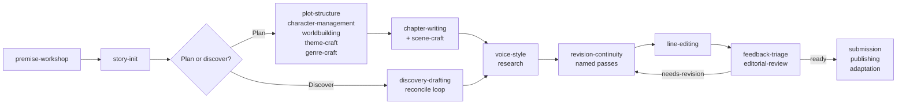

# Writing workflows

This page is for writers who draft with an AI agent (Claude Code, Codex, or another Agent Skills host) and want to know which skills to use, in what order, and which checks to run. It walks through complete workflows, from a first spark of an idea to a published book, with the prompts you would type and the project state each one leaves behind.

For what the files mean, see [Core concepts](concepts.md) and the [Project format reference](project-format.md). For every command and flag, see the [CLI reference](cli-reference.md). For a one-paragraph summary of each skill, see the [Skills catalogue](skills.md).

## Choose your path

Each workflow stands on its own, so skip the ones that do not apply to your book.

| Workflow | Use it when | Main skills |
|----------|-------------|-------------|
| [Premise workshop](#premise-workshop) | You have a spark, several ideas, or an untested premise, and no project yet | `premise-workshop` |
| [Plotting-first](#plotting-first-from-premise-to-chapter-one) | You want the structure, cast, and world planned before any prose | `plot-structure`, `chapter-writing` |
| [Discovery drafting](#discovery-drafting) | You want to write without an outline and build the bible afterwards | `discovery-drafting` |
| [Scene-level craft](#scene-level-craft) | A single scene needs planning or repair | `scene-craft` |
| [Theme](#theme) | You want the controlling idea, arcs, and motifs to carry the theme | `theme-craft` |
| [Voice and house style](#voice-and-house-style) | You want consistent spelling, usage, and voice across chapters | `voice-style` |
| [Research](#research) | The book depends on real-world facts | `research` |
| [Revision passes](#revision-passes) | You have a draft to improve, one named pass at a time | `revision-continuity` |
| [Line editing](#line-editing) | The structure is settled and the sentences need work | `line-editing` |
| [Feedback triage](#feedback-triage) | Alpha or beta readers have sent notes | `feedback-triage` |
| [Editorial review](#editorial-review) | You need a sensitivity reader, permissions, an AI-use statement, an editor, or a co-author | `editorial-review` |
| [Submission prep](#submission-prep) | The manuscript is finished and going to agents or magazines | `submission` |
| [Publishing](#publishing) | You are self-publishing, or managing rights and a contract | `publishing` |
| [Adaptation](#adaptation) | You want an audiobook script, screenplay, picture book, comic, interactive version, or translation | `adaptation` |

Every workflow has the same layout: the goal, the skills involved, numbered steps with example prompts, the checks to run, and the result. If you are new, read [How the workflows fit together](#how-the-workflows-fit-together) and [Before you start](#before-you-start) first. [Checks by workflow](#checks-by-workflow) at the end is a quick reference.

## How the workflows fit together

A Story Skills project moves through the same broad stages whatever your method. The skills below are the ones that own each stage; the `story` CLI runs the mechanical checks between them.



| Stage | Skills | Main CLI checks |
|-------|--------|-----------------|
| Find the idea | `premise-workshop` | `story init --form`, `story names` |
| Set up | `story-init` | `story init`, `story validate`, `story next` |
| Plan | `plot-structure`, `character-management`, `worldbuilding`, `theme-craft`, `genre-craft` | `story reindex`, `story links`, `story validate`, `story names`, `story diagram`, `story clues` |
| Draft | `chapter-writing` or `discovery-drafting`, with `scene-craft` | `story wordcount --write`, `story continuity`, `story pacing`, `story progress --log` |
| Keep it consistent | `voice-style`, `research` | `story prose`, `story voices`, `story validate` |
| Revise | `revision-continuity`, `theme-craft` (theme audit) | `story passes`, `story next`, `story continuity`, `story pacing`, `story clues`, `story doctor`, `story compare` |
| Polish | `line-editing` | `story prose`, `story voices`, `story build --format narration`/`html`/`print` |
| Get outside readers | `feedback-triage`, `editorial-review` | `story build --format html`, `story continuity`, `story validate` |
| Send it out | `submission`, `publishing`, `adaptation` | `story synopsis`, `story build --format shunn`/`epub`/`print`/`metadata`/`narration` |

Sequels and prequels add `series-continuity` on top of any of these; see [Series](series.md).

## Before you start

### How skills get picked up

You do not call a skill by name. Each skill's `description` lists the phrases that trigger it, so the agent loads the right one when you ask in plain language: "I have an idea for a story" loads `premise-workshop`, "start a new story" loads `story-init`, "write the next chapter" loads `chapter-writing`, "line edit chapter 3" loads `line-editing`, "process beta reader feedback" loads `feedback-triage`. Nearly every phrase has one owner, so similar requests can land on different skills: "premise" on its own goes to `premise-workshop`, while "controlling idea" goes to `theme-craft`. You can also name the skill directly ("use the scene-craft skill to check this scene") when a request could match more than one.

The prompts on this page are examples. Rephrase them freely; the skill asks for anything it needs that is not in the project files.

### How the agent runs the CLI

Every skill uses the first CLI it finds: the installed `story` command, then `bun run story --` from a Story Skills checkout, then the bundled fallback that ships inside the `story-maintenance` skill. If none is available, the skill does the registry, backlink, and word-count work by hand. [Core concepts](concepts.md#the-bundled-fallback-cli) explains the lookup, and [Getting started](getting-started.md#install-the-story-cli) covers installation.

The commands on this page use `story` and assume you are in the project root, so the path argument is `.`.

### The maintenance loop

Almost every workflow ends with some subset of these five commands:

| Command | Run it when | What it does |
|---------|-------------|--------------|
| `story wordcount . --write` | Prose changed | Recounts prose under `## Chapter Text` and writes `word-count` into chapter frontmatter |
| `story reindex .` | You hand-edited entity files | Rebuilds every `_index.md` registry table from the files |
| `story links .` | References changed | Checks that every id points at a real file and that backlinks exist both ways |
| `story validate .` | Always, last | Checks structure, frontmatter fields and values, and registries |
| `story continuity .` | Chapters or scenes changed | Checks deaths, question, promise, and clue ordering, casts, and `continuity/state.md` |

`story add` rebuilds the registries itself, so you only need `story reindex .` after editing files by hand. `story next .` runs `validate`, `links`, and `continuity` and turns their results into a prioritised to-do list, which makes it a good way to start a session.

## Premise workshop

**Goal:** turn a spark into a premise that can carry a book, choose its form, and hand a brief to `story-init`, before any project folder exists.

**Skill:** [`premise-workshop`](../skills/premise-workshop/SKILL.md), which hands off to `story-init`. Skip it if you already know your premise, form, and genre.

The running example on this page is a new book, *The Gannet Point Light*: a 1950s coastal mystery about Nell Carrow, a lighthouse keeper's daughter. It is a different project from *The Sunken Ledger* in [Getting started](getting-started.md), and every later workflow on this page keeps using it.

### 1. Capture the spark

```text
I have an idea for a story. A lighthouse keeper's daughter finds a drowned
man in the tide room under the light.
```

The skill takes the spark in your words and doesn't improve it yet. It sorts it (here, an image with a character attached) and asks what drew you to it. The answer is often the book's real subject, so it is kept in the notes as the check on later drift.

### 2. Generate what-ifs and pick one

The skill offers 8 to 12 short what-ifs from different angles, using its [what-if reference](../skills/premise-workshop/references/what-if-generation.md): invert the spark, raise the cost, move it in time or place, give it to the wrong person. For example, *what if her father recognises the drowned man and says he doesn't?* It says which ones already imply conflict but doesn't rank them unless you ask. You pick one to three, or combine them.

### 3. Test the logline, premise, and stakes

```text
Workshop the logline for the father one. Is this idea strong enough?
```

For each pick the skill drafts a logline (protagonist, want, obstacle, stakes) and runs the [premise tests](../skills/premise-workshop/references/premise-tests.md): an active protagonist, opposition that can win, a choice at the end, personal stakes, and a situation big enough for the length. Each test is reported as pass, weak, or fail with one sentence of why and one suggested revision.

It then drafts the controlling idea as `premise` and its opposite as `counter-premise` (value plus cause, as working hypotheses), and writes the stakes on three levels: external, relational, and internal. The logline is kept for the Synopsis section; `premise` in `story.md` is always the controlling idea.

### 4. Choose the form and a title

```text
Short story or novel? And give me some title ideas.
```

The [form reference](../skills/premise-workshop/references/form-choice.md) counts the idea's moving parts (POV characters, threads, locations, time span) and recommends one of `novel`, `novella`, `novelette`, `short-story`, `flash`, `serial`, `picture-book`, or `chapter-book`, with the trade-offs. You decide. Titles come from the families in [title and comps](../skills/premise-workshop/references/title-and-comps.md), cut to a shortlist of five and tested against the logline and the shelf. The skill also asks for two or three recent books the idea sits beside, and never invents a title, author, or sales claim; without web search to confirm each book, the list is marked unverified.

### 5. Hand off to story-init

The skill shows a one-screen brief (working title, logline, premise, counter-premise, stakes, form, genre and sub-genre, POV and tense if known, themes, comps). On your approval it follows `story-init` with that brief, so you are not asked the same questions twice. Workshop text is your own words, so it quotes every value in single quotes for the shell, writing an apostrophe inside a value as `'\''`:

```shell
story init 'The Gannet Point Light' --form novel --genre mystery --sub-genre coastal \
  --setting-era 1950s --pov third-person-limited --tense past \
  --synopsis 'A lighthouse keeper'\''s daughter finds a drowned man in the tide room.' \
  --theme grief --theme duty
```

It then writes `premise` and `counter-premise` into `story.md` by hand, and moves the stakes, the what-ifs worth keeping, the title shortlist, and the comps into its `## Notes` section. If you asked it to save work before the project existed, that went into a `premise-notes.md` in the current directory; it offers to move the file into the project as `notes/premise-notes.md` and deletes it only when you ask.

Once the project exists, `story names` checks title words and new names against every character, alias, location, faction, artifact, system, and glossary term. An exact clash fails the check. Later in the book, with Nell and Silas created:

```shell
story names "Gannet" "Nell" "Silas Carrow" --path .
```

```text
Gannet: clear
Nell: taken
Silas Carrow: taken
Name check failed: 2 errors, 0 warnings, 0 dismissed
error: "Nell" clashes with character nell-carrow (Nell)
error: "Silas Carrow" clashes with character silas-carrow (Silas Carrow)
```

Look-alike checks compare single words only: a one-word candidate against one-word names and character given names. Multi-word names are only checked for exact clashes, and a word inside an existing multi-word name is never matched, which is why `Gannet` is clear even though the book has a location called Gannet Point Light.

### Checks

```shell
story validate .
story report .
```

`story report` shows the form beside the genre, and `story validate` warns when `target-words` sits outside the form's usual range. Raise a short story's target to 40,000 by hand, for example, and it reports:

```text
warning: story.md target-words 40000 is outside the usual short-story range of 1000-7500 words
```

Once `status` is `complete`, it gives the same warning for the manuscript's actual length. Either adjust the target or confirm the choice.

### Result

A new project whose `story.md` has `form`, a default `target-words` for that form, the logline in `## Synopsis`, `premise` and `counter-premise`, and the workshop's stakes, titles, and comps in `## Notes`. The next workflow picks up from here.

## Plotting-first: from premise to chapter one

**Goal:** plan the story's structure, cast, and world before drafting, then write chapters from approved outlines.

**Skills, in order:** (`premise-workshop`) → `story-init` → `plot-structure` → `character-management` → `worldbuilding` → (`theme-craft`, `genre-craft`) → `chapter-writing`.

### 1. Create the project

If you ran the [premise workshop](#premise-workshop), the project already exists. Otherwise:

```text
Start a new story. It's a coastal mystery novel set in the 1950s, third-person
limited, past tense. A lighthouse keeper's daughter finds a drowned man in
the tide room. Themes: grief and duty.
```

The [`story-init`](../skills/story-init/SKILL.md) skill asks for anything missing (title, form, sub-genre, setting era, 2 to 4 themes, POV, tense), then scaffolds the project with the CLI:

```shell
story init "The Gannet Point Light" --form novel --genre mystery --sub-genre coastal \
  --setting-era 1950s --pov third-person-limited --tense past \
  --synopsis "A lighthouse keeper's daughter finds a drowned man in the tide room." \
  --theme grief --theme duty
```

`--form novel` records the form and sets `target-words: 80000`. Without `--form`, `story init` writes neither field, so the skill passes `--form novel` when you don't choose. It then fills in the `story.md` bible: the synopsis, a Tone & Style section derived from the genre and themes, and a working `premise` and `counter-premise`. Treat both as guesses. The skill says to revise the premise later if the draft argues something different, rather than bending the draft to fit.

The skill finishes with `story validate` and suggests `story next` as a next step. A fresh project is valid, and `story next` tells you where to go:

```text
# Next Writing Actions: The Gannet Point Light

Checks: validate ok (0 errors, 0 warnings), links ok (0 errors, 0 warnings), continuity ok (0 errors, 0 warnings)

Actions:
- [P2] Draft chapter 1: Use story add chapter "Chapter 1" --number 1, then outline scenes to establish the next story beat.
- [P2] Create first character: Use story add character "Name" --role protagonist before drafting prose.
```

If you already have a manuscript, skip this step and use `story import` instead; see [Import, export, and builds](manuscripts.md#import-an-existing-manuscript).

### 2. Choose a structure and build the main arc

```text
What story structure fits this book? Then help me build the main arc.
```

[`plot-structure`](../skills/plot-structure/SKILL.md) reads `story.md`, recommends a model from its [structure models reference](../skills/plot-structure/references/structure-models.md) (three-act, hero's journey, Save the Cat, kishotenketsu, five-act, Fichtean curve, Harmon's story circle), sets `structure` in `plot/_index.md`, and writes the beat sheet. It then builds the arc through conversation (setup, escalations, climax, resolution) and saves it to `plot/arcs/`:

```shell
story add arc "The Drowned Stranger" --type main --character nell-carrow --theme grief
```

Useful follow-up prompts:

```text
Add a plot point: in chapter 6 Nell finds the lamp log has been altered.
Track foreshadowing for the altered log. Plant it in chapter 2.
Which MICE threads does this arc open, and in what order should they close?
How far should I outline before drafting?
```

The last one uses the [outlining ladder](../skills/plot-structure/references/outlining-ladder.md): premise, beat sheet, step outline, full outline, each with an exit criterion. Most novels stop at the step outline.

When a plot point creates a mystery or a setup that needs a payoff, the skill records it in the continuity ledgers, not only in the arc:

```shell
story add question "Who was the drowned man" --introduced chapter-01
story add promise "The Lamp Log" --planted chapter-01
```

Plans can name characters and chapters that do not exist yet, but `story links` treats every id without a file as an error. At this stage, before the cast or any chapter scaffold exists, it reports:

```text
Link check failed: 3 errors, 0 warnings, 0 dismissed
error: plot/arcs/the-drowned-stranger.md references missing character nell-carrow
error: continuity/questions/who-was-the-drowned-man.md references missing chapter chapter-01
error: continuity/promises/the-lamp-log.md references missing chapter chapter-01
```

`story validate` still passes, because it checks structure rather than references. The character error clears in step 3. Chapter ids in ledgers, arc bodies, and `plot/timeline.md` stay errors until those chapters exist, so either scaffold them with `story add chapter` or expect these errors until you draft that far. The exception is a promise or clue that is scheduled rather than on the page: its `payoff`, and its `planted` chapter while `status: planned` (`story add promise "The Lamp Log" --planted chapter-01 --status planned`), may name a chapter that has no file yet. If you would rather keep `story links` clean throughout, build the cast before the arc.

### 3. Build the cast

```text
Create the protagonist, Nell Carrow. She's twenty-three and has kept the
light alongside her father since her mother drowned.
```

[`character-management`](../skills/character-management/SKILL.md) asks for a role (`protagonist`, `antagonist`, `supporting`, `minor`, `narrator`, or `deuteragonist`) and then works through appearance, personality, backstory, external want and internal need, voice (it will ask for sample dialogue), arc, and key life events. It writes `characters/nell-carrow.md` from its [character template](../skills/character-management/references/character-template.md), or runs `story add character "Nell Carrow" --role protagonist` and fills the file in.

Before settling a name, the skill checks it with `story names`. With Nell, Silas, and Edwin Marsh already in the book:

```shell
story names "Nora Pike" "Neil" "Silas" "Tamsin"
```

```text
Nora Pike: check
Neil: check
Silas: taken
Tamsin: clear
Name check failed: 1 errors, 2 warnings, 0 dismissed
error: "Silas" clashes with character silas-carrow (Silas)
warning: "Nora Pike" shares an initial with protagonist nell-carrow (Nell Carrow)
warning: "Neil" looks like character nell-carrow (Nell Carrow)
```

An exact clash is an error and the command exits 1. Look-alikes and a shared initial with a major character are warnings for you to weigh.

The voice discussion also fills two short lists that make the voice checkable later: `voice-words` (words the character reaches for) and `voice-avoid` (words they would never say). An invented or easily misread name gets a `pronunciation`, which the audiobook script uses.

```yaml
voice-words:
  - "reckon"
voice-avoid:
  - "love"
```

Relationships are always written both ways. Ask for one and the skill adds the inverse to the other character's file and updates the Relationship Map in `characters/_index.md`:

```text
Silas Carrow is Nell's father. Add the relationship and start a family tree.
```

`story diagram relationships` draws the graph from every character's frontmatter as Mermaid source, which GitHub and many editors render. With Silas as Nell's parent and Edwin as his rival:

```text
flowchart LR
  edwin_marsh["Edwin Marsh"]
  nell_carrow["Nell Carrow"]
  silas_carrow["Silas Carrow"]
  edwin_marsh -.-|rival| silas_carrow
  silas_carrow ==>|parent| nell_carrow
```

Family edges are drawn heavier than other relationships, so the family tree stands out. Add `--out dist/relationships.mmd` to save it, and regenerate it after changes rather than editing it.

### 4. Build the world

```text
Create the lighthouse at Gannet Point as a location.
Design the harbor's smuggling economy as a system.
Add the Coastguard Board as a government faction.
```

[`worldbuilding`](../skills/worldbuilding/SKILL.md) handles locations, systems (magic, political, technology, religion, economic, military, social, education), factions, and artifacts. Each goes in its own folder under `worldbuilding/` and is cross-linked to the characters who use it: a location's `notable-characters` must match each character's `locations` list, a faction's `members` must be real character ids, and an artifact's `owner` must be a real character or faction. `story links` reports any reference that points nowhere and any location or character that is missing its backlink.

Travel between places goes in the location file as `routes`, so the CLI can check it:

```text
How long does it take to walk from the light to the harbor? Add the route.
```

```yaml
routes:
  - to: porthkennack-harbor
    hours: 1.5
    mode: on foot
```

A route is two-way unless the other location declares its own. Once scenes carry `date`, `time`, and `location`, `story continuity` reports an error when a character is in two places joined by a route with less story time between them than the route's `hours`. `story diagram locations` draws the route network:

```text
flowchart LR
  gannet_point_light["Gannet Point Light"]
  porthkennack_harbor["Porthkennack Harbor"]
  gannet_point_light ---|1.5h on foot| porthkennack_harbor
```

The skill's references also cover [calendars](../skills/worldbuilding/references/calendars.md), [naming languages](../skills/worldbuilding/references/naming-languages.md), and [economy and logistics](../skills/worldbuilding/references/economy-logistics.md), including a table of travel speeds by mode for setting plausible `hours`.

### 5. Add the thematic and genre layers (optional)

Run these two skills before drafting if the book depends on them:

```text
Give Nell a lie, a truth, and a ghost wound. Is her arc positive or flat?
Design the antagonist as the counter-argument to the premise.
This is a mystery. Set up the fair-play rules and the clue ledger.
```

[`theme-craft`](../skills/theme-craft/SKILL.md) adds `arc-type`, `lie`, `truth`, and `ghost-wound` to character files; see [Theme](#theme) below. [`genre-craft`](../skills/genre-craft/SKILL.md) loads the pack for the genre in `story.md` (mystery, romance, thriller, horror, MG/YA, science fiction, or serial) and applies its constraints up front. For a mystery that means ledgering every clue:

```shell
story add clue "The wet footprints" --planted chapter-01 --payoff chapter-03 --significance-delayed
story add clue "The altered lamp log" --planted chapter-02 --payoff chapter-03
story add clue "The harbormaster's boots" --planted chapter-02 --red-herring
```

`--significance-delayed` marks a clue the reader sees before understanding it, and `--red-herring` a clue meant to mislead, whose `payoff` is the chapter that debunks it. `story continuity` reports a payoff chapter that comes before the planted chapter as an error. `story clues` lays the ledger out chapter by chapter and checks fair play. Once the first three chapters are drafted and the clues are on the page, it reports:

```text
Clues: 3 live (1 red herring), 3 planted, 2 revealed

Clue                        1  2  3
the-wet-footprints          P  .  R  planted, delayed
the-altered-lamp-log        .  P  R  planted
the-harbormasters-boots ~   .  P  .  planted

P planted, R revealed, x both, ~ red herring
Clue check complete: 0 errors, 5 warnings, 0 dismissed
warning: clue the-wet-footprints lists no characters: record who could notice it
warning: clue the-altered-lamp-log is planted in the chapter before its reveal (chapter-02 -> chapter-03): late plant gives readers no time to notice it
warning: clue the-altered-lamp-log lists no characters: record who could notice it
warning: clue the-harbormasters-boots lists no characters: record who could notice it
warning: clue the-harbormasters-boots is a red herring with no payoff: record the chapter that debunks it
```

The late-plant warning is the one to act on: move the lamp log earlier, or the reveal in chapter 3 isn't fair. `story diagram clues` draws the same ledger as a plant-to-reveal flow. [Continuity and analysis](continuity.md) explains each warning.

Record any deliberate break from a genre's conventions in `story.md` with a reason, so a later audit does not "fix" it.

### 6. Write chapters outline-first

```text
Write the next chapter.
```

[`chapter-writing`](../skills/chapter-writing/SKILL.md) follows the same five steps every time:

1. **Gather context.** It reads `story.md`, `style-sheet.md`, the chapter, plot, and scene registries, `plot/timeline.md`, `continuity/state.md`, the open questions and promises, the previous chapter, and the active arcs.
2. **Scope the chapter.** It asks what the chapter covers, whose POV, and which locations, and suggests the next beats from the arcs.
3. **Outline.** It proposes a beat-by-beat outline: what each beat accomplishes, POV and location, which plot points advance, what to plant or pay off, which state changes to record, each scene's intended `outcome` (`yes`, `no`, `yes-but`, `no-and`), and how the chapter ends. You approve or revise it before any prose is written.
4. **Draft.** It writes the prose in the POV character's voice and the tense from `story.md`, into `chapters/chapter-NN.md`, with the approved outline kept above `## Chapter Text`. Word counts start at that heading, so the outline never inflates them. Each speaker uses the `voice-words` and avoids the `voice-avoid` words in their character file. It also creates a `scenes/chapter-NN-scene-NN.md` record for each scene.
5. **Update everything else.** Chapter registry, timeline, arc plot points, scene records, `continuity/state.md`, foreshadowing status. It sets each scene's `outcome` and the chapter's `hook` (`cliffhanger`, `question`, `revelation`, `reversal`, `decision`, `emotional`, `resolution`) to what actually happened on the page, not what the outline planned. It flags character changes (an injury, a revelation) for you to confirm.

The in-repo [`line-editing`](../skills/line-editing/SKILL.md) skill owns the prose-quality pass on a drafted chapter; see [Line editing](#line-editing). The chapter-writing skill also checks whether the separate [`better-writing`](https://github.com/forjd/better-writing) skill is installed, an optional complement. If it is, the agent uses it for a final prose pass. If not, the agent asks before installing anything and otherwise falls back to its own [writing guidelines](../skills/chapter-writing/references/writing-guidelines.md).

The chapter and scene scaffolds come from the CLI, which can set the pacing fields up front:

```shell
story add chapter "The Drowned Man" --number 1 --pov nell-carrow --arc the-drowned-stranger --hook cliffhanger
story add scene "Low Water" --chapter chapter-01 --scene 1 --pov nell-carrow --location gannet-point-light --outcome yes
```

### Checks

After each chapter, `chapter-writing` runs:

```shell
story wordcount . --write
story reindex .
story links .
story validate .
story next .
story pacing .
story progress . --log
```

`story pacing .` shows the new chapter beside the rest of the book. Later in the draft, with three short chapters of *The Gannet Point Light* written:

```text
Pacing: 6 scenes, 0 sequels, 3 of 3 chapters with hooks
Outcomes: 17% of recorded outcomes are setbacks or complications
Median chapter: 113 words

Ch  Words  Scenes  Sequels  Outcomes (yes/no/yes-but/no-and)  Hook
 1    124       2        0  1/0/0/1                           cliffhanger
 2    113       2        0  2/0/0/0                           question
 3     89       2        0  2/0/0/0                           resolution
Pacing check complete: 0 errors, 2 warnings, 0 dismissed
warning: 4 scenes in a row end in an outright yes (chapter-02-scene-01 to chapter-03-scene-02): raise the cost with yes-but or no-and
warning: 6 scene units in a row with no sequel (chapter-01-scene-01 to chapter-03-scene-02): give the POV character room to react and decide
```

Nell has been getting what she wants too easily since chapter 2, and she never stops to react. The warnings are prompts to reread, not rules; [Scene-level craft](#scene-level-craft) is where they get fixed.

`story next .` summarises continuity warnings as a single action. Run `story continuity .` to see them in full, because that is where most first-draft slips show up. Here is what it reported on the example chapter straight after the scaffold commands above:

```text
Continuity is consistent: 0 errors, 1 warnings, 0 dismissed
warning: scenes/chapter-01-scene-01.md is set in gannet-point-light but chapters/chapter-01.md does not list that location
```

`--pov` already put `nell-carrow` in both `characters` lists, so only the location is missing. Adding `gannet-point-light` to the chapter's `locations` clears it. `story continuity` also warns when `current-chapter` in `continuity/state.md` falls behind the latest drafted chapter, but it cannot tell whether the state entries themselves are complete, so bringing the state forward stays part of step 5.

`--form novel` already set `target-words: 80000` in `story.md`; add a `deadline` and `story progress` measures pace against both. `--log` also appends the session to `progress.md`:

```text
Logged 132 words for 2026-09-24 in /path/to/the-gannet-point-light/progress.md
Progress: 132 of 80,000 words (0.2%)
Remaining: 79,868 words
Deadline: 2027-03-31 (188 days left): 425 words a day needed
Sessions: 1 logged; last 2026-09-24 (+0 words since)
Progress checked: 0 errors, 0 warnings, 0 dismissed
```

### Result

```text
the-gannet-point-light/
├── story.md                 # bible with premise, themes, form, target-words
├── style-sheet.md
├── progress.md              # session log from story progress --log
├── characters/              # nell-carrow.md, silas-carrow.md + _index.md
├── worldbuilding/
│   ├── locations/gannet-point-light.md
│   └── factions/coastguard-board.md
├── plot/
│   ├── _index.md            # structure model, arcs table, theme tracking
│   ├── arcs/the-drowned-stranger.md
│   └── timeline.md
├── chapters/chapter-01.md   # outline above ## Chapter Text, prose below
├── scenes/chapter-01-scene-01.md
└── continuity/
    ├── state.md
    ├── questions/who-was-the-drowned-man.md
    ├── promises/the-lamp-log.md
    └── clues/the-wet-footprints.md
```

The tree leaves out the `_index.md` registries that `story init` creates for each domain, and `glossary/` is there from `story init`, empty until you add terms.

For a fuller planned project, open [`examples/harbor-of-second-light`](../examples/harbor-of-second-light/story.md) or [`examples/the-last-ember`](../examples/the-last-ember/story.md).

## Discovery drafting

**Goal:** write without an outline and keep the bible accurate by reconciling each chapter into it afterwards.

**Skills, in order:** `story-init` → `character-management` (one character is enough) → `discovery-drafting` → `revision-continuity` at the midpoint and the end.

[`discovery-drafting`](../skills/discovery-drafting/SKILL.md) is the counterpart to outline-first `chapter-writing`. You still get a bible; it is written after the prose rather than before. The skill says not to use it for mysteries or other clue-dependent books where setups must be planted before payoffs. For those, plan with `chapter-writing` and the `genre-craft` mystery pack. You can mix modes per chapter.

### 1. Write the kernel

```text
I want to discovery-write this one. Help me write a story kernel.
```

The kernel is one paragraph of 3 to 6 sentences: a character in an unstable situation, a want, an obstacle or pressure, and a tone signal. It deliberately leaves out plot beats, an ending, a theme statement, a cast list, and worldbuilding. The [kernel reference](../skills/discovery-drafting/references/story-kernel.md) gives this example:

```markdown
A retired cartographer who falsifies maps for smugglers discovers her
latest commission describes a city that shouldn't exist — and someone is
paying in real gold to reach it. She wants the money and wants to know if
she drew something true by accident. The client is lying about why they
need the route, and her old guild contacts are watching. A tense,
low-magic caper with the unease of a ghost story.
```

The skill stores it under `## Story Kernel` in `story.md` and sets `draft-mode: discovered` in the frontmatter. It also agrees a writing target with you, records the daily rhythm in a `## Draft Log` or `## Notes` section, and sets `target-words` (and `deadline`, if you have one) in `story.md`.

### 2. Draft forward

```text
Let's write chapter one. Just go, don't stop to plan.
```

Each session has three parts, described in the [drafting cadence reference](../skills/discovery-drafting/references/drafting-cadence.md):

1. **Re-read** the kernel, the previous chapter's post-hoc notes, and the last few pages. No editing.
2. **Write forward.** When the agent needs a fact it has not settled, it leaves `[TODO: check bible]` inline and keeps going. When stuck, it goes back a few hundred words and tries a different choice.
3. **Close** with a `[TODO]` note above `## Chapter Text` saying where the next session starts.

The inline `[TODO: check bible]` markers sit in the prose until the reconcile loop clears them, and they count towards the chapter's words in the meantime. Only the end-of-session note goes above `## Chapter Text`: anything below that heading is counted by `story wordcount` and shipped by `story export`, so a stray TODO left in the prose ends up in the book.

Discovery changes the planning order, not the prose standard: the skill still reads `style-sheet.md` and uses the `scene-craft` tools.

The chapter scaffold records the mode:

```shell
story add chapter "What the Sea Kept" --mode discovered
```

### 3. Run the reconcile loop after every chapter

```text
Reconcile chapter one into the bible.
```

The [reconcile loop](../skills/discovery-drafting/references/reconcile-loop.md) runs after every chapter and before the next:

1. **Extract** new entity candidates (characters, places, factions, objects, rules) and new promises and questions. The agent lists them and waits for your approval before creating any file, the same way `story import` handles candidates.
2. **Reverse-outline** the chapter: one line per scene, the state changes, and anything planted. This goes into the chapter file above the prose and into `scenes/` records.
3. **Diff** against the bible. Each finding is *new*, *contradiction*, *enrichment*, or *dangling*.
4. **Reconcile.** Every diff ends in one of two outcomes: update the bible, or revise the chapter. Leaving both as they are is not allowed, because an unresolved diff becomes a continuity bug.

The chapter then gets a `## Chapter Notes (post-hoc)` section above `## Chapter Text` recording what was discovered, what was cut or left dangling, and open questions. The next session starts by reading it.

### 4. Batch reviews and dead ends

Every 3 to 5 chapters:

```text
Run a batch review of chapters 4 to 7. Anything dead?
```

The agent rereads the post-hoc notes, sweeps the promise and question ledgers for setups with no plausible payoff, and applies the [dead-ends reference](../skills/discovery-drafting/references/dead-ends.md). A thread is a dead end when it meets two of three tests: it has not advanced for two consecutive chapters, removing it changes nothing downstream, and the post-hoc notes say the interest is gone. A thread with a payoff recorded in `continuity/promises/` is a slow burn, not a dead end. For each dead end you decide with the agent whether to cut it clean, fold its best element into another thread, or prune it to a single scene or mention.

Cut threads are logged, not deleted. An abandoned promise, question, or clue keeps its file with `status: abandoned` and a recorded reason, and a cut character keeps their file with `status: cut` and is dropped from casts, relationships, and arcs. `story validate` accepts both statuses. Each cut also goes into a `## Cut Threads` log in the project notes, so a later book can find the material.

At the midpoint and at draft completion, the skill hands the batch to `revision-continuity` for developmental checks before you continue.

### Checks

After each reconcile loop:

```shell
story wordcount . --write
story reindex .
story links .
story validate .
story continuity .
```

Log each session with `story progress . --log`. `story validate` warns about chapters that have no scene records yet, which in a discovery project usually means the reverse outline has not been done:

```text
warning: chapters/chapter-02.md has no machine-readable scene records
```

### Result

The layout is the same as a plotted project. The differences are in the content:

- `story.md` has `draft-mode: discovered`, a `## Story Kernel` section, and a draft log.
- Each discovered chapter has `mode: discovered`, a reverse outline, and a `## Chapter Notes (post-hoc)` section above `## Chapter Text`.
- Arcs, locations, and most characters appear only once a reconcile loop has approved them.
- Cut material stays in place with `status: cut` or `status: abandoned`.

When the draft is complete, any `mode: discovered` chapter without post-hoc notes counts as unfinished maintenance. The skill flags these before handing the manuscript to revision.

## Scene-level craft

**Goal:** plan or repair individual scenes: pacing, dialogue, viewpoint, exposition, flashbacks, and openings.

**Skills:** `scene-craft`, used inside `chapter-writing` while planning and inside `revision-continuity` while revising.

### 1. Name the problem

Describe the scene and what feels wrong:

```text
The scene after the body is found feels rushed. Plan a sequel for it.
Chapter 4's argument between Nell and Silas reads flat. Check the subtext.
Does chapter one's first page hook?
I need a flashback to the night Nell's mother drowned. Where should it go?
Pacing flags four easy wins in a row. Rework the scene outcomes.
Chapter 3 ends too neatly. Give it a better chapter hook.
```

[`scene-craft`](../skills/scene-craft/SKILL.md) starts by identifying which problem you have, then loads the matching reference:

| Symptom | Reference |
|---------|-----------|
| Incidents with no breathing room | [Scene and sequel](../skills/scene-craft/references/scene-sequel.md): reaction, dilemma, decision |
| The middle sags, resolves too easily, or `story pacing` flags a run of `yes` outcomes | [Try/fail cycles](../skills/scene-craft/references/try-fail.md) and scene outcomes |
| Several POVs or timelines to order | [Scene cards](../skills/scene-craft/references/scene-cards.md) |
| Flat conversation or voices that blur | [Dialogue subtext](../skills/scene-craft/references/dialogue-subtext.md) and the tag-swap test |
| Distant narration or head-hopping | [Deep POV and psychic distance](../skills/scene-craft/references/deep-pov.md) |
| World facts piling up undelivered | [Exposition](../skills/scene-craft/references/exposition.md) |
| A flashback or time jump | [Flashbacks and time](../skills/scene-craft/references/flashbacks-time.md) |
| The book's opening or a character introduction | [Openings](../skills/scene-craft/references/openings.md) |

### 2. Plan the scene

The skill does not guess at scene purpose, viewpoint, location, or whether a change alters canon. It asks. It writes the planning inputs (sequel beats, try/fail positions, subtext wants, zoom level) into the chapter outline or a `## Planning` or `## Scene Card` section of the scene file, so they are not only in the chat.

### 3. Record it in the scene file

The skill also records the result in scene frontmatter. A sequel scene can be scaffolded directly:

```shell
story add scene "The Keeper's Choice" --chapter chapter-01 --scene 2 \
  --pov nell-carrow --sequel --dilemma "Tell her father or hide the body"
```

which produces:

```yaml
---
title: "The Keeper's Choice"
chapter: chapter-01
scene: 2
pov: nell-carrow
location: ""
characters: []
mentions: []
arcs-advanced: []
status: outline
date: ""
time: ""
sequel: true
dilemma: Tell her father or hide the body
state-changes: []
---
```

The scaffold's body has only `## Purpose` and `## Continuity Notes`; the skill adds a `## Sequel` section with the reaction, dilemma, and decision beats.

For flashbacks, the skill sets `flashback-to:` (a free-text note that `story validate` checks is a single value and continuity checks ignore) and moves characters who appear only in the flashback to `mentions`, so `story continuity` does not flag a dead character as present.

Every goal-driven scene records its `outcome`: does the POV character get what they want? The [try/fail reference](../skills/scene-craft/references/try-fail.md) explains the four values:

| `outcome` | Meaning | Effect on pressure |
|-----------|---------|--------------------|
| `yes` | Goal achieved cleanly | Releases pressure; use sparingly |
| `no` | Goal blocked | Holds pressure |
| `yes-but` | Goal achieved at a cost or with a new problem | Complicates; raises pressure |
| `no-and` | Goal blocked and things get worse | Complicates; raises pressure most |

The skill prefers the complicating `yes-but` and `no-and`. Sequel scenes react rather than pursue a goal, so they have no `outcome`. When a scene ends its chapter, the skill also sets the chapter's `hook`: `cliffhanger`, `question`, `revelation`, `reversal`, `decision`, `emotional`, or `resolution`.

### 4. Leave deliberate rule-breaking alone

The skill will not rewrite prose just to satisfy a checklist. If a scene breaks a rule on purpose (a deliberate info dump, say), it notes that in the scene's planning notes so a later audit leaves it alone. The same goes for `story pacing` warnings: a quiet `resolution` chapter after the climax is right.

### Checks

```shell
story reindex .
story links .
story validate .
story continuity .
story pacing .
```

`story pacing` warns after three or more consecutive `yes` outcomes, four or more scene units without a sequel, three or more chapters in a row ending on `resolution`, chapters more than twice or less than half the median length (once three chapters have prose), and drafted chapters with no `hook`. Scene outcomes and chapter hooks are fixed here; act structure and a sagging middle belong to [`plot-structure`](../skills/plot-structure/SKILL.md).

### Result

Scene files in `scenes/` carry `outcome`, `sequel`, `dilemma`, `flashback-to`, and complete `state-changes`, plus planning sections in the body, and chapters carry a `hook`. Canon changes (new knowledge, moved objects, changed relationships) are reflected in `continuity/state.md` and the affected entity files.

## Theme

**Goal:** make the theme do work in the story: a premise the ending proves, characters whose arcs test it, and motifs that pay off.

**Skill:** [`theme-craft`](../skills/theme-craft/SKILL.md), at story start, during character design, and after a full draft. Theme runs alongside drafting rather than after it, and is best started with the premise.

### 1. Set a working premise

```text
Help me sharpen the controlling idea and its counter-argument.
```

The skill writes a one-sentence controlling idea (value plus cause) and its counter-premise, stored as `premise:` and `counter-premise:` in `story.md`. If you would rather find the theme in the draft, the skill records `premise: tbd-discovery` and moves on. Ask for the controlling idea or the thematic argument rather than "the premise": that word on its own loads `premise-workshop`, which is for testing an idea before the book exists.

### 2. Give the main characters a lie and a truth

```text
Build the lie/truth machinery for Nell and for the antagonist.
```

For the protagonist, the antagonist, and any supporting character whose arc touches the theme, the skill adds `arc-type` (`change-positive`, `change-negative`, or `flat`), `lie`, `truth`, and `ghost-wound` to the character file. It checks the character's turning points against the arc type. A flat arc needs escalating tests of conviction. A negative arc needs the truth offered and refused.

### 3. Make the antagonist the counter-argument

The antagonist gets a defensible belief in the counter-premise, a want, a wound, a plan, and scenes the antagonist wins.

### 4. Choose and track motifs

```text
Choose two or three motifs and track them.
```

The skill picks two or three concrete motifs and tracks them with `planned`, `planted`, and `paid-off` status in `continuity/motifs.md` or a motif table in an arc file.

### 5. Audit the finished draft

```text
Run a theme audit on the finished draft.
```

After a complete draft, the audit asks: does the ending answer the opening's value question, is the theme shown through consequence rather than commentary, and do the motifs pay off? The findings go in `continuity/theme-audit.md` with a `theme-holds` or `theme-broken` verdict. Structural findings go to `revision-continuity` as a developmental plan. The skill will never fix a theme finding by adding a speech or a narrator's summary that explains the theme. It reworks the characters' choices instead.

### Checks

The CLI has no theme-specific checks: the premise and arc fields are for you and the agent, and the CLI does not read `continuity/motifs.md` or `continuity/theme-audit.md`. The maintenance pass still keeps the edited `story.md` and character files valid:

```shell
story reindex .
story links .
story validate .
```

### Result

`story.md` has `premise` and `counter-premise` (or `premise: tbd-discovery`). The protagonist, the antagonist, and any character whose arc touches the theme carry `arc-type`, `lie`, `truth`, and `ghost-wound`. Motifs are tracked in `continuity/motifs.md` or an arc file, and after a full draft `continuity/theme-audit.md` holds the verdict.

## Voice and house style

**Goal:** keep the voice and surface conventions the same across chapters, sessions, and agents.

**Skill:** [`voice-style`](../skills/voice-style/SKILL.md). `chapter-writing`, `discovery-drafting`, `revision-continuity`, and `line-editing` all read the style sheet it maintains. Start once there is a first chapter or a writing sample. This workflow records and checks the voice; rewriting lines so the characters sound different is [Line editing](#line-editing).

### 1. Build the style sheet

```text
Set up the style sheet from the first two chapters. We're using American spelling.
```

The skill reads `story.md`, the existing `style-sheet.md`, and two or three drafted chapters (or asks you for a sample paragraph, or three published books whose voice is close). It fills in the style sheet from decisions the prose has already made. Where the draft is inconsistent, *grey* in one chapter and *gray* in another, it asks you which wins instead of choosing. The frontmatter is machine-readable:

```yaml
---
type: style-sheet
dialect: american
preferred: []
watch-words:
  - rocks
allow-words:
  - slowly
---
```

### 2. Lint the prose

```text
Lint the prose.
The voice drifted in chapter 9. Check it against the style sheet.
```

`story prose .` checks every chapter against the style sheet. On the example chapter, with that style sheet:

```text
Prose report: 1 chapter, 132 words

chapters/chapter-01.md: The Drowned Man (132 words)
  Sentences: 11, average 12.0 words, longest 20, spread 4.0
  Filter words: 23.1 per 1k narration words (felt 1, saw 1, thought 1)
  -ly adverbs: 15.4 per 1k narration words (completely 1, suddenly 1)
  Dialogue tags: said 1; said-bookisms: none
  Echoes within 30 words: rocks 1
  Watch words: rocks 3
  Spelling: grey 1 (use gray)

Manuscript:
  Repeated 4-word phrases: none
  Similar character names: none
Prose check complete: 0 errors, 1 warnings, 0 dismissed
warning: chapters/chapter-01.md uses "grey" once; american dialect prefers "gray"
```

The chapter opens with "The tide had gone out slowly", but `slowly` is in `allow-words`, so it is not counted as an adverb.

### 3. Check the dialogue voices

```text
Check the character voice fingerprints.
```

The style sheet's Character Voices section gives one line per major speaker, linked to the character file, which stays canon. The character file's `voice-words` and `voice-avoid` lists make the voice checkable, and `story voices .` fingerprints each character's dialogue against them. On the first three chapters:

```text
Voices: 3 speaking characters, 0 unattributed lines

silas-carrow: 15 lines, 73 words
  Sentence length 3.8, contractions 1.4 per 100 words, questions 0%, exclamations 0%
  Signature words: always, done, fetch, light's

nell-carrow: 13 lines, 62 words
  Sentence length 4.8, contractions 4.8 per 100 words, questions 23%, exclamations 0%
  Signature words: someone

edwin-marsh: 3 lines, 10 words
  Sentence length 2.5, contractions 10.0 per 100 words, questions 0%, exclamations 0%
  Signature words: terrible
Voice check complete: 0 errors, 1 warnings, 0 dismissed
warning: nell-carrow never says "reckon" from their voice-words list in 13 lines of dialogue
```

It also warns when a character says one of their `voice-avoid` words, and when two characters with five or more lines each have near-identical fingerprints ("X and Y may sound alike"). A line counts only when the narration names the speaker beside a speech verb (`"...," Nell said`, `said Silas`), or when the paragraph's narration names exactly one character. Pronoun tags (`she said`) are never attributed, so in close third person the POV character is often under-counted.

### 4. Act on the findings

How the skill handles findings:

- Avoided spellings are always fixed.
- Rates, echoes, and repeated phrases are prompts to reread, not orders. If a flagged word is right, it stays, and a word the book uses on purpose goes into `allow-words`.
- Similar character names are raised with you first. If you agree to a rename, it checks the replacement with `story names "<Candidate>"`, then uses `story rename character <id> "<New Name>"` so every reference follows.
- For `story voices` warnings, it revises the dialogue, or, when the draft has found a better voice, asks you before updating the character's `voice-words` or `voice-avoid`. Here, either Nell starts saying "reckon" or the word comes off her list.

`story prose` and `story voices` exit 0 unless a file cannot be read, so they never block anything. See [Continuity and analysis](continuity.md#what-each-line-measures) for what each count measures.

### Checks

After editing the style sheet or revising prose:

```shell
story validate .
story prose .
story voices .
story wordcount . --write
story links .
```

### Result

`style-sheet.md` records the book's `dialect`, `preferred` spellings, `watch-words`, and `allow-words` in frontmatter, with voice, usage, and character-voice decisions in the body. Character files carry `voice-words` and `voice-avoid`. Chapters use the preferred spellings, and any rename has gone through `story rename` so every reference follows.

## Research

**Goal:** get real-world details right and keep a record of where each fact came from and which chapters depend on it.

**Skill:** [`research`](../skills/research/SKILL.md). It covers history, science, law, medicine, trades, and real places. For invented world facts use `worldbuilding`.

```text
Research how a 1950s lighthouse lamp rotation actually worked. Chapter 1 depends on it.
Is it accurate that a body would surface after three days in cold water?
I'm interviewing a retired keeper next week. Help me prepare.
Fact-check chapter 6 before I mark it final.
```

### 1. Open a note

The skill opens a note for each topic with the CLI, which creates the `research/` folder and registry on first use, and sets the fields that describe the note:

```shell
story add research "Lighthouse lamp rotation" --used-in chapter-01 \
  --accuracy must-be-accurate --method fact --confidence low
story add research "Drowning and cold water" --used-in chapter-01 \
  --accuracy must-be-accurate --method expert-review --confidence low --risk medical
```

| Field | Values | Meaning |
|-------|--------|---------|
| `accuracy` | `must-be-accurate`, `blended`, `invented` | How closely the prose must match reality. `invented` notes are a consistency record: they need no sources and never trigger the open-research warning |
| `method` | `fact`, `reading`, `interview`, `site-visit`, `expert-review` | Where the knowledge comes from |
| `confidence` | `high`, `medium`, `low` | How sure the findings are; start low and raise it as sources agree |
| `risk` | `legal`, `medical`, `weapons`, `safety`, `cultural`, `defamation`, `technical` | Getting it wrong could harm a reader, a real person, or you. Pass `--risk` once per value |

The note has `## Question`, `## Findings`, and `## Story Use` sections and starts at `status: open`. Add `--source "<citation or URL>"` (repeatable) to record sources up front.

### 2. Plan the investigation

The skill breaks the question into the specific things the prose asserts ("could she walk from the light to the harbour in 90 minutes in 1953?" rather than "1950s Cornwall") and writes a `## Search Plan` in the note: terms to search, archives and reference works to try, people who would know, which sources are primary, and what counts as enough. For an interview or site visit it prepares questions and consent first, following [interviews and site visits](../skills/research/references/interviews-and-site-visits.md).

### 3. Research and record sources

The agent uses whatever research tools the session has (web search, documents you supply). With none, it gives you the search plan and asks you for sources. Every finding is recorded with a full citation (author or institution, title, date, page or URL), with exact wording quoted where a claim rests on it, and every source goes into the `sources` list. `confidence` follows the evidence: `high` for a primary source or independent agreement, `medium` for one good secondary source, `low` for anything recalled or single and weak.

### 4. Set the status honestly

A fact the agent recalls without a source stays `open`. A note becomes `verified` only when every finding the chapters rely on has a source. When sources disagree it becomes `disputed`, with both sides recorded.

### 5. Flag risk; never advise

A note with any `risk` needs a qualified human reviewer (a clinician, lawyer, weapons or safety specialist, cultural reader, or engineer, as fits) before its chapters are final. The skill never gives legal, medical, or safety advice itself and never treats its own research as the review. Once the reviewer has read the passage, their name or role goes in `reviewed-by`, which you edit by hand because `story add` has no flag for it:

```yaml
reviewed-by:
  - "Dr A. Patel, A&E consultant"
```

Sensitivity and authenticity reads, and portrayals of real people, go through [Editorial review](#editorial-review); the reader's notes are triaged through `feedback-triage`.

### 6. Connect it to the story

`used-in` lists every chapter that relies on the note. `## Story Use` records deliberate departures (a compressed timeline, an invented institution); a recorded departure is a choice, not an error.

### Checks

```shell
story reindex .
story links .
story validate .
```

`story validate` catches the case that matters most: a settled chapter resting on unsettled or unreviewed research. Marking chapter 1 `final` while the drowning note is still open and unreviewed gives:

```text
Project is valid: 0 errors, 2 warnings, 0 dismissed
warning: research/drowning-and-cold-water.md is open but chapter-01 relies on it and is final
warning: research/drowning-and-cold-water.md carries medical risk but has no reviewed-by, and chapter-01 relies on it
```

It also warns about a `verified` note with no sources.

### Result

The project gains a `research/` folder with an `_index.md` registry and one kebab-case note per topic, each listing its `sources`, `used-in` chapters, and the `accuracy`, `method`, `confidence`, `risk`, and `reviewed-by` fields that apply. `story rename` and `story remove` keep `used-in` current when chapters change.

## Revision passes

**Goal:** improve a draft in deliberate passes, big structural changes before polish, without breaking continuity, and be able to see and undo what each pass changed.

**Skill:** [`revision-continuity`](../skills/revision-continuity/SKILL.md), with `theme-craft`, `voice-style`, `research`, and `genre-craft` supplying the specialised audits and [`line-editing`](#line-editing) taking the line, copyedit, and proof passes.

### 1. Set up the pass ladder

```text
The first draft is done. Set up the revision passes.
```

A full revision is tracked as a ladder of named passes in `story.md` `revision-passes`, so it happens in order (there is no point polishing sentences a structural pass may cut) and survives between sessions. The skill writes the default ladder and sets `status: revising`:

```shell
story passes . --init
```

```text
Updated revision-passes in story.md
Revision passes: 0 of 8 done

[ ] structure - Order of events, act turns, scenes that do not change anything (story timeline, story pacing, story diagram arcs)
[ ] character - Wants, arcs, motivation, and who knows what when (story voices, story knowledge <id> --at <chapter>, story diagram relationships)
[ ] theme - Premise, counter-premise, motifs, and the lie/truth arc (story report)
[ ] continuity - Deaths, props, travel, promises, clues, and backlinks (story continuity, story clues, story links)
[ ] pacing - Scene outcomes, sequels, chapter hooks, and chapter lengths (story pacing)
[ ] line - Sentence-level clarity, rhythm, and distinct voices (story prose, story voices)
[ ] copyedit - Spelling, usage, and consistency against the style sheet (story prose)
[ ] proof - Typos and layout in the built book (story build --format print, story build --format html)

Next: structure; mark it with story passes --done structure
```

`--init` keeps any entries already there. Each pass runs the checks shown beside it. `story passes . --start <pass>` marks one `in-progress` (`[~]`), and `story passes . --done <pass>` marks it done, only when its checks are clean or every remaining finding is a recorded decision. A new kebab-case name such as `fact-check` or `sensitivity` with `--start` appends a custom pass.

With `status: revising`, `story next .` recommends the next unfinished pass, so a new session starts where the last one stopped:

```text
What pass is next?
```

```text
# Next Writing Actions: The Gannet Point Light

Checks: validate ok (0 errors, 0 warnings), links ok (0 errors, 0 warnings), continuity ok (0 errors, 0 warnings)

Actions:
- [P1] Revision pass: character: Wants, arcs, motivation, and who knows what when. Run story voices, story knowledge <id> --at <chapter>, story diagram relationships. Mark it with story passes --done character.
- [P2] Review open clues: 3 clues are still planned or planted.
- [P2] Draft chapter 4: Use story add chapter "Chapter 4" --number 4, then outline scenes to advance The Drowned Stranger.
```

That was after `structure` was marked done. A pass marked `in-progress` comes ahead of the first pending one.

### 2. Pick a pass

Within a ladder pass, or for a one-off job, the skill asks which pass you want unless you say. Each one reads and updates a specific set of files:

| Pass | Ask for it with | Ladder pass | What it does |
|------|-----------------|-------------|--------------|
| Continuity audit | "Continuity check chapters 1 to 10" | `continuity` | Contradictions, stale references, timeline and travel problems, missing backlinks, word-count drift |
| Developmental revision | "Developmental edit: the middle drags" | `structure`, `character` | Structure, scene purpose, motivation, pacing, stakes, arc progression |
| Reverse outline | "Reverse-outline the draft" | `structure` | One line per chapter written from the prose alone, then compared with the plot files |
| Theme audit | "Does the ending prove the controlling idea?" | `theme` | Ending against the opening's value question, consequence against commentary, motif payoff |
| Pacing waveform | "Run a pacing check as a revision pass" | `structure`, `pacing` | Tension per chapter and dead zones, from `story pacing .` (outcomes, sequels, hooks, length outliers) and `story timeline .` for POV balance |
| Reveal economy | "Run a clue check. Are my reveals earned?" | `continuity` | Every reveal planted beforehand and spaced out, from `story clues .`; `story diagram clues` draws the flow |
| Removability audit | "Which scenes could I cut?" | `structure` | Scenes whose removal changes nothing downstream: wire them in, fold them, or cut them |
| Voice differentiation | "Everyone sounds the same" | `character`, `line` | `story voices .` fingerprints; handed to `line-editing` for the rewrite |
| Line edit | "Line edit chapter 3" | `line` | Handled by [`line-editing`](#line-editing) |
| Copyedit | "Copyedit against the style sheet" | `copyedit` | Handled by `line-editing` |
| Fact check | "Fact-check chapter 6" | `continuity` or a custom `fact-check` | Research notes whose `used-in` lists the chapter |
| Proof/polish | "Proofread chapter 12" | `proof` | Handled by `line-editing`, on a built copy rather than the source |

"Line edit", "copyedit", "proofread", and "everyone sounds the same" load `line-editing` directly; the other prompts load `revision-continuity`.

For genre books, add the audit checklist at the end of the relevant [`genre-craft`](../skills/genre-craft/SKILL.md) pack (fair play for a mystery, the HEA contract for romance, the ticking clock for a thriller) to a developmental pass.

### 3. Snapshot before a multi-chapter pass

Before any pass that touches more than one chapter, the skill takes a snapshot named after the draft it preserves (`draft-1`, `pre-beta-edit`):

- **In a git repository**, it asks before committing, then commits and tags: `git add -A && git commit -m "Draft 1 before developmental pass" && git tag draft-1`. It never pushes, rewrites history, or deletes tags without your approval.
- **Without git**, it offers `git init`. If you decline, it copies the project folder next to the original (`../the-gannet-point-light-draft-1`), never inside it, where `story` commands would scan the copy.

### 4. Plan, edit, and update

The skill reads the chapter, its neighbours, the scene files, and every entity the chapter references, and writes a short plan: what changes, what must stay fixed, and which other files are affected. It then edits the markdown directly and updates what depends on it: chapter `status` (`draft` to `revised`, and to `final` only when appropriate), the timeline, scene records, continuity state and ledgers, arc foreshadowing, and character or location files.

```text
Revise chapter 3 so Nell hides the log instead of burning it. Keep continuity.
```

### 5. Compare with the snapshot

After the pass, the skill reports how deep it went:

```shell
story compare . --ref draft-1
story compare . --against ../the-gannet-point-light-draft-1
```

Against a folder copy, after a copyedit that changed *grey* to *gray* in chapter 1 and a new chapter 3, the report reads:

```text
Compared with /path/to/the-gannet-point-light-draft-1
Chapters: 2 then, 3 now (1 added, 0 removed)
Words: 132 then, 132 now (±0)

- chapter-01 The Drowned Man: 132 -> 132 words (±0), 0% of paragraphs unchanged
- chapter-02 What the Sea Kept: unchanged (0 words)
- chapter-03 The Keeper's Log: added (0 words)
Comparison complete: 0 errors, 0 warnings, 0 dismissed
```

Chapter 1's prose is a single paragraph, so one changed word leaves 0% of its paragraphs unchanged. Chapters are matched by id, so a renumbered chapter shows as one removed and one added. `story compare` reads git but never commits or tags.

### 6. Close the pass

When the pass's checks are clean, or every remaining finding is a decision you have recorded, the skill marks it done and `story next .` moves on to the next rung:

```shell
story passes . --done structure
```

### Checks

```shell
story wordcount . --write
story reindex .
story links .
story validate .
story continuity .
story doctor .
```

Structural and reveal passes add `story pacing .` and `story clues .`, and a pass that changed dialogue adds `story voices .`. The skill runs `story compare` from step 5 as well. If `story.md` has `follows` or `precedes` links to other books, the skill also runs `story series .`; see [Series](series.md).

For a continuity audit, `story continuity .` goes first and the agent checks what it cannot: character knowledge, carried-forward injuries and alliances, travel time between places with no recorded `routes`, world rules, and whether frontmatter lists every major character and location in the prose. `story continuity` already reports a character who crosses a recorded route faster than its `hours` allow, and `story diagram timeline` draws dated scenes in story order. `story knowledge <character> --at <chapter>` answers "did she know this yet?" from `continuity/state.md`. See [Continuity and analysis](continuity.md) for these commands and for [exemptions](continuity.md#exemptions).

### Result

You end up with revised chapters at `status: revised`, updated scene and continuity records, a git tag or sibling folder holding the previous draft, `revision-passes` in `story.md` showing which rungs are done, and, depending on the pass, an updated `plot/timeline.md`, `continuity/theme-audit.md`, or `style-sheet.md`. For an audit you asked to read rather than apply, the agent returns findings ordered by severity with file references and concrete fixes, and changes nothing.

## Line editing

**Goal:** polish the prose sentence by sentence, keep every speaker distinct, bring the text into line with the style sheet, and proof the book as a reader will see it, without losing your voice.

**Skill:** [`line-editing`](../skills/line-editing/SKILL.md). It comes after the structural passes; line-editing a chapter that a structural pass then cuts is wasted work. It reads the style sheet that `voice-style` maintains (and sends you there first if it is missing or thin), and hands anything that would change events or who knows what back to `revision-continuity`.

### 1. Scope the edit

```text
Line edit chapter 1. Keep it light.
```

The skill asks which chapters, which pass (line edit, voice differentiation, copyedit, read-aloud, or proof), and how heavy: **light** (errors and clear improvements only, the default), **medium** (tighten and clarify), or **heavy** (restructure sentences and paragraphs). It never rewrites a passage wholesale without your permission. Before a multi-chapter pass it takes a snapshot, then marks the rung in the ladder:

```shell
story passes . --start line
```

### 2. Review the edits

The skill reads `story.md`, the style sheet's Voice section, and the chapter, runs `story prose .`, and works paragraph by paragraph through clarity, precision, economy, rhythm, POV distance, and voice ([line edit checklist](../skills/line-editing/references/line-edit-checklist.md)). Edits arrive in batches of about 20, highest impact first, in the [edit note format](../skills/line-editing/references/edit-note-format.md):

```markdown
**ch01-p5** · economy
> Before: Silas came down the steps slowly.
> After: Silas took the steps one at a time.
Why: replaces the -ly adverb with an action the reader can see.
```

The location is the paragraph anchor the HTML review copy uses (`ch01-p5`: chapter 1, paragraph 5). Every rationale names an effect, never "sounds better". You reply with the numbers to accept, reject, or discuss, and only accepted edits are applied, directly in the chapter markdown. When a rejection rests on a rule (a deliberate fragment, a character's grammar), the rule goes into `style-sheet.md` or the character file so the edit isn't proposed again. Where the fix depends on what you meant, the skill asks a query instead of editing.

### 3. Make the voices distinct

```text
Everyone sounds the same in chapter 4.
```

The skill runs `story voices .` (see [Voice and house style](#voice-and-house-style) for the output) and, for a pair flagged as sounding alike, proposes line-level changes that follow each character's Voice & Speech Patterns: vocabulary, sentence length, what each avoids saying, how each deflects. A character with no voice notes gets proposed `voice-words` and `voice-avoid` lists drawn from their best lines, added only with your approval. Pronoun-tagged lines are invisible to the report, so it reads those by hand.

### 4. Copyedit

```text
Copyedit chapters 1 to 3 against the style sheet.
```

The skill marks `story passes . --start copyedit`, fixes every avoided spelling that `story prose .` reports, then works through the [copyedit checklist](../skills/line-editing/references/copyedit-checklist.md): grammar, punctuation, dialogue punctuation, capitalisation, hyphenation, numbers, and consistency of names and terms against the glossary. Each new decision goes into `style-sheet.md` in the same change, so the next chapter follows it. The skill tells you plainly that this is a consistency pass, not a substitute for a professional copyeditor on a book going to print.

### 5. Read it aloud

```text
Do a read-aloud pass on chapter 2.
```

Following the [read-aloud guide](../skills/line-editing/references/read-aloud-guide.md), the skill builds the narration script:

```shell
story build . --format narration
```

```text
Built 3 chapters as narration to /path/to/the-gannet-point-light/dist/the-gannet-point-light.narration.md
```

It offers to play chapters through the system's text-to-speech if one is installed (`say` on macOS, `espeak-ng` or `spd-say` on Linux), asking before installing anything. Stumbles, unintended rhymes, tongue-twisters, and runs of same-length sentences become edit notes.

### 6. Proof the built copy

```text
Proofread the book.
```

Proofing happens on what a reader will see, not the markdown source. The skill marks `story passes . --start proof` and builds both copies:

```shell
story build . --format html
story build . --format print --trim 6x9
```

It checks for typos introduced by editing, doubled or missing words, broken scene breaks, chapter headings, matter pages, and widows and orphans in the print copy, citing each by paragraph anchor. Rendering the print HTML to PDF needs a paged-media engine you install (Paged.js CLI, WeasyPrint, or Prince); see [Import, export, and builds](manuscripts.md).

### 7. Close the pass

The skill summarises what changed, what was kept on purpose, and any style-sheet or character-file updates. It moves chapter `status` from `draft` to `revised` only when you agree, and marks the rung done with `story passes . --done line` (or `copyedit`, or `proof`).

### Checks

After editing chapters, character voice fields, or the style sheet:

```shell
story wordcount . --write
story prose .
story voices .
story links .
story validate .
```

### Result

Chapters carry the accepted edits and, where you agreed, `status: revised`. `style-sheet.md` records every new decision, character files carry any agreed voice lists, and `revision-passes` shows `line`, `copyedit`, and `proof` as done. The HTML, print, and narration builds sit in `dist/`, which is disposable.

## Feedback triage

**Goal:** turn alpha and beta reader notes into decisions and a revision plan, without rewriting the book after the first reader replies.

**Skill:** [`feedback-triage`](../skills/feedback-triage/SKILL.md), which hands its plan to `revision-continuity`.

### 1. Set up the round

```text
I'm sending chapters 1 to 12 to three beta readers: Maria Chen, Tom Ashby, and Priya Nair. Set up round 1.
```

The skill creates `feedback/round-1/` with a stub per reader (`maria-chen.md`, `tom-ashby.md`, `priya-nair.md`) from its [feedback template](../skills/feedback-triage/references/feedback-template.md). The frontmatter records `reader`, `round`, `chapters-read`, and `overall-verdict`. The list of stubs is the round's checklist. Two to four readers is typical; the skill treats one reader as a data point rather than a round.

It also builds a review copy your readers can open in any web browser, without a terminal:

```shell
story build . --format html
```

```text
Built 3 chapters as html to /path/to/the-gannet-point-light/dist/the-gannet-point-light.html
```

The single HTML file has a table of contents and a small clickable label beside every paragraph (`ch03-p12` is chapter 3, paragraph 12). Readers put that label at the start of each note, so every note points at an exact place. The feedback template includes a short note to send with the file, asking readers for reactions rather than fixes.

If the project is on GitHub, the skill can offer two templates from the Story Skills repository, copied into your repository only with your approval: [`templates/github/review-copy.yml`](../templates/github/review-copy.yml) publishes the HTML copy to GitHub Pages on every push to `main`, and [`manuscript-note.yml`](../templates/github/ISSUE_TEMPLATE/manuscript-note.yml) gives readers an issue form with the anchor, a note type (typo or wording, confusing, continuity, pacing, character, sensitivity or authenticity, loved this, other), how much it affected their reading, and the note. Create a `manuscript-note` label first, because GitHub only applies labels that exist, and remember that a public Pages site makes the manuscript public. [Automation and CI](automation.md) covers the workflows.

### 2. Collect feedback

```text
Here are Maria's notes. Record them.
```

Notes are quoted or closely paraphrased, never invented, and ambiguous notes are marked as ambiguous. Each note keeps its paragraph anchor in its **Where** line; chapter or page references from other formats are converted to anchors when the location is unambiguous. Each problem gets a canon check: verified against the bible, contradicts canon (usually a sign that a setup is missing), or outside canon scope. Anchors are paragraph positions, so a revision moves them: rebuild and resend the review copy for each round rather than reusing old anchors.

The rule that matters most is that **nothing gets revised until every reader in the round has reported.** Revising on partial feedback tunes the book to the first reader and spoils the others' reads. If a reader is late, you either wait or close the round without them, and the synthesis records that.

### 3. Synthesise

```text
All three are in. Synthesize round 1.
```

Every finding goes into exactly one category:

| Category | Meaning | Default outcome |
|----------|---------|-----------------|
| Convergent | Two or more readers agree independently | Becomes a revision item |
| Divergent | Readers disagree | Adjudicated against canon and premise, with the winner and reason recorded |
| Single-reader | One reader only | Specific and checkable against canon: investigate. Vague and a matter of taste: usually declined |
| Declined-with-reason | Explicitly rejected | Must cite canon, premise, genre contract, or a craft principle |

The result is `feedback/round-1/synthesis.md` (see the [synthesis template](../skills/feedback-triage/references/synthesis-template.md)) with a `readiness` verdict of `ready`, `needs-revision`, or `not-ready`, and a numbered revision plan with file targets. Reader confusion often reveals a clarity gap, so the synthesis may also add or resolve `continuity/questions/` entries.

### 4. Hand off

On `needs-revision` or `not-ready`, the plan goes to `revision-continuity`, which makes the edits. On `ready`, the round is closed and you move to the next round, the next drafting stage, or submission.

Rounds with a professional editor, and sensitivity or authenticity reads, are set up by [Editorial review](#editorial-review) and then synthesised here in the same file shape.

### Checks

```shell
story build . --format html
story reindex .
story links .
story validate .
story continuity .
```

The CLI ignores `feedback/`, so reader files never cause validation errors. The checks are there for the continuity questions the synthesis touches.

### Result

```text
feedback/
└── round-1/
    ├── maria-chen.md
    ├── tom-ashby.md
    ├── priya-nair.md
    └── synthesis.md      # readiness: needs-revision, plus the revision plan
```

## Editorial review

**Goal:** handle the work that involves people outside the agent: sensitivity and authenticity readers, real people and permissions, an AI-use statement, rounds with a human editor, and co-authors.

**Skill:** [`editorial-review`](../skills/editorial-review/SKILL.md), which hands reader and editor notes to `feedback-triage`. It prepares materials, tracks state in frontmatter, and flags risk. It gives no legal advice, contacts nobody, and never records a review, permission, or disclosure you haven't confirmed. Each part below stands on its own.

### Sensitivity and authenticity reads

```text
Nell's mother was Deaf. Do I need a sensitivity reader?
```

The skill finds the characters, settings, and research notes that touch lived experience you don't share, adds `cultural` to the `risk` list of the notes that ground them (adding `medical`, `legal`, or others as they apply), or opens one:

```shell
story add research "Deaf community in 1950s Cornwall" --accuracy must-be-accurate \
  --method expert-review --risk cultural --used-in chapter-04
```

It drafts a brief from its [reader brief template](../skills/editorial-review/references/sensitivity-reader-brief.md) (the chapters, characters, specific questions, your research so far, deadline, and fee), saved as `feedback/briefs/{reader-kebab}.md` or used as the body of your email. Sensitivity reading is paid professional work; the skill helps you budget and find readers, and never suggests asking community members to do it for free. It builds what the reader receives: `story build . --format docx` for a reader who comments in Word, or `--format html` for paragraph-anchored notes.

The returned notes become a feedback round and go through [Feedback triage](#feedback-triage). Once they are incorporated, the reader goes in the research note's `reviewed-by`, by name only with their consent and otherwise by role (`sensitivity reader, Deaf culture`). Until then, `story validate` warns whenever a final chapter relies on the note.

### Real people and defamation

```text
The harbourmaster is based on a real man. Is that a problem?
```

Following [real people and permissions](../skills/editorial-review/references/real-people-and-permissions.md), the skill lists every real or recognisable person and organisation, classifies each portrayal, and flags risky ones in a research note whose `risk` list includes `defamation` or `legal`. It says plainly that this is a flagging exercise, not legal advice, and recommends a publishing lawyer's review before publication whenever a living person or a real organisation is shown doing something discreditable.

### Permissions for quoted material

```text
Can I use song lyrics as the epigraph?
```

The skill finds every epigraph, lyric, poem, and extract, usually in `matter/`, and records their state in the matter file's frontmatter:

```yaml
---
title: Epigraph
placement: front
order: 1
heading: false
permission: pending
rights-holder: ""
credit: ""
---
```

`permission` is `not-needed`, `pending`, `granted`, or `public-domain`, and `credit` is the exact line the rights-holder requires. Song lyrics almost always need permission, fair use is a narrow and uncertain defence, and public-domain status depends on country and date. The skill never sets `granted` or `public-domain` without your confirmation, or `granted` without a rights-holder. Once the book is `complete`, `story validate` catches anything left open:

```text
warning: matter/epigraph.md permission is still pending and the story is complete
```

It also warns about `granted` with no `rights-holder`.

### AI-use disclosure

```text
Do I need to disclose AI use?
```

The skill asks how AI tools were used on this book (brainstorming, outlining, drafting, editing, research, cover art, translation) and roughly how much of the published text was generated rather than written or rewritten by you. From your answers only, it drafts a plain statement for `ai-disclosure` in `story.md`, never minimising or inflating it:

```yaml
ai-disclosure: "Outlining and line-level editing suggestions used an AI assistant; all prose was written and revised by the author."
```

Expectations differ between retailers, agents, publishers, and magazines, and they change, so the skill asks you to check each one's current terms rather than quoting policy from memory. `story build . --format metadata` shows the statement on the retailer sheet.

### A round with a human editor

```text
Send the manuscript to my editor as a Word file.
```

Following [editor rounds](../skills/editorial-review/references/editor-rounds.md), the skill asks before committing and tagging the draft sent (`sent-to-editor-1`), then builds what the editor wants: `story build . --format docx` for Track Changes, or `--format shunn` for manuscript format. When the edits come back, you accept or reject them in Word, and the agent carries the accepted text into the chapter markdown, chapter by chapter, never with a bulk script. Queries that change events go to `revision-continuity`, and the editorial letter goes through `feedback-triage`. Afterwards, `story compare . --ref sent-to-editor-1` shows how deep the round went.

### Co-authors and backups

```text
My sister is co-writing book two with me. How do we share the project?
```

Following [collaboration](../skills/editorial-review/references/collaboration.md), the skill lists every author under `authors` in `story.md` and sets up one git branch per author or per chapter, pull requests to `main`, a `CODEOWNERS` file for shared-world canon, and a remote pushed after every session as the backup. Two people typing in the same file at once doesn't fit the markdown model; take turns per file through branches. The skill never commits, pushes, or changes branches without your approval.

### Checks

After adding or editing research notes, matter pages, `story.md` metadata, or chapters:

```shell
story reindex .
story links .
story validate .
story wordcount . --write
```

### Result

Research notes carry `risk` and, once reviewed, `reviewed-by`. Matter pages that quote others carry `permission`, `rights-holder`, and `credit`. `story.md` has `ai-disclosure` and, for a shared book, `authors`. Reader and editor notes sit in `feedback/` rounds, and the snapshot tag shows what the editor saw.

## Submission prep

**Goal:** check that a finished manuscript is ready, draft the package agents or magazines expect, build it in submission format, and track where it has gone.

**Skill:** [`submission`](../skills/submission/SKILL.md). It prepares materials and records outcomes; you send everything yourself. Self-publishing production (ISBNs, retailer metadata, print, launch, rights) belongs to [Publishing](#publishing), which reuses the blurb drafted here.

The skill reads `status`, `genre`, `sub-genre`, `premise`, `author`, and `contact` from `story.md`. If `status` is not `complete` or `revising`, it tells you the package can be drafted now but the readiness check will fail until the draft is finished.

The skill has hard limits. It never invents your bio, credentials, awards, or contact details (it leaves `[TODO: author to supply]` instead). It never invents agent names, guidelines, or responses. It never claims sales figures for comp titles. It never sends or uploads anything. Package copy describes the book as written, not as planned.

### 1. Readiness check

```text
Is the manuscript ready to query?
```

The skill runs:

```shell
story validate .
story links .
story continuity .
story prose .
story wordcount . --write
story report .
```

It then checks what the CLI cannot. There must be no validate, links, or continuity errors, and no avoided spellings. Every chapter must be at `revised`, `final`, or `complete`. No `[TODO` markers may remain in the prose. Every open question and planted promise must be resolved or deliberately left for a sequel. The word count must fall inside the range for the category in its [word-count norms](../skills/submission/references/word-count-norms.md), which the skill states as rough conventions for you to confirm. The verdict is `ready`, `ready-with-caveats`, or `not-ready`. Blockers go to `revision-continuity`.

### 2. Draft the package

```text
Write a one-line pitch and give me three variants.
Suggest comp titles.
Draft the query letter.
Write the 1-page and 3-page synopses.
Write back-cover copy and a retailer description.
```

| File | Contents |
|------|----------|
| `submission/query.md` | Chosen pitch at the top (protagonist, goal, obstacle, stakes, under 35 words), then the query: hook, one or two book paragraphs, metadata line (title, genre, word count to the nearest thousand, comps), bio placeholder. 250 to 350 words |
| `submission/comps.md` | Comparable titles, each with a one-line reason, marked unverified until you confirm year, category, and fit |
| `submission/synopsis-1-page.md` | About 500 words, present tense, third person, names in capitals on first use, ending revealed |
| `submission/synopsis-3-page.md` | About 1,500 words, same rules |
| `submission/blurb.md` | Tagline, 150 to 200 words of back-cover copy, optional retailer description. Never reveals the ending |
| `submission/tracker.md` | One row per submission, with status `queried`, `requested-partial`, `requested-full`, `offer`, `declined`, `no-response`, or `withdrawn` |

Each file has YAML frontmatter with a `type` (`query`, `comps`, `synopsis`, `blurb`, or `submission-tracker`) and `updated: YYYY-MM-DD`. Word counts in the copy come from `story wordcount .`, rounded to the nearest thousand.

The synopses start from the CLI, which stitches the `story.md` synopsis and each arc's Setup, Rising Action, Climax, and Resolution sections into a scaffold:

```shell
story synopsis . --pages 1 --out submission/synopsis-1-page.md
story synopsis . --pages 3 --out submission/synopsis-3-page.md
```

The agent then rewrites the scaffold into finished prose. If the scaffold is thin, the arc files are thin: the skill sends you back to `plot-structure` to fill them, then reruns.

### 3. Build the manuscript

Add `author` and `contact` to `story.md` first, because the title page uses them. Then:

```shell
story build . --format docx --shunn
story build . --format shunn
```

The first writes a Shunn-format Word file to `dist/<story-id>.docx`; the second writes a Shunn-format markdown file to `dist/<story-id>.shunn.md`. Shunn builds leave out `matter/` pages. For self-publishing, the skill hands off to [Publishing](#publishing) for the EPUB and print builds. Builds go to `dist/`; see [Import, export, and builds](manuscripts.md#build-a-book) for formats and output paths.

To check the pitch facts against one page, the skill also builds the metadata sheet:

```shell
story build . --format metadata
```

It lists title, series, author, word count, description length against common retailer limits, keywords, subjects, and a checklist of missing fields; [Publishing](#publishing) shows the output. If `story.md` has an `ai-disclosure`, the skill asks you to check each agent's or market's policy on AI-assisted work and disclose as they require.

### 4. Track submissions

```text
I queried three agents today. Add them to the tracker.
Summarize where the book stands.
```

The tracker is created the first time you report a submission, and every row comes from what you tell the agent. On request it summarises queries out, partial and full requests, offers, declines, and entries past the response window you set.

### Checks

After the readiness check, or after any change made for submission:

```shell
story wordcount . --write
story validate .
story continuity .
story prose .
```

The CLI does not validate `submission/`, and builds never include it. If the manuscript changes after the package is drafted, ask the agent to reread the package and update anything the revision made untrue.

### Result

```text
the-gannet-point-light/
├── story.md          # status: complete, plus author and contact
├── submission/
│   ├── query.md
│   ├── comps.md
│   ├── synopsis-1-page.md
│   ├── synopsis-3-page.md
│   ├── blurb.md
│   └── tracker.md
└── dist/             # disposable build output; safe to delete and rebuild
```

## Publishing

**Goal:** take a final manuscript through metadata, ISBNs, the copyright page, the ebook and print builds, distribution, pricing, launch, and rights.

**Skill:** [`publishing`](../skills/publishing/SKILL.md). It prepares, checks, and records; you make every account, upload, purchase, payment, and signature. It never invents an ISBN, publisher, date, price, review, or sales claim (it leaves `[TODO: author to supply]`), never states current retailer specs or royalty rates as fact, and treats legal, tax, and contract questions as matters for an agent, a publishing lawyer, an accountant, or an author organisation's contract-vetting service. Most of it applies to self-publishing; the rights and contract steps apply to a traditional deal too.

If `status` is not `complete`, the skill says metadata and launch planning can start now but every file must be rebuilt after the last revision.

### 1. Readiness

```text
Help me self-publish this book. Is it ready?
```

The skill runs the checks and builds the metadata sheet:

```shell
story validate .
story links .
story continuity .
story prose .
story wordcount . --write
story build . --format metadata
```

The sheet ends in a readiness checklist of every missing field. For *The Gannet Point Light* before any publishing fields were set:

```text
| Field | Value |
| --- | --- |
| Title | The Gannet Point Light |
| Series | (missing) |
| Author(s) | (missing) |
| ISBN | (missing) |
| Publisher | (missing) |
| Publication date | (missing) |
| Language | en |
| Genre | mystery / coastal |
| Form | novel |
| Word count | 326 |
| Estimated print pages | 2 at 5.5x8.5, 2 at 6x9 |
| Description | (missing) |
...

## Readiness

- [ ] Author named (`author` or `authors`)
- [ ] ISBN for this edition (`isbn`), or a retailer-assigned identifier
- [ ] Publisher or imprint (`publisher`)
- [ ] Publication date (`publication-date`)
- [ ] Description under 4000 characters (`description`)
- [ ] Keywords, up to 7 (`keywords`)
- [ ] BISAC subjects (`subjects`)
- [ ] Copyright line (`copyright`) or copyright matter page
- [ ] Cover image (`cover`)
- [ ] Cover alt text (`cover-alt`)
- [ ] AI-use statement decided (`ai-disclosure`)
- [ ] Story status is complete
```

`story validate` only warns about a pending permission once the story is `complete`, and about unreviewed risky research only when a final chapter uses it, so the skill also searches directly and reports everything outstanding, whatever the chapter status:

```shell
grep -l "permission: pending" matter/*.md
grep -l "^risk:" research/*.md
```

If `story passes .` shows unfinished revision passes, it says so before production starts.

### 2. Metadata, ISBNs, and the copyright page

```text
Fill in the book metadata. I've bought an ISBN for the ebook.
```

Using the [metadata checklist](../skills/publishing/references/metadata-checklist.md), the skill fills the `story.md` fields `isbn`, `publisher`, `publication-date`, `language`, `description`, `keywords`, `subjects`, `copyright`, `cover-alt`, `ai-disclosure`, and `authors` for a co-written book. The description comes from `submission/blurb.md` when it exists. It explains the ISBN choices (one per format and edition, who issues them in your country, the trade-offs of a free retailer ISBN) and records only the ISBN you supply. One `story.md` holds one edition, so when the ebook and print ISBNs differ, it sets the one being built before each build and keeps both on the copyright page and in `publishing/rights.md`.

The copyright page is a matter page ordered first, filled from the [copyright page template](../skills/publishing/references/copyright-page.md) with `heading: false`:

```shell
story add matter "Copyright" --order 0
```

Without it, every build except Shunn generates a minimal copyright page from `copyright`. Quoted pages get their permission fields, as in [Editorial review](#editorial-review). The skill rebuilds the metadata sheet until the checklist is clean.

### 3. Build the ebook and print interior

```text
Build the EPUB and a 6x9 paperback interior.
```

```shell
story build . --format epub
story build . --format print --trim 6x9
```

The EPUB carries accessibility metadata, language, semantic chapter and matter markup, a landmarks nav, the cover with `cover-alt`, and the metadata fields. If you have EPUBCheck or Ace by DAISY installed, the skill runs them on the file in `dist/` and fixes errors before upload, and asks you to open the book in a reading app and the retailer's previewer.

The print build is HTML with CSS paged media: the trim size (`5x8`, `5.25x8`, `5.5x8.5`, `6x9`, or `a5`; default `5.5x8.5`), mirrored margins, running heads, page numbers, chapters opening on the right, and a copyright page. You render it to PDF with a paged-media engine you have installed, such as `pagedjs-cli`, WeasyPrint, or Prince; the CLI bundles none. Following the [print interior reference](../skills/publishing/references/print-interior.md), the skill checks the PDF against the printer's file requirements and tells you to get the spine width and cover wrap from the printer's cover calculator, using the PDF's real page count, and to order a printed proof. See [Import, export, and builds](manuscripts.md) for every build format.

### 4. Distribution, pricing, and retailer copy

```text
Should I go wide or into Kindle Unlimited?
```

The [launch plan reference](../skills/publishing/references/launch-plan.md) lays out KDP, IngramSpark, aggregators such as Draft2Digital, and direct sales, and the trade-off between exclusivity and going wide. You decide, and the skill records the choice in `publishing/launch-plan.md`. Pricing is discussed through considerations, not a formula. Retailer copy goes into `publishing/retailer-copy.md`: the first two lines that show before "read more", the long description (checked against the metadata sheet's character count), series-page copy when `series` is set, and enhanced-content ideas. The chosen long description is copied into `description`.

### 5. Plan the launch

```text
Build a launch plan with an ARC team and a newsletter.
```

`publishing/launch-plan.md` follows a T-90 to T+30 timeline: ARC team, newsletter and reader magnet, street team, preorder, launch week, and paid ads with a test budget and stop rules. As you report what happened, the skill updates the plan; it never fills in results you didn't give it.

### 6. Rights and contracts

```text
I've been offered an audio deal. What should I check in the contract?
```

The skill keeps `publishing/rights.md`: every right (print, ebook, audio, translation by language or territory, film and TV, and the rest), who holds it, the term, and the reversion terms. It reads a contract offer against the [contract red flags](../skills/publishing/references/contract-red-flags.md) and lists each matching clause with the question to ask, states that this is not legal advice, and recommends a lawyer or agent before you sign. For a right you want to license, it drafts a one-sheet from the [rights one-sheet template](../skills/publishing/references/rights-one-sheet.md), such as `publishing/one-sheet-audio.md`.

### Checks

After editing `story.md` metadata, adding matter pages, or changing the manuscript:

```shell
story reindex .
story wordcount . --write
story validate .
story build . --format metadata
```

After any manuscript change, the skill rebuilds every format and rechecks the page count and spine width before you re-upload.

### Result

```text
the-gannet-point-light/
├── story.md          # isbn, publisher, publication-date, description, keywords, subjects, ...
├── matter/
│   └── copyright.md
├── publishing/
│   ├── launch-plan.md
│   ├── retailer-copy.md
│   ├── rights.md
│   └── one-sheet-audio.md
└── dist/             # EPUB, print HTML, and metadata sheet; rebuild rather than edit
```

Each planning file has a `type` (`launch-plan`, `retailer-copy`, `rights-inventory`, `rights-one-sheet`) and `updated` in its frontmatter. The CLI doesn't validate `publishing/`, and builds never include it.

## Adaptation

**Goal:** turn the book into another form or language while the story project stays the source of truth.

**Skill:** [`adaptation`](../skills/adaptation/SKILL.md). Adaptation files live in `adaptations/`; a translation becomes its own project folder. The skill never changes the source manuscript to suit an adaptation without your approval, and never puts adaptation `.md` files in the project root, where `story validate` reports them as stray files. If `status` is not `revising` or `complete`, it warns that adapting a draft that is still changing means redoing the adaptation. Rights and contracts for audio, film, and translation belong to [Publishing](#publishing).

### Audiobook

```text
Make an audiobook narration script.
```

The skill first adds `pronunciation` (plain respelling with the stressed syllable in capitals, such as `SEER-sha`) to every character, location, faction, artifact, and glossary term a narrator could say wrong, asking you for any you haven't decided. It never invents a pronunciation for a real place, person, or language. Then:

```shell
story build . --format narration --out adaptations/audiobook/narration-script.md
```

The script opens with the runtime and a pronunciation guide, then gives each chapter with its estimated finished runtime at 155 words per minute, scene breaks as `[pause]`:

```text
# The Gannet Point Light: Narration Script

Estimated finished runtime: 0h 02m at 155 words per minute (326 words). Narration pace varies; time a sample chapter and rescale.

## Pronunciation Guide

| Name | Say it | Kind |
| --- | --- | --- |
| Edwin Marsh | ED-win | character |

## Opening Credits

The Gannet Point Light. Narrated by [narrator].

## Chapter 1: Chapter 1

[under 1 min]
```

Following the [audiobook reference](../skills/adaptation/references/audiobook.md), the skill reviews the script for what reads badly aloud (long untagged dialogue runs, visual jokes, letters, maps, tables) and records narrator notes in `adaptations/audiobook/production.md`, with the production checklist: route (ACX, Findaway Voices by Spotify, or another), audition script, retail sample, chapter file list, credits, and AI narration disclosure. Platform specs change, so it gives working figures and asks you to check.

### Screenplay, comics, and interactive fiction

```text
Adapt the book to a screenplay.
```

For a screenplay, the skill builds a scene list from the scene records (reading order, or `story timeline .` for story-time order), marks each scene keep, merge, cut, or externalise, and saves `adaptations/screenplay/scene-list.md`. It then writes `adaptations/screenplay/the-gannet-point-light.fountain` act by act at about one page per minute ([Fountain reference](../skills/adaptation/references/fountain.md)). A comics adaptation gets a page plan and a full script with pages, panels, captions, balloons, and SFX ([comics script](../skills/adaptation/references/comics-script.md)). Interactive fiction gets a branch map in `adaptations/interactive/branch-map.md` and Ink or Twine source ([interactive fiction](../skills/adaptation/references/interactive-fiction.md)). Every adaptation file keeps the story's scene, character, and location ids, so each adapted scene traces back to its source.

### Picture book

```text
Plan this as a picture book.
```

For a picture book, set `form: picture-book` in `story.md`, or start a new project with `story init "Title" --form picture-book`, which sets a 500-word target. The skill plans 32 pages and 14 story spreads, with a page-turn beat on each, in `adaptations/picture-book/pagination.md`. The text stays in chapters, one per spread, and illustration briefs and art notes stay in the plan, not the prose ([picture book reference](../skills/adaptation/references/picture-book.md)).

### Translation

```text
Prepare the book for a Spanish translation.
```

Following the [translation reference](../skills/adaptation/references/translation.md), the skill turns the glossary into a term base (a `## Translations` section on each term, plus `pronunciation` where it helps) and checks translated names with `story names`. It copies the project to a new folder without `dist/`, sets `language`, removes `series`, `book-number`, `follows`, and `precedes` from the copied `story.md` (copied values break `story links` and `story series`), keeps every id as the English kebab-case id, and writes a target-language style sheet. After translation it checks the new project and compares the chapter sets:

```shell
story validate ../the-gannet-point-light-es
story links ../the-gannet-point-light-es
story continuity ../the-gannet-point-light-es
story compare ../the-gannet-point-light-es --against .
```

### Checks

After adding `pronunciation` or glossary translations, or setting `form` or `language`:

```shell
story reindex .
story links .
story validate .
```

After changing chapters in a picture-book or translated project, also run `story wordcount . --write`.

### Result

The source project gains `pronunciation` fields and glossary translations, and an `adaptations/` folder with `audiobook/`, `screenplay/`, `picture-book/`, `comics/`, or `interactive/` as needed. Markdown planning files carry a `type` (`audiobook-production`, `scene-list`, `pagination-plan`, `page-plan`, `branch-map`, `translation-notes`) and `updated`. The CLI doesn't validate `adaptations/`, and builds never include it. A translated edition sits beside the source as a separate project with the same ids and its own `language`, `isbn`, and metadata.

## Checks by workflow

Which commands each skill runs when it finishes. All take the project path, `.` here.

| Workflow | `wordcount --write` | `reindex` | `links` | `validate` | `continuity` | Other |
|----------|:---:|:---:|:---:|:---:|:---:|-------|
| Premise workshop (`premise-workshop`) | | | | ✓ | | `init --form`, `names`, `report` |
| Project setup (`story-init`) | | | | ✓ | | `init --form`, `next` (suggested) |
| Plot (`plot-structure`) | | ✓ | ✓ | ✓ | | `timeline`, `pacing`, `clues`, `diagram timeline`/`arcs`/`clues` |
| Character, world (`character-management`, `worldbuilding`) | | ✓ | ✓ | ✓ | | `names`, `diagram relationships`/`locations` |
| Outline-first chapter (`chapter-writing`) | ✓ | ✓ | ✓ | ✓ | | `next`, `pacing`, `progress --log` |
| Discovery chapter (`discovery-drafting`) | ✓ | ✓ | ✓ | ✓ | ✓ | `progress --log` |
| Scene craft (`scene-craft`) | | ✓ | ✓ | ✓ | ✓ | `pacing` |
| Theme (`theme-craft`) | | ✓ | ✓ | ✓ | | |
| Voice (`voice-style`) | ✓ | | ✓ | ✓ | | `prose`, `voices` |
| Genre packs (`genre-craft`) | | ✓ | ✓ | ✓ | ✓ | `clues` (mystery), `pacing` (thriller, serial) |
| Research (`research`) | | ✓ | ✓ | ✓ | | |
| Revision (`revision-continuity`) | ✓ | ✓ | ✓ | ✓ | ✓ | `passes`, `next`, `doctor`, `pacing`, `clues`, `voices`, `compare`, `series` if linked |
| Line editing (`line-editing`) | ✓ | | ✓ | ✓ | | `passes`, `prose`, `voices`, `build --format narration`/`html`/`print` |
| Feedback (`feedback-triage`) | | ✓ | ✓ | ✓ | ✓ | `build --format html` |
| Editorial review (`editorial-review`) | ✓ | ✓ | ✓ | ✓ | | `add research`, `build --format docx`/`shunn`/`html`/`metadata`, `compare --ref` |
| Submission (`submission`) | ✓ | | ✓ | ✓ | ✓ | `prose`, `report`, `synopsis`, `build`, `build --format metadata` |
| Publishing (`publishing`) | ✓ | ✓ | ✓ | ✓ | ✓ | `prose`, `passes`, `add matter`, `build --format metadata`/`epub`/`print` |
| Adaptation (`adaptation`) | ✓ | ✓ | ✓ | ✓ | ✓ | `build --format narration`, `timeline`, `names`, `compare --against` |

When in doubt, `story doctor .` runs the health checks and prints a repair step for each finding. For automating these checks on every push, see [Automation and CI](automation.md).

## See also

- [Skills catalogue](skills.md): each skill's triggers, files, and commands
- [Continuity and analysis](continuity.md): what the checks report and how to fix it
- [Series](series.md): workflows for sequels and prequels
- [Import, export, and builds](manuscripts.md): getting a draft in and a book out
- [Documentation index](README.md): every page, by audience and task
